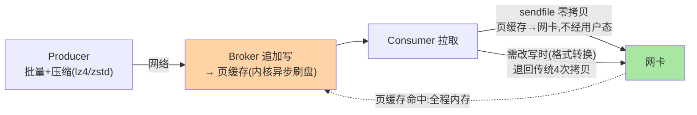
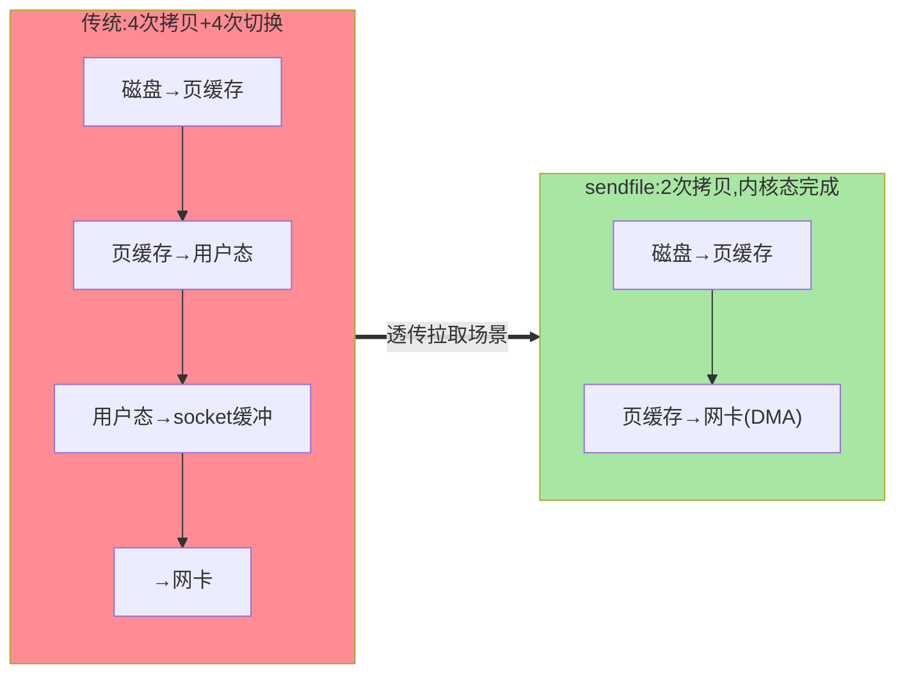
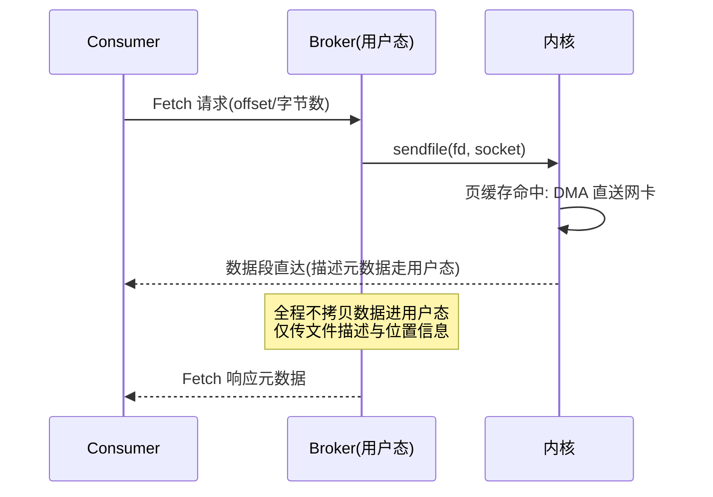

# 页缓存、零拷贝与压缩：存储高性能的三件套

> 「Kafka 为什么快」的答案在入门层给过直觉（顺序写）——本篇把剩下三件拆透：**页缓存**（读写都先走内存）、**零拷贝**（消费路径的 sendfile）、**压缩**（批级压缩怎么省网络与磁盘）——三件的协作才是吞吐天花板的来源。

> **本文核心**：三件套各管一段——**页缓存**管「热数据在内存」（读命中页缓存零磁盘 IO、写先入页缓存由内核异步刷盘）、**零拷贝**管「日志文件到网卡的搬运路径」（sendfile 消除 kernel↔user 的两次拷贝与上下文切换）、**压缩**管「批量传输与存储的体积」（Producer 压缩、Broker 透传保留、Consumer 解压）。**机制链**：Producer 批量压缩发送 → Broker 追加写（页缓存）→ Consumer 拉取 → sendfile 直达网卡（页缓存命中时全程零用户态拷贝）。

## 一句话摘要

三件的设计演进取舍：**页缓存信任内核**（Kafka 自己不做缓存层——「不重复造缓存」让同一份页缓存供写路径与读路径复用，代价是依赖 OS 的刷盘策略：断电丢页缓存数据（acks=all + 副本同步兜底数据安全，而非 fsync 兜底）；**零拷贝只服务拉取路径**（sendfile 要求「数据不改写」——消费直传成立；但 Broker 端要改数据的场景（格式转换/事务标记）零拷贝失效退回传统路径——「零拷贝的前提是不碰数据」）；**压缩在批粒度**（压缩单位是 Producer batch——批越大压缩率越高，与延迟的权衡（linger.ms 攒批）互指客户端系列篇 1）。**三件是一套组合拳**：单看任何一件都觉得平常，组合起来支撑百万级分区消息的吞吐。

## 一、边界：入门层讲过什么，本文讲什么

| 内容 | 入门层 | 本文 |
|---|---|---|
| 「顺序写+页缓存所以快」的直觉 | ✅ 讲过 | 不重复 |
| 页缓存与数据安全的取舍 | 未讲 | **本文核心一** |
| 零拷贝的路径与失效条件 | 未讲 | **本文核心二** |
| 压缩算法选择与批粒度 | 提了一句 | **本文核心三** |

## 二、三件套的协作全景

**架构分层认知**：页缓存是「存储层与 OS 的协作」（上下游模块边界在内核态）、零拷贝是「读路径的快通道」、压缩是「传输与存储的体积经济学」——三件作用在不同层，替换任何一件（比如自建缓存层）整个架构的均衡就破。

传统路径 vs 零拷贝的拷贝次数对比：

**把 sendfile 的时序展开看**——一次透传拉取里用户态与内核态的交替次数，是「快通道」二字的定量注脚：

时序里值得盯的是「Broker 用户态」这一行只出现了描述性信息的传递——数据本体在内核里走完最后一公里。为什么这么设计？因为 Broker 在透传场景对数据没有发言权（不改字节），用户态参与只剩成本没有收益——**把无收益的环节从路径上删掉**，这就是零拷贝的设计思想。

## 三、页缓存：数据安全的取舍账

Kafka 不 fsync 每条消息（默认 log.flush.interval.messages 为 Long.MAX——刷盘交给内核）——**性能取舍**：fsync 每条 = 吞吐崩塌；不 fsync = 断电丢页缓存。**数据安全的兜底转移**：从「单机刷盘」转移到「多副本同步」（acks=all + min.insync.replicas≥2：消息在多台机器的页缓存里各有一份，单机断电不丢——多副本的冗余替代 fsync 的持久化）。这是与 MySQL（redo log 每事务 fsync，互指 MySQL 日志系列篇 1 的双 1）的路线分歧：**数据库单条价值高走同步刷盘、消息队列批量流走副本冗余**——两种数据形态对应两种持久化架构。

页缓存的读写复用还有一层经济账：写入的最新段必然停留在页缓存里（刚写的数据就是最热的数据），而消费行为高度偏斜（绝大多数消费者在追最新数据）——**写入路径留下的缓存恰好就是读取路径要的缓存**，一层缓存两层受益。这正是为什么不自建缓存层的答案的一半；另一半见下节反方案。

### 追问链：不刷盘真的不会丢数据吗

- **追问一：断电丢页缓存，那 acks=all 的「不丢」承诺从哪来？** acks=all 的完成语义是「ISR 全部副本的页缓存都已收到」——消息跨机器冗余后才向 Producer 确认。单机断电丢的是那台机器的页缓存，ISR 里其他机器还有——**持久性由副本拓扑保证，不由单机刷盘保证**，这是承诺边界的重新划分。
- **再追问：多台机器同时断电呢（机架掉电、机房故障）？** 这时副本间同步走的也是页缓存→网卡，如果整个故障域同时掉电，未刷盘的数据确实会丢——所以严格的持久性需求配 min.insync.replicas 与机架感知副本分布（副本跨故障域放置），把「同时断电」的概率压到可接受；再往上还有 acks=all 配合 broker 端刷盘策略的组合（牺牲部分吞吐换窗口收窄）——**每多一层保证都有代价，按业务的丢失容忍窗口选层级**。
- **打破砂锅：既然不靠刷盘，log.flush 系列参数存在的意义是什么？** 它们是「重启恢复时间」的旋钮而非「丢不丢」的旋钮——刷得勤，宕机后恢复时要重放的日志段就少，恢复快；刷得懒，恢复慢但吞吐高。业内常见误区是把它们当安全性参数调（调了以为更安全），实际改变的是恢复时长——**参数的真实语义要对着机制链读，不能对着名字猜**。

## 四、零拷贝：快通道与失效条件

传统读路径四次拷贝（磁盘→页缓存→用户态→socket 缓冲→网卡）+ 四次上下文切换；**sendfile 两次**（磁盘→页缓存→网卡 DMA，内核态完成）——大消息高吞吐场景 CPU 占用与延迟的质变。**失效条件**（数据必须过用户态改写）：Broker 真正的消息格式转换（老版本客户端升级期）、**事务消息的 control marker 追加**不影响（marker 独立记录）、consumer 侧 max.bytes 裁剪需改写时——「零拷贝要求字节流透传」是硬约束。**源码口径**（4.x）：`FileRecords.writeTo()` 内部按条件走 `transferTo`（sendfile 封装）或用户态回退路径。

**失效条件的一分钟盘点**（上下游视角）：上游触发（客户端版本错配 / 代理层要求改写 / 安全层要解密重加密）→ 拉取路径过用户态 → CPU 拷贝回归 → 吞吐天花板下移。业内经验是「性能基线按最差路径评估」——评估消费吞吐时不能只看理想透传路径，要盘点生产集群里有多少比例的拉取正走在失效分支上。

## 五、压缩：批粒度的经济学

| 算法 | 压缩比 | CPU | 适用 |
|---|---|---|---|
| gzip | 高 | 高 | 带宽极贵、CPU 富余 |
| snappy | 中 | 低 | 均衡默认的历史选择 |
| lz4 | 中 | **最低** | 吞吐优先（当前主流） |
| zstd | 高 | 中低 | **新默认候选**（3.x+ 推荐） |

压缩单位是 **Producer 的 batch**（攒批→整批压缩→一条压缩消息发送）——**批大小与压缩率正相关**（linger.ms 越大批越大压缩率越高，但延迟上升）——压缩参数不是孤立选择，与客户端攒批参数（互指客户端系列）联动配置。Broker 保留压缩态存储（不解压）——**端到端压缩**（Producer 压一次、Broker 不动、Consumer 解一次）。Broker 侧的 destination 压缩（broker 端 recompress，配置不匹配时）是浪费路径——保持 Producer/Broker 配置一致是纪律。

**为什么压缩在批粒度而不是消息粒度？** 压缩算法吃「重复度」——单条消息里的重复字节有限，批内跨消息的重复（相同 key 前缀、相似 header、重复字段值）才是压缩比的主要来源；批越大字典越丰富压缩率越高。代价是解压粒度也变成批（消费端整批解压）——对逐条消费语义无影响（解压后仍逐条投递），只是解压的 CPU 摊在批上更划算。**压缩粒度的设计思想：在「信息重复度的最大收集范围」与「延迟的最小牺牲」之间取交点**。

### 追问链：为什么不在 Broker 压缩

- **追问一：Broker 离数据最近（写盘前压一次不行吗）？** 不行——Broker 压缩意味着先解压（Producer 压过来的）再重压，两次 CPU 全花在 Broker，而 Broker 是集群里最贵的资源（所有分区共享）；Producer 侧压缩的 CPU 分散在成千上万个业务机器上——**把可下放的计算下放到边缘**，中心留做透传。
- **再追问：那 broker 端 compression.type 到底管什么？** 它是「一致性的守门员」而不是「压缩的执行者」——配置为 producer 时透传（主流做法）；配置成具体算法时表示「入集群必须是我这个格式」（Producer 格式不匹配就触发 recompress）——它的正确用法是统一格式收敛，不是省磁盘。
- **打破砂锅：既然透传最省，什么时候真值得让 Broker 重压？** 存量客户端版本碎片化（部分老客户端不支持 zstd）时的过渡期收敛——用 Broker 重压换取全链路格式统一，等客户端全部升级后再撤掉——**过渡态的代价换终态的收敛**，别把过渡配置当稳态。

## 六、两次排查复盘（匿名化实践叙事）

**复盘一：消费吞吐「莫名」腰斩，是冷读穿透了页缓存。** 某直播平台的回溯消费场景（业内公开分享中的常见形态）：一次排查发现消费组的拉取延迟 P99 从毫秒级涨到几十毫秒、broker 磁盘读 IO 飙升——复盘发现起因是一个数据订正任务从三天前的 offset 开始全量重放，热数据集瞬间从「最新几分钟」扩到「三天」，页缓存（机器内存有限）装不下，拉取路径从「页缓存命中」退化为「磁盘顺序读」。复盘结论：**页缓存容量的规划基准是热数据集（消费窗口）不是磁盘总量**——回溯消费、滞后追平等冷读行为要当作「内存置换风暴」对待，错峰执行或分批限速。

**复盘二：Broker CPU 周期性冒尖，元凶是格式不匹配的 recompress。** 另一次排查：集群升级 zstd 的过程中，某批分区 CPU 使用率持续偏高但消息速率没涨——火焰图定位在压缩/解压函数对。根因：这批分区的 broker 端 compression.type 已切成 zstd，而对应 Producer 还在发 lz4——每个 batch「解压 lz4 → 重压 zstd」，Broker 白付两遍 CPU。复盘落成的纪律：**压缩格式迁移必须先客户端后 broker**——先把 Producer 全量升级到目标算法，确认透传后再动 broker 端配置；反向顺序就是给所有中间流量上刑。两次复盘的公共底层原理：**三件套的性能账都建立在「路径如预期」上，任何偏离预期路径的配置错位都会让账本作废**。

## 业内惯例

- **不调 log.flush 参数**（默认交给内核 + 副本兜底）——手工 fsync 配置是历史遗留误区，改了反而伤吞吐
- **compression.type=zstd（新集群）/lz4（存量）**：算法演进方向 zstd（3.x+ 的官方推荐路线），存量按灰度切换
- **页缓存容量规划**：热数据集（最近消费窗口的数据量）为基准，不是总磁盘量——消费滞后大时页缓存命中率是容量告警信号
- **3.x/4.x 视角**：三件套机制自 0.x 稳定；zstd 是 2.1+ 的演进增量；tiered storage（4.x）后「页缓存只管热层」——三件套的适用边界在分层化
- **sendfile 的可用性随部署形态复核**：部分容器/安全加固环境（加密文件系统、特殊存储插件）不支持高效 sendfile——上生产前用基准工具实测一次透传路径，别默认它一定在

## 七、常见误区

- **「Kafka 快因为顺序写」只对了一半**：顺序写是必要条件，页缓存命中率（读）与零拷贝（传输）同样是充分件——冷读场景 Kafka 的读性能会向磁盘顺序读回归
- **「零拷贝 everywhere」**：只服务透传拉取；一切需要 Broker 改写消息的演进（格式升级、裁剪）都退回慢路径——性能基线要按最差路径评估
- **压缩配在 Broker**：Broker 压缩是「解压再压」的浪费路径（除非 destination 不匹配）——压缩的正确位置是 Producer
- **拿 MySQL 的 fsync 直觉要求 Kafka**：两种数据形态两种持久化哲学（副本冗余 vs 同步刷盘）——用数据库的 RPO 直觉审消息队列会得出错误结论
- **「压缩比越高越好」**：zstd 高压缩比成立的前提是批够大——小批场景（linger.ms=0 的低延迟链路）高算法的压缩率优势发挥不出来，CPU 反而多付——算法与攒批参数要一起看

## 八、与相邻机制的关系

- 本系列篇 1：段结构是三件套的载体（零拷贝的对象就是段文件）
- 《深入理解客户端原理系列》篇 1：攒批参数与压缩的联动在那篇
- tips 互指：MySQL redo 的 fsync 路线对照（日志系列）；RocketMQ 的存储对照（其特性层）
- **上下游一分钟**：上游是 Producer 攒批（决定压缩批的大小下限）；下游是 Consumer 解压（CPU 预算的一部分）；旁路是副本同步（跨 broker 的传输同样受益于压缩态透传）——三件套贯穿「一份数据的三段旅程」

## 你们可能会问

**Q1：页缓存和 Kafka 自己的缓存是什么关系？**
Kafka 没有自建缓存层（曾有消息缓存演进史，最终架构收敛到「信任页缓存」）——一层缓存两层用（写缓冲+读缓存），避免双缓存的一致性与内存翻倍——「不重复造轮子」的存储架构演进结论。

**Q2：acks=all 就不丢了吗（页缓存角度）？**
多副本各持一份页缓存——同时多机断电才丢（概率极低的故障域叠加）；要再压一层可用 unclean 配置禁止 + min.insync.replicas——**丢失概率的工程化压缩**而非绝对零（与 Redis AOF everysec 的择车哲学同源，互指 Redis 持久化篇）。

**Q3：压缩批与消费幂等的关系？**
压缩是传输与存储优化，不影响消息语义（解压后逐条投递）——幂等与事务在协议层（互指事务与流处理系列），与压缩正交。

**Q4：为什么不用更激进的技术（比如 RDMA / 用户态网络栈）把最后两次拷贝也消掉？**
工程性价比问题——sendfile 已把拷贝从四次减到两次（剩下的 DMA 拷贝 CPU 不参与），RDMA 类方案要整套网络栈与网卡、部署形态的配套，收益增量有限而改造成本面很大——**技术选型看边际收益，不看绝对极限**；这类方案在特定超大规模场景（公开报道里的头部自研）出现过，不是通用建议。

## 什么时候用/不用：三件套相关配置的决策边界

- **什么时候用（建议动）**：新集群直接 zstd 起步（官方推荐路线，公开基准方向压缩比与 CPU 的综合分最优）；延迟不敏感的聚合链路加大 linger.ms 让压缩率兑现
- **什么时候不用（不要动）**：log.flush 系列参数默认即可（当恢复时间旋钮理解，不当安全旋钮）；存量集群的压缩算法灰度未完成前不动 broker 端 destination 配置（复盘二的教训）
- **明确推荐**：把「页缓存命中率」「透传拉取占比」「压缩算法分布」三项指标放进 broker 大盘——三件套的健康度可观测，比任何经验参数都可靠

## 不同量级的思考：架构约束驱动解法

三件套在不同消息量级下的角色权重完全不同：

- **十万级（日消息 10w，带宽与内存都不是瓶颈）**：约束来源是「默认配置已经饱和工作」——这一档的核心问题是别把集群调坏，而不是榨性能。思考方式是保守驱动：三件套全按默认，监控基线建好，任何优化冲动先缓一缓。
- **百万级（日消息百万，消费组数量上来）**：约束来源是「页缓存开始出现竞争（多消费组冷热交错）」——这一档的核心问题是热数据集与内存的配比对不对，而不是压缩算法选哪个。思考方式是容量驱动：按消费窗口算页缓存水位，命中率为第一告警指标。
- **千万级（日消息千万，跨机房带宽成本显形）**：约束来源是「网络与磁盘的体积经济学」——这一档的核心问题是单位消息的传输字节能不能降，而不是单机吞吐。思考方式是成本驱动：zstd 兑现压缩比、跨机房同步链路优先压缩、压缩格式收敛纪律落地。
- **亿级（日消息亿级，集群规模化）**：约束来源是「CPU 与内存的总量预算」——这一档的核心问题是每一份 CPU 花在刀刃上没有（recompress/冷读/失效路径的浪费清零），而不是再调哪个参数。思考方式是架构驱动：冷热分层让页缓存只管热层、透传路径占比纳入 SLO、压缩策略按链路分级。

自下而上收束：10w 靠默认、百万级靠容量表、千万级靠成本账、亿级靠架构分层——三件套本身不变，变的是每档「该盯的那笔账」。触发升级的信号：当上一档的账本（默认参数/水位表/成本账）开始频繁报警，就是迁移到下一档思考方式的时机。

## 九、自测三问

1. 页缓存的数据安全取舍（副本替代 fsync）的逻辑？
2. 零拷贝的路径与三个失效条件？
3. 压缩为什么在批粒度？与攒批参数怎么联动？

## 开放问题

- 分层存储时代「页缓存只管热层」的容量模型重建——冷热分层后页缓存命中率的目标值与监控口径需重新定义。
- 硬件压缩卸载（网卡/存储引擎的压缩 offload）若成熟，「CPU 换带宽」的压缩经济学被重写。

## 5W 速记卡

| 维度 | 一句话 |
|---|---|
| What | 页缓存（内核热数据层）+ 零拷贝（sendfile 透传）+ 批级压缩（端到端体积经济学） |
| Why | 顺序写只是地基——读靠页缓存命中、传靠零拷贝、省靠批压缩，三件合起来才是吞吐天花板 |
| When | 容量规划（热数据集）、消费性能排查（命中率/透传占比）、带宽降本（算法选型）都要用 |
| Who | 写路径入页缓存；读路径 sendfile；Producer 压、Broker 透传、Consumer 解 |
| How | 安全靠副本（acks=all+min.insync）不靠刷盘；压缩先客户端后 broker；冷读限速保护缓存 |

## 📎 核心带走

- **核心一句话**：存储高性能 = 页缓存（读写复用内核缓存）+ 零拷贝（透传拉取的快通道）+ 批级压缩（端到端体积经济学）——三件各管一段、组合成吞吐天花板
- **机制链**：Producer 攒批压缩 → Broker 追加页缓存（内核刷盘+副本兜底安全）→ Consumer 拉取 sendfile 直达网卡
- **失效点/边界**：零拷贝要求透传；fsync 手工配置是误区；页缓存按热数据集规划

## 💡 实战提示

- 💡 页缓存命中率与热数据集监控进容量大盘——消费滞后引发的冷读是性能滑坡前兆
- 💡 压缩算法演进路径 lz4→zstd 按公开基准灰度验证再切，且必须先客户端后 broker
- 💡 决策口径：数据安全靠副本配置（acks/min.insync），不靠 flush 参数——review 见到 flush 调优一律质疑
- 💡 消费吞吐排查看三条：页缓存命中率（读）、sendfile 透传占比（传）、解压 CPU 占比（解）——三段各自独立计账

## 📌 数据与事实声明

- 写于 2026-09-10，2026-09-17 扩写修订；机制以 Kafka 4.x 主线为准（zstd 自 2.1+、sendfile 路径跨版本稳定）；压缩比对比为公开基准的量级方向
- 文中排查复盘为业内常见故障形态的匿名化综合叙事，不指向任何具体公司；量级分界为业内认知
- 免责：算法选择按业务实测

## 📚 参考资料

| 类型 | 标题 | 来源 |
|---|---|---|
| 官方源码 | apache/kafka（FileRecords/transferTo 路径） | github.com/apache/kafka |
| 官方文档 | Kafka Producer Configurations（compression.type） | kafka.apache.org |
| 原理书 | 《深入理解 Kafka》朱忠华（高性能章） | 公开出版 |
