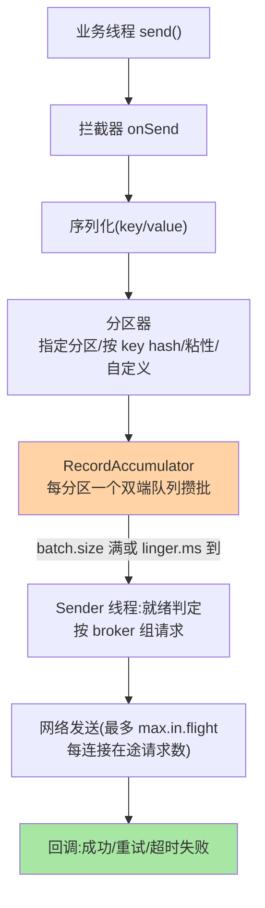
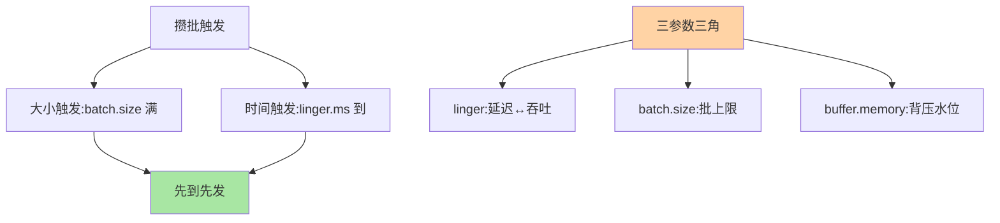

# Producer 发送器源码：攒批、分区与发送的三层流水

> `producer.send()` 一行调用背后是「**主线程攒批 + Sender 线程发送**」的双线程架构——批的聚合（RecordAccumulator）、分区的选择（Partitioner）、请求的编排（Sender/InFlightRequests）三层流水线。这篇以 4.x 源码走读全链，把吞吐参数（batch.size/linger.ms）与可靠参数（acks/retries）的挂载位置讲清。

> **本文核心**：Producer = **主线程**（拦截器 → 序列化 → 分区器 → 追加进 RecordAccumulator 的双端队列）+ **Sender 线程**（按 broker 维度取批组请求 → 网络发送 → 按 acks 完成回调）。**机制链**：send() → 拦截/序列化/分区 → accumulator 攒批（batch.size 满或 linger.ms 到）→ Sender 就绪判定（哪个 broker 有批可发）→ InFlight 限流（max.in.flight）→ 发送 → 回调（成功/重试/失败）。

## 一句话摘要

双线程架构的演进逻辑：**主线程只做轻活**（序列化与入队微秒级）——send() 立即返回 Future（异步语义）；**Sender 线程独占网络**（单线程 NIO——多线程网络的复杂度被「批聚合」消化：与其多线程发小包，不如单线程发大批）——**攒批是这套架构的支点**（batch.size/linger.ms 控制聚合度：大小触发与时间触发先到先发）。**可靠性的挂载位**：retries 在 Sender 的失败处理（幂等开启时按 PID+序号重试不重复，互指事务系列）；acks 在请求完成判定（互指副本系列篇 2 的 HW 路径）——**每个 producer 配置都能定位到流水线的具体环节**。

## 一、边界：入门层讲过什么，本文讲什么

| 内容 | 入门层 | 本文 |
|---|---|---|
| producer 基本用法与参数 | ✅ 讲过 | 不重复 |
| 双线程架构与 accumulator 攒批 | 未讲 | **本文核心一** |
| 分区策略与粘性批 | 提了一句 | **本文核心二** |
| InFlight 限流与有序性保证 | 未讲 | **本文核心三** |

## 二、双线程三层流水全景



**攒批的两触发**（大小与时间先到先发）与取舍：linger.ms=0（立即发，低延迟小批）vs 加大 linger（延迟换吞吐——批更满、请求更少、压缩率更高，互指存储系列篇 2）；batch.size 是上限不是目标（不满就等 linger）。**架构上下的分工**：业务线程从不碰网络（异步无阻塞）、Sender 从不碰业务对象（只操作批与节点）——**线程边界即模块边界**的双线程设计。

攒批的两触发与三参数三角：



## 三、分区策略与粘性批

分区选择的四种：**指定 partition**（直发）、**按 key hash**（同 key 同分区——顺序语义的载体，互指可靠性专题的顺序篇）、**UniformSticky（无 key 默认）**——粘性：批未满时续用同分区（换分区则废批重聚，粘性省这笔）、**自定义 Partitioner**（按业务维度路由——机房亲和/灰度分流的实现位）。**演进要点**：4.x 的 KIP-794（统一分区模型）把有 key 与无 key 的行为统一框架化（broker 侧可感知的分区策略演进）——分区选择从「客户端黑盒」向「协议可见」演进。

## 四、源码关键路径（4.x 口径）

```text
KafkaProducer.send()
 ├─ interceptors.onSend → serialize → partition()
 └─ accumulator.append()                     // ProducerBatch 追加(或新建批)
Sender(run 循环):
 ├─ accumulator.ready()                      // 哪些节点有就绪批
 ├─ drain()                                  // 按节点取批组请求
 ├─ InFlightRequests.canSend()               // max.in.flight 限流判定
 ├─ NetworkClient.poll()                     // NIO 收发
 └─ completeBatch()                          // 成功回调/重试(retries+幂等序号)
                                            // 失败最终进 onCompletion(异常)
```

阅读建议：两个断点（accumulator.append 与 completeBatch）跑一条「发送→回调」——双线程的交接面（批的生产与消费）是理解全部 producer 行为的钥匙。

## 五、典型场景

- **发送延迟抖动**：linger.ms 与批组装节奏（小流量时段批总等满 linger）——延迟敏感与吞吐的取舍按流量分时配置
- **发送失败排查**：回调异常的类型分层——可重试（网络抖动/NOT_LEADER）自动重试（retries 内）、不可重试（消息过大/无权限）直达回调——**失败处理的分类先于排查**
- **同 key 乱序**：max.in.flight>1 + 失败重试的批插队（开启幂等后按序号保序——enable.idempotence 的隐藏收益，互指事务系列篇 1）

## 业内惯例

- **enable.idempotence 默认开**（3.x+ 的默认演进方向）：幂等 + 有序 + retries=MAX 的安全默认——历史「手动配幂等」已是过去时
- **linger.ms 从小起步实测调优**（0 → 5ms 的吞吐增益常显著、延迟损耗可接受——按业务延迟预算调，不抄别家）
- **max.in.flight=5 默认足够**：与幂等协同保序（开启幂等后 broker 按序号去重回序）——盲目调大徒增内存与乱序风险
- **3.x/4.x 视角**：双线程架构稳定；演进在分区模型统一（KIP-794）与 API 现代化（KafkaProducer 的演进接口）——核心流水线知识保值

## 六、常见误区

- **「send() 发出去了」**：send 只是入队——网络发送在 Sender 的下个循环（毫秒内，但语义是异步）；「调 send 后立刻断言 broker 有消息」的测试写法是时序 Bug
- **linger.ms=0 + 抱怨吞吐低**：批几乎不满（每条一请求）——延迟与吞吐的第一权衡位就是它
- **回调里抛异常没人接**：onCompletion 的异常要处理（记日志/告警）——回调静默 = 发送失败不可见
- **自定义分区器破坏 key 语义**：为「负载均衡」绕开 key hash——同 key 消息散到多分区，顺序语义全毁（顺序需求与均衡需求的冲突要架构层解决，不是分区器 hack）

## 七、与相邻机制的关系

- 《深入理解事务与流处理系列》篇 1：幂等与事务的协议层（PID/序号/事务协调器）在那篇
- 《深入理解客户端原理系列》篇 2：消费侧的协调器与再平衡（本篇是生产侧的对称篇）
- tips 互指：存储系列篇 2（压缩在批粒度）；可靠性专题（顺序与不丢的配置联动）

## 你们可能会问

**Q1：为什么 Sender 是单线程？**
吞吐压力被「攒批」消化（大批低频请求），单线程 NIO 足够；多线程只在小批高频场景有收益（而那应该先调 linger）——**架构选择与批聚合共生**。

**Q2：缓冲满了会怎样？**
accumulator 到 max.request.size/blocking 超过 buffer.memory——send() 阻塞（max.block.ms 后抛异常）——背压机制：消费速度（Sender 发送）跟不上生产速度时把压力推给业务线程——buffer.memory 是 Producer 的内存水位线。

**Q3：怎么保证同 key 全局有序？**
单分区（key 路由）+ 幂等（in-flight 内保序）+ 不换 leader 期间——**分区级有序是 Kafka 的承诺边界**，全局有序需要单分区（牺牲并行度）——有序的粒度是架构决策。

## 九、自测三问

1. 双线程的分工与「攒批是支点」的逻辑？
2. 四种分区策略与粘性批的省批机制？
3. 幂等开启后 max.in.flight 与有序性的关系？

## 开放问题

- 分区策略的服务端可见化（KIP-794 统一模型）让「客户端黑盒路由」走向协议透明——跨语言客户端的行为一致性增强。
- 远端计算/边缘场景的 producer 裁剪形态（无本地攒批的轻量生产者）是生态扩张的新需求。

## 📎 核心带走

- **核心一句话**：Producer = 业务线程攒批（拦截/序列化/分区/accumulator）+ Sender 单线程网络（就绪/限流/回调）——攒批是架构支点，参数挂位可追溯
- **机制链**：send 入队 → batch/linger 触发 → Sender 按节点组请求 → in-flight 限流发送 → acks 判定 → 回调/重试
- **失效点/边界**：send≠已发出；缓冲满的背压；同 key 有序的边界在分区级

## 💡 实战提示

- 💡 producer 三参数（linger/batch/buffer.memory）的吞吐-延迟-内存三角按业务预算联调，不单点抄值
- 💡 回调统一封装（日志+指标+告警）进脚手架——发送失败的可见性从第一天建
- 💡 决策口径：幂等默认开；顺序诉求走 key 路由 + 单分区评估，不 hack 分区器

## 📌 数据与事实声明

- 写于 2026-09-10，源码以 Kafka 4.x 为主线（幂等默认自 3.0、KIP-794 为 3.3+ 演进）；架构跨版本稳定
- 免责：源码细节以 apache/kafka 当前主线为准

## 📚 参考资料

| 类型 | 标题 | 来源 |
|---|---|---|
| 官方源码 | apache/kafka（clients: KafkaProducer/RecordAccumulator/Sender） | github.com/apache/kafka |
| 官方文档 | Kafka Producer Configurations | kafka.apache.org |
| 原理书 | 《深入理解 Kafka》朱忠华（客户端章） | 公开出版 |
