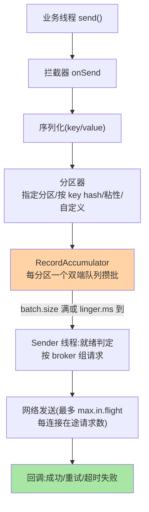
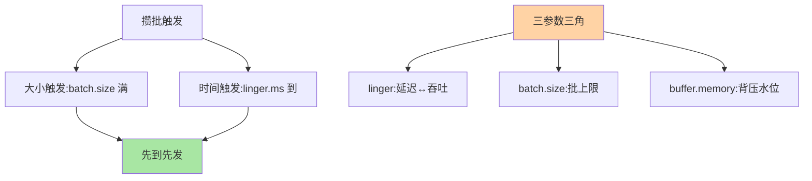
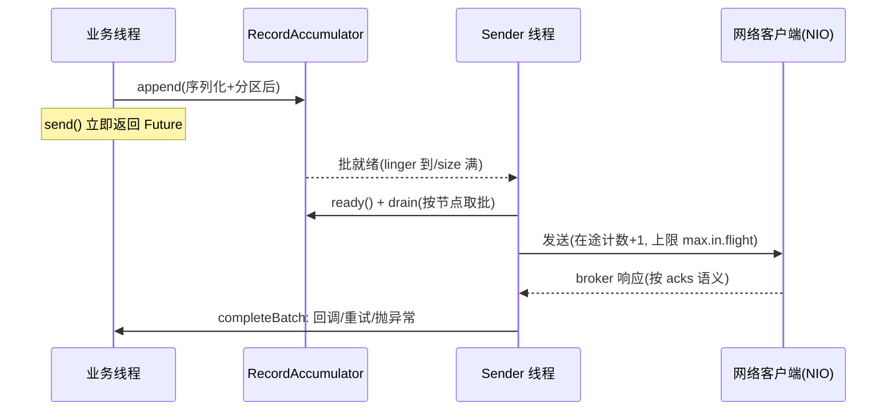

# Producer 发送器源码：攒批、分区与发送的三层流水

> `producer.send()` 一行调用背后是「**主线程攒批 + Sender 线程发送**」的双线程架构——批的聚合（RecordAccumulator）、分区的选择（Partitioner）、请求的编排（Sender/InFlightRequests）三层流水线。这篇以 4.x 源码走读全链，把吞吐参数（batch.size/linger.ms）与可靠参数（acks/retries）的挂载位置讲清。

> **本文核心**：Producer = **主线程**（拦截器 → 序列化 → 分区器 → 追加进 RecordAccumulator 的双端队列）+ **Sender 线程**（按 broker 维度取批组请求 → 网络发送 → 按 acks 完成回调）。**机制链**：send() → 拦截/序列化/分区 → accumulator 攒批（batch.size 满或 linger.ms 到）→ Sender 就绪判定（哪个 broker 有批可发）→ InFlight 限流（max.in.flight）→ 发送 → 回调（成功/重试/失败）。

## 一句话摘要

双线程架构的演进逻辑：**主线程只做轻活**（序列化与入队微秒级）——send() 立即返回 Future（异步语义）；**Sender 线程独占网络**（单线程 NIO——多线程网络的复杂度被「批聚合」消化：与其多线程发小包，不如单线程发大批）——**攒批是这套架构的支点**（batch.size/linger.ms 控制聚合度：大小触发与时间触发先到先发）。**可靠性的挂载位**：retries 在 Sender 的失败处理（幂等开启时按 PID+序号重试不重复，互指事务系列）；acks 在请求完成判定（互指副本系列篇 2 的 HW 路径）——**每个 producer 配置都能定位到流水线的具体环节**。

## 一、边界：入门层讲过什么，本文讲什么

| 内容 | 入门层 | 本文 |
|---|---|---|
| producer 基本用法与参数 | ✅ 讲过 | 不重复 |
| 双线程架构与 accumulator 攒批 | 未讲 | **本文核心一** |
| 分区策略与粘性批 | 提了一句 | **本文核心二** |
| InFlight 限流与有序性保证 | 未讲 | **本文核心三** |

## 二、双线程三层流水全景



**攒批的两触发**（大小与时间先到先发）与取舍：linger.ms=0（立即发，低延迟小批）vs 加大 linger（延迟换吞吐——批更满、请求更少、压缩率更高，互指存储系列篇 2）；batch.size 是上限不是目标（不满就等 linger）。**架构上下的分工**：业务线程从不碰网络（异步无阻塞）、Sender 从不碰业务对象（只操作批与节点）——**线程边界即模块边界**的双线程设计。

攒批的两触发与三参数三角：



**把整条链按时间轴展开**——一次 send 从入队到回调的完整时序，双线程的交接面（accumulator 的批队列）就横在中间：



时序里的关键设计：业务线程与 Sender 的全部交汇只在 accumulator 的队列上——没有共享的可变业务状态，没有双向等待——**用一条队列隔离两个世界的速度差**，这是整个 Producer 架构的承重墙。

## 三、分区策略与粘性批

分区选择的四种：**指定 partition**（直发）、**按 key hash**（同 key 同分区——顺序语义的载体，互指可靠性专题的顺序篇）、**UniformSticky（无 key 默认）**——粘性：批未满时续用同分区（换分区则废批重聚，粘性省这笔）、**自定义 Partitioner**（按业务维度路由——机房亲和/灰度分流的实现位）。**演进要点**：4.x 的 KIP-794（统一分区模型）把有 key 与无 key 的行为统一框架化（broker 侧可感知的分区策略演进）——分区选择从「客户端黑盒」向「协议可见」演进。

**粘性批的反直觉点**：无 key 消息本应均匀散到所有分区（最大化并行），但 UniformSticky 故意「暂时不散」——批未满期间固定在一个分区上灌满整批，批满了才换下一个。代价是瞬时倾斜（短窗口内单分区集中），换来的是批的完整性（攒批语义成立、压缩率成立、请求数下降）——**用微观的暂时倾斜换宏观的吞吐**，与「小批高频不如大批低频」的架构主旨一脉相承。

## 四、源码关键路径（4.x 口径）

```text
KafkaProducer.send()
 ├─ interceptors.onSend → serialize → partition()
 └─ accumulator.append()                     // ProducerBatch 追加(或新建批)
Sender(run 循环):
 ├─ accumulator.ready()                      // 哪些节点有就绪批
 ├─ drain()                                  // 按节点取批组请求
 ├─ InFlightRequests.canSend()               // max.in.flight 限流判定
 ├─ NetworkClient.poll()                     // NIO 收发
 └─ completeBatch()                          // 成功回调/重试(retries+幂等序号)
                                            // 失败最终进 onCompletion(异常)
```

阅读建议：两个断点（accumulator.append 与 completeBatch）跑一条「发送→回调」——双线程的交接面（批的生产与消费）是理解全部 producer 行为的钥匙。

**completeBatch 的三分支**（可靠性参数的挂载位）：① broker 正常应答且 acks 满足 → 成功回调（Future 完成 + onCompletion）；② 可重试异常（网络抖动/NOT_LEADER 等临时态）→ 批退回 accumulator 重发（幂等开启时序号随批重挂，broker 按序号去重）；③ 不可重试异常（超限/序列化错误/超时耗尽 retries）→ 直达回调异常分支。**幂等的序号机制**就住在第二分支：每个 PID+分区维护递增序号，重试批次带原序号，broker 侧判定「序号已见则拒绝重复」——**重试不丢、重试不重**两件事在一次判定里同时成立。

### 追问链：攒批参数的三层穿透

参数表背得再熟，不如把默认值追问到底——质疑者视角的三层穿透：

- **追问一：batch.size 默认 16KB，为什么是这个量级（业内认知）？** 批太小时请求密度高（网络包头与 RPC 常数开销占比大），批太大时内存被少数大批占死（每分区队尾批按 batch.size 预留内存预算）——16KB 是「一个请求装得下足够多消息 × 内存碎片可控」的折中；注意它与 batch.size 相互作用的是平均消息体：小消息场景一批几十条，大消息场景一条就超批（此时批按消息大小自适应）。
- **再追问：linger.ms 默认 0（到批就走），那攒批语义不就废了？** 没废——linger.ms=0 的语义是「不额外等」，但高并发下 batch 天然是满的：多个业务线程同时往同一分区灌消息，队尾批在 Sender 取走之前已被填满（大小触发先于时间触发）——**高流量场景攒批是涌现的，低流量场景才需要 linger 补**。这也是「linger.ms 从 0 起步、按流量形态加」调参路径的机制依据。
- **打破砂锅：为什么攒批以「分区」为单位而不是「broker」？** 因为压缩与顺序语义的最小单元都是批（批内消息同分区才能同 key 保序、才能整批压缩），而分区是 Kafka 的并行原子——按 broker 攒批会破坏这两个批级语义；代价是「同 broker 多分区的批要合并成一个请求」发生在 drain 阶段（多个分区的批装进一个 Produce 请求）——**攒批在分区粒度做（保语义），请求合并在 broker 粒度做（省网络）**，两段分工不混淆。

### 发送语义的边界：Future、get 与回调

send() 返回 RecordFuture——`get()` 阻塞等待完成（把异步变同步，测试与强确认场景用），回调 onCompletion 在完成时触发（正常与异常都进，异常时 exception 非空）。两者的组合纪律：**业务主链路用回调（不阻塞），对账/校验点用有限时长的 get（超时保护）**——无限期的 get 是把背压直接焊死在业务线程上。另有「发后即忘」（不 get 不回调）——失败完全不可见，业内共识是只在可容忍丢失的埋点类流量使用。send 语义的三个层次（即忘/回调/get）对应三种可靠性预期——选哪层是业务决策，不是代码风格。

### 发送失败的两段式归属：send 之前与发送之后

从源码看，失败并不都走同一条路——以「是否已进 accumulator」为分界：序列化异常、拦截器异常发生在业务线程内（send() 直接抛出，消息从未入队，**调用方同步感知**）；入队之后的失败（网络超时、无 leader、消息超限、retries 耗尽）都在 Sender 的 completeBatch 里收口（**异步经回调感知**）。这个区分的实践价值：同步段的异常能立刻定位到消息本身（多半是代码/数据问题），异步段的异常要先看集群与网络状态（多半是环境问题）——排查入口直接由失败归属决定。混合两段信号一起看的常见误判：把异步段的「超时」当同步段的「序列化慢」去优化代码，方向就完全错了。

### 拦截器与指标：流水线的观测挂载点

拦截器 onSend（业务线程内、序列化前）与 onAcknowledge（完成时）是官方给业务留的两个切面——打点、审计、轻量改写都挂这里；但它是热路径上的业务代码（每条消息两次调用），业内惯例是保持拦截器轻到「微秒级」，重逻辑走外部队列。指标侧，ProducerMetrics 把流水线三段各给了一组：发送段的 record-send-rate/error-rate、攒批段的 record-queue-time-avg、内存段的 buffer-available-bytes——**观测点与机制链一一对应**，这正是「参数能定位到环节」的另一面：指标也能定位到环节。

## 五、两次排查复盘（匿名化实践叙事）

**复盘一：同 key 消息乱序，根因是「重试 + 未开幂等」的插队窗口。** 某订单状态流转链路（业内公开分享中的常见形态）出现下游状态机错乱：排查发现配置是 max.in.flight=5 且 retries 开着但幂等未开——第 1 批发送失败重试期间，第 2~5 批已先到 broker，重试的第 1 批后到，同 key 消息在分区里颠倒。修复是开启幂等（序号保序）或把 in-flight 收到 1（串行化牺牲吞吐）。复盘的设计结论：**有序性不是一个参数而是参数组合（幂等 × in-flight × 重试）的合取**——只调其中一个得到的保障是假的；这类 Bug 的隐蔽性在于它只在「恰好发生重试」时出现，测试环境流量健康时永远复现不出来。

**复盘二：业务线程周期性卡顿，是 buffer.memory 打满后的阻塞外溢。** 另一次排查：下游 broker 短暂抖动（ leader 切换约 10 秒）期间，上游业务接口的 P99 同步抖动——按理说 producer 是异步的、业务线程不该感知。复盘发现 send() 调用在 accumulator 内存耗尽时最长阻塞 max.block.ms（默认 60 秒）：broker 抖动导致批积压无法外发 → buffer.memory（默认 32MB）被占满 → 新 send() 无内存可分配 → 业务线程阻塞在内存等待上。修复是加大 buffer.memory 水位 + 降低业务峰值期的发送速率 + 对 send 的阻塞耗时加监控。复盘的机制结论：**背压迟早传导到业务线程——buffer.memory 决定的是「什么时候传到」，不是「会不会传到」**；异步语义不豁免容量规划。

## 业内惯例

- **enable.idempotence 默认开**（3.x+ 的默认演进方向）：幂等 + 有序 + retries=MAX 的安全默认——历史「手动配幂等」已是过去时
- **linger.ms 从小起步实测调优**（0 → 5ms 的吞吐增益常显著、延迟损耗可接受——按业务延迟预算调，不抄别家）
- **max.in.flight=5 默认足够**：与幂等协同保序（开启幂等后 broker 按序号去重回序）——盲目调大徒增内存与乱序风险
- **3.x/4.x 视角**：双线程架构稳定；演进在分区模型统一（KIP-794）与 API 现代化（KafkaProducer 的演进接口）——核心流水线知识保值
- **发送指标三件套进大盘**：record-send-rate（吞吐）、record-queue-time（攒批等待）、buffer-available-bytes（内存水位）——流水线三段的健康度各看一个指标，排查时按指标定位到对应层

## 六、常见误区

- **「send() 发出去了」**：send 只是入队——网络发送在 Sender 的下个循环（毫秒内，但语义是异步）；「调 send 后立刻断言 broker 有消息」的测试写法是时序 Bug
- **linger.ms=0 + 抱怨吞吐低**：批几乎不满（每条一请求）——延迟与吞吐的第一权衡位就是它
- **回调里抛异常没人接**：onCompletion 的异常要处理（记日志/告警）——回调静默 = 发送失败不可见
- **自定义分区器破坏 key 语义**：为「负载均衡」绕开 key hash——同 key 消息散到多分区，顺序语义全毁（顺序需求与均衡需求的冲突要架构层解决，不是分区器 hack）
- **「buffer.memory 越大越保险」**：内存水位只是把背压的外溢点往后推——下游持续不可用时多大的缓冲都会满，解法在容量规划与降级路径，不在堆内存

## 七、与相邻机制的关系

- 《深入理解事务与流处理系列》篇 1：幂等与事务的协议层（PID/序号/事务协调器）在那篇
- 《深入理解客户端原理系列》篇 2：消费侧的协调器与再平衡（本篇是生产侧的对称篇）
- tips 互指：存储系列篇 2（压缩在批粒度）；可靠性专题（顺序与不丢的配置联动）
- **上下游一分钟**：上游是业务线程（send 语义与异常处理契约）；中间是 accumulator（双线程交接的唯一界面）；下游是 broker 的副本追加（acks 判定在那边）——三层各自的速度不匹配全部由 accumulator 的队列与水位吸收

## 你们可能会问

**Q1：为什么 Sender 是单线程？**
吞吐压力被「攒批」消化（大批低频请求），单线程 NIO 足够；多线程只在小批高频场景有收益（而那应该先调 linger）——**架构选择与批聚合共生**。

**Q2：缓冲满了会怎样？**
accumulator 到 max.request.size/blocking 超过 buffer.memory——send() 阻塞（max.block.ms 后抛异常）——背压机制：消费速度（Sender 发送）跟不上生产速度时把压力推给业务线程——buffer.memory 是 Producer 的内存水位线。

**Q3：怎么保证同 key 全局有序？**
单分区（key 路由）+ 幂等（in-flight 内保序）+ 不换 leader 期间——**分区级有序是 Kafka 的承诺边界**，全局有序需要单分区（牺牲并行度）——有序的粒度是架构决策。

**Q4：send() 为什么不同步等 broker 应答（做成阻塞式不是更简单）？**
同步语义下业务线程的吞吐上限 = RTT 的倒数（一次往返等一次确认，网络稍慢吞吐就崩），攒批更是无从谈起（单条等单条）——异步入队把「等」的职责转给 Sender 线程批量承担，业务线程只付入队成本。**为什么不用同步方案的根本原因：延迟不可消除时，只能把等待从业务路径上剥离**。

## 什么时候用/不用：发送参数的决策边界

- **什么时候用（建议调）**：吞吐不达预期时先动 linger.ms（0→5ms 量级实测对照）；延迟敏感且量小时保 linger.ms=0（牺牲吞吐保延迟）；订单/库存类有顺序诉求的链路开幂等 + 校验 in-flight 配置组合
- **什么时候不用（不要动）**：max.in.flight 盲目调大（复盘一的乱序窗口随之放大）；buffer.memory 无监控依据地加大（复盘二的教训——先有水位监控再有容量决策）；自定义分区器仅在确有路由需求（机房亲和/灰度）时使用
- **明确推荐**：幂等默认开 + linger.ms 按延迟预算实测 + 三指标大盘（速率/队列时间/水位）——配置的每次改动有指标对照，不让「感觉」进生产

## 不同量级的思考：架构约束驱动解法

同一套双线程流水，在不同发送量级下被逼出的问题完全不同：

- **十万级（日消息 10w 条，峰值每秒几十条）**：约束来源是「默认参数的延迟已是最优」——这一档的核心问题是别引入异步坑（回调没人处理、断言时序），而不是吞吐。思考方式是正确性驱动：幂等开、回调统一封装、linger 保持 0。
- **百万级（日消息百万，峰值每秒千条）**：约束来源是「每条一请求的请求数开始可观」——这一档的核心问题是批的聚合度够不够，而不是网络带宽。思考方式是参数驱动：linger.ms 与 batch.size 实测联调，用 record-queue-time 观察攒批等待的分布。
- **千万级（日消息千万，峰值每秒数万条）**：约束来源是「内存水位与压缩 CPU 进入预算」——这一档的核心问题是 buffer.memory 与压缩算法的配比（攒批越大压缩越划算但内存占用越高），而不是单点参数。思考方式是预算驱动：内存水位、压缩 CPU、请求速率三笔账一起算。
- **亿级（日消息亿级，多集群多机房）**：约束来源是「机房带宽与集群间拓扑」——这一档的核心问题是发送流量怎么按机房亲和与分区拓扑分布（跨机房发消息的带宽成本与延迟），而不是客户端参数。思考方式是拓扑驱动：分区器带机房亲和路由、就近发送、集群间镜像承接跨域同步——量级把「调参数」升级成「设计流量的地理分布」。

自下而上收束：10w 拼正确性、百万级拼聚合度、千万级拼预算表、亿级拼拓扑——每一档都不是上一档的参数放大，而是约束易主后的重新决策。触发升级的信号：当「回调积压 / 队列时间飘高 / 水位告警 / 带宽成本」这些词开始出现在周报里，就该换下一档的思考方式了。

## 八、自测三问

1. 双线程的分工与「攒批是支点」的逻辑？
2. 四种分区策略与粘性批的省批机制？
3. 幂等开启后 max.in.flight 与有序性的关系？

## 开放问题

- 分区策略的服务端可见化（KIP-794 统一模型）让「客户端黑盒路由」走向协议透明——跨语言客户端的行为一致性增强。
- 远端计算/边缘场景的 producer 裁剪形态（无本地攒批的轻量生产者）是生态扩张的新需求。

## 5W 速记卡

| 维度 | 一句话 |
|---|---|
| What | 双线程流水：主线程（拦截/序列化/分区/攒批）+ Sender 线程（就绪/限流/发送/回调） |
| Why | 攒批把小请求聚成大批——单线程网络因此成立，吞吐与压缩因此兑现 |
| When | 调吞吐看 linger/batch、查丢失看回调、查乱序看幂等+in-flight 组合、查卡顿看 buffer 水位 |
| Who | 业务线程只入队；Sender 独占网络；broker 按 acks 判定完成 |
| How | send 入队 → 批触发 → drain 组请求 → in-flight 限流 → acks 判定 → 回调/幂等重试 |

## 📎 核心带走

- **核心一句话**：Producer = 业务线程攒批（拦截/序列化/分区/accumulator）+ Sender 单线程网络（就绪/限流/回调）——攒批是架构支点，参数挂位可追溯
- **机制链**：send 入队 → batch/linger 触发 → Sender 按节点组请求 → in-flight 限流发送 → acks 判定 → 回调/重试
- **失效点/边界**：send≠已发出；缓冲满的背压会外溢到业务线程；同 key 有序的边界在分区级且依赖幂等+in-flight 组合

## 💡 实战提示

- 💡 producer 三参数（linger/batch/buffer.memory）的吞吐-延迟-内存三角按业务预算联调，不单点抄值
- 💡 回调统一封装（日志+指标+告警）进脚手架——发送失败的可见性从第一天建
- 💡 决策口径：幂等默认开；顺序诉求走 key 路由 + 单分区评估，不 hack 分区器
- 💡 排查发送问题的入口顺序：先看回调异常类型（可重试/不可重试），再看 buffer 水位与队列时间，最后才动参数——顺序反了容易掩盖真因
- 💡 高流量场景攒批是涌现的（大小触发先于时间触发），linger 只是低流量场景的补充手段——调参前先分清自己处在哪种流量形态

## 📌 数据与事实声明

- 写于 2026-09-10，2026-09-17 扩写修订；源码以 Kafka 4.x 为主线（幂等默认自 3.0、KIP-794 为 3.3+ 演进）；架构跨版本稳定
- 默认参数（batch.size=16KB、linger.ms=0、buffer.memory=32MB、max.block.ms=60s、max.in.flight=5）为官方口径；两次排查复盘为业内常见故障形态的匿名化综合叙事；量级分界为业内认知
- 免责：源码细节以 apache/kafka 当前主线为准

## 📚 参考资料

| 类型 | 标题 | 来源 |
|---|---|---|
| 官方源码 | apache/kafka（clients: KafkaProducer/RecordAccumulator/Sender） | github.com/apache/kafka |
| 官方文档 | Kafka Producer Configurations | kafka.apache.org |
| 原理书 | 《深入理解 Kafka》朱忠华（客户端章） | 公开出版 |
