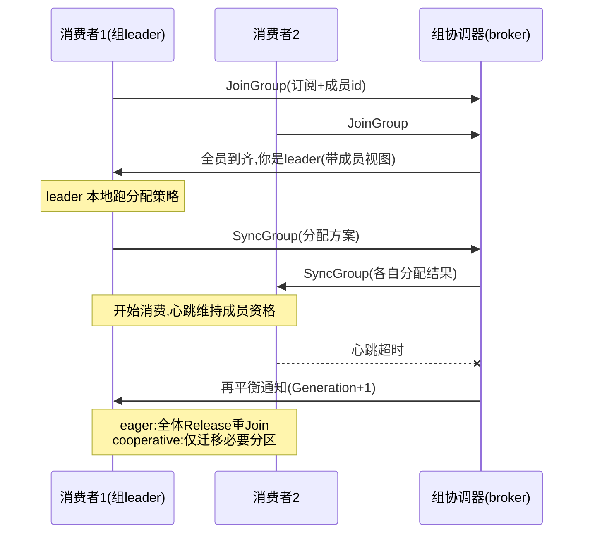
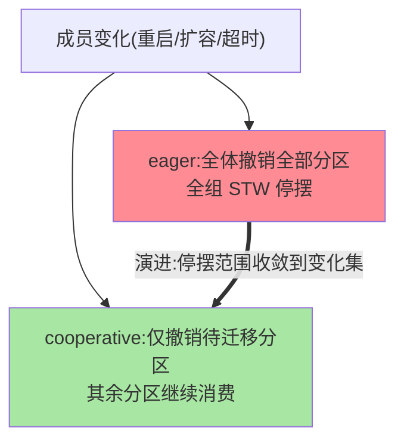
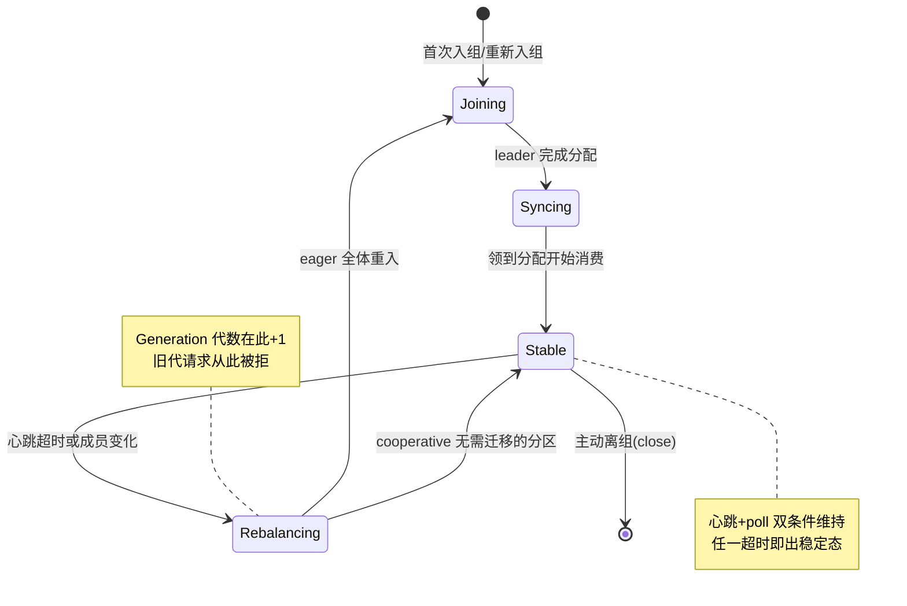

# Consumer 协调器与再平衡：消费组的自我治理

> 消费组的「谁消费哪个分区」不是静态分配——组内成员增减、订阅变化都会触发**再平衡（rebalance）**：全组停摆、重新分蛋糕。这篇拆协调器协议（组怎么治理自己）、再平衡的代价（STW 窗口）、以及缓解方案（协作式再平衡/静态成员）的演进。

> **本文核心**：消费组 = **组协调器（broker 侧的组成员管理）+ 消费者客户端（组内协商）** 的自治体系。再平衡协议两代：**eager（全体退出再全体加入——STW 全组停摆）→ cooperative（增量式只迁移必要分区——停摆窗口大幅收缩）**。**机制链**：消费者入组（JoinGroup）→ leader 消费者执行分配策略（Assign）→ 方案下发（SyncGroup）→ 消费；成员变化/心跳超时 → 触发再平衡 → 重新 JoinGroup。

## 一句话摘要

三个机制深挖：**组协调器**（broker 端的组成员账本——心跳维持成员资格、Generation 代数防旧成员干扰）；**分配策略**（Range/RoundRobin/Sticky/CooperativeSticky——由「组内 leader 消费者」执行而非 broker：分配计算下放客户端，协调器只管成员与分发）；**再平衡的代价与缓解**（eager 的全组 STW 是历史上最痛的点——cooperativesticky 增量迁移 + static membership（重启不触发再平衡）+ group.instance.id 三件演进把再平衡的爆炸半径逐级压缩——**从「全组停摆」到「只停迁移中分区」的演进主线**）。

## 一、边界：入门层讲过什么，本文讲什么

| 内容 | 入门层 | 本文 |
|---|---|---|
| 消费组与 offset 提交 | ✅ 讲过 | 不重复 |
| 再平衡的现象与触发条件 | ✅ 讲过 | 不重复 |
| JoinGroup/SyncGroup 协议流程 | 未讲 | **本文核心一** |
| eager 与 cooperative 的差异 | 未讲 | **本文核心二** |
| 静态成员与缓解三件套 | 提了一句 | **本文核心三** |

## 二、组协议与再平衡全景



**分配下放客户端的设计**：broker 协调器不做分配（只管成员账本与方案分发）——分配策略的演进（新增 Sticky/自定义策略）不需要 broker 升级——**控制面（成员管理）与策略面（分配计算）的解耦**是组协议的架构要点。这层设计思想可以复述成一句话：**把「算得快的部分」与「必须可信的部分」拆给不同组件**——分配是纯计算（客户端算），成员资格是需要全局唯一裁决的（broker 管），设计取舍的刀口就落在两者的交界面（JoinGroup/SyncGroup 两个协议动作）上。

两代协议的停摆范围对比：



**把一个成员的生命周期画成状态机**——消费组的日常运转就是成员在这几个状态间的迁移，再平衡是其中「离开稳定态」的那条边的 collective 版本：



状态机的枢纽是 Stable 态的两个维持条件（心跳与 poll），任何一条断了都会把整组拉回 Rebalancing——**消费组的稳定性本质上是「维持条件不断裂」的工程**。为什么这么设计成双条件而不是单条件？因为「联系」与「进度」的失效形态不同（下节追问链拆开），单条件要么误伤慢消费者要么漏判真故障——状态机的迁移边就是按失效形态切的。

## 三、再平衡的两代协议

| 维度 | eager（默认一代） | cooperative（增量式） |
|---|---|---|
| 触发后动作 | 全体撤销全部分区 → 重 Join | 只撤销「要迁移的分区」 |
| 停摆窗口 | 全组（所有分区消费暂停） | 仅被迁移分区 |
| 演进代价 | — | 协议两阶段（多一轮协商） |

**演进逻辑**：成员增减的影响面是「部分分区该换人」——eager 的「全体重来」是协议简单性的代价（历史实现）；cooperative 把影响面收敛到真实变化集（两轮 Join-Sync：第一轮算出迁移集、第二轮确认新归属）——**停摆范围从「全组」到「迁移分区」的语义对齐**。**CooperativeSticky 策略**（cooperative 协议 + 粘性分配（尽量保持原分配，迁移最小化））是当前的推荐组合。

### 追问链：两条超时线为什么必须拆开

- **追问一：一个超时不够吗（session.timeout 管「死没死」，为什么还要 max.poll.interval）？** 不够——消费者的「活着」有两层：进程/网络还通着（心跳能发）与消费在推进（poll 在按期调用）。GC 停顿把 poll 卡住时进程没死（心跳其实也可能停）、或者业务处理慢导致两次 poll 间隔超限但网络一切正常——单凭心跳判「死」会把活着的慢消费者误踢，单凭 poll 判「死」会把暂时空闲（没有数据可拉）的消费者误踢——**两条线各管一种死亡形态：session 管「联系断了」，poll.interval 管「进度断了」**。
- **再追问：那为什么不把心跳塞进 poll 主循环里（简化成一条线）？** 心跳若依赖 poll 的调用频率，处理慢的消费者（poll 间隔长）会被「误伤为死亡」——心跳独立出来（旧版独立线程，新版并入网络轮询但语义不变：不依赖业务处理速度）正是为了把「联系活性」与「进度活性」解耦；再平衡通知也走心跳通道下发（poll 不及时就收不到通知）——这条通道本身就是控制面的载体。
- **打破砂锅：Generation 代数防的「旧成员」具体是什么场景？** 僵尸成员——被踢出组的消费者其实没死（只是慢），它还在往旧分区提交 offset 甚至继续处理：新代方案下发后，旧代（Generation 编号小）的提交请求被协调器直接拒绝——**代数是分布式系统里「届数」防僵尸的经典手法**（与 Paxos 的任期、Raft 的 term 同构，互指分布式共识系列）。没有它，每次再平衡都会留下竞态窗口。

## 四、静态成员与缓解三件套

**static membership**（group.instance.id）：成员带稳定身份重启——协调器认得「还是你」（心跳窗口内不触发再平衡）——**滚动发布/重启场景的再平衡消除**（K8s 时代的刚需）；代价：真宕机时要等 session.timeout 才能接管（身份复用的判定延迟）。**缓解三件套**：① cooperativesticky 策略（增量迁移）② 静态成员（重启不震荡）③ 调优 session.timeout/max.poll.interval（触发阈值的合理化——处理慢的消费者别被误判死亡）——三件组合把再平衡从「高频全停事故」压成「低频小窗口维护事件」。

### 追问链：静态成员的边界在哪

- **追问一：instance.id 重复会怎样（两个实例配了同一个身份）？** 协调器按「后到者顶替」处理——新实例接管身份、旧实例被 FENCED（隔离拒绝请求）——这既是便利（K8s Pod 重建即顶替）也是配置错误的高危面（误配重复身份=静默互踢）。
- **再追问：为什么真宕机反而变慢了（无静态成员时心跳超时就能踢）？** 无静态成员时，成员消失（连接断）即可较快判定；有静态成员时「消失」更可能是「重启中」——协调器必须等满 session.timeout 确认不是重启，才能把身份判给空——**用故障转移的延迟换发布零震荡**，这笔交换的账两头都要认。

## 五、源码关键路径（4.x 口径）

```text
客户端: ConsumerCoordinator(clients)
 ├─ poll 主循环: ensureActiveGroup(入组/再平衡触发点)
 ├─ onJoinComplete → 更新分配 → 拉取位置重置
 └─ 心跳维持(旧版独立 HeartbeatThread,新版并入网络轮询)
broker 侧: GroupCoordinator(组协调器)
 ├─ JoinGroup:成员收集→选leader→成员视图下发
 ├─ SyncGroup:方案接收与分发
 └─ Generation 代数管理(旧代成员的请求被拒)
4.x 演进: KRaft 时代组协调器的新实现(新一代组协议 KIP-848,
   broker 侧无中断再平衡的彻底方案,演进中)
```

**KIP-848 的演进方向**：broker 主导的增量再平衡（彻底消除消费端停摆——服务端直接推增量分配）——消费组协议的代际重写，值得关注但当前生产主流仍是客户端协商两代协议。**模块边界的一分钟**：客户端侧 ConsumerCoordinator 管「协商与心跳」（协议状态机），fetcher 管「拉取与解压」（数据面）；broker 侧 GroupCoordinator 管「成员账本」（每个 broker 负责一部分组的分片），日志模块管「offset 提交的存储」（组进度以内部 topic 落盘）——控制面与数据面在两侧都分开，这是治理类模块的通用架构形态。

## 六、两次排查复盘（匿名化实践叙事）

**复盘一：每天定时出现的消费停顿，是一次「伪装成流量问题」的再平衡风暴。** 某风控计算链路（业内公开分享中的常见形态）每天固定时段消费 lag 飙升：第一轮排查盯着 broker 负载与分区倾斜没找到异常；第二轮换方向拉取组的再平衡事件日志，发现停顿时段再平衡密集发生——根因是上游定时批量任务让单批消息变大，处理时长越过 max.poll.interval（默认 5 分钟），消费者被判定「进度死亡」踢出重组，重组期间消费停摆、lag 堆高，恢复后下一轮又超时——**自激的再平衡循环**。修复：缩小 max.poll.records（单批少拉）+ 处理逻辑异步化（poll 线程只投递不处理），把单批时长压回阈值内。复盘的机制结论：poll 参数是组不是单点——records/处理速度/interval 三者要满足「单批处理 < interval」的不等式，改任何一个都要重验不等式。

**复盘二：GC 调优引出的连环踢，是「两条超时线」误诊的活案例。** 另一次复盘：升级 JVM 参数后消费组频繁重组，表象是「心跳超时」——按直觉调大 session.timeout 无效。细排查发现真实链路：长 GC 停顿同时打断两件事——poll 停了（进度线断）且应用恢复后立刻 poll 拉回大批积压消息，处理又超时（进度线再断）；调 session.timeout 只修了「联系线」，进度线的问题原封不动。最终按「先诊断哪条线断」的口径修复：看协调器日志的踢出原因字段（heartbeat vs poll 超时）分诊，进度线断就走 max.poll.records/interval 组合。复盘沉淀的口径：**再平衡的根因分诊第一字段是「踢出原因」，不是「调大哪个超时」**——两条超时线的机制差异就是分诊表。

### 反方案盘点：三条没走的路与一份事故清单

给「分配下放客户端」这个架构点补一张反方案对照表——每个为什么不选都有机制层面的理由：**为什么不选 broker 集中式分配**（Q4 已拆：策略迭代绑版本、控制面被拖重）；**为什么不选去中心化自协商**（成员间两两协商分配方案——消息复杂度 O(n²)，分区归属的收敛性无法保证，一致 agreeing 难以达成）；**为什么不选完全静态配置**（人工指定「哪个消费者吃哪些分区」——失去弹性，成员故障要人工介入，K8s 时代不可运维）。三条反方案全部否掉之后，剩下的就是「协调器管账本 + leader 客户端算分配」这个唯一合理点。

再补一份触发条件清单（事故预防视角）：心跳超时、poll 超时、成员主动离组、订阅正则变化、分区数变化——五类触发各有对应的监控字段；生产环境见过的事故形态集中在前三类（复盘一/复盘二覆盖），后两类变化频率低但影响整组，发布分区扩容时要提前知会消费组。

## 业内惯例

- **新集群 cooperativesticky 起步**：增量再平衡 + 粘性迁移的现成红利，无理由用 eager 裸奔
- **max.poll.records 与处理时长联动配置**：保证「单批处理 < max.poll.interval」的等式——消费参数是组不是单点
- **再平衡事件监控**（组代数变化率 + 踢出原因分布）——再平衡是消费组健康的心电图
- **3.x/4.x 视角**：两代协议稳定可用；KIP-848（新组协议）在 3.x 后期至 4.x 演进——彻底解法在路上，当前按 cooperative + static 组合是最佳实践
- **发布节奏与再平衡错峰**：滚动发布尽量避开消费高峰（再平衡期间的停摆窗口叠加高峰=延迟毛刺）——发布窗口选择把消费组状态当输入

## 七、常见误区

- **「再平衡是异常事件」**：成员管理的正常机制（扩容/发布都走它）——监控看的是「频率与原因」不是「发生了」；高频再平衡才是病
- **cooperative 立即生效**：需全组同版本客户端支持（旧客户端混部时退化 eager）——升级窗口期注意协议兼容
- **静态成员一劳永逸**：身份复用的接管延迟（session.timeout）——真宕机的故障转移时间要按这个窗口评估，不能两头都要
- **心跳线程保一切**：心跳保「成员资格」，max.poll.interval 保「消费进度」——两条超时线管两件事（很多人只知其一）
- **「分区数必须等于消费者数」**：消费者数低于分区数完全合法（一个消费者吃多个分区，Sticky 下尽量均匀）；超过分区数才浪费——规划的是「分区数 ÷ 消费者数」的余量而不是对齐

## 八、与相邻机制的关系

- 本系列篇 1（Producer）：生产消费的客户端对称篇
- 《深入理解存储引擎系列》篇 1：消费的 offset 定位（拉取路径的存储侧）
- tips 互指：治理域容错系列（再平衡期间消费失败的容错衔接）；可靠性专题（重复消费窗口与幂等）
- **上下游一分钟**：上游是组协调器（成员事件与代数下发）；本体是 ConsumerCoordinator 状态机（Join/Sync/心跳）；下游是 fetcher（拿到分配后才开始拉取）——分配结果的生效时间点卡在「onJoinComplete」这个交接线上

## 你们可能会问

**Q1：再平衡期间会丢消息吗？**
不会丢（消息在 broker，组只是暂停消费）——但会重复（已处理未提交 offset 的部分，再平衡后被新归属者重拉）——**再平衡的代价是「停摆 + 可能重复」，不是丢失**（幂等消费兜底重复，互指可靠性专题）。

**Q2：怎么选分配策略？**
默认 CooperativeSticky（3.x+ 的推荐默认方向）；特殊需求（机架亲和分配）走自定义策略接口——策略在客户端（本篇架构点），自定义不需要动 broker。

**Q3：消费者数量超过分区数会怎样？**
多出的消费者空闲（每分区至多一个消费者）——扩消费并行度的上限是分区数（分区数的规划要预留消费并行度，互指入门层的容量规划）。

**Q4：为什么不选 broker 直接分配（ broker 明明最清楚全局负载）？**
三个理由：其一，分配策略的迭代不该绑定 broker 版本（下放客户端后新策略上线不用升级集群）；其二，broker 做分配要持续收集各分区消费水位，控制面被数据面拖重；其三，分配是纯计算（订阅视图 → 分配方案），放哪都能算，放客户端是最便宜的位置——**「有计算下放到有完整信息且最便宜的一侧」**是这套设计的架构判断；KIP-848 收权给 broker 是因为「增量分配的实时性」需求压过了「解耦的灵活性」——约束变了，答案换了。

## 什么时候用/不用：缓解三件套的适用边界

- **什么时候用（建议上）**：K8s/容器化部署（实例频繁重建）→ 静态成员是刚需；分区多、组大的集群 → cooperative 增量迁移收益按停摆窗口直接兑现；处理耗时波动大的业务 → poll 参数不等式必须显式验证
- **什么时候不用（不要动）**：小规模组（3 个消费者以内、重启少）无需过度工程（静态成员的接管延迟反而要重新评估）；升级期新旧客户端混部时不要强切 cooperative（退化 eager 不如先统一版本）
- **明确推荐**：先监控（再平衡频率+踢出原因分布）后治理——用分诊表定位是哪条线断了，再选对应的三件套之一，不做无诊断的参数调优

## 不同量级的思考：架构约束驱动解法

再平衡问题在不同组规模下是不同的问题：

- **十万级（组内几个消费者，几十个分区）**：约束来源是「成员少、影响面小」——这一档的核心问题是别误配置（超时值乱设、混部协议），而不是优化停摆窗口。思考方式是默认驱动：cooperativesticky + 默认超时 + 基础监控，够用即止。
- **百万级（日消息百万，组内十几个消费者）**：约束来源是「发布频率 × 再平衡成本的乘积显形」——这一档的核心问题是发布与故障时的停摆窗口可接受吗，而不是单次分配效率。思考方式是节奏驱动：静态成员消发布震荡、发布避开高峰、再平衡频率进监控告警。
- **千万级（日消息千万，大组几十上百成员）**：约束来源是「重组的协调成本随成员数上升（JoinGroup 收集阶段线性膨胀）」——这一档的核心问题是组的规模本身要不要拆（大组拆小组/按业务域分治），而不是参数怎么调。思考方式是分治驱动：组粒度对齐业务域，单组规模控制在协调成本可接受区间。
- **亿级（日消息亿级，多组多集群）**：约束来源是「拓扑级的分配正确性与弹性成本」——这一档的核心问题是治理协议本身能不能支撑弹性扩缩（Serverless 式按 lag 自动伸缩会频繁触发成员变化），而不是治理某一个组。思考方式是架构驱动：跟进 KIP-848 类服务端主导的增量协议，把再平衡从「事件」变成「常态化的增量调整」——量级把「治理动作」升级成「协议演进」。

自下而上收束：10w 拼不误配、百万级拼发布节奏、千万级拼组规模分治、亿级拼协议演进——每一档的解法都不是上一档的调参延续，而是约束易主后的重新决策。触发升级的信号：当「再平衡频率/停摆时长」开始出现在容量评审或成本账单里，就是向下一档思考方式迁移的时机。

## 九、自测三问

1. 组协议两阶段（JoinGroup/SyncGroup）的分工与「分配下放客户端」的架构意义？
2. eager 与 cooperative 的停摆范围差异与演进逻辑？
3. 缓解三件套各解决什么再平衡场景？

## 开放问题

- KIP-848（broker 主导的无中断再平衡）是组协议的代际重写——落地后的「再平衡」概念本身可能消失（增量分配成为常态），消费组的运维心智将重建。
- 弹性消费（按 lag 自动扩缩消费者，Serverless 形态）让再平衡频率天然上升——再平衡的效率成为弹性消费的基石能力。

## 5W 速记卡

| 维度 | 一句话 |
|---|---|
| What | 组协调器（成员账本+Generation）+ 客户端协商（JoinGroup/SyncGroup）+ 两代再平衡协议（eager/cooperative） |
| Why | 分区归属要随成员增减重排——自治协议让 broker 只管账本、分配计算下放客户端 |
| When | 成员增减/心跳超时/poll 超时触发；发布与扩容必然经过；高频再平衡=健康问题 |
| Who | broker 协调器收发与代数管理；leader 消费者算分配；普通成员执行与心跳 |
| How | 心跳管联系、poll 管进度（两条超时线）；cooperative+静态成员把停摆压到最小 |

## 📎 核心带走

- **核心一句话**：消费组自治 = 组协调器（成员账本/Generation）+ 客户端协商（JoinGroup/SyncGroup，分配下放）——再平衡从 eager 全停到 cooperative 增量、静态成员消重启震荡的演进主线
- **机制链**：入组 → leader 分配 → 方案分发 → 消费+心跳 → 成员变化触发再平衡（增量迁移）→ 代数递增防旧成员
- **失效点/边界**：再平衡 = 停摆 + 可能重复（非丢失）；两条超时线（session/poll.interval）管两件事；静态成员有接管延迟

## 💡 实战提示

- 💡 cooperativesticky + 静态成员 + poll 参数等式（单批处理 < interval）进消费端配置模板
- 💡 再平衡事件监控带「踢出原因」——根因分诊的第一字段
- 💡 决策口径：扩消费并行先看分区数（上限），分区规划预留给消费扩展
- 💡 消费停顿排查的次序：先拉组的再平衡事件与踢出原因，再验 poll 不等式，最后看 GC 与网络——先分诊后用药

## 📌 数据与事实声明

- 写于 2026-09-10，2026-09-17 扩写修订；机制以 Kafka 4.x 为主线（cooperative 自 2.4、静态成员自 2.3、KIP-848 为 3.x+ 演进中）；协议细节以官方文档为准
- 默认值（max.poll.interval=5 分钟、session.timeout 默认窗口）为官方口径；两次排查复盘为业内常见故障形态的匿名化综合叙事；量级分界为业内认知
- 免责：源码细节以 apache/kafka 当前主线为准

## 📚 参考资料

| 类型 | 标题 | 来源 |
|---|---|---|
| 官方源码 | apache/kafka（clients: ConsumerCoordinator / server: GroupCoordinator） | github.com/apache/kafka |
| 官方文档 | Kafka Consumer Group / KIP-848（公开提案） | kafka.apache.org |
| 原理书 | 《深入理解 Kafka》朱忠华（消费组章） | 公开出版 |
