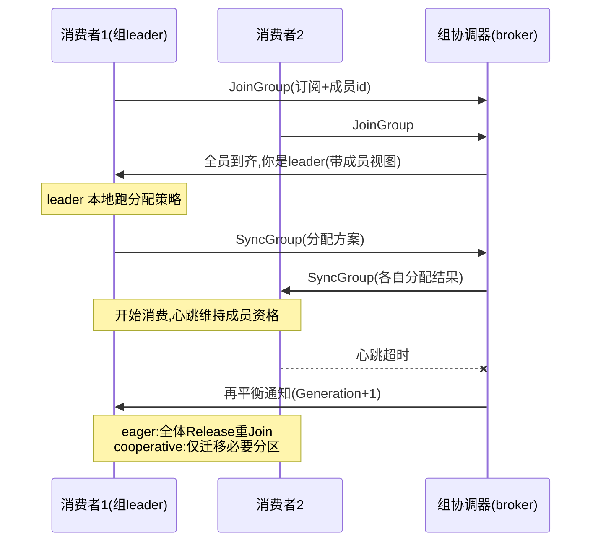
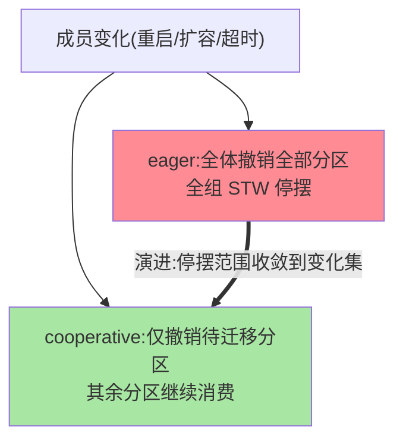

# Consumer 协调器与再平衡：消费组的自我治理

> 消费组的「谁消费哪个分区」不是静态分配——组内成员增减、订阅变化都会触发**再平衡（rebalance）**：全组停摆、重新分蛋糕。这篇拆协调器协议（组怎么治理自己）、再平衡的代价（STW 窗口）、以及缓解方案（协作式再平衡/静态成员）的演进。

> **本文核心**：消费组 = **组协调器（broker 侧的组成员管理）+ 消费者客户端（组内协商）** 的自治体系。再平衡协议两代：**eager（全体退出再全体加入——STW 全组停摆）→ cooperative（增量式只迁移必要分区——停摆窗口大幅收缩）**。**机制链**：消费者入组（JoinGroup）→ leader 消费者执行分配策略（Assign）→ 方案下发（SyncGroup）→ 消费；成员变化/心跳超时 → 触发再平衡 → 重新 JoinGroup。

## 一句话摘要

三个机制深挖：**组协调器**（broker 端的组成员账本——心跳维持成员资格、Generation 代数防旧成员干扰）；**分配策略**（Range/RoundRobin/Sticky/CooperativeSticky——由「组内 leader 消费者」执行而非 broker：分配计算下放客户端，协调器只管成员与分发）；**再平衡的代价与缓解**（eager 的全组 STW 是历史上最痛的点——cooperativesticky 增量迁移 + static membership（重启不触发再平衡）+ group.instance.id 三件演进把再平衡的爆炸半径逐级压缩——**从「全组停摆」到「只停迁移中分区」的演进主线**）。

## 一、边界：入门层讲过什么，本文讲什么

| 内容 | 入门层 | 本文 |
|---|---|---|
| 消费组与 offset 提交 | ✅ 讲过 | 不重复 |
| 再平衡的现象与触发条件 | ✅ 讲过 | 不重复 |
| JoinGroup/SyncGroup 协议流程 | 未讲 | **本文核心一** |
| eager 与 cooperative 的差异 | 未讲 | **本文核心二** |
| 静态成员与缓解三件套 | 提了一句 | **本文核心三** |

## 二、组协议与再平衡全景



**分配下放客户端的设计**：broker 协调器不做分配（只管成员账本与方案分发）——分配策略的演进（新增 Sticky/自定义策略）不需要 broker 升级——**控制面（成员管理）与策略面（分配计算）的解耦**是组协议的架构要点。

两代协议的停摆范围对比：



## 三、再平衡的两代协议

| 维度 | eager（默认一代） | cooperative（增量式） |
|---|---|---|
| 触发后动作 | 全体撤销全部分区 → 重 Join | 只撤销「要迁移的分区」 |
| 停摆窗口 | 全组（所有分区消费暂停） | 仅被迁移分区 |
| 演进代价 | — | 协议两阶段（多一轮协商） |

**演进逻辑**：成员增减的影响面是「部分分区该换人」——eager 的「全体重来」是协议简单性的代价（历史实现）；cooperative 把影响面收敛到真实变化集（两轮 Join-Sync：第一轮算出迁移集、第二轮确认新归属）——**停摆范围从「全组」到「迁移分区」的语义对齐**。**CooperativeSticky 策略**（cooperative 协议 + 粘性分配（尽量保持原分配，迁移最小化））是当前的推荐组合。

## 四、静态成员与缓解三件套

**static membership**（group.instance.id）：成员带稳定身份重启——协调器认得「还是你」（心跳窗口内不触发再平衡）——**滚动发布/重启场景的再平衡消除**（K8s 时代的刚需）；代价：真宕机时要等 session.timeout 才能接管（身份复用的判定延迟）。**缓解三件套**：① cooperativesticky 策略（增量迁移）② 静态成员（重启不震荡）③ 调优 session.timeout/max.poll.interval（触发阈值的合理化——处理慢的消费者别被误判死亡）——三件组合把再平衡从「高频全停事故」压成「低频小窗口维护事件」。

## 五、源码关键路径（4.x 口径）

```text
客户端: ConsumerCoordinator(clients)
 ├─ poll 主循环: ensureActiveGroup(入组/再平衡触发点)
 ├─ onJoinComplete → 更新分配 → 拉取位置重置
 └─ 心跳线程 HeartbeatThread(session 超时判定)
broker 侧: GroupCoordinator(组协调器)
 ├─ JoinGroup:成员收集→选leader→成员视图下发
 ├─ SyncGroup:方案接收与分发
 └─ Generation 代数管理(旧代成员的请求被拒)
4.x 演进: KRaft 时代组协调器的新实现(新一代组协议 KIP-848,
   broker 侧无中断再平衡的彻底方案,演进中)
```

**KIP-848 的演进方向**：broker 主导的增量再平衡（彻底消除消费端停摆——服务端直接推增量分配）——消费组协议的代际重写，值得关注但当前生产主流仍是客户端协商两代协议。

## 六、典型场景

- **再平衡风暴排查**：频繁再平衡的根因清单——max.poll.interval 超时（处理太慢被踢）、session 超时（GC/网络）、成员频繁重启（无静态成员）——三个根因对应三个修法，**先看 Rebalance 事件日志的触发原因**（协调器侧记录踢出原因）
- **长处理消费者被误踢**：单批处理超 max.poll.interval（默认 5 分钟）——调大间隔或缩小 max.poll.records（每批少处理点）——处理时长与心跳解耦是设计前提
- **滚动发布震荡**：无静态成员时逐台重启 = 逐次全组再平衡——static membership 一配解千愁（K8s 部署的标配）

## 业内惯例

- **新集群 cooperativesticky 起步**：增量再平衡 + 粘性迁移的现成红利，无理由用 eager 裸奔
- **max.poll.records 与处理时长联动配置**：保证「单批处理 < max.poll.interval」的等式——消费参数是组不是单点
- **再平衡事件监控**（组代数变化率 + 踢出原因分布）——再平衡是消费组健康的心电图
- **3.x/4.x 视角**：两代协议稳定可用；KIP-848（新组协议）在 3.x 后期至 4.x 演进——彻底解法在路上，当前按 cooperative + static 组合是最佳实践

## 七、常见误区

- **「再平衡是异常事件」**：成员管理的正常机制（扩容/发布都走它）——监控看的是「频率与原因」不是「发生了」；高频再平衡才是病
- **cooperative 立即生效**：需全组同版本客户端支持（旧客户端混部时退化 eager）——升级窗口期注意协议兼容
- **静态成员一劳永逸**：身份复用的接管延迟（session.timeout）——真宕机的故障转移时间要按这个窗口评估，不能两头都要
- **心跳线程保一切**：心跳保「成员资格」，max.poll.interval 保「消费进度」——两条超时线管两件事（很多人只知其一）

## 八、与相邻机制的关系

- 本系列篇 1（Producer）：生产消费的客户端对称篇
- 《深入理解存储引擎系列》篇 1：消费的 offset 定位（拉取路径的存储侧）
- tips 互指：治理域容错系列（再平衡期间消费失败的容错衔接）；可靠性专题（重复消费窗口与幂等）

## 你们可能会问

**Q1：再平衡期间会丢消息吗？**
不会丢（消息在 broker，组只是暂停消费）——但会重复（已处理未提交 offset 的部分，再平衡后被新归属者重拉）——**再平衡的代价是「停摆 + 可能重复」，不是丢失**（幂等消费兜底重复，互指可靠性专题）。

**Q2：怎么选分配策略？**
默认 CooperativeSticky（3.x+ 的推荐默认方向）；特殊需求（机架亲和分配）走自定义策略接口——策略在客户端（本篇架构点），自定义不需要动 broker。

**Q3：消费者数量超过分区数会怎样？**
多出的消费者空闲（每分区至多一个消费者）——扩消费并行度的上限是分区数（分区数的规划要预留消费并行度，互指入门层的容量规划）。

## 九、自测三问

1. 组协议两阶段（JoinGroup/SyncGroup）的分工与「分配下放客户端」的架构意义？
2. eager 与 cooperative 的停摆范围差异与演进逻辑？
3. 缓解三件套各解决什么再平衡场景？

## 开放问题

- KIP-848（broker 主导的无中断再平衡）是组协议的代际重写——落地后的「再平衡」概念本身可能消失（增量分配成为常态），消费组的运维心智将重建。
- 弹性消费（按 lag 自动扩缩消费者，Serverless 形态）让再平衡频率天然上升——再平衡的效率成为弹性消费的基石能力。

## 📎 核心带走

- **核心一句话**：消费组自治 = 组协调器（成员账本/Generation）+ 客户端协商（JoinGroup/SyncGroup，分配下放）——再平衡从 eager 全停到 cooperative 增量、静态成员消重启震荡的演进主线
- **机制链**：入组 → leader 分配 → 方案分发 → 消费+心跳 → 成员变化触发再平衡（增量迁移）→ 代数递增防旧成员
- **失效点/边界**：再平衡 = 停摆 + 可能重复（非丢失）；两条超时线（session/poll.interval）管两件事；静态成员有接管延迟

## 💡 实战提示

- 💡 cooperativesticky + 静态成员 + poll 参数等式（单批处理 < interval）进消费端配置模板
- 💡 再平衡事件监控带「踢出原因」——根因分诊的第一字段
- 💡 决策口径：扩消费并行先看分区数（上限），分区规划预留给消费扩展

## 📌 数据与事实声明

- 写于 2026-09-10，机制以 Kafka 4.x 为主线（cooperative 自 2.4、静态成员自 2.3、KIP-848 为 3.x+ 演进中）；协议细节以官方文档为准
- 免责：源码细节以 apache/kafka 当前主线为准

## 📚 参考资料

| 类型 | 标题 | 来源 |
|---|---|---|
| 官方源码 | apache/kafka（clients: ConsumerCoordinator / server: GroupCoordinator） | github.com/apache/kafka |
| 官方文档 | Kafka Consumer Group / KIP-848（公开提案） | kafka.apache.org |
| 原理书 | 《深入理解 Kafka》朱忠华（消费组章） | 公开出版 |
