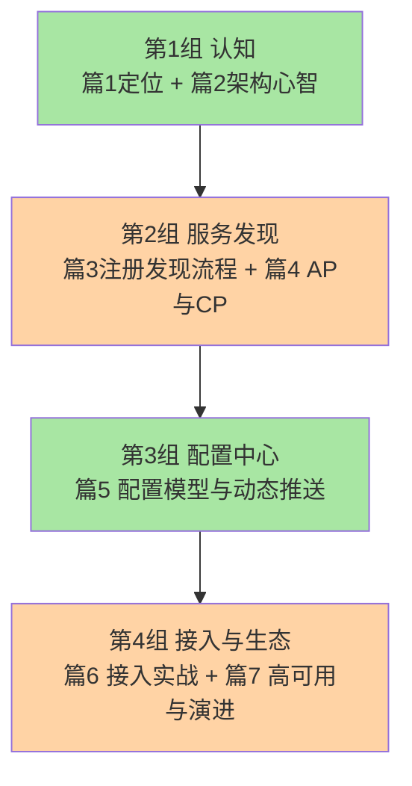

# Nacos 系列导读：从机制到组件的 4 层学习路径

> 入门层 7 篇导读。讲清系列定位、4 层关系、阅读路径、与相邻系列的关系——**不重复入门层定义**。

## 一、这个系列讲什么

微服务一旦多起来，两件事立刻变难：「服务在哪」和「配置怎么改」。学 Nacos 最容易犯的错，是把「机制」和「组件」混在一起：

- 会加 `nacos-discovery` 依赖，但说不清服务列表是怎么到本地的、挂了怎么感知
- 会改配置，但不知道推送是推还是拉、为什么改完秒级生效
- 上了生产，临时实例和持久实例随便选，AP/CP 说不出所以然

所以本系列先划分工：**「服务发现为什么需要注册中心」「配置推送有哪几种模型」这类跨实现机制，归架构域服务治理系列（service-discovery / config-center）；本系列专注 Nacos 这个组件本身**——数据模型、AP/CP 双协议、长连接演进、生产落地。

按 4 层架构组织：先建认知心智模型，再深挖协议与推送实现，最后用治理与选型收束——每层读到什么深度，取舍权在你。

## 二、4 层关系

```
L1 入门层（本文）      ← 概念入门：是什么 + 两大模块 + 接入
  ↓ 组件视角（机制概念 tips 链回服务治理系列）
L2 特性层           ← 实现深挖：注册发现 / 配置中心 / Distro 与 Raft
  ↓ 跨特性组合
L3 专题层           ← 治理专题：多环境配置治理 / 迁移与容灾
  ↓ 跨 L3 收束
L4 整合层           ← 全景演进 + 选型决策树 + 接入实战
```

每层独立可读、并列不依赖——你可以在任何一层开始。

## 三、子主题地图

入门层 7 篇分 4 组：

**第 1 组 · 认知（篇 1-2）**：Nacos 是什么（与 ZooKeeper / Consul / Eureka 的定位直觉）+ 核心概念与架构心智模型

**第 2 组 · 服务发现（篇 3-4）**：注册与发现流程 → AP 与 CP（临时实例 vs 持久实例）怎么选

**第 3 组 · 配置中心（篇 5）**：配置模型、命名空间多环境隔离、动态推送概念级

**第 4 组 · 接入与生态（篇 6-7）**：Spring Boot 接入与控制台 → 集群高可用与版本演进



## 四、阅读路径

| 读者类型 | 推荐路径 |
|---|---|
| **入门读者** | 篇 1 → 2 → 3 → 4 → 5 → 6 → 7 |
| **用过但想懂原理** | 篇 2 → 直接进 L2 特性层（从注册发现机制系列开始） |
| **生产运维视角** | 篇 6 → L3 专题层（多环境治理 / 迁移容灾） |
| **框架选型视角** | 篇 1 → L4 整合层选型决策树 |

## 五、与相邻层的关系


- **L1 入门层**（本层）：概念入门，建立「注册 + 配置」的心智模型
- **L2 特性层**（待铺）：实现深挖——先读 L1 再读 L2，理解成本最低
- **L3 专题层**（待铺）：跨 L2 特性的治理专题
- **L4 整合层**（待铺）：全景 + 选型 + 接入实战

## 六、与相邻系列的关系

- **architecture/service-governance/service-discovery**：注册发现的**机制**正式定义篇在那边，本系列只讲 Nacos 怎么实现
- **architecture/service-governance/config-center**：配置中心通用机制在那边；长轮询到 gRPC 的推送演进作为 Nacos 实现在特性层讲
- **middleware/sentinel**：Nacos 是 Sentinel 规则持久化推送的主流数据源，两系列各讲各的视角互指

## 📌 数据与事实声明

- 写于 2026-09-08，对标 Nacos 3.2.4（2026-08-27 发布，gh CLI 实测）
- 免责：Nacos 版本迭代快，具体配置项与默认值以官方文档为准

## 📚 参考资料

| 类型 | 标题 | 来源 |
|---|---|---|
| 官方文档 | Nacos Docs | nacos.io |
| 官方源码 | alibaba/nacos | github.com/alibaba/nacos |
| 仓库本系列 index | `docs/middleware/nacos/index.md` | 本仓库 |
