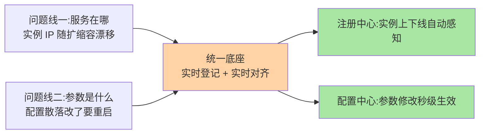
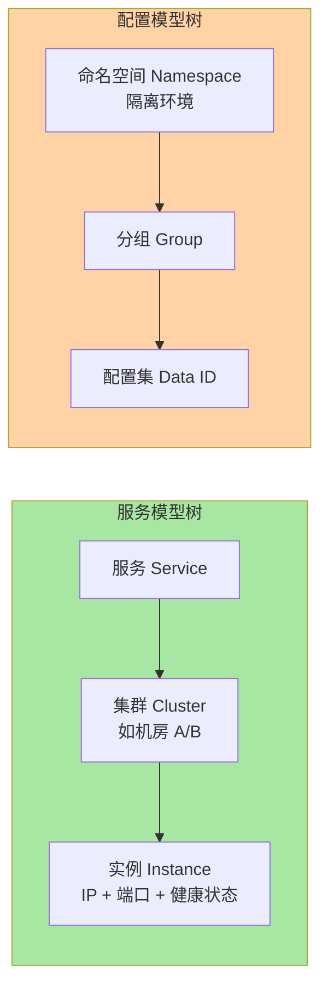

# Nacos 是什么：注册中心与配置中心的统一底座

> 一句话：Nacos 是「动态服务发现 + 配置管理」二合一的中间件——服务实例再怎么漂移，调用方都能拿到最新地址列表；线上参数再怎么改，都不用重启实例。

> **本文核心**：Nacos 的本质是**「一份数据、多方订阅、变更及时送达」的统一底座**——注册中心管「服务在哪」（实例上下线自动感知），配置中心管「参数是什么」（修改秒级推送），两条问题线的底层需求同源所以收进一个组件。**机制链**：变更方（实例注册/配置修改）→ Nacos Server 存储（AP/CP 双模）→ 订阅方感知（推送/长连接）→ 调用方与使用方实时对齐。名字即定位：**Na**ming + **Co**nfiguration + **S**ervice。

## 一句话摘要

微服务架构有两个反复出现的麻烦：**服务实例的地址随时在变**（扩缩容、发布、故障迁移），**线上参数随时要改**（开关、阈值、超时）。Nacos 用一套底座同时解决这两件事：注册中心负责「服务在哪」的实时登记与查询，配置中心负责「参数是什么」的中心化存储与动态推送。名字里的 Na 即 Naming（命名/发现），cos 即 Configuration（配置），s 即 Service。

## 一、为什么需要注册与配置的统一底座

先看没有它会怎样。某团队几十个微服务跑在容器平台，实例 IP 随扩缩容天天变：A 服务调 B 服务，地址写死在配置文件里——B 一发版 A 就报连接失败，运维半夜手改 hosts 是家常便饭。与此同时另一个痛点：风控规则的超时参数散落在 40 台机器的配置文件里，改一个值要滚动重启全部实例，改完还不知道有没有漏。

这是两条独立的问题线，各有各的解法，但痛点同源——**「动态变化」缺少一个大家都能实时对齐的地方**：



分开用两个组件（注册中心 + 配置中心）当然也可以，历史上很多团队就是这么演进的。但两条线的底层需求高度重合：都是「一份数据、多方订阅、变更及时送达」。Nacos 把它们收进一个组件，部署一套、控制台一个、客户端 SDK 一份——这是架构上的取舍：换来运维面收敛，付出的是「两个功能耦合在一个进程」的代价。是否值得，等读完全系列你可以自己下判断。

**量级演进视角**：十几个服务的小团队——Eureka/ZK 单功能组件也够，二合一的收益还显现不出来；服务数到万级实例规模（几十到几百个服务）——配置散落与寻址漂移的运维成本线性上涨，统一底座+控制台的收敛收益放大；十万级实例、多机房混合部署——双模一致性的选择权（AP/CP 按场景选）、多命名空间治理、集群高可用成为硬需求——**「二合一」的价值随服务规模与变更频率放大**，小规模下的收益确实有限，这是诚实的边界。

## 5W 速记卡

| 维度 | 一句话 |
|---|---|
| What | 动态服务发现 + 配置管理二合一的中间件（Naming + Configuration + Service） |
| Why | 实例地址与线上参数都在动态变化，需要各方实时对齐的统一底座 |
| When | 微服务间调用寻址、多环境配置隔离、动态调参、灰度发布 |
| Where | 独立部署的 Server 集群 + 嵌在应用里的轻量客户端 |
| How | 服务注册发现走命名模块，配置存储推送走配置模块，客户端统一接入 |

## 二、核心概念：三件事与两棵模型树

Nacos 对外就做三件事：**服务注册**（实例上线时登记自己的地址）、**服务发现**（调用方订阅服务，拿到实时实例列表）、**配置管理**（配置中心化存储 + 变更推送）。三件事背后是两棵相互独立的模型树：



服务模型树回答「**一次调用找谁**」：服务是逻辑名，下面按机房/分区分集群，叶子是具体 IP 端口的实例。配置模型树回答「**一份配置在哪**」：命名空间隔离环境（开发/测试/生产），分组隔离用途，最叶子是具体配置文件。

接入本身薄到只有两行配置——这就是最小可运行的全部：

```yaml
# Spring Boot 应用接入 Nacos（依赖 spring-cloud-starter-alibaba-*）
spring:
  cloud:
    nacos:
      discovery:
        server-addr: nacos-headless:8848   # 注册与发现
      config:
        server-addr: nacos-headless:8848   # 配置中心
```

### 二·五、控制面定位：Nacos 在一次调用中的位置

把 Nacos 放回一次调用的全景：调用方先问 Nacos「order-service 在哪」（发现），再发调用（互指 RPC 篇 2 的寻址阶段），运行中 Nacos 推送实例变更（摘除/新增）更新本地列表——**Nacos 全程不碰业务流量**，它交换的是「元数据」（地址、健康状态、元数据标签），这正是它敢做成中心化的原因：数据面流量不过中心，控制面消息量=变更频率（低）而非调用频率（高）。理解「控制面/数据面分离」，就理解了为什么百级 QPS 的 Nacos 集群能支撑十万级调用 QPS（互指 RPC 篇 6 的频率解耦设计思想）。

## 三、与同类组件的区别：ZooKeeper / Consul / Eureka

| 维度 | Nacos | ZooKeeper | Consul | Eureka |
|---|---|---|---|---|
| 定位 | 注册 + 配置二合一 | 通用协调（注册只是用法之一） | 注册 + 配置 + 网格 | 纯注册中心 |
| 一致性取向 | AP/CP 双模可选 | CP（选举期间不可用窗口） | CP 倾向 | AP |
| 控制台 | 自带，功能完整 | 无 | 自带 | 简单 |
| 维护状态 | 活跃（3.x） | 活跃（Java 生态降温） | 活跃 | 官方公告 2.0 停止演进 |

定位直觉：**ZooKeeper 是为协调而生的通用件，用 ZAB 强一致换可用性窗口；Eureka 为可用性而生，简单但演进停了；Consul 功能全面且强在多数据中心；Nacos 的差异点是「二合一 + 双模一致性 + 上手成本低」**——注册和配置一套搞定，AP 还是 CP 按场景选。谁更适合你，取决于一致性取向和生态，完整决策树在整合层讲一遍。

划一个边界：「注册发现的通用机制」「配置推送有哪几种模型」这类**跨实现原理**，归架构域服务治理系列正式讲；本系列只讲 Nacos 怎么实现。

## 四、典型使用场景

- **服务上下线自动感知**：发布时新实例上线自动接流量、下线实例自动摘除，调用方无感
- **多环境配置隔离**：开发/测试/生产用命名空间隔离，同一份应用代码零修改跑三个环境
- **动态调参**：大促把限流阈值、降级开关做成配置项，改完秒级推送全量实例生效
- **灰度发布**：配置支持按客户端 IP 或标签灰度下发，先放一台验证再全量

## 五、误区与不适用

- **当数据库用**：把业务大对象、订单数据塞进配置中心——它管的是「小而关键的控制面参数」，数据面的问题找存储，混用的代价是配置系统被拖垮
- **以为注册中心挂了服务全挂**：客户端订阅后有本地快照缓存，Nacos 集群短暂不可用时，**已发现**的实例列表还能用、已建立的调用不受影响；受影响的是「新服务的首次发现」。这是 AP 设计给的容错余量，不是运气
- **什么配置都塞进来**：高频变更的大文件、秒级跳动的数据会放大推送压力。取舍原则：配置中心放「低频变更、全局敏感」的参数
- **临时与持久实例乱选**：临时实例（心跳保活，挂了自动摘）和持久实例（永久登记，靠健康检查探活）语义不同，数据库这类不会被「摘掉」的固定成员该用持久实例——篇 4 展开怎么选

## 六、你们可能会问

**Q1：ZooKeeper 也能当注册中心，为什么选 Nacos？**
ZK 当注册中心是「借用」：CP 强一致带来的选举不可用窗口对发现场景是硬伤，且没有配置能力、没有控制台。Nacos 是为发现与配置原生设计，双模一致性把选择权交回应用。当然，已有 ZK 基础的团队（Dubbo 老体系）继续用也成立——迁移收益与成本要一起算。

**Q2：配置改完是推还是拉？**
概念级回答：早期版本以客户端长轮询（拉的一种变体）为主，2.x 起演进为 gRPC 长连接、服务端可主动推。推拉的权衡与实现细节是特性层的重头，这里先记住「秒级生效」是结果。

**Q3：K8s 自带 Service 发现，还要 Nacos 吗？**
看边界：K8s Service 解决「集群内按 Service 名找到 Pod」，平台视角；Nacos 解决「应用层跨语言、跨集群甚至混合部署的服务寻址 + 配置」，应用视角。纯 K8s 内的简单服务可以只用原生发现，需要应用级治理与统一配置时两者并存很常见。

## 七、自测三问

1. Nacos 名字的三个组成部分对应什么能力？
2. 服务模型树和配置模型树各自的层级是什么？
3. Nacos 集群短暂不可用，为什么已建立的调用不受影响？

下一篇讲「核心概念与架构心智模型」：把两棵模型树展开成一次完整的注册-订阅-推送旅程，看清 Server 集群内部怎么分工。

## 💡 实战提示

- 💡 生产必开鉴权与网络隔离——Nacos 掌握全站寻址与配置，裸奔等于把控制面交给内网任何人
- 💡 配置中心只放「低频变更、全局敏感」的参数——数据面数据与高频跳动数据一律不进
- 💡 决策口径：固定成员（数据库/ES）用持久实例、弹性实例（微服务）用临时实例；已有 ZK 生态的迁移收益与成本一起算

## 追问思考与开放问题

**质疑者视角**：「二合一」的架构取舍要两面看——运维收敛的对面是**爆炸半径耦合**：Nacos 集群故障同时冲击寻址与配置两条线（分属两个组件时互不牵连）。缓解依赖篇 4 的一致性设计（AP 模式下客户端快照兜底）与客户端容错（配置快照文件），但「一荣俱荣一损俱损」的结构性风险客观存在。另一个质疑：注册中心数据的「实时性」承诺有边界——推送链路任何一环延迟都会让调用方拿着过期列表，防护要靠调用方容错（failover）兜底，**Nacos 保证的是「尽快送达」，不是「绝对一致」**（AP 模式）。

**开放问题**：
- 注册数据模型与 Mesh 服务发现的融合——K8s Service/Nacos/istio 三套寻址体系在混合云场景的统一路径。
- 配置面与数据面边界的治理自动化——「什么该进配置中心」目前靠纪律，治理平台能否自动识别违规数据。

## 📎 核心带走

- **核心一句话**：Nacos = 注册中心 + 配置中心的统一底座——「一份数据、多方订阅、变更及时送达」，AP/CP 双模按场景选
- **机制链**：变更方 → Server 存储（临时走 AP/Distro、持久走 CP/Raft）→ 推送/长连接触达订阅方 → 调用方与使用方对齐
- **失效点/边界**：不当数据库用；集群短暂不可用时靠客户端快照兜底（新发现受影响）；临时/持久实例语义不同按成员性质选

## 📌 数据与事实声明

- 写于 2026-09-08，对标 Nacos 3.2.4（2026-08-27 发布，gh CLI 实测）
- Eureka 2.0 停止演进为官方公告口径（公开报道）；各组件一致性取向为公开文档口径
- 免责：具体配置项与默认值以官方文档为准

## 📚 参考资料

| 类型 | 标题 | 来源 |
|---|---|---|
| 官方文档 | Nacos 概念与架构 | nacos.io/docs |
| 官方源码 | alibaba/nacos | github.com/alibaba/nacos |
| 官方公告 | Eureka 2.0 演进说明 | github.com/Netflix/eureka |
| 系列导航 | Nacos 系列目录 | `docs/middleware/nacos/index.md` |
