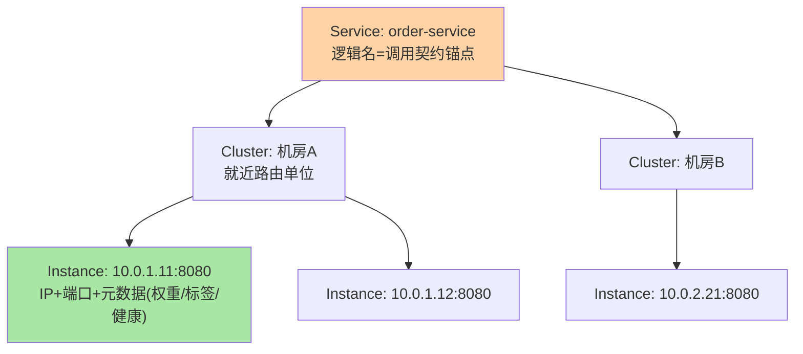
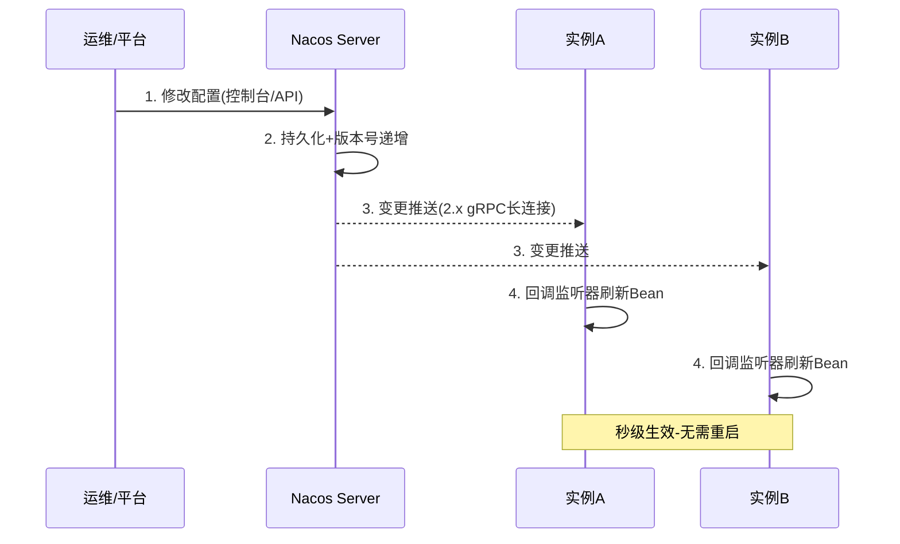

# Nacos 核心概念与架构心智模型：两棵模型树与一次变更的旅程

> **本文核心**：Nacos 的全部概念可以收进**两棵模型树**——服务模型树（Service → Cluster → Instance，回答「一次调用找谁」）与配置模型树（Namespace → Group → Data ID，回答「一份配置在哪」），加上**一次变更的旅程**（变更方提交 → Server 存储（按数据类型走 Distro 或 Raft）→ 订阅方被推送/拉取感知）。**机制链**：概念分层定位（逻辑隔离→用途分组→具体对象）→ Server 内部按数据模型分片存储 → 变更事件沿订阅关系触达——理解「树的层级是隔离与寻址的语义」与「数据类型决定一致性协议」，后续每篇深挖都有坐标系。

## 一句话摘要

服务模型树的三层各有明确语义：**服务**是逻辑名（调用契约的锚点）、**集群**是机房/可用区维度（就近路由与容灾的单位）、**实例**是 IP+端口+元数据（流量的最终落点）。配置模型树同样三层各有分工：**命名空间**隔离环境（开发/测试/生产物理隔离）、**分组**隔离用途（同一环境内不同体系）、**Data ID** 定位具体配置文件。两大模块（命名服务 Naming + 配置服务 Config）在 Server 内部是相对独立的存储与推送管线，共享集群与控制台——**「概念树分职责、数据分协议、部署收一体的松耦合」**是 Nacos 架构的心智总图。

## 5W 速记卡

| 维度 | 一句话 |
|---|---|
| What | 服务/配置两棵模型树 + 命名/配置两模块的架构心智模型 |
| Why | 概念层级是隔离与寻址的语义载体，先建坐标系再谈机制 |
| When | 资源规划（命名空间/分组设计）、排障定位、多环境治理 |
| Where | Nacos Server 集群 + 客户端 SDK + 控制台 |
| How | 按树层级组织数据 → 按数据类型选协议存储 → 按订阅关系推送 |

## 二、服务模型树：三层各管一件事

**层级的语义必须分清，混用是治理灾难的起点**：服务层是「调用的稳定锚点」（调用方永远面向服务名，实例怎么漂移无感）；集群层是「地域语义」（同城双机房部署时，cluster-A/cluster-B 支撑就近路由与机房级容灾切换——互指 RPC 篇 8 的机房路由，Nacos 的集群字段就是路由规则的元数据来源）；实例层是「流量的最终落点」（权重、健康状态、元数据标签都在实例上，负载均衡与灰度的数据基础）。**元数据（metadata）是树的隐形第四维**——版本号、灰度标记、自定义标签全挂在实例的 key-value 上，治理域各机制（路由/灰度/鉴权）的落地都靠它（互指治理域元数据篇）。

**量级演进视角**：单集群几十实例——树的层级是纯语义，怎么组织都对；万级实例——实例变更事件量上涨，客户端订阅的列表体积与推送频率成为 Server 压力源（增量推送/udp→gRPC 长连接的演进正是被这个量级逼出来的）；十万级实例、多机房——集群层从「可选语义」变成「硬要求」（跨机房容灾靠它），命名空间从「环境隔离」扩展为「租户隔离」——**树的每一层都会在特定量级从「语义可选」变成「治理必需」**。

## 三、配置模型树：隔离与定位的三级火箭

| 层级 | 语义 | 典型用法 |
|---|---|---|
| Namespace 命名空间 | 物理级隔离（数据互不可见） | dev/test/prod 各一个，或按租户隔离 |
| Group 分组 | 逻辑级隔离（同环境内分体系） | DEFAULT_GROUP / 中台组 / 网关组 |
| Data ID | 具体配置文件定位 | order-service.yaml / common-datasource.properties |

**命名空间是「硬隔离」**：跨命名空间的配置与服务互不可见——生产事故最怕「测试配置改到生产」，命名空间从物理上杜绝这类串环境操作；**分组是「软隔离」**：同一命名空间内的体系划分，跨组引用需要显式声明（配置继承场景）。**Data ID 的命名规范是治理核心**：`{应用名}-{环境}-{类型}.{后缀}` 这类约定让数百配置可检索、可审计——没有命名规范的配置中心三个月后就变成垃圾场，这是所有配置中心实践的第一教训。

### 一次配置变更的完整旅程

旅程里的关键机制位：**版本号**（配置每次变更版本递增，客户端比对版本判断是否需要刷新——MD5/版本比对是长轮询时代的心跳负载优化核心）；**监听器回调**（客户端收到变更后触发注册的 Listener，Spring 环境下由 @RefreshScope 等机制刷新 Bean——「推送生效」的最后一公里是应用自己的刷新机制）；**灰度推送**（配置支持按 IP/标签灰度下发，变更先到指定实例验证再全量——配置变更的安全网，互指 RPC 篇 8 的规则灰度）。

## 四、两大模块的松耦合与一致性分野

Nacos Server 内部，命名模块（Naming）与配置模块（Config）是**相对独立的存储与推送管线**：命名服务的实例数据默认走 **AP（Distro 协议）**——可用性优先，实例短暂不一致可容忍；配置数据走 **CP（Raft 协议）**——配置的写入必须过半数确认，因为「配置不一致」的代价远高于「实例列表短暂不一致」。**为什么同一个组件用两种协议**——数据性质决定一致性要求：实例列表是「最终一致无妨」的易变数据，配置是「必须一致」的关键小数据——这是「一致性协议跟着数据性质走」的教科书实践（机制深挖互指篇 4 与分布式理论系列）。

模块松耦合的收益与代价并存：收益是两条管线独立演进（2.x 的 gRPC 长连接改造主要发生在通信层，两模块共享收益）、故障域相对隔离；代价是「一个组件两套内部机制」的学习成本——排障时要先分清问题在命名管线还是配置管线。

## 与 K8s 资源模型的区别

| 维度 | Nacos 模型树 | K8s 资源层级 |
|---|---|---|
| 层级 | Namespace→Service→Cluster→Instance | Namespace→Workload→Pod |
| 隔离单元 | 命名空间（环境/租户） | 命名空间（租户/项目） |
| 寻址对象 | 服务名→实例列表 | Service 名→Endpoints |
| 跨集群 | 多集群同步/迁移工具 | 联邦/多集群 Service |

两者同构（树形模型+命名空间隔离），差异在服务对象：Nacos 面向「应用层跨平台寻址」（K8s 内外混合部署、非容器实例都能注册），K8s 面向「平台内调度发现」——混合部署团队的两者并存与对齐是常态（互指篇 1 的 K8s 边界 QA）。

## 五、典型场景与误区

**典型场景**：多环境隔离（三套命名空间+独立集群，测试配置物理上进不了生产）；同机房容灾（服务按集群字段标注机房，调用方就近路由）；配置灰度（变更先灰度到一台实例，观察指标再全量）；中台配置复用（公共 Data ID 跨应用共享数据源配置，分组管理版本）。

**常见误区**：① **命名空间当分组用**——按业务线开几十个命名空间，最后环境隔离反而做不了（命名空间总数失控，权限矩阵爆炸）；正确层级：环境用命名空间、业务体系用分组；② **服务/集群/实例的语义混用**——把「版本」当集群字段用（v1/v2 集群），机房容灾与版本灰度两个语义挤在一个字段里互相打架——版本语义该走实例元数据；③ **Data ID 无命名规范**——`test1` `new-config` 这类命名在规模面前必然失控，规范要在第一个配置进来之前定；④ **以为配置推送保证原子生效**——推送按实例逐个触达，「全量生效」是个时间窗口（秒级但非原子），对一致性敏感的变更要配合业务侧确认机制（版本上报/生效确认）；⑤ **元数据乱用**——实例 metadata 塞大对象（几 KB 的 JSON），注册与推送的报文被拖大——元数据只放路由与治理需要的小标签。

## 设计思想：为什么是「树」而不是「标签云」

Nacos 的模型设计选择「层级树」而非「纯标签体系」值得推敲：**树结构让每一层有唯一确定的语义与归属**（实例必属于某集群某服务），权限、隔离、寻址都能沿树做确定性推导；标签体系的自由度更高，但「谁的标签」永远有归属歧义。配置模型树同理：命名空间→分组→Data ID 的包含关系让「一次变更影响谁」可以沿树静态推算——**「可推算的影响面」是控制面数据模型的核心要求**，树结构用牺牲一点自由度换来了治理的确定性。这与 K8s 的资源层级（Namespace→Workload→Pod）异曲同工：成熟的控制面几乎都收敛到树形模型。

## 追问思考

**质疑者视角**：两棵树的「松耦合」在部署上收为一体，但**运维心智必须强制分离**——命名管线的故障（实例推送延迟）与配置管线的故障（配置推送失败）的排障路径、监控指标、一致性保障完全不同；把 Nacos 当「一个黑盒」运维的团队，会在故障时混淆两条管线的问题信号（配置推送失败时误查注册链路）。另一个质疑：树模型的层级是**设计期锁定的**——「实例属于集群、集群属于服务」一旦定死，跨服务的实例共享（同实例注册多个服务名）在树模型里是「多路径挂载」的特例，多注册场景的心智负担比标签模型高——这是树模型的代价面，多数团队用不到这个特例，但要意识到它在。

**事故视角**：某团队图省事，测试与生产用同一个命名空间、靠 Group 区分（test 组/prod 组）——一次配置变更时控制台选中了同名 Group 前缀的 prod 配置，改动直接进了生产，触发全站数据源连接串刷新事故。复盘定下铁律：**环境隔离必须用命名空间（物理隔离），Group 只做环境内的体系划分（逻辑隔离）**——逻辑隔离靠人选中对，物理隔离靠系统结构性防错——「能靠结构防错的绝不靠人小心」是配置治理的第一原则。追问：为什么不只靠权限系统管？——权限控制的是「谁能改」，命名空间控制的是「能看到哪些」；误操作往往发生在「看错了但有权改」的场景，可见性隔离才是第一道闸。

**追问链**：为什么配置要 CP 而实例数据可以 AP？——推演不一致的代价：配置不一致=同一参数在不同实例上值不同（可能直接业务错误且难排查），实例列表不一致=调用方拿着旧列表打了一两次失败（有容错兜底）；**代价不对称决定协议选择**——CP 的写入延迟与可用性窗口对配置是可付代价，对实例发现是不可付代价。追问：版本号机制为什么重要到要在旅程里单列？——推送链路可能丢包/乱序，客户端靠版本号（单调递增）判断「我这份是不是最新的」，乱序到达的旧配置会被丢弃——**版本号是把「不可靠的推送链路」修复成「可靠的最终一致」的最小机制**。

## 💡 实战提示

- 💡 环境隔离必须用命名空间（物理隔离），Group 只做环境内体系划分——「能靠结构防错的绝不靠人小心」
- 💡 Data ID 命名规范在第一个配置进来之前定——`应用名-环境-类型.后缀` 起步，规范晚于内容必失控
- 💡 版本语义走实例元数据、机房语义走集群字段——树层级语义不混用，混用即治理灾难
- 💡 决策口径：实例列表问题查命名管线（AP/Distro）、配置问题查配置管线（CP/Raft）——先分管线再排障

## 你们可能会问

**Q1：一个服务能注册到多个集群吗？**
能——实例按部署位置标注 cluster-name，同城双机房的服务天然是两个集群；调用方按集群就近调用或全集群混调由路由策略决定。集群字段的本职就是地域/可用区语义，别挪作他用。

**Q2：配置变更推送失败某个实例没收到怎么办？**
两层兜底：客户端有定时比对机制（长轮询/长连接心跳里带版本比对，错过的变更会在下个周期补上）；配置中心的历史版本与监听审计让「没生效」可发现——「推送失败」最终会转为「延迟生效」，但业务敏感配置要加生效确认（实例上报当前版本）。

**Q3：服务模型树和注册中心机制域讲的「注册/订阅」怎么对应？**
机制域讲的是「为什么需要注册中心、注册订阅的通用协议」；本篇的树是 Nacos 对这些机制的数据建模——服务=订阅主题、实例=主题下的数据项、集群与元数据=路由过滤的维度。两套视角：一个是协议行为学，一个是数据结构学。

**Q4：命名空间能跨集群共享吗？**
命名空间是逻辑隔离单元，Nacos 集群内所有节点共享全部命名空间的数据（集群内部同步）；「跨 Nacos 集群共享」是另一回事（多集群同步/迁移场景），靠同步工具或双写，不是命名空间自身的能力。

## 八、自测三问

1. 两棵模型树各自的层级与职责？（答：服务树 Service→Cluster→Instance 管寻址；配置树 Namespace→Group→Data ID 管隔离与定位）
2. 命名服务与配置服务为什么用不同一致性协议？（答：实例列表不一致代价小可容忍（AP/Distro），配置不一致代价大必须过半数确认（CP/Raft）——代价不对称决定协议）
3. 配置变更从提交到生效经过哪些机制位？（答：持久化+版本递增 → 推送（gRPC 长连接）→ 客户端版本比对 → 监听器回调刷新；灰度推送是变更安全网）

## 开放问题

- 树形模型与标签模型的融合——多注册/跨服务实例共享场景下层级树的「多路径挂载」特例是否值得标准化。
- 配置生效确认的协议化——「全量生效」从时间窗口变为可查询的确定性状态（实例版本上报的标准化）。

## 📎 核心带走

- **核心一句话**：Nacos 概念体系 = 两棵模型树（服务树管寻址、配置树管隔离定位）+ 两套管线（AP 命名/CP 配置）——树层级是语义载体，数据性质决定协议
- **机制链**：按树层级组织数据 → 按数据类型走 Distro/Raft 存储 → 变更沿订阅关系推送（版本号保证最终一致）→ 监听器回调生效
- **失效点/边界**：环境隔离靠命名空间不靠 Group；树层级语义不可混用；推送是非原子的最终一致；元数据只放小标签

## 📌 数据与事实声明

- 写于 2026-09-15，对标 Nacos 3.2.4；模型树与 Distro/Raft 分野以官方文档为准（公开口径）
- 免责：具体字段名与行为细节以官方文档为准

## 📚 参考资料

| 类型 | 标题 | 来源 |
|---|---|---|
| 官方文档 | Nacos 概念 / 架构 | nacos.io/docs |
| 官方源码 | alibaba/nacos（naming/config 模块） | github.com/alibaba/nacos |
| 关联系列 | 本仓库 service-discovery 系列（机制互指）、RPC 篇 6（发现链路互指） | docs/architecture/ |
