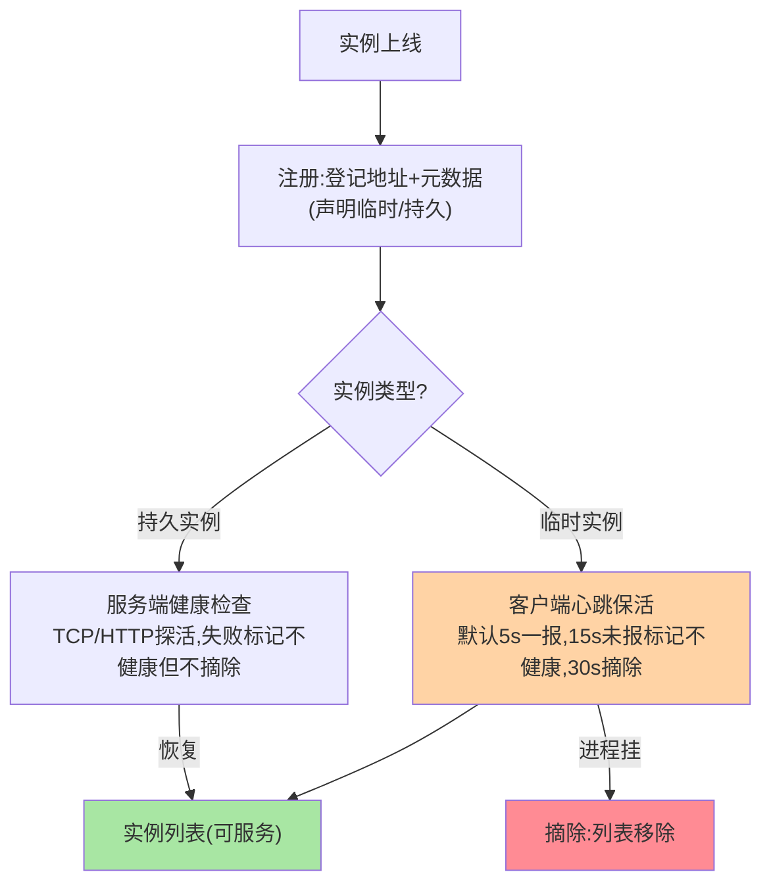
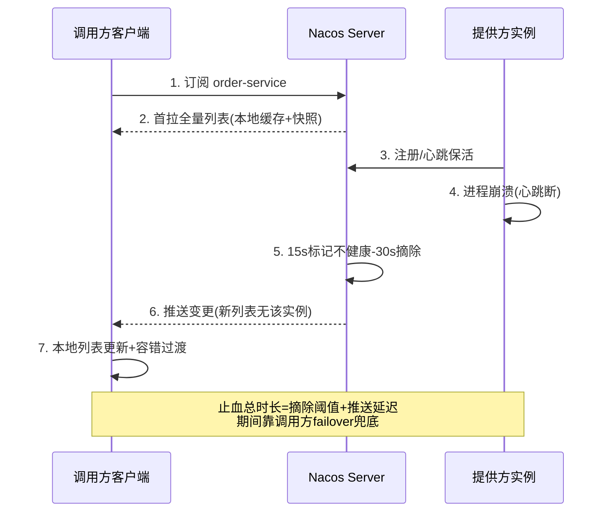

# Nacos 服务注册与发现：一次注册、订阅与推送的完整旅程

> **本文核心**：服务发现的运转靠四个机制咬合——**注册**（实例上线时向 Server 登记地址与元数据）、**心跳**（临时实例定期上报证明「我还活着」，超时未报即摘除）、**健康检查**（Server 侧对持久实例主动探活）、**订阅推送**（调用方订阅服务后，实例变更由 Server 主动推送——1.x 长轮询/UDP，2.x gRPC 长连接）。**机制链**：实例注册 → 订阅方首拉全量列表 → 建立订阅关系 → 实例变更（上线/下线/失联）→ Server 推送变更 → 客户端更新本地列表 → 负载均衡消费。通用机制的正版在 service-discovery 系列，本篇讲 Nacos 怎么实现它们。

## 一句话摘要

把注册发现拆成「**写路径**」（注册+心跳：实例证明自己在）与「**读路径**」（订阅+推送：调用方感知变更）两条线：写路径的保活语义按实例类型分岔——**临时实例靠客户端心跳**（进程活着就报，进程挂了心跳断、Server 摘除）、**持久实例靠服务端健康检查**（实例不报健康状态，Server 主动探测）；读路径的核心是**推送替代轮询**——订阅关系建立后，变更从「调用方反复问」变成「Server 主动说」，延迟从分钟级（DNS 时代）压到秒级以内。所有机制的组合目标只有一个：**调用方本地始终有一份「够新」的实例列表**（互指 RPC 篇 6 的三层发现机制）。

## 5W 速记卡

| 维度 | 一句话 |
|---|---|
| What | 注册/心跳/健康检查/订阅推送四机制咬合的发现链路 |
| Why | 实例动态漂移时调用方需要「够新」的地址列表 |
| When | 服务上下线、发布滚动、故障摘除、扩缩容 |
| Where | 客户端 SDK（注册+订阅）+ Server 命名管线（存储+推送） |
| How | 注册登记 → 心跳保活 → 变更检测 → 推送订阅方 → 本地列表更新 |

## 二、写路径：注册与保活

**临时实例的心跳语义**是「活着就证明」：心跳间隔（默认 5 秒）、不健康标记阈值（默认 15 秒）、摘除阈值（默认 30 秒）三档参数构成保活的灵敏度——参数越小摘除越快但网络抖动误摘越多。**持久实例的检查语义**是「死了也留着」：健康检查失败只标记不健康（调用方收到列表会带健康标记），实例对象保留——数据库、固定成员这类「重启后地址不变、不该被摘掉」的成员用持久语义；微服务弹性实例（地址随时变，旧地址该忘掉）用临时语义。**两种保活方向的差异本质**：临时实例「自己证明活着」（客户端主权），持久实例「被证明活着」（服务端主权）——主权归属决定了故障形态下谁更准。

**量级演进视角**：百级实例——心跳量微不足道，默认参数随便用；万级实例——心跳 QPS 本身成为 Server 负载（1 万实例×每 5 秒一报=每秒 2000 次心跳），心跳间隔调优与批量心跳成为 Server 容量问题；十万级实例——1.x 的 HTTP 心跳+长轮询架构到顶，2.x 的 gRPC 长连接改造（连接级心跳代替应用级心跳，一次连接保活代替每实例轮询）正是被这个量级逼出来的架构演进——**保活机制的形态随实例规模换代**。

## 三、读路径：订阅与推送的演进

订阅链路的三步：**首拉**（订阅时拉全量列表存本地）、**订阅关系登记**（Server 记住「谁订了什么」）、**变更推送**（实例变更时沿订阅关系推给订阅方）。推送机制经历了三代演进，每代都是「延迟与开销」的重新权衡：

| 代际 | 机制 | 延迟 | 代价 |
|---|---|---|---|
| 长轮询 | 客户端定期问「有变更吗」，有则拉回 | 秒级（轮询间隔） | 空轮询开销随客户端数线性涨 |
| UDP 推送 | 变更时 UDP 推，丢了靠定时拉兜底 | 亚秒 | UDP 不可靠，跨网络边界易丢 |
| gRPC 长连接（2.x） | 连接常驻，变更即时双向推 | 毫秒级 | 连接管理复杂度（重连/保活/负载） |

演进主线的本质：**「变更触达」从客户端的轮询责任变成服务端的推送责任**，触达延迟逐代下降、无效开销逐代减少——这与配置推送、消息通知类系统的演进路径同构（互指 config-center 系列的推送模型篇）。

## 四、与 DNS 发现的区别：语义与时效对照

| 维度 | Nacos 服务发现 | DNS 发现 |
|---|---|---|
| 数据丰富度 | IP+端口+权重+健康+元数据 | 仅 A/SRV 记录 |
| 变更时效 | 秒级推送 | TTL 缓存（秒到分钟） |
| 上下线语义 | 主动注册+自动摘除 | 手工改记录或脚本 |
| 适用 | 微服务动态寻址 | 稳定入口/跨云混合 |

DNS 的 TTL 缓存与「无主动摘除」对微服务的变更频率是灾难（互指 RPC 篇 6 的 DNS 对比），但在跨云、混合部署的稳定入口场景仍是不可替代的通用协议——两者是「变更频率」决定的选择。

### 订阅与推送的端到端时序

时序图把两条路径（写路径的保活、读路径的推送）在一次故障里串起来——「止血总时长」的构成一目了然，这也是容量演练与容错配置的依据。

## 五、典型场景与误区

**典型场景**：滚动发布（新实例注册秒级接流量、旧实例注销摘除，发布不断流）；故障自愈（进程崩溃心跳断，30 秒内自动摘除，调用方 failover 过渡）；弹性扩缩容（HPA 扩出的新 Pod 注册即入列表，缩容先注销再终止——优雅下线的发现侧配合）；多机房容灾（集群标注+就近订阅，机房故障时订阅切换）。

**常见误区**：① **心跳参数盲目调小**——为了「摘得快」把 5 秒调到 1 秒，万级实例下心跳 QPS 压垮 Server，网络抖动误摘一片——摘除灵敏度与误摘率的平衡要按实例规模实测；② **优雅下线只靠心跳超时**——进程 kill 后流量还会打进死实例最多 30 秒，正确姿势是下线前主动注销（反注册）+ 等推送触达再退出，心跳摘除只是兜底；③ **订阅方不做本地容错**——列表只在内存、Server 抖动时重新拉取失败就空列表——本地快照持久化与「拉取失败继续用旧列表」是调用方的自我保护（互指 RPC 篇 6 的快照兜底）；④ **把健康检查当监控用**——Nacos 的健康状态只有「通/不通」一比特，SLO 级的健康度量（P99/错误率）要靠监控体系，两者语义差一层；⑤ **持久/临时按习惯选**——持久实例的变更不走推送摘除语义，误用会让「实例已死但列表不摘」成为常态——按成员性质选，不按习惯。

## 设计思想：保活与发现的责任分配

注册发现的机制分工里藏着一条通用的责任分配原则：**「谁的变化自己最清楚，就由谁负责上报；谁的损失自己最在意，就由谁负责校验」**——实例的生死自己最清楚（心跳上报），调用方对列表新鲜度的损失最在意（本地快照+容错兜底）。Server 居中做的是「收集与广播」，它既不替实例证明生死（那是心跳的事），也不替调用方兜底（那是快照的事）——**中间层只做「自己不可替代的部分」，其余推给两端**。这条原则的反面教材是把一切塞给中间层（Server 主动探测所有实例+保证所有调用方一致）——1.x 到 2.x 的演进恰恰是把中间层从「全能管家」瘦身成「高效交换所」。

## 追问思考

**质疑者视角**：「秒级摘除」听起来很快——但故障场景的完整止血时间是「心跳超时（30s）+推送延迟（秒级）+调用方容错生效」的总和，前 30 秒里流量还在打进死实例。**发现链路的时效永远慢于故障本身**，这就是为什么调用方侧的容错（failover/熔断，互指 RPC 篇 9/10）不可省略——发现机制管「新流量别再去」，容错机制管「已经在路上的怎么办」。另一个质疑：推送的「秒级到达所有订阅方」在万级订阅方时并不均匀——部分实例先收到变更、部分后收到，变更窗口内各实例的列表版本不一致（AP 的常态）——负载均衡在这个窗口内可能把流量打到已下线实例（已摘除方）或漏打新实例（未收到推送方），这是 AP 语义的固有代价，不是 bug。

**事故视角**：某团队的优雅下线脚本只做了「sleep 30 秒再 kill」（等心跳摘除），大促扩容后的缩容操作引发了持续半分钟的报错毛刺——追查发现 sleep 期间实例还在接新流量（列表没摘），kill 时在途请求全部失败。修复：下线顺序改为「主动反注册 → 等待推送生效（订阅方列表更新确认）→ 流量衰减（在途请求处理完）→ 退出」——**心跳摘除是兜底不是流程，主动注销+流量衰减才是优雅下线的正文**。追问：为什么不缩短心跳参数让摘除更快？——把 30 秒摘除调到 10 秒只是把毛刺缩短，主动注销才是消除；调参数救不了流程设计错误。

**追问链**：为什么 2.x 敢把 UDP 推送换成 gRPC 长连接？——UDP 推送丢失靠定时拉兜底，本质是「不可靠通道+可靠兜底」的双轨；gRPC 长连接提供可靠有序的推送通道后，兜底拉取退化为低频对账——**通道可靠性的提升把「兜底机制」降级为「对账机制」，系统从双轨简化为单轨+对账**。追问：长连接的数量怎么管？——每个客户端一条连接（承载该实例全部订阅），万级实例=万级连接，连接的负载均衡与断线重连风暴（Server 重启瞬间全量重连）需要退避策略——连接是 2.x 的新容量维度，Server 容量评估从「QPS」变为「QPS+连接数」。

## 💡 实战提示

- 💡 优雅下线四步：主动反注册 → 等推送生效 → 流量衰减 → 退出——心跳摘除只是兜底不是流程
- 💡 心跳参数按实例规模实测调优（万级实例必调），盲调小=压垮 Server+误摘一片
- 💡 调用方必配本地快照持久化+拉取失败沿用旧列表——发现链路的自我保护不能全指望 Server
- 💡 决策口径：弹性微服务用临时实例（心跳保活）、固定成员用持久实例（健康检查）；问题先分管线（发现/配置）再排障

## 你们可能会问

**Q1：实例注册后多久能被调用方发现？**
注册成功后推送即触发（2.x 毫秒级到达在线订阅方）；但订阅方到调用方的使用还有一层（负载均衡读本地缓存），端到端通常秒级。关注「发现延迟」要区分推送延迟（Server→客户端）与生效延迟（客户端→业务代码使用）。

**Q2：心跳断了一定是实例挂了吗？**
不一定——网络分区、Full GC 停顿、CPU 打满导致心跳线程饿死都会「假死」。临时实例语义下假死=被摘（宁可错杀，AP 语义的取向），这也是核心服务的调用方必须配容错的原因：摘除机制的误杀率不为零。

**Q3：订阅的服务太多，客户端连接和内存扛得住吗？**
按需订阅是纪律——只订阅真正要调的服务（框架按 @DubboReference 等声明建立订阅），全量订阅让列表内存与推送量白白上涨；2.x 单连接复用（一连接多订阅）已把连接数问题收拢，内存问题靠订阅纪律解决。

**Q4：怎么观察发现链路的健康度？**
四个指标：推送延迟（变更→客户端 P99）、列表版本一致性（各客户端持有版本分布）、心跳超时率（误摘率的先行指标）、订阅数与连接数（Server 容量水位）——发现链路不是「通了就行」，时效与一致性都有账可查。

## 八、自测三问

1. 临时实例与持久实例的保活方向差异？（答：临时=客户端心跳证明活着（挂了摘除）；持久=服务端健康检查（挂了标记不摘）——按成员性质选）
2. 推送机制三代演进的主线？（答：长轮询→UDP 推+拉兜底→gRPC 长连接——变更触达从客户端责任变为服务端责任，延迟逐代下降）
3. 优雅下线的完整顺序？（答：主动反注册→等推送生效→流量衰减→退出；kill+等心跳超时是毛刺的来源）

## 开放问题

- 连接作为新的容量维度的治理标准化——连接数/重连风暴的容量模型与自动限流。
- 假死判别的智能化——心跳之外引入业务级活性信号（请求处理成功上报）降低误摘率。

## 📎 核心带走

- **核心一句话**：服务发现 = 写路径（注册+保活）与读路径（订阅+推送）的咬合——目标只有一个：调用方本地始终有「够新」的实例列表
- **机制链**：注册登记 → 心跳/健康检查保活 → 变更检测 → 沿订阅关系推送（长轮询→UDP→gRPC 三代）→ 本地列表更新 → 负载均衡消费
- **失效点/边界**：发现时效永远慢于故障（调用方容错不可省）；AP 窗口内列表版本不一致是常态；心跳假死会误摘；优雅下线必须主动注销

## 📌 数据与事实声明

- 写于 2026-09-15，对标 Nacos 3.2.4；心跳默认参数（5s/15s/30s）与三代推送演进以官方文档为准（公开口径）
- 免责：具体参数默认值以官方文档为准

## 📚 参考资料

| 类型 | 标题 | 来源 |
|---|---|---|
| 官方文档 | Nacos 服务发现 / 2.x 架构演进 | nacos.io/docs |
| 官方源码 | alibaba/nacos naming 模块 | github.com/alibaba/nacos |
| 关联系列 | 本仓库 service-discovery 系列（通用机制正版）、RPC 篇 6/9（发现与容错联动） | docs/architecture/ |
