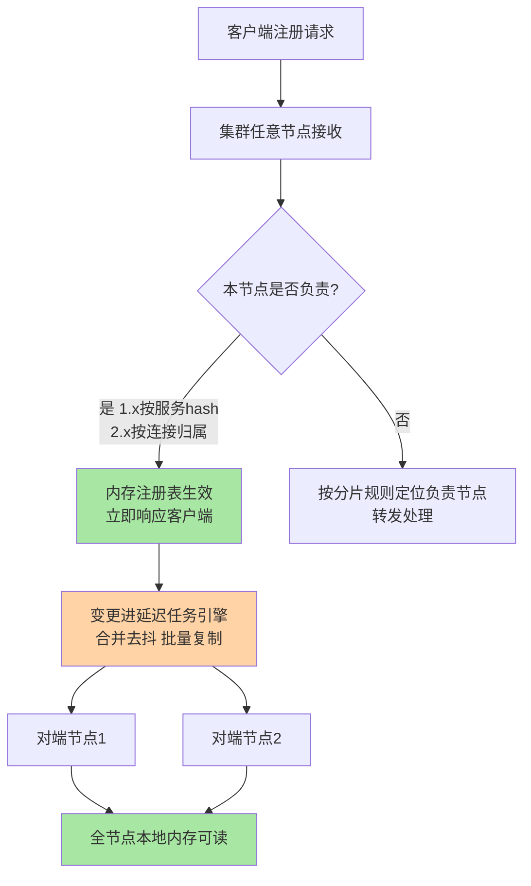
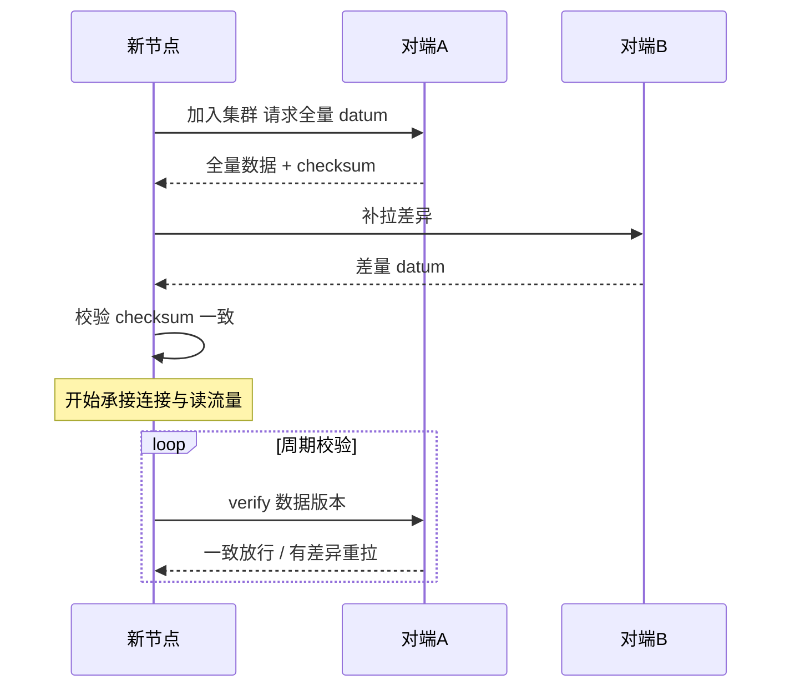
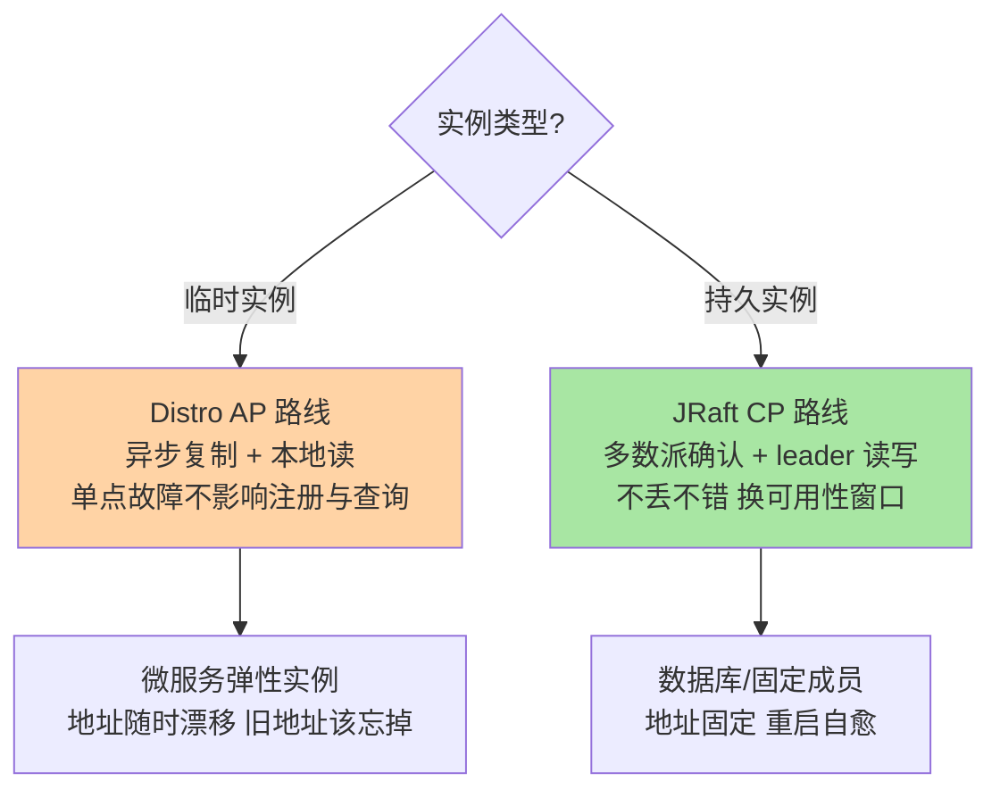
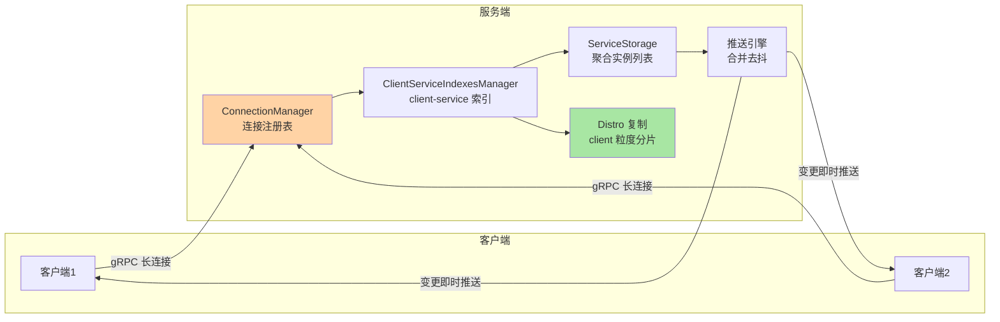

# 注册发现与 Distro 协议：临时实例的 AP 路线

> 注册中心选 AP 还是 CP，不是背概念，是读懂两条数据链路怎么走。这篇把 Nacos 临时实例的 Distro 协议拆开——分片负责、异步复制、本地读三件事怎么咬合出「高可用 + 秒级感知」，以及它和 Raft CP 路线的分界为什么画在「临时/持久」这个维度上。

## 一句话摘要

Nacos 注册中心对数据一致性按实例类型分了两条路线：**临时实例走 Distro 协议（AP）**——写请求落在负责节点后立即返回，变更**异步复制**到全部对端，查询一律**本地读**，用「短暂不一致窗口」换「任意单点故障不影响注册与查询」；**持久实例走 JRaft（CP）**——写需要多数派确认，用「可用性窗口」换「不丢不错」。1.x 的分片粒度是服务（按服务名 hash 选负责节点），2.x 改造为 client 连接粒度——连接所在节点即负责节点，gRPC 长连接同时改变了同步、摘除与推送三件事的形态。**Distro 的一切设计都服务于一个判断：临时实例数据是可再生的瞬时状态，一致性可以异步追，可用性不能让**。

## 🎯 本文核心

**核心一句话：Distro = 分片负责（谁连谁负责）+ 异步复制（写完即返回，批量追平）+ 本地读（查询不出本节点）——三个机制共同把注册中心做成「可分区容忍的最终一致缓存」，而不是「强一致的真相源」。**

机制链：客户端注册 → 落在负责节点（1.x 按服务 hash / 2.x 按连接归属）→ 内存注册表生效即响应 → 变更进延迟任务批量复制 → 全节点收敛 → 查询永远走本地内存 → 新节点加入全量拉取 + 周期校验找平。全文一句话可重构：「写快靠异步，读快靠本地，容错靠可再生」。

## 前置阅读

- 入门层篇 3《服务注册与发现》：注册/心跳/订阅推送四机制的心智模型
- 入门层篇 1《Nacos 是什么与定位》：AP/CP 双模的组件级定位

## 目标导向

本文是什么：Distro 协议的三个核心机制与 2.x 连接化改造。功能是什么：让「为什么临时实例注册秒级可用、偶尔列表旧一拍」「为什么持久实例写要多数派」可归因。能得到什么：AP/CP 选型判据、Distro 不一致窗口的量化口径、2.x 升级的容量与端口检查清单。什么时候用：注册中心选型评审、Distro 参数调优、1.x 升 2.x 的方案评估，必看。

## 一、边界：入门层讲过什么，本文讲什么

| 内容 | 入门层 | 本文 |
|---|---|---|
| 注册/心跳/订阅推送四机制概念 | ✅ 讲过 | 不重复 |
| Distro 分片负责/异步复制/本地读 | 未讲 | **本文核心一** |
| 临时/持久实例与 AP/CP 分界 | 提了一句 | **本文核心二** |
| 2.x gRPC 长连接对同步与推送的改变 | 未讲 | **本文核心三** |
| 心跳参数与保护阈值 | 提了数字 | 篇 3 讲透 |

## 二、Distro 三件套：分片负责、异步复制、本地读

**分片负责**解决「谁来拍板」。1.x 每个服务按服务名 hash 映射到集群中的一个**负责节点**：心跳检查任务只由负责节点执行（`DistroMapper.responsible()` 判定），checksum 校验也由负责节点汇总——避免多节点对同一服务重复做后台动作。2.x 把分片粒度从**服务**改为**client**：每个客户端连接挂在哪个节点，该节点的 `ClientServiceIndexesManager` 就为这个 client 建立索引，这个节点就是它的负责节点——client 的全部实例、订阅关系作为一份 datum 整体同步。粒度变化的收益后面讲。

**异步复制**解决「怎么追平」。负责节点写内存成功即返回客户端，不等任何对端确认；变更进入延迟任务引擎（1.x `TaskDispatcher` 按 serviceName 分桶、攒批定时分发；2.x `DistroDelayTaskProcessor` 延迟合并），批量推给对端。复制的语义是**最终一致**：正常情况收敛在百毫秒到秒级（业内认知），故障分区期间各自为战、恢复后靠增量补发与周期校验（VerifyTask 比对数据版本，有差异重新拉取）找平。

**本地读**解决「查询怎么办」。每个节点都持有全量服务数据的内存副本，实例列表查询**从不跨节点**——读延迟即内存访问，且任一节点存活就能服务读请求。这是「可用性优先」的直接兑现，也是「偶尔读到旧列表」这一 AP 代价的来源：复制在途时，不同节点的本地副本可能差一个变更。

### 新节点加入与数据校验

新节点加入走 `DistroLoadDataTask` 全量拉取；日常靠周期校验兜住「复制丢包、延迟任务积压」这类静默差异。校验是 Distro「异步但可信」的底线——异步复制可以丢，校验必须能发现。

## 三、AP/CP 分界：画在临时与持久之间

分界为什么画在**实例类型**而不是「整个注册中心选边」？因为两类成员的**数据性质**不同。临时实例是瞬时状态：进程挂了地址就该消失，数据丢了也能靠重新注册与心跳摘除再生——不一致窗口的代价是「短暂旧列表」，可接受；CP 语义在这里是负资产（多数派写入慢、分区时不可写）。持久实例是配置事实：数据库地址这类成员「死了也不该从列表消失」，而且不能错——CP 的强一致正中需求，可用性窗口（leader 切换期间该分片不可写）也是持久成员能容忍的。**一致性协议的选择跟着数据可再生性走，而不是跟着架构口号走**。

| 维度 | Distro（临时） | JRaft（持久） |
|---|---|---|
| 写确认 | 负责节点单点确认即返回 | 多数派确认 |
| 复制方式 | 异步批量 | 同步日志复制 |
| 分区行为 | 各自可读写，恢复后找平 | 少数派侧不可写 |
| 读路径 | 本地内存 | leader 读（线性一致口径） |
| 适用成员 | 弹性微服务实例 | 数据库/固定基础设施 |

## 四、2.x gRPC 长连接：改造的不只是通道

1.x 的订阅感知是「UDP 推送 + 定时拉兜底」的双轨：UDP 不可靠所以必须定时全量拉对账；实例保活靠每实例 5 秒一次的 HTTP 心跳。2.x 用一条 gRPC 长连接同时替换了三件事：

**第一改：推送从双轨变单轨。** gRPC 双向流可靠有序，变更推送即时可达，定时全量拉退化为低频对账——通道可靠性的提升把兜底机制降级为对账机制（与配置中心 2.x 的演进同构，篇 2 细讲）。**第二改：保活从应用级变连接级。** 连接断开事件本身就是摘除信号，`ConnectionManager` 触发 `ClientDisconnectEvent` 后该 client 名下实例批量下线——不再依赖每实例 5 秒心跳，万级实例的心跳 QPS 从容量账上消失。**第三改：分片从服务粒度变 client 粒度。** 连接归属即数据归属，「一个 client 的所有数据」是同步的最小单元——连接断开 = 整份 datum 作废，语义干净；同时也避免了 1.x 服务粒度在实例数远大于服务数时的检查任务倾斜。

**量级演进视角**：小规模（百级实例）1.x/2.x 体验无差别，选熟悉度；万级实例（十万级 client 场景同理）1.x 的 HTTP 心跳 QPS 与 UDP 推送丢失率开始 measurable，2.x 连接化收益显现——这一档的核心问题是「通道与保活的开销」，而不是「功能有没有」；十万级实例，1.x 架构到顶，2.x 是官方给定的演进路线（公开口径），思考方式是「容量驱动」——连接数成为新容量维度，容量评估从 QPS 变为 QPS + 连接数；更大规模走多集群分域，思考方式是「架构驱动」。思考方式总结：小规模看功能，中规模看开销，大规模看连接容量，超大规模看分域——每一档的约束来源不同（HTTP 开销/UDP 可靠性/连接内存/机房边界），解法随之换代。

## 五、源码关键路径

以 Nacos 2.x 主线（naming 模块）为口径：

- 连接与索引：`ConnectionManager`（连接注册与断开事件）→ `ClientServiceIndexesManager`（service 到 clients 的双向索引，`onClientRegister` 时建立）
- 数据聚合：`ServiceStorage#getPushData`——按索引把 client 的实例聚合成服务实例列表，带缓存，变更时失效重算
- Distro 复制：`DistroClientDataProcessor`（把 client 数据打包成 datum）→ `DistroDelayTaskProcessor`（延迟合并）→ `DistroSyncChangeTask`（对端同步）；新节点 `DistroLoadDataTask` 全量拉取、`DistroVerifyTask` 周期校验
- 1.x 对照：`ServiceManager`（双层内存注册表）、`Service#updateIps`（实例变更异步任务）、`TaskDispatcher`/`TaskScheduler`（分桶批量复制）、`DistroMapper`（服务 hash 分片判定）

阅读建议：以「一个 client 注册两个实例」为剧本，从 `ConnectionManager` 走到 `DistroSyncChangeTask`，Distro 的每个环节都在这条路径上；再以「连接断开」重走一遍，看摘除为什么不再需要心跳超时。

### 为什么 Distro 不用多数派确认？（追问）

写路径如果是多数派确认，注册延迟 = 最慢的多数派节点延迟，且分区时少数派侧整体不可写——「注册中心挂了业务就发不了版、扩不了容」。临时实例数据的可再生性（死了会重注册、假死会摘除）决定了「短暂旧列表」的代价远小于「不可写」的代价。**Distro 的取舍是把一致性从写路径挪到后台**：写快（单点确认）+ 收敛靠异步 + 错误靠校验找平。这也是它和 Eureka peer-to-peer 复制的亲缘所在，只是 Nacos 加了分片负责与更硬的校验。

（打破砂锅：那 AP 路线会丢数据吗？——会，且是刻意容忍的丢：分区期间某节点上注册的实例，在它重新连上负责节点前对全网不可见；节点故障时未同步出去的内存数据随进程消失。对临时实例这不是缺陷——实例自己会重新注册；对持久实例这条路被 JRaft 挡住了，这正是双路线存在的意义。）

### 为什么 2.x 要把分片粒度从服务改成 client？（追问）

服务粒度在「实例数远大于服务数」时检查与同步的负载全压在少数负责节点上（一个服务几十万实例时，负责节点单点做摘除检查与校验）；client 粒度天然均匀（client 数 ≈ 实例数，且连接本身均衡分布在各节点）。更关键的是语义对齐：2.x 的摘除信号从「心跳超时」变成「连接断开」，连接断开天然是 client 级事件——粒度与信号对齐，一次断开就是整份 datum 的原子作废，不再有「服务粒度下逐实例判活」的中间状态。

（再深一层：代价是什么？——client 粒度让「一个服务的数据」散落在多个节点的 client datum 里，读时必须聚合（`ServiceStorage` 聚合 + 缓存）。聚合是读路径新增的一跳，Nacos 用「变更时失效重算 + 内存缓存」把它摊平——这是「写侧均匀、读侧聚合」的经典交换，和 Kafka 分区聚合消费侧是同一种取舍。）

## 典型场景

- **滚动发布**：新实例注册经负责节点立即生效，异步复制百毫秒到秒级全网可见；旧实例注销同理——发布窗口内调用方列表的新旧差异就是这个窗口的宽度
- **注册中心节点滚动升级**：Distro 下任意节点下线，它上面的连接迁移到其他节点（client 重新建连重新注册），读流量无缝切走——AP 路线的「无脑重启」底气
- **1.x 升 2.x 评估**：收益（心跳消失、推送即时、性能翻倍级，公开口径的官方压测数据）vs 代价（端口规划、连接容量评估、混布期双协议），按下面的量级表对号入座

### 事故叙事一：升级后的「推送时灵时不灵」

某团队灰度升级 2.x，混布期业务反馈「服务列表更新有时秒级、有时十几秒」。排查发现 gRPC 端口（8848 偏移 +1000 的 9848）在部分机器的安全组没放通，客户端建连失败后回落到兼容路径，推送退化为低频拉取——问题不在 Nacos，在端口基线。复盘动作：把 9848/9849 端口连通性写进升级 checklist 与巡检脚本，混布期按「连接成功率」而不是「注册成功率」验证升级。这次复盘的教训是架构性的：**新通道的第一性检查是网络可达，功能指标发现不了通道没通**。

### 事故叙事二：AP 窗口里的「已下线实例还在被调用」

一次大规模缩容后，少量已注销实例仍收到零星流量报错。排查链路：注销动作正常 → 负责节点摘除正常 → 卡在「部分订阅方收推送晚了几秒」——正是 Distro 异步复制 + 推送去抖窗口的常态。复盘结论：这是 AP 语义的固有代价而非 bug，修复不在 Nacos 侧而在调用方——主动注销后等待推送生效再关进程（优雅下线）、调用方对连接失败快速失败重试其他实例。**发现机制的时效永远慢于故障本身，调用方容错是 AP 路线的配套义务**。

## 业内惯例

- **临时/持久按成员性质选**：弹性微服务实例一律临时（Distro），数据库、第三方固定地址一律持久（JRaft）——用「重启后地址还在吗、该不该被忘掉」判断，不按团队习惯
- **注册中心读流量从不跨节点**：部署上让应用就近接入同可用区节点（VIP/域名解析层做），别在应用侧做跨机房节点轮询——本地读的收益要靠接入层配合才能兑现
- **2.x 升级先盘连接容量**：连接数 = 实例数 + 纯订阅进程数，按官方容量白皮书口径评估内存与句柄（公开口径）；端口 9848/9849 连通性进巡检
- **Distro 不一致窗口用指标盯**：变更推送延迟 P99、VerifyTask 差异重拉次数是「异步收敛是否健康」的两个先行指标，异常增长先查复制链路再查业务

## 💡 实战提示

- 💡 选 AP/CP 先问「数据丢了能不能再生」：能再生（临时实例）选 Distro，不能丢（持久成员）选 JRaft——协议跟着数据性质走
- 💡 不要把注册中心当强一致真相源用：临时实例列表在复制窗口内各节点可能不同版本，依赖「全网同一瞬间看到同一列表」的设计在 AP 路线必然翻车
- 💡 2.x 升级三个前置检查：9848/9849 端口连通、连接容量评估（内存/句柄）、混布期监控按连接成功率验证——端口不通是灰度事故最高频根因
- 💡 摘除逻辑的调试口径：2.x 先查连接断开事件（`ClientDisconnectEvent`），1.x 才查心跳超时——两代摘除信号不同，排查路径不能混用

### 不同量级的思考：架构约束驱动解法

- **十万级（单集群起步）**：约束来源是 HTTP 心跳与 UDP 推送的开销——这一档的核心问题是「通道开销可观测吗」，而不是「功能齐不齐」；思考方式是「监控驱动」，注册 QPS、推送延迟、心跳超时率三个指标打底，1.x 够用不必折腾
- **百万级（实例规模起飞）**：约束来源是心跳 QPS 与 UDP 丢失率——这一档的核心问题是「保活开销在容量里占了多少」，而不是「加不加机器」；思考方式是「容量驱动」，万级实例 × 5 秒心跳 = 每秒 2000 次保活请求的账必须算，2.x 连接化的收益从这里开始兑现
- **千万级（连接容量为纲）**：约束来源是连接内存与句柄、全量同步的带宽峰值——这一档的核心问题是「连接与同步的容量模型成立吗」，而不是「单集群调参」；思考方式是「工程驱动」，连接数容量评估、新节点全量拉取限速、VerifyTask 周期按规模调档
- **亿级（多集群分域）**：约束来源是机房边界与全量数据的物理极限——这一档的核心问题是「架构分域对不对」，而不是「协议怎么调」；思考方式是「架构驱动」，按业务域/可用区拆多套 Nacos 集群 + 上层聚合发现，单集群 Distro 不背全网数据

思考方式总结：十万级靠监控打底，百万级靠容量算账，千万级靠工程建模，亿级靠架构分域——约束来源从通道开销逐级迁移到物理边界，思考方式必须跟着约束换代。**自下而上与触发升级**：先用三个实测值定档——实例数、client 连接数、变更推送延迟 P99；触发升级的信号是「心跳 QPS 占 Server 容量超过两位数百分比」「全量同步时间超过节点就绪时间」「单集群连接逼近官方容量口径」，任一信号出现就把思考方式升一档，别用上一档的解法硬扛下一档的约束。

### 反方案：为什么不选「全集群 CP 注册」？

有人主张「注册数据就该强一致，全走 Raft 不就完了」——看似省掉两条路线的理解成本，实际付三笔账：**写延迟**——多数派确认让注册 RTT 从单点内存写变成一次日志复制；**可用性**——分区时少数派侧不可注册不可扩容，「注册中心抖一下业务跟着抖」；**必要性缺失**——临时数据可再生，强一致保护一个可再生数据是杀鸡用牛刀。业界对照也清晰：ZooKeeper/etcd 式 CP 注册在弹性微服务场景的摘除风暴（session 抖动即全量摘除）是公开讨论多年的痛点，Eureka/Nacos 的 AP 路线正是对这个痛点的回应。

为什么不选「读时跨节点对账保强一致」？——本地读是 AP 路线的性能根，读一次跨节点往返就把读延迟抬了一个量级，且对账本身又依赖网络分区下的可用性——用可用性换一致性，两头都输。真正落地的折中是「本地读 + 客户端容错 + 周期校验」，用工程手段把不一致窗口压到业务可忽略，而不是协议层强扭。

## Trade-off：Distro 三件套的代价账

| 取舍 | 得到 | 代价 | 兜底 |
|---|---|---|---|
| 异步复制 | 写 RTT 极短 | 短暂不一致窗口 | 周期校验 + 调用方容错 |
| 本地读 | 读延迟与高可用 | 可能读到旧列表 | 客户端订阅容错/快照 |
| 单点确认 | 注册不依赖集群健康 | 节点故障丢未同步数据 | 临时数据可再生（重注册） |
| client 分片（2.x） | 负载均匀 + 摘除语义干净 | 读侧聚合一跳 | ServiceStorage 缓存 |

取舍的公共逻辑：**Distro 把「一致性」降级为「可观测、可校验的收敛过程」，把省下的代价全部投给可用性与延迟**。这笔账对临时实例永远划算；一旦数据不可再生（持久成员），账就反过来——所以 Nacos 干脆开两条路线，让数据性质自己选协议。

## 六、常见误区

- **「Distro = 没有一致性」**：Distro 是最终一致 + 周期校验，不是放任差异——差异窗口有百毫秒到秒级的量级（业内认知），校验机制保证静默差异必然被找平
- **「临时实例也能配成持久来保平安」**：持久实例走 JRaft，写要多数派、挂了不摘除——给弹性实例配持久语义，得到的是「实例已死列表不摘」的常态化脏数据
- **「2.x 只是换个传输协议」**：连接是数据模型的一部分（连接归属决定分片与摘除），升级是架构换代不是换传输层——端口、连接容量、监控口径都要换
- **「负责节点是单点」**：负责节点只承担后台职责（检查、校验、同步发起），数据每个节点都有全量副本，负责节点挂了连接迁移、读流量无缝——分片负责不是数据单点

## 七、与相邻机制的关系

- 本系列篇 2《配置中心长轮询与推送演进》：配置侧 2.x 同样从轮询演进到 gRPC 推送，通道演进两条线同构
- 本系列篇 3《心跳健康检查与摘除》：摘除的两代信号（心跳超时 vs 连接断开）在篇 3 展开
- 本仓库 service-discovery 系列篇：注册发现通用机制的正版定义在架构域，本篇只讲 Nacos 怎么实现

## 你们可能会问

**Q1：Distro 收敛到底多快？不一致窗口能压到多小？**
正常态收敛在百毫秒到秒级（业内认知，取决于复制批量与去抖参数）；压窗口的方向是调低延迟任务的合并窗口，但压得过小会让复制碎片化、批处理收益消失——窗口大小是「复制开销 vs 感知延迟」的平衡，默认值适用绝大多数场景，异常先查网络与积压再动参数。

**Q2：节点宕机时，连在它上面的 client 会怎样？**
客户端 SDK 感知连接断开后向其他节点重建连接并重新注册/订阅——client 粒度分片下旧节点上的 datum 随进程消失，新连接在新节点重新建立，全网收敛后数据如初。这就是「临时数据可再生」的具体形态，也是 2.x 不需要复杂的数据迁移协议的原因。

**Q3：混布 1.x/2.x 节点可靠吗？**
可靠是升级路径的设计目标（官方支持平滑升级，公开口径），但双协议并行期两套同步链路并存，监控与容量都要双份口径——混布是过渡态不是稳态，尽快收拢到单一版本是纪律。

**Q4：什么时候该考虑不用 Nacos 的 AP 路线？**
两类场景：需要「注册数据强一致」的元数据场景（配置事实类，走持久实例/JRaft 或专用存储）；单集群规模到官方容量上限的极致规模（公开口径的单集群连接容量红线）——前者换路线，后者分域，都不是换产品。

## 八、自测三问

1. Distro 三件套分别解决什么问题？各自付出的代价是什么？
2. 临时/持久实例与 AP/CP 的对应关系由什么决定？（答：数据可再生性——可再生选 AP，不可丢选 CP）
3. 2.x 长连接改了哪三件事？分片粒度变化带来的读路径新开销是什么？

## 开放问题

- client 粒度分片在「超长连接 + 海量订阅」下的聚合缓存命中率模型，社区仍在演进（公开讨论中）。
- Distro 与上层多集群聚合发现的标准化（跨集群服务冗余与就近路由）尚无定论，值得跟踪 Nacos 3.x 的推进。

## 🎯 核心带走

- **核心一句话**：Distro = 分片负责 + 异步复制 + 本地读，用「可再生数据不需要强一致」的判断换来注册中心的可用性与延迟双优
- **机制链**：注册落负责节点 → 内存生效即响应 → 延迟任务批量复制 → 全节点本地读 → 校验找平 → 连接断开即摘除（2.x）
- **哪里会坏**：不一致窗口被当强一致用、2.x 端口不通退化兜底、把弹性实例配成持久语义、连接容量没评估就升级
- **边界**：本篇管注册侧数据平面与协议；摘除细节在篇 3，配置侧推送演进在篇 2，选型全景在整合层

## 相关阅读

- 上一篇：[0_系列导读（入门层）](../../入门层/从零开始认识Nacos系列/0_系列导读-全景.md)
- 下一篇：[2_配置中心长轮询与推送演进-特性](./2_配置中心长轮询与推送演进-特性.md)
- 姊妹篇：[3_心跳健康检查与摘除-特性](./3_心跳健康检查与摘除-特性.md)

## 📌 数据与事实声明

- 写于 2026-09-18，机制以 Nacos 2.x 主线源码与官方文档为准（naming 模块）；1.x 对照以 1.4.x 代码为口径
- 收敛延迟「百毫秒到秒级」、容量压测数字等为业内认知/公开口径，具体数值以官方文档与实测为准
- 免责：参数默认值与版本特性以 nacos.io 官方文档为准

## 📚 参考资料

| 类型 | 标题 | 来源 |
|---|---|---|
| 官方文档 | Nacos 架构 / 概念 / AP-CP 说明 | nacos.io/docs |
| 官方源码 | alibaba/nacos（naming 模块：Distro*/ServiceStorage/ConnectionManager） | github.com/alibaba/nacos |
| 社区文章 | Nacos 2.0 架构升级官方系列（连接化改造） | nacos.io 博客 |
| 关联系列 | 本仓库 service-discovery 系列（机制正版） | docs/architecture/ |
