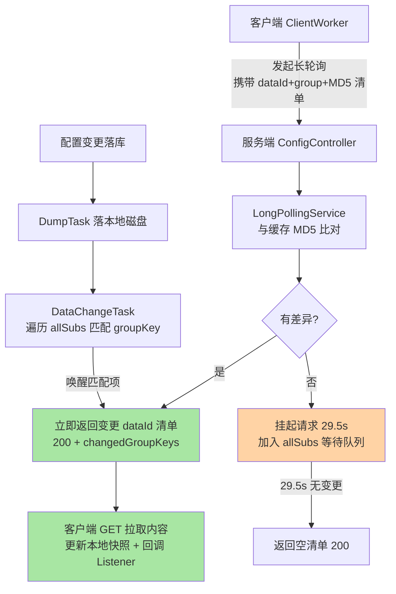
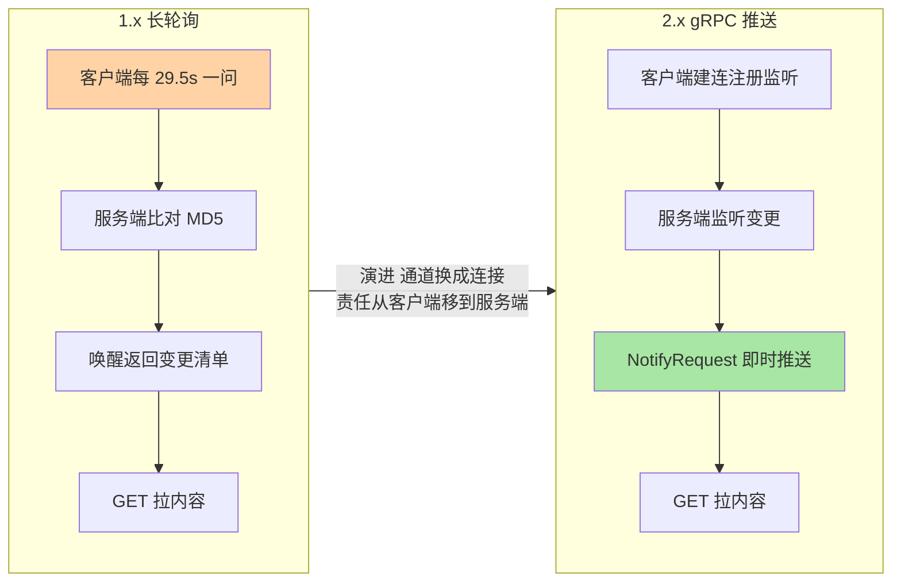

# 配置中心长轮询与推送演进：29.5 秒的由来

> 配置改完秒级生效，靠的不是魔法，是一个被精心校准的「29.5 秒挂起窗口」。这篇把 1.x 长轮询的完整闭环拆开——为什么挂 29.5 秒、MD5 在哪里比对、变更怎么被唤醒——再看 2.x gRPC 推送怎么把这个闭环重做，最后落到配置灰度与回滚的生产纪律。

## 一句话摘要

Nacos 1.x 配置感知的骨架是**长轮询**：客户端带着「本地缓存的 MD5 清单」向服务端发起请求，服务端比对 MD5——有差异立即返回变更清单，无差异则**挂起请求 29.5 秒**（客户端 HTTP 读超时 30 秒减去 0.5 秒网络余量），期间任何配置变更即时唤醒返回。注意它推的是**变更通知（dataId 清单）而不是内容**，内容由客户端再拉一次——「通知 + 拉」分离是可靠性的关键设计。2.x 用 gRPC 双向流把长轮询升级为**服务端主动推送**，延迟从秒级压到毫秒级，同时保留低频对账兜底。**演进主线：变更触达从客户端的轮询责任变成服务端的推送责任**。

## 🎯 本文核心

**核心一句话：1.x 长轮询 = MD5 比对（变化的哨兵）+ 29.5s 挂起（一次请求覆盖一个窗口）+ 通知即返回（轻响应）+ 二次拉取（重内容）——四个部件咬合出「秒级感知 + 空闲零开销」；2.x gRPC 把「客户端问」换成「服务端推」，但「通知与内容分离」的可靠性骨架原样保留。**

机制链：客户端注册监听 → 发起长轮询（带 MD5 清单）→ 服务端缓存比对 → 命中差异立即返回 / 未命中挂起 29.5s → 变更落库触发 dump → DataChangeTask 遍历挂起请求唤醒 → 客户端拉取内容更新快照 → 回调 Listener。全文一句话可重构：「MD5 是哨兵，挂起省开销，通知走轻通道，内容走重通道」。

## 前置阅读

- 入门层篇 3《服务注册与发现》：推送模型三代演进的概念层
- 入门层篇 1《Nacos 是什么与定位》：配置中心在统一底座中的位置

## 目标导向

本文是什么：1.x 长轮询的完整实现与 2.x 推送演进。功能是什么：让「为什么改配置秒级生效」「为什么配置没生效」「29.5 秒为什么不是整数」可归因。能得到什么：长轮询链路的排查路径（网关超时/线程积压/本地快照优先级）、灰度发布与回滚的操作纪律、2.x 迁移的评估口径。什么时候用：配置中心问题排查、动态参数体系设计、配置变更规范制定，必看。

## 一、边界：入门层讲过什么，本文讲什么

| 内容 | 入门层 | 本文 |
|---|---|---|
| 配置中心干什么、推送概念 | ✅ 讲过 | 不重复 |
| 长轮询完整闭环与 29.5s 由来 | 未讲 | **本文核心一** |
| MD5 比对与「通知+拉」分离 | 未讲 | **本文核心二** |
| 2.x gRPC 推送与对账兜底 | 未讲 | **本文核心三** |
| 灰度发布与回滚纪律 | 未讲 | **本文核心四** |

## 二、1.x 长轮询：29.5 秒怎么来的



**29.5 = 30 − 0.5**。客户端发起长轮询时自身 HTTP 读超时是 30 秒（公开口径的客户端默认值）：如果服务端也挂满 30 秒，服务端响应和网络传输可能落在客户端超时之后——客户端以「请求失败」处理并立即重试，形成超时重连风暴。所以服务端把挂起时间定在 29.5 秒，留 0.5 秒给网络传输与响应处理，保证**服务端的空结果响应永远先于客户端超时到达**。这 0.5 秒余量是长轮询机制的「安全边际」，不是拍脑袋的整数偏好。

**为什么挂这么长？** 挂起窗口的长度直接决定空闲开销：挂 5 秒，每个客户端每 5 秒一次请求，十万客户端就是每秒 2 万次空轮询；挂 29.5 秒，同等客户端量的空闲请求频率降为约六分之一，而变更触达延迟并不受损（挂起期间变更即时唤醒）。窗口长度同时受两层约束压制：客户端读超时（30s 上限）与中间网络设备会话空闲超时（LB/网关常见 60s 档，需大于 30s 才安全）——29.5 是「客户端超时减余量」的工程结果，落在这两层约束的安全区。

**时序上的一次完整唤醒**：

```mermaid
sequenceDiagram
    participant C as 客户端
    participant S as 服务端
    participant Q as allSubs 挂起队列
    C->>S: 长轮询 MD5 清单
    S->>Q: 无差异 挂起 29.5s
    Note over C: 监听已注册 等待通知
    C2["另一管理员发布配置"] --> S
    S->>S: 落库 + Dump 本地磁盘
    S->>Q: DataChangeTask 匹配 groupKey
    Q-->>C: 立即返回变更 dataId
    C->>S: GET 拉取新内容
    S-->>C: 新配置内容
    C->>C: 更新快照 + 回调 Listener
```

## 三、MD5 与「通知 + 拉」分离

**MD5 是变化的哨兵**。服务端为每个配置在内存维护缓存项（`ConfigCacheService` 的 `CacheItem`），配置发布时重算 MD5；客户端长轮询带上「我手里的每个配置的 MD5」，服务端逐项比对，不同即视为变更。比对是 O(清单长度) 的内存操作，成本几乎为零——这就是长轮询能在服务端承载海量挂起请求的前提。变更的落盘由 `DumpService` 完成：配置先写数据库，再异步 dump 到每台服务器本地磁盘——**DB 是真相源，本地磁盘是读缓存**，查询配置走本地文件（DB 抖动不影响读），这也是集群节点间一致性传播的载体（节点间通知 → 各自 dump）。

**为什么通知和内容分离？** 长轮询的响应只带「哪些 dataId 变了」的轻清单，客户端再发独立 GET 拉内容。分离的收益有三层：响应体小（挂起队列的唤醒风暴不至于变成带宽风暴）；拉取语义幂等可重试（丢了就再拉，不存在「半条推送」）；内容可以走缓存与快照。为什么不直接推内容？——推送通道上的大 payload 无法幂等重试，通知丢失可以靠下一轮比对兜底、推送失败只能靠重推硬扛。**「轻通知 + 幂等拉」是把不可靠通道上的可靠性做出来**的经典手法。

客户端侧还有一层**本地快照（failover 文件）**：每次拉到内容同步更新本地磁盘快照；开启容灾模式后本地文件优先于服务端——Server 全挂时配置读取不中断。这层设计在排查「改了配置没生效」时是第一嫌疑人（见事故叙事一）。

## 四、2.x gRPC：从「客户端问」到「服务端推」

2.x 的配置监听走 gRPC 双向流：客户端建连后通过 `ConfigChangeBatchListenRequest` 注册监听集合；服务端配置变更时主动下发 `ConfigChangeNotifyRequest`，客户端收到通知后拉取内容——**通知与内容分离的骨架没变，变的是通知的通道**：从「客户端 29.5 秒一问」变成「服务端即时一推」，感知延迟从秒级（挂起唤醒链路）压到毫秒级（连接推送）。



不变的部分同样重要：客户端仍保留**低频全量比对**作对账兜底（推送丢失、连接重建的静默间隙靠它找平），本地快照与容灾模式原样保留。2.x 没有删掉 1.x 的可靠性存量，只是把「变更触达」这个最高频路径换成了更好的通道——**演进不是替换系统，是替换系统里最疼的那条路径**。

**量级演进视角**：千级客户端，长轮询与 gRPC 体验无差别，约束来源是功能够用——这一档的核心问题是「用起来对不对」，而不是「延迟差多少」；十万级客户端，约束来源是挂起队列内存与空轮询 QPS——长轮询的 `allSubs` 挂起项与请求频率成为 Server 内存与连接账上的一笔固定开销，这一档的核心问题是「空闲开销的账算过没有」，而不是「响应快不快」；百万级客户端，约束来源是连接数与推送扇出——思考方式是「容量驱动」，连接容量评估 + 推送去抖批量的参数档位是必备功课；更大规模走多集群分域，思考方式是「架构驱动」。思考方式总结：小规模看功能，中规模看空闲开销，大规模看连接与扇出容量，超大规模看分域——约束来源从「请求频率」逐级迁移到「连接与物理边界」，思考方式跟着换代。

## 五、源码关键路径

以 Nacos 2.x 主线（config 模块，1.x 对照）为口径：

- 客户端：`ClientWorker`（1.x 长轮询循环：checkUpdateDataIds 发起长轮询 → 变更项 getServerConfig 拉内容 → 更新快照回调）；2.x 对应 `ConfigRpcTransportClient`
- 服务端接单：`ConfigController#doListener` → `LongPollingService#addLongPollingClient`——先比对 MD5，命中立即返回；未命中算出 hold 时间（timeout − 500ms）包成 `ClientLongPolling` 加入 `allSubs`
- 唤醒链路：配置发布 → `DumpTask`（落本地磁盘 + 更新 `CacheItem` 的 MD5）→ `DataChangeTask#run` 遍历 `allSubs`，逐项比对 groupKey 命中即返回响应
- 比对工具：`MD5Util#compareMd5`——MD5 清单比对的实现位置
- 灰度与历史：beta 配置独立存储（config_info_beta 表口径）+ 历史 `his_config_info` 表，控制台回滚接口读历史写新版本

阅读建议：以「管理员改了一个配置」为剧本，从发布接口走到 `DataChangeTask` 唤醒挂起请求，29.5 秒窗口内的每个角色（DB、dump、缓存、挂起队列）都在这条链上各就各位。

### 为什么 29.5 秒不是 25 秒或 60 秒？（追问）

先看两个失败候选。挂 60 秒：空闲开销更低，但客户端读超时 30 秒先到——客户端超时重试，服务端还挂着已无意义的请求，白占挂起队列；要配 60 秒就得把客户端超时也放大，超时放大的副作用是「真断连时的感知延迟」翻倍。挂 25 秒：能跑，但空轮询频率比 29.5 高 18%，且没有利用满 30 秒的客户端超时窗口——白白多付开销。29.5 是「在客户端超时约束内取满窗口、减去网络余量」的最优解，不是中间值随便取的。

（打破砂锅：如果链路上有个网关的读超时是 25 秒呢？——长轮询会被网关提前掐断，客户端收 504/断连，退化成 25 秒一轮的「短轮询 + 报错日志噪音」。这是生产环境长轮询问题的最高频形态，修复不是改 Nacos 参数，是把链路上所有超时统一到大于 30 秒——超时链的一致性比参数本身重要。）

### 为什么客户端拿到通知还要再拉一次？（追问）

如果通知直接带内容：变更风暴时（批量发布、误操作全量改）服务端要把完整配置塞进每条通知，带宽与序列化开销被放大数倍；且推送通道上的内容不可幂等重试，丢半条就是脏配置。分离后通知只带 groupKey（几十字节），内容走幂等 GET——风暴场景下服务端唤醒轻、客户端拉取稳。「通知轻、内容重、通道各司其职」比「一份数据打包推」在故障态下鲁棒得多。

（再深一层：为什么不做成 WebSocket 直接推内容？——1.x 的年代（2018 前后开源）WebSocket 服务端生态与运维成熟度不足，且推内容同样绕不开幂等问题；2.x 选 gRPC 双向流而不是 WebSocket，是因为 SDK 已用 gRPC 承载注册发现，一条连接复用两类流量，运维只养一种通道。通道选型的第一约束常常是「与既有体系的复用」，不是单点性能。）

## 典型场景

- **动态参数热更**：阈值、开关、白名单类参数走配置中心 + Listener 回调——长轮询秒级/gRPC 毫秒级生效，免去重启发布
- **配置灰度发布**：beta 发布指定 IP 生效，验证后再全量——把「改错配置」的爆炸半径从全网缩到一台
- **故障回滚**：发布引发线上异常，控制台从 `his_config_info` 历史一键回滚——回滚即一次新发布，MD5 变化自动触发推送

### 事故叙事一：改了配置「没生效」的三个真凶

某团队反馈「控制台改了超时参数，线上实例迟迟不生效」。排查按嫌疑度递进：第一查链路超时——网关读超时 20 秒，长轮询被掐断重连（日志里大量 504），变更通知退化到低频对账才送达；第二查本地快照——部分实例曾开过容灾模式，本地 failover 文件优先级高于服务端，配置永远读旧值；第三查 Listener——回调里抛了异常被吞掉，配置送达了但业务没接住。三个问题都不是「推送慢」。复盘动作：超时链统一进基线巡检、容灾模式开关纳入变更管理、Listener 回调必须带失败告警。**「没生效」的排查纪律是按链路顺序归因，而不是先怀疑推送机制**。

### 事故叙事二：批量发布引发的唤醒风暴

一次数据订正脚本循环发布了 2000 余个配置，变更任务排队 + 挂起请求批量唤醒 + 客户端集中拉取，推送延迟从毫秒级恶化到分钟级，期间新配置生效时序错乱引发业务报错。排查发现服务端 dump 与通知链路被单点打满。复盘：批量发布必须分批错峰（每批间隔 + 顺序可预期）；变更脚本加上「每批后的生效确认」再发下一批。教训是**配置中心把「发布」当成廉价操作，但链路成本随并发度非线性上涨——变更频率是容量问题，不是运维习惯问题**。

## 业内惯例

- **链路超时统一大于长轮询窗口**：Nginx/LB/网关的读超时必须 > 30s，写进中间件接入基线——这是长轮询类系统接入的第一条军规
- **配置变更走「灰度 → 验证 → 全量」三段式**：beta 指定 IP 先行，观察核心指标无异常再全量；高危配置（连接池、线程池、开关类）一律走灰度
- **Listener 回调必须有兜底**：回调失败要告警、重注册要幂等——「推送送达」不等于「业务生效」，两头的可观测性都要建
- **变更频率纳入治理**：单配置变更频率、单日发布总量有上限口径（业内经验），批量订正走分批错峰 + 生效确认

## 💡 实战提示

- 💡 排查「配置没生效」按序归因：链路超时 → 本地快照/容灾模式 → Listener 回调异常 → 最后才是推送链路——顺序错了容易白改参数
- 💡 29.5 秒窗口是客户端 30s 超时减余量的结果：任何一环改动（网关超时、SDK 超时）都要重新核对整条超时链的一致性
- 💡 高危配置必走灰度：beta 指定 IP 验证再全量，回滚走历史版本一键操作——灰度与回滚是配置发布的刹车，不是可选项
- 💡 批量发布分批错峰：变更风暴的代价（dump 排队、唤醒风暴、集中拉取）是分钟级的，发布脚本的间隔是工程纪律

### 不同量级的思考：架构约束驱动解法

- **十万级（客户端数）**：约束来源是空轮询 QPS 与挂起内存——这一档的核心问题是「空闲开销在不在账上」，而不是「功能用没用上」；思考方式是「监控驱动」，盯挂起项数量与长轮询 QPS 曲线，默认参数即可
- **百万级（客户端数）**：约束来源是连接数、唤醒风暴与推送扇出——这一档的核心问题是「变更风暴的扇出算过吗」，而不是「加几台机器」；思考方式是「容量驱动」，连接容量评估 + 变更频率治理 + 推送去抖参数分档，缺一不可
- **千万级（客户端数）**：约束来源是连接内存与单集群推送极限——这一档的核心问题是「单集群还装得下吗」，而不是「参数怎么调」；思考方式是「工程驱动」，按业务域拆集群 + 变更路由收敛 + 灰度扇出按集群滚动
- **更大规模（多机房/多域）**：约束来源是物理边界与合规要求——这一档的核心问题是「架构分域对不对」，而不是「协议选哪个」；思考方式是「架构驱动」，多域独立 + 上层聚合，单集群不背全网连接

思考方式总结：十万级靠监控打底，百万级靠容量治理，千万级靠工程拆分，更大规模靠架构分域——约束来源从请求频率逐级迁移到连接与物理边界。**自下而上与触发升级**：先用两个实测值定档——在线客户端数、变更推送延迟 P99；触发升级的信号是「挂起队列/连接数逼近单集群容量口径」「批量发布出现过分钟级延迟」「跨机房推送延迟可测」，任一信号出现，思考方式必须升档——用上一档的解法硬扛下一档的约束，事故在前面等着。

### 反方案：为什么不选「纯定时轮询」？

定时轮询（客户端每 N 秒全量比对）实现最简单，但两笔账都难看：**延迟账**——感知延迟 = 轮询间隔均值（5 秒间隔平均延迟 2.5 秒，P99 接近 5 秒）；**开销账**——QPS = 客户端数 ÷ 间隔，十万客户端 × 5 秒间隔 = 每秒 2 万次请求的常驻负载，换来的只是「不比长轮询差多少的延迟」。长轮询用「服务端多养一个挂起队列」的复杂度，同时解决了延迟与开销——这就是 25 年来（从 Comet 到 Nacos）长轮询在推送通道不成熟年代长盛的原因。

为什么不选「1.x 直接上推送通道」？——2018 年前后的开源服务端没有一条「可靠、有序、免运维」的推送通道可用：UDP 不可靠要配拉兜底（Nacos 注册侧 1.x 的选择）、TCP 自研连接管理成本高。长轮询是那个时代「HTTP 生态免费拿可靠性」的务实解；等 gRPC 生态成熟，2.x 才把通道换掉——**先务实后演进，不是不思进取**。

## Trade-off：长轮询 vs gRPC 推送的取舍账

| 维度 | 1.x 长轮询 | 2.x gRPC 推送 |
|---|---|---|
| 感知延迟 | 秒级（唤醒链路） | 毫秒级（连接推送） |
| 空闲开销 | 每 29.5s 一次请求/客户端 | 常驻连接（内存/句柄） |
| 中间层依赖 | 链路超时必须 > 30s | 端口连通性（9848） |
| 故障兜底 | 下一轮比对自然兜底 | 低频对账 + 快照 |
| 运维复杂度 | HTTP 生态零成本 | 连接管理/重连风暴治理 |

取舍主线：**长轮询用「请求频率」换「无连接运维」，gRPC 用「连接容量」换「毫秒级触达」**——客户端规模小时长轮询更省心，规模大时 gRPC 的开销曲线更平缓。迁移决策跟着客户端量级与延迟敏感度走，不跟「新旧哪个先进」走。

## 六、常见误区

- **「改了控制台就等于全民生效」**：生效链路有 dump、推送、拉取、回调四跳，任何一跳断链都表现为「没生效」——以「客户端实际读到的值」为准验证，不以控制台为准
- **「29.5 秒是可以随便调的参数」**：它是客户端超时的因变量，调它必须连着整条超时链一起核——单独改出一个「大于客户端超时」的窗口等于制造重连风暴
- **「2.x 有推送就不用对账了」**：推送会丢（连接重建间隙）、连接会断（重连风暴），低频比对与本地快照是最后一道防线——兜底机制的存在不因通道先进而失效
- **「灰度发布是控制台的可选功能」**：灰度是高危配置的发布纪律——「直接全量 + 出事回滚」在连接池类配置上一次就能打出生产事故

## 七、与相邻机制的关系

- 本系列篇 1《注册发现与 Distro 协议》：注册侧 2.x 同样演进到 gRPC 连接，通道演进两条线同构，连接容量账同一套
- 本系列篇 4《鉴权与安全基线》：配置内容是最敏感的数据面，鉴权与加密基线直接约束本篇的发布与拉取链路
- 本仓库 config-center 系列：长轮询/推送模型的通用机制定义在架构域，本篇只讲 Nacos 怎么实现

## 你们可能会问

**Q1：客户端数很多时，29.5 秒的挂起会不会把服务端线程占满？**
不会——挂起用的是异步 DeferredResult 式挂起队列（`allSubs`），不占请求线程；占的是内存与唤醒时的 CPU。真正的压力点是变更风暴时的批量唤醒，靠去抖与分批发布治理，而不是靠加线程。

**Q2：配置内容里能存密码吗？**
明文密码不建议——配置中心的安全模型覆盖传输与访问控制，但不改变「有权限就能读」的事实；敏感项用配置加密插件或应用侧解密方案（篇 4 展开安全基线），密钥与配置分离托管。

**Q3：长轮询和注册发现的心跳是什么关系？**
没关系——配置监听是拉/推模型，注册保活是心跳模型，两条独立链路。1.x 客户端里它们共用 HTTP 通道但机制独立；2.x 共用 gRPC 连接但报文独立——排查问题时别把配置不生效归因到心跳参数。

**Q4：升级 2.x 后长轮询还有用吗？**
对老版本客户端仍有兼容价值（混布期），新接入一律走 gRPC 连接；理解长轮询仍然必要——它是所有「通知 + 拉」类系统的母版，兜底对账的语义也继承了它的比对逻辑。

## 八、自测三问

1. 29.5 秒怎么来的？链路上网关读超时 25 秒会发生什么？
2. 为什么通知和内容分离？变更风暴时这个设计怎么体现价值？
3. 2.x 推送演进保留了 1.x 的哪些可靠性存量？分别兜什么底？

## 开放问题

- 配置推送延迟的标准化 SLO（毫秒级口径的度量与告警约定）社区尚无统一定义，值得跟踪。
- 配置与密钥托管分离的插件生态（加密算法插件、KMS 对接）仍在演进，敏感配置的工程范式未收敛。

## 🎯 核心带走

- **核心一句话**：1.x 长轮询 = MD5 哨兵 + 29.5s 挂起 + 轻通知 + 幂等拉；2.x 把「客户端问」换成「服务端推」，但通知内容分离与对账兜底的骨架不变
- **机制链**：注册监听 → 长轮询/建连 → MD5 比对 → 挂起或唤醒 → dump 落盘 → 通知 → 拉内容 → 快照 + 回调
- **哪里会坏**：网关超时掐断长轮询、本地快照优先级、Listener 回调吞异常、批量发布的唤醒风暴
- **边界**：本篇管配置侧触达与发布纪律；安全与加密在篇 4，注册侧协议在篇 1

## 相关阅读

- 上一篇：[1_注册发现与Distro协议-特性](./1_注册发现与Distro协议-特性.md)
- 下一篇：[3_心跳健康检查与摘除-特性](./3_心跳健康检查与摘除-特性.md)
- 入门对照：[3_服务注册与发现-入门](../../入门层/从零开始认识Nacos系列/3_服务注册与发现-入门.md)

## 📌 数据与事实声明

- 写于 2026-09-18，机制以 Nacos 2.x 主线源码与官方文档为准（config 模块）；29.5s = 30s 客户端超时 − 0.5s 余量为官方文档/社区公开口径
- 客户端默认超时、延迟量级等为业内认知/公开口径，具体数值以官方文档与实测为准
- 免责：参数默认值与版本特性以 nacos.io 官方文档为准

## 📚 参考资料

| 类型 | 标题 | 来源 |
|---|---|---|
| 官方文档 | Nacos 配置管理 / 监听机制 | nacos.io/docs |
| 官方源码 | alibaba/nacos（config 模块：LongPollingService/ClientWorker/DumpService） | github.com/alibaba/nacos |
| 社区文章 | Nacos 2.0 连接与推送模型官方系列 | nacos.io 博客 |
| 关联系列 | 本仓库 config-center 系列（推送模型正版） | docs/architecture/ |
