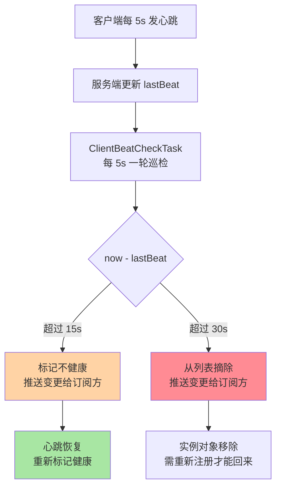
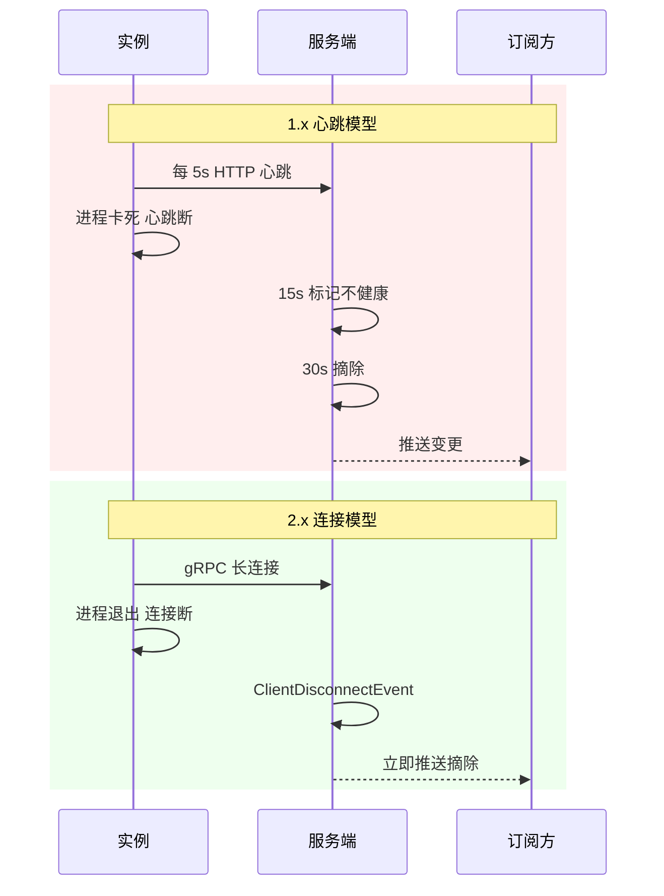
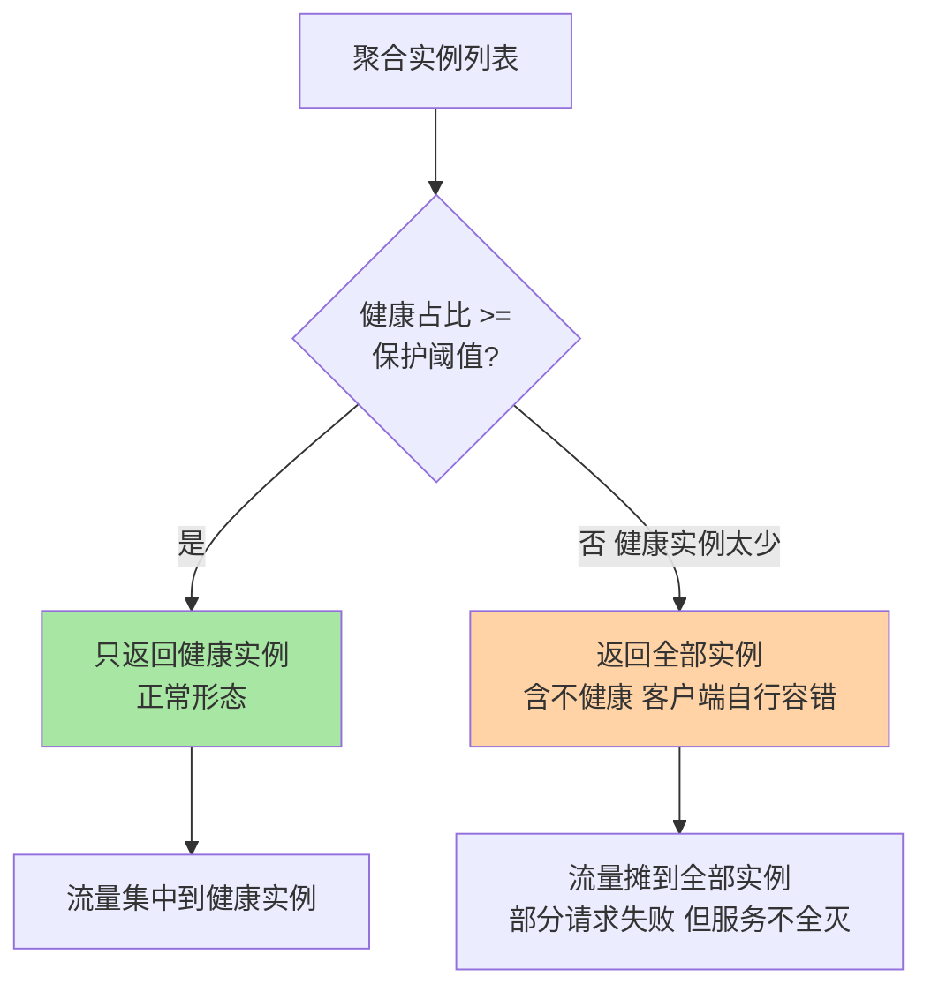

# 心跳、健康检查与摘除：5s/15s/30s 与保护阈值

> 「宁可把可能不健康的实例返回给调用方，也不让服务被摘到全灭」——保护阈值这条反直觉的规则，是理解注册中心健康机制的一把钥匙。这篇把临时实例心跳的三档阈值、持久实例的服务端探测、2.x 连接摘除与保护阈值的雪崩防线讲透。

## 一句话摘要

Nacos 的保活与摘除按实例类型分两条路线：**临时实例**（1.x）靠客户端心跳——每 5 秒上报一次，服务端 `ClientBeatCheckTask` 周期巡检，15 秒未报标记不健康、30 秒未报从列表摘除，三档数字构成「灵敏度阶梯」；2.x 心跳退化为连接保活——gRPC 连接断开即整批摘除，秒级且无需应用层证明。**持久实例**反方向：实例不证明自己，服务端主动探测（TCP/HTTP），失败只标记不健康、**永不摘除**。再叠一层**保护阈值**：健康实例占比跌破阈值时，列表返回全部实例（含不健康）——用「部分请求可能失败」换「绝不雪崩到全灭」。**摘除机制的本质是拿误杀率换止血速度，保护阈值是这条取舍的最后刹车**。

## 🎯 本文核心

**核心一句话：健康机制 = 保活信号（临时靠心跳/连接，持久靠服务端探测）+ 摘除决策（临时摘、持久留）+ 保护阈值（摘除的最后刹车）——三层共同回答「谁来说实例死了、死了怎么办、死太多怎么办」。**

机制链：客户端心跳 5s 一报 → 服务端巡检任务 5s 一轮 → 15s 未报标记不健康（推送变更）→ 30s 未报摘除（推送变更）→ 调用方列表更新；持久实例侧：服务端探测任务 → TCP/HTTP 处理器探活 → 失败标记不健康但保留实例；任何时刻健康占比跌破保护阈值 → 返回全量列表 + 不健康标记。全文一句话可重构：「信号选对方向，摘除管止血，阈值管保命」。

## 前置阅读

- 入门层篇 3《服务注册与发现》：临时/持久实例的保活方向差异（概念层）
- 本系列篇 1《注册发现与 Distro 协议》：2.x 连接与摘除信号的关系

## 目标导向

本文是什么：心跳/探测/摘除/保护阈值四层机制。功能是什么：让「为什么 30 秒才摘」「为什么宁可返回不健康实例」「2.x 为什么不需要心跳」可归因。能得到什么：三档参数的调优判据、保护阈值的开启口径、摘除延迟的量化账、误摘风暴的排查路径。什么时候用：心跳参数评审、保护阈值决策、实例漂移类故障复盘，必看。

## 一、边界：入门层讲过什么，本文讲什么

| 内容 | 入门层 | 本文 |
|---|---|---|
| 临时心跳/持久探测的方向差异 | ✅ 讲过 | 不重复 |
| 5s/15s/30s 三档的机制实现与调优 | 提了数字 | **本文核心一** |
| 2.x 连接摘除替代心跳 | 未讲 | **本文核心二** |
| 持久实例 TCP/HTTP 探测实现 | 未讲 | **本文核心三** |
| 保护阈值的雪崩逻辑与口径 | 未讲 | **本文核心四** |

## 二、临时实例：三档数字的机制实现

三档数字各司其职：**5 秒是客户端上报周期**（心跳间隔，由服务端下发的 beat interval 微调），决定「活着的证据」的刷新频率；**15 秒是服务端不健康标记阈值**（三次周期未报），决定订阅方何时被告知「这个实例可能不行了」；**30 秒是摘除阈值**，决定「这个实例确定不在列表里了」。三档的间隙不是随意拉开的：上报周期必须显著小于标记阈值（用多次缺报过滤单次抖动），标记阈值必须小于摘除阈值（给「先降权观察」留窗口）——阶梯的每一级都在吸收上一级的误判。

**1.x 的摘除检查只由负责节点执行**（`DistroMapper.responsible()` 判定，本系列篇 1 的分片负责）——避免多节点对同一服务重复检查与重复摘除。心跳本身则落在「收到心跳的那个节点」：1.x 心跳是 HTTP 请求，打给哪个节点由客户端轮询决定，节点更新本地 lastBeat 后按 Distro 异步同步——心跳数据的收敛同样走最终一致。

**2.x 把这条链路整个换掉**：客户端与服务端之间是一条 gRPC 长连接，连接建立即注册完成，连接断开事件（网络断、进程退、重启）通过 `ConnectionManager` 触发 `ClientDisconnectEvent`，该 client 名下全部实例**一次性摘除**。信号从「每实例每 5 秒的周期证明」变成「连接级的单次事件通知」——应用层心跳在 2.x 里不再承担保活职责，只剩连接级的 keepalive。摘除延迟从「最长 30 秒 + 复制窗口」压到「断连感知 + 复制窗口」，且万级实例的每秒 2000 次心跳请求从容量账上消失。

### 两代摘除信号对照

## 三、持久实例：服务端主动探测，失败不摘除

持久实例把保活主权交给服务端：`HealthCheckTask` 按服务组织探测任务，交给注册的**健康检查处理器**执行——**TCP 探测**（NIO 非阻塞发起连接，连通即健康，适合 TCP 服务）、**HTTP 探测**（发 GET，响应 2xx 判健康，适合暴露健康端点的服务）、**NONE**（不探测，人工标记）。探测结果只改健康标记：失败 → 不健康（订阅方收到列表带标记，可路由绕开）；恢复 → 健康。**实例对象永不删除**——这是持久语义的核心承诺：数据库主从、消息队列这类固定成员「重启后地址不变」，探测失败只是「暂时不可用」，不能把「配置过的成员」从系统里抹掉（摘除意味着有人要手工重新登记）。

临时摘、持久留，不是两套标准不一，而是两种错误代价的倒置：**临时实例摘错（误杀）代价小**——实例还活着会重新注册，且不摘的死实例会把流量持续打进黑洞；**持久实例摘错误价大**——摘除破坏「固定成员登记表」的语义，且这类成员往往没有自动重注册能力。摘除决策跟着「谁有能力自愈」走。

## 四、保护阈值：为什么宁可返回不健康实例

推演一遍关闭保护阈值的雪崩：某服务 30 个实例因下游抖动集体变慢，26 个探测/心跳失败被标记——订阅方列表只剩 4 个健康实例，**全网流量瞬间集中到这 4 个**——它们本来就正常，被打挂也只是时间问题；再摘除、再集中，直到全灭。故障从「26/30 不可用」恶化成「30/30 不可用」，**摘除机制在极端场景下是雪崩的放大器**。保护阈值（服务级参数 `protectThreshold`，默认 0 关闭）的语义：健康实例占比跌破阈值时，列表返回**全部实例**（不健康实例带标记），宁可让部分请求失败在「大概率还活着」的实例上，也不让存活实例被流量集中处决。这与 Eureka 的自我保护、熔断器的降级思想同源：**在不确定性下保留多样性，比追求确定性而集中风险更可存活**。

代价同样明确：开启后调用方会拿到不健康实例，部分请求直接失败——**保护阈值把「系统性全灭」兑换成「局部错误率上升」**，这笔兑换只在调用方具备容错能力（快速失败、重试其他实例、熔断）时是赚的；调用方没有容错时，错误会直通用户。所以保护阈值默认关闭：它默认「调用方未必准备好了」，开启与否是调用方成熟度的函数。

### 设计思想：健康机制的三次取舍

把四层机制串起来看，Nacos 的设计思想是三次清晰的取舍。**第一次：信号方向的选择**——临时实例「自己证明活着」、持久实例「被证明活着」，保活主权跟数据性质走，这是整个健康机制的设计哲学起点：机制不替数据选边，让数据的性质自己选。**第二次：摘除的保守化设计**——三档阶梯、负责节点单点执行、误杀可自愈的取向，设计取舍始终偏向「少摘、慢摘」：摘除是破坏性动作，破坏性动作的默认姿态就该保守。**第三次：保护阈值的反直觉设计目标**——宁可返回不健康实例，是给「摘除机制自身的失效模式」（雪崩放大）留的最后一道刹车，好系统承认自己的机制会失灵，并提前给失灵定价。三次取舍的共同点：**每一层都在为上一层的失效模式设计补偿**——信号会断（所以阶梯滤抖动）、摘除会错杀（所以保守化）、摘除会放大故障（所以保护阈值）。健康机制的可靠性不是「每个部件都正确」，是「每个部件的失效都被下一层兜住」。

## 五、源码关键路径

以 Nacos 2.x 主线（naming 模块，1.x 机制对照）为口径：

- 心跳接收：`InstanceController#heartbeat` → `ClientBeatProcessor`（更新 lastBeat）→ `Service#processClientBeat`（顺带触发健康回正与变更检查）
- 摘除巡检：`ClientBeatCheckTask#run`——`now - lastBeat > 15000` 标记不健康，`> 30000` 删除实例；任务仅由负责节点执行；调度由 `HealthCheckReactor` 的延迟任务池驱动（默认 5s 一轮）
- 2.x 摘除：`ConnectionManager`（连接注册/断开）→ `ClientDisconnectEvent` → `ClientServiceIndexesManager` 移除 client 索引 → 实例批量下线
- 持久探测：`HealthCheckTask`（按服务分片的探测任务）→ 处理器族：`TcpSuperSenseProcessor`（NIO 探测）、`HttpHealthCheckProcessor`（2xx 判健康）、`NoneHealthCheckProcessor`；结果写 `HealthCheckStatus`
- 保护阈值：`Service#updateIps` 聚合实例时统计健康比例，跌破 `protectThreshold` 即返回全量列表并标记保护生效

阅读建议：以「一个实例进程假死 40 秒后恢复」为剧本，1.x 从 lastBeat 停更走到摘除再走到恢复；2.x 从连接断开走到 `ClientDisconnectEvent`——两代摘除的速度差与机制差在这两条路径上一目了然。

### 为什么摘除阈值敢给到 30 秒这么长？（追问）

直觉上摘得越快止血越快，但 30 秒是在**误杀代价**与**止血速度**之间的取中：心跳断的原因不只有进程死亡——一次 20 秒的 Full GC、一次网络抖动、一次容器 CPU 限流都能造成「心跳断了人还在」。摘除阈值太短，这类假死实例被成批误杀：摘除推送引发列表抖动、流量集中到幸存者、恢复后又引发回切风暴——误杀的代价比晚摘 20 秒更大。业内同类系统（Eureka 的默认阈值量级、K8s 的探测宽限期）都在同一个数量级上取值（公开口径）——**摘除速度的竞争没有意义，误杀率的控制才有**。

（打破砂锅：那 2.x 连接断开是不是也会误杀假死实例？——会，但概率低得多：TCP 连接断开是内核级信号，进程假死但网络栈活着时连接通常不断；只有进程真退、机器宕机、网络真断才触发。2.x 把「应用层周期证明」换成「内核连接事件」，本质是把误杀的样本空间从「一切卡顿」缩小到「真断连」。）

### 为什么保护阈值默认是 0（关闭）？（追问）

默认值要为「最不了解机制的用户」服务。开启保护阈值意味着调用方会持续收到不健康实例——如果调用方没有快速失败与重试，用户视角是「请求莫名报错」，比「流量集中」更早被感知、更难排查。默认关闭把选择权留给理解代价的团队：**机制可以保护系统，但保护动作本身需要调用方配合，默认值不能替用户做这个假设**。这也是「默认值保守、基线建议积极」的典型分层——生产基线里核心服务建议显式开启（业内经验口径 0.2-0.4 起步实测），基线与默认值的分工各干各的。

### 为什么持久实例探测失败也不摘？（追问）

摘除的对象是「不再被管理的实例」，而持久实例的本质是**登记表**：它是运维/部署系统登记进来的配置事实，不是「证明自己活着才存在」的动态成员。摘掉一个暂时探测不通的数据库地址，等它恢复时没有任何机制会把它加回来——登记表的信息量比健康状态值钱。真正需要的是「调用方绕开不健康实例」，这由健康标记 + 客户端路由完成，不需要摘除参与——**标记解决路由问题，摘除解决成员管理问题，两件事不该混**。

## 典型场景

- **发布期的健康波动**：滚动发布时新旧实例交替，标记阈值 15 秒内订阅方收到「降权提示」，摘除 30 秒内完成——发布窗口的列表抖动量 = 实例数 × 两级阈值内的变更次数，这是发布节奏设计的输入
- **优雅下线**：正确顺序是主动注销（跳过 30 秒等待）→ 等推送生效 → 流量衰减 → 退出；心跳摘除只是忘记注销时的兜底
- **依赖故障的连锁健康恶化**：下游抖动引发上游批量不健康——保护阈值 + 调用方熔断的「双刹车」场景，任一缺失都会放大故障

### 事故叙事一：一次网络抖动的误摘风暴

某机房交换机闪断约 20 秒，恢复后业务出现两波报错：第一波在闪断期间（部分调用方仍把流量打进已被标记不健康实例之外的区域，另一些在等推送）；第二波在恢复后——批量实例重新注册/回健康触发密集变更推送，叠加客户端重连，列表短时间高频抖动。排查链路：摘除日志时间线 → 网络设备告警对齐 → 推送量曲线确认抖动幅度。复盘动作：核心服务开启保护阈值（兜「集中摘除」场景）、调用方加列表版本防抖（短时间内不频繁切换）、交换机闪断进演练场景库。**摘除机制对「群体性短暂失联」最脆弱，单实例故障反而无害——演练要打群体场景**。

### 事故叙事二：保护阈值关闭下的雪崩复盘

某核心服务 30 实例中 26 个因下游存储超时被标记不健康（保护阈值默认 0），流量集中到剩余 4 个，全部超时——服务全灭，扩容恢复用时数十分钟。复盘争议点恰在保护阈值：开启后那 26 个「大概率活着只是慢」的实例会分掉流量，多数请求能慢速成功而非快速全灭。最终口径：核心服务保护阈值 0.3 起步（配合调用方超时收紧 + 失败快速切换），非核心服务保持 0。**保护阈值不是「开不开」的问题，是「按服务分层开多少」的问题**——雪崩防御的参数没有全局答案，只有分层口径。

## 业内惯例

- **心跳三档默认值不动，按实例规模实测再调**：误杀率与摘除延迟的平衡点只能来自本环境的 GC 停顿分布与网络抖动数据——盲调小间隔 = 心跳 QPS 上涨 + 误杀率上升双输
- **核心服务保护阈值显式开启（业内经验 0.2-0.4）**，非核心服务保持 0；开启前提是调用方具备快速失败 + 重试，两者成对配置
- **优雅下线永远主动注销**：心跳摘除（30s）只做兜底；发布系统统一注入注销钩子是业内标配
- **摘除链路的观测三件套**：不健康标记率（15s 阈值命中）、摘除率（30s 阈值命中）、恢复回切次数——误杀率与抖动量都在这三个指标里

## 💡 实战提示

- 💡 摘除延迟的账要算总账：1.x = 30s 摘除阈值 + 复制窗口，2.x = 断连感知 + 复制窗口——拿「摘除快慢」做方案对比时用总账，别只比阈值
- 💡 心跳假死 ≠ 实例死亡：Full GC、CPU 限流、网络抖动都能断心跳——排查「实例被摘」先看心跳断的原因，再谈摘除对不对
- 💡 保护阈值与调用方容错成对上线：只开阈值不给调用方快速失败，等于把「全灭」换成「报错直通用户」——配置评审时两项一起看
- 💡 2.x 排查摘除问题从连接入手：连接成功率、断连事件日志优先于心跳参数——两代机制的排查入口不同

### 不同量级的思考：架构约束驱动解法

- **十万级（实例数）**：约束来源是心跳 QPS 与巡检任务的粒度——这一档的核心问题是「保活开销在不在监控里」，而不是「参数配多少」；思考方式是「监控驱动」，万级实例 × 5s = 每秒 2000 次心跳的账先行，1.x 也能扛，2.x 更从容
- **百万级（实例数）**：约束来源是巡检任务内存与摘除推送的扇出——这一档的核心问题是「群体摘除的推送风暴算过吗」，而不是「阈值调多少」；思考方式是「容量驱动」，摘除批量化、推送去抖、保护阈值分层开启缺一不可
- **千万级（实例数）**：约束来源是单集群连接与巡检的物理上限——这一档的核心问题是「摘除决策的集中度还成立吗」，而不是「加节点」；思考方式是「工程驱动」，分片负责的巡检粒度、摘除决策的分布式化、跨集群分域
- **更大规模（多域部署）**：约束来源是机房边界与故障域隔离——这一档的核心问题是「故障域切干净了吗」，而不是「协议怎么选」；思考方式是「架构驱动」，按域独立部署摘除体系，跨域只做聚合与对账

思考方式总结：十万级靠监控打底，百万级靠容量治理，千万级靠工程重构，更大规模靠架构分域——约束来源从心跳频率逐级迁移到巡检内存与故障域边界。**自下而上与触发升级**：先用三个实测值定档——实例数、心跳/断连事件速率、群体摘除时的推送延迟峰值；触发升级的信号是「巡检任务耗时逼近周期」「一次群体事件推送延迟分钟级」「单集群连接逼近容量口径」，任一信号出现即升档思考——用单机巡检的思路硬扛集群规模的问题，是摘除类事故的通用病根。

### 反方案：为什么不选「心跳越快摘除越准」？

把 5s/15s/30s 压到 1s/3s/5s，摘除延迟线性下降，但两笔账同步恶化：**开销账**——心跳 QPS 五倍化，万级实例从每秒 2000 次涨到 1 万次，服务端巡检压力与网络负载同步上涨；**误杀账**——判定窗口越窄，单次抖动（GC 20 秒、网络闪断）越容易被判死刑，误杀引发的流量集中与回切风暴远比晚摘更贵。快心跳买来的是「对真死的确认更快」，付出的是「对假死更不留情」——健康机制的调优方向从来不是更快，是更准。

为什么不选「全走服务端探测，客户端别掺和」？——服务端主动探测的成本是 O(实例数) 的探测流量，且要维护探测任务的分片与调度；客户端心跳把「证明活着」的成本摊给实例自身，服务端只做被动巡检——分工的经济学在十万级实例上差出量级。服务端探测留给「不会自证的持久成员」，是按能力分工，不是按技术偏好。

## Trade-off：摘除机制的取舍账

| 取舍 | 得到 | 代价 | 适用 |
|---|---|---|---|
| 心跳周期 5s（长） | 低开销 + 抗抖动 | 摘除慢（30s 总账） | 大规模弹性实例 |
| 摘除阈值 30s（长） | 误杀率低 | 故障止血慢 | 配合调用方容错 |
| 2.x 连接摘除 | 秒级 + 零心跳开销 | 假死断连仍可能误杀 | 全量 2.x 化 |
| 持久实例不摘除 | 登记表语义完整 | 死成员长期占列表 | 固定基础设施 |
| 保护阈值开启 | 防雪崩保命 | 错误率上升暴露给调用方 | 核心服务 + 容错齐备 |

取舍的公共逻辑：**摘除是「用误杀率换止血速度」的调节器，保护阈值是它的最后刹车**——所有参数都在这条取舍线上找位置，没有又快又准又零代价的档位。

## 六、常见误区

- **「心跳断了 = 实例挂了」**：心跳断只说明「证据链断了」，进程假死、网络抖动都表现为心跳断——摘除是决策不是事实，决策就可能错
- **「保护阈值会让故障被掩盖」**：它不掩盖，它改变故障形态——从「全灭」变「部分失败」，前提是调用方能感知并容错；掩盖故障的是没有可观测性，不是阈值
- **「持久实例探测失败该告警并摘掉」**：探测失败该告警（健康标记变化就是信号），但摘除破坏登记语义——告警走监控，摘除管成员，两个体系
- **「2.x 还要按 1.x 的经验调心跳参数」**：2.x 心跳退化为连接保活，1.x 的三档参数语义已变——升级后按连接指标重新建立基线，旧经验不迁移

## 七、与相邻机制的关系

- 本系列篇 1《注册发现与 Distro 协议》：摘除信号（连接断开/心跳超时）如何驱动 Distro 数据变更，协议侧看篇 1
- 本系列篇 2《配置中心长轮询与推送演进》：健康变更推送与配置推送共用 2.x 的连接通道，容量账同源
- 本仓库 RPC/容错系列：保护阈值是注册侧的雪崩防线，调用侧的熔断/重试是它的配套件——两侧成对设计

## 你们可能会问

**Q1：15 秒标记不健康后，调用方流量还会打进去吗？**
会——标记只是给订阅方「降权提示」，具体行为取决于客户端路由策略（默认列表里仍在，带健康标记）。真正确保不打的是摘除（30 秒后）或调用方主动过滤不健康实例——「标记」与「断流」是两级动作。

**Q2：保护阈值开启后，怎么区分「保护生效」和「真的有问题」？**
保护生效时列表里不健康实例带标记、数量可见——「健康实例数曲线」仍是真相源；告警与容量决策都以健康实例数为准，不因保护生效而放松排查。保护阈值是止血带，不是健康证明。

**Q3：假死实例被误摘后，会自动回来吗？**
会——1.x 临时实例恢复心跳后重新回健康（若已被摘除则需重注册，客户端 SDK 自动处理）；2.x 连接重建即整批回归。误杀的自愈成本低，这也是「宁可误杀」取向敢用的原因。

**Q4：2.x 下 1.x 的心跳参数还有意义吗？**
兼容期对走 HTTP 通道的老客户端仍生效；纯 gRPC 接入下不再承担保活职责。混布期两套参数并存，监控与容量要分开口径——这也是尽快收拢到 2.x 单一形态的理由之一。

## 八、自测三问

1. 5s/15s/30s 各自的角色是什么？为什么阶梯要拉开间距？
2. 临时摘、持久留的错误代价逻辑是什么？
3. 保护阈值的雪崩推演怎么走？开启的前提条件有哪些？

## 开放问题

- 连接级摘除在「网络设备闪断」群体场景下的防抖标准化（社区仍在演进，公开讨论中）。
- 健康度从「通/不通」一比特走向多档位（慢、过载、健康）的语义扩展，与调用方路由策略的联动尚无定论。

## 🎯 核心带走

- **核心一句话**：健康机制三层——信号（心跳/连接/探测）、决策（临时摘持久留）、刹车（保护阈值）；摘除是误杀率与止血速度的取舍，保护阈值防的是摘除机制自身的雪崩放大
- **机制链**：5s 心跳/连接保活 → 巡检或断连事件 → 15s 标记降权 → 30s 摘除/秒级连接摘除 → 推送订阅方 → 健康占比破阈值时全量返回
- **哪里会坏**：群体性失联的误摘风暴、保护阈值未开启的雪崩、优雅下线只靠心跳超时、2.x 沿用 1.x 心跳经验
- **边界**：本篇管健康与摘除；协议与分片在篇 1，配置触达在篇 2，摘除推送的容量账与篇 1 的 Distro 复制同源

## 相关阅读

- 上一篇：[2_配置中心长轮询与推送演进-特性](./2_配置中心长轮询与推送演进-特性.md)
- 下一篇：[4_鉴权与安全基线-特性](./4_鉴权与安全基线-特性.md)
- 入门对照：[3_服务注册与发现-入门](../../入门层/从零开始认识Nacos系列/3_服务注册与发现-入门.md)

## 📌 数据与事实声明

- 写于 2026-09-18，机制以 Nacos 2.x 主线源码与官方文档为准（naming 模块）；5s/15s/30s 默认值为官方默认（公开口径）
- 保护阈值业内经验区间（0.2-0.4）为业内认知口径，实际取值需按服务分层实测
- 免责：参数默认值与版本特性以 nacos.io 官方文档为准

## 📚 参考资料

| 类型 | 标题 | 来源 |
|---|---|---|
| 官方文档 | Nacos 健康检查机制 / 心跳参数 | nacos.io/docs |
| 官方源码 | alibaba/nacos（naming 模块：ClientBeatCheckTask/HealthCheckTask/ConnectionManager） | github.com/alibaba/nacos |
| 社区文章 | Nacos 2.0 连接模型与摘除语义官方系列 | nacos.io 博客 |
| 关联系列 | 本仓库 service-discovery / RPC 容错系列（机制与容错正版） | docs/architecture/ |
