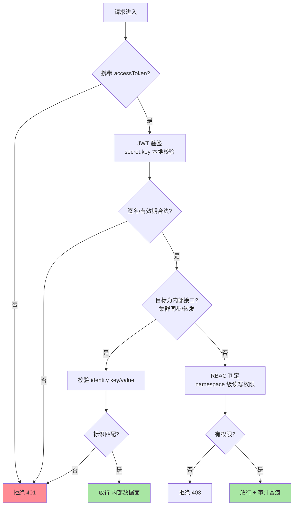
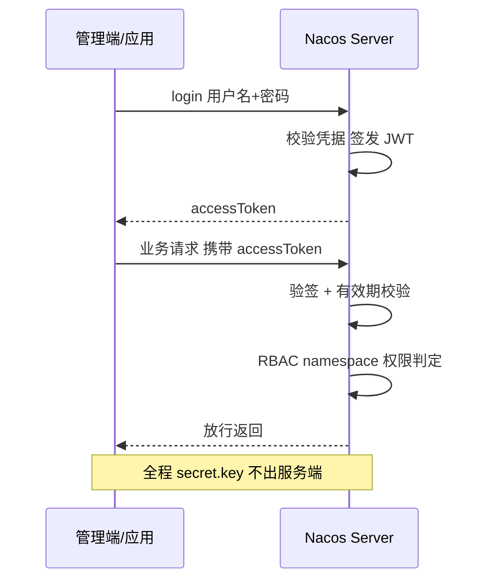
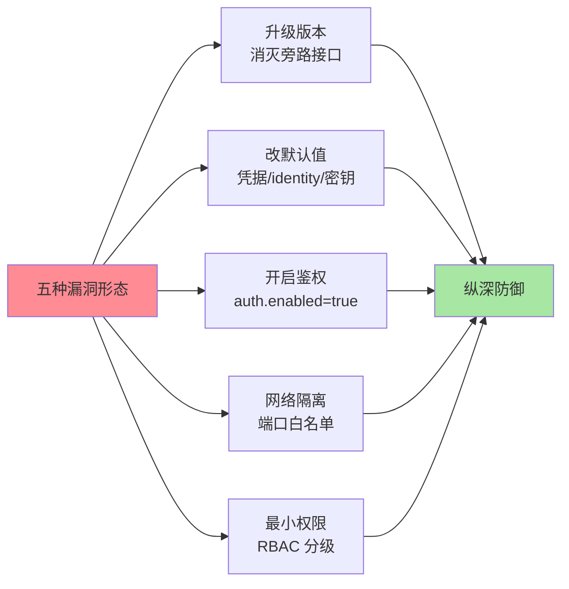

# 鉴权与安全基线：identity、Token 与默认密钥的代价

> Nacos 的安全历史几乎是一部「默认值的历史」：默认不鉴权、默认账号密码、默认内部标识、默认签名密钥——每一个公开的默认值都是一种漏洞形态的种子。这篇把鉴权体系的三层结构拆开，讲透 openAPI 鉴权绕过的经典形态与修复，最后收敛成一张生产安全基线清单。

## 一句话摘要

Nacos 鉴权体系分三层：**身份层**（用户名/密码，控制台与 openAPI 登录换取 accessToken）、**密钥层**（JWT 签名密钥 `token.secret.key`，服务端签发与校验 Token 的根）、**内部互信层**（`server.identity.key/value`，集群节点间请求的内部标识）。三层各自有一个经典漏洞形态与之对应：**默认凭据**（nacos/nacos）、**默认/弱签名密钥**（可自签 Token）、**默认内部标识**（可伪造节点请求绕过鉴权，对应公开 CVE 描述的认证绕过形态）。修复主线只有一条：**升级 + 改默认 + 开鉴权 + 网络隔离 + 最小权限**——安全基线的每一项都在堵一个「公开默认值」的洞。

## 🎯 本文核心

**核心一句话：Nacos 鉴权 = 三层结构（身份/密钥/互信）× 一条判定链（请求 → Token 校验 → identity 校验 → 放行），每层的安全上限由「默认值是否公开」决定——改默认值不是加固项，是这套鉴权成立的前提。**

机制链：客户端登录换 accessToken（JWT）→ 请求携带 Token → 服务端用 secret.key 本地验签 → 内部接口校验 identity 标识 → 鉴权通过后进入 RBAC 权限判定（namespace 级读写）→ 审计留痕。全文一句话可重构：「JWT 管外部身份，identity 管内部互信，RBAC 管权限边界，网络隔离兜住全部」。

## 前置阅读

- 入门层篇 1《Nacos 是什么与定位》：组件定位与部署形态
- 本系列篇 2《配置中心长轮询与推送演进》：配置内容是最敏感的数据面，鉴权直接约束它的发布与拉取

## 目标导向

本文是什么：鉴权三层结构与经典漏洞形态的防御。功能是什么：让「为什么默认部署等于裸奔」「为什么开了鉴权还能被绕过」「基线清单为什么是这几条」可归因。能得到什么：鉴权配置项的正确姿势、漏洞形态与修复的映射表、可落地的生产基线清单与巡检口径。什么时候用：Nacos 上生产前的安全评审、等保/合规整改、安全事件复盘，必看。

## 一、边界：入门层讲过什么，本文讲什么

| 内容 | 入门层 | 本文 |
|---|---|---|
| Nacos 定位与部署形态 | ✅ 讲过 | 不重复 |
| 鉴权三层结构与判定链 | 未讲 | **本文核心一** |
| openAPI 绕过的经典漏洞形态 | 未讲 | **本文核心二** |
| 生产安全基线与巡检 | 未讲 | **本文核心三** |

## 二、鉴权三层结构与判定链

**身份层：用户名密码与 accessToken。** 控制台与 openAPI 共用一套身份：`POST /nacos/v1/auth/users/login` 提交用户名密码，服务端返回 accessToken（JWT 形态，公开口径）；后续请求通过 `accessToken` 参数或 `Authorization` 头携带。默认账号 `nacos/nacos` 是公开默认值——身份层的第一课就是**默认凭据视为已泄露**。

**密钥层：JWT 签名密钥。** 服务端用 `nacos.core.auth.plugin.nacos.token.secret.key`（2.2.1+ 配置命名；更早版本为 `nacos.core.auth.default.token.secret.key`，公开口径）验签每个 Token——多节点共享同一密钥，任何节点都能本地验签，不需要共享会话存储。Token 默认有效期 5 小时量级（`expire.seconds` 默认 18000 秒，公开口径）。密钥层的上限就是密钥本身：默认值公开、密钥过短、密钥入库（代码仓库）任一命中，攻击者即可自签任意身份的合法 Token——鉴权在数学上失效，而不是工程上失效。

**内部互信层：server identity。** 集群节点间的同步、转发请求需要一个「我是自己人」的标识：节点在请求头携带 `nacos.core.auth.server.identity.key` 与对应 `value`，服务端比对通过即视为内部流量。这层的**设计意图是区分「集群流量」与「外部流量」，不是强身份认证**——key/value 是配置在所有节点上的共享静态值，一旦使用公开默认值（历史版本的默认组合是公开信息），任何知道该组合的网络可达方都能冒充集群节点访问内部接口，绕过用户鉴权——这正是公开 CVE 描述中「认证绕过」类漏洞的形态（公开口径，以官方安全公告为准）。

### 一次完整的鉴权时序

## 三、经典漏洞形态与修复映射

以下形态均为公开口径的防御性归纳（对应官方安全公告与公开 CVE 描述），只讲形态与修复，不复现利用路径：

| 形态 | 根因 | 表现 | 修复 |
|---|---|---|---|
| 默认凭据 | nacos/nacos 未改 | 控制台/openAPI 直接登录 | 首次部署强制改密 + 弱口令巡检 |
| 未授权访问 | `auth.enabled=false` 裸奔 | openAPI 分页枚举批量导出全部配置 | 开启鉴权 + 网络隔离双保险 |
| 内部标识伪造 | identity key/value 用公开默认值 | 外部请求冒充集群节点绕过用户鉴权 | 必改 identity 组合 + 网络层收紧 |
| 密钥可预测 | secret.key 默认/过短/入库 | 自签 Token 通过验签 | 随机长密钥 + KMS/配置管理托管 |
| 旁路接口暴露 | 旧版本运维/调试接口未收敛 | 绕过主鉴权路径访问敏感端点 | 升级到修复版本 + 端口收敛 |

五种形态的共同根因只有一个：**默认值公开**。鉴权体系本身的实现没有结构性缺陷——缺陷在「安全假设建立在默认值没人知道上」。这也是为什么修复主线是「升级 + 改默认」的组合拳：升级消灭已公告的旁路形态，改默认消灭公开知识带来的伪造能力，两者缺一，鉴权就还留着后门。

**量级演进视角**：小规模部署（测试/预发），约束来源是「别把测试习惯带上生产」——这一档的核心问题是「默认值改了没有」，而不是「权限模型细不细」；思考方式是「清单驱动」，基线五项逐项核对即可；万级 client 的生产集群，约束来源是「凭据与 Token 的管理面」——这一档的核心问题是「密钥怎么托管轮换」，而不是「开没开鉴权」；思考方式是「流程驱动」，密钥入 KMS、凭据定期轮换、审计日志进安全系统；多集群/多环境规模，约束来源是「安全策略的一致性与变更面」——这一档的核心问题是「基线怎么在全集群强制」，而不是「单集群配多少」；思考方式是「架构驱动」，部署模板化（安全项进基线模板不可覆盖）+ 周期性合规扫描。思考方式总结：小规模靠清单，中规模靠流程，大规模靠架构模板——约束来源从「默认值」逐级迁移到「管理面与一致性」，思考方式跟着换代。

## 四、源码与关键路径

以 Nacos 2.x 主线为口径（core/auth 相关模块）：

- 鉴权开关与过滤器：`nacos.core.auth.enabled` 控制 `AuthFilter` 的挂载——关闭时外部请求直达业务 Controller（这就是「未授权访问」形态的机制根源）
- 登录与签发：`/nacos/v1/auth/users/login` → 用户凭据校验 → JWT 生成（密钥来自 `token.secret.key` 配置，算法与 TTL 为公开口径）
- 验签路径：`JwtTokenManager`（Token 解析与校验）→ 通过后进入 `PermissionBaselineChecks`/权限插件判定 namespace 级读写
- 内部互信：`serverIdentity` 相关解析器读取请求头的 identity key/value 比对——命中即按内部流量放行（这就是「标识伪造」形态的机制根源）
- RBAC 数据：用户/角色/权限三张表（users/roles/permissions 口径），控制台权限管理页面的落点

阅读建议：以「一个未携带 Token 的请求」为剧本走一遍 `AuthFilter` 的判定分支，再以「一个携带 identity 头的伪造请求」走内部互信分支——五种漏洞形态都能映射到这两条判定链上被跳过的环节。

### 为什么默认鉴权是关闭的？（追问）

历史背景（公开口径）：Nacos 早期把部署假设放在「内网可信区」——注册中心与配置中心是业务内网组件，安全由网络边界负责，组件自身默认轻装。这个假设在内网物理边界年代勉强成立，在「一台失陷主机即可横扫内网」的现代威胁模型下全面失效。默认关闭的代价是 statistically 大量裸奔实例（公网测绘口径的暴露量级一直是业内警示话题），官方后来用「版本升级强制要求密钥配置」「文档反复警示」来补默认值留下的坑。**默认值是产品对世界的表态——「默认安全」与「默认易用」的拉锯里，Nacos 早期选了易用，代价由部署方偿还**。

（打破砂锅：为什么不改成默认开启？——默认开启会让所有存量升级当场断连：没有准备凭据的客户端全部 401，破坏性大于保护性。这类「安全默认值迁移」只能走「新版本强制配置 + 文档警示 + 工具提示」的渐进路线，社区在 2.2.x 之后的密钥强校验就是这条路线——默认值的修改是兼容性问题，不只是安全问题。）

### 为什么用 JWT 而不是服务端会话？（追问）

多节点无状态：任何节点持有同一 secret.key 即可本地验签，不需要共享会话存储或粘性路由——这跟 Nacos 自身「多节点对等、任意节点可服务」的架构设计是同构的。代价也清晰：**JWT 难以主动吊销**——Token 在有效期内无法单点作废，改密码不会让已签发的 Token 失效（需要换 secret.key 全集群重启生效，公开口径）。所以凭据轮换的工程含义是「密钥轮换 + 滚动重启」，周期要按这个成本设计——业内惯例按季度到半年的量级规划（业内认知），高危事件即时轮换。

（再深一层：为什么吊销难还要用 JWT？——吊销难的本质是「无状态」的代价，而无状态正是这里需要的设计目标；需要强吊销语义的场景（金融级）会在 JWT 之外叠一层网关侧黑名单或缩短 TTL，用可用性换吊销实时性——取舍仍在「无状态 vs 可控」这条线上，没有两全。）

## 典型场景

- **新集群上线**：安全基线五项（改默认/开鉴权/密钥托管/网络隔离/RBAC 分级）作为上线 checklist 前置——基线是上线条件，不是上线后的优化项
- **存量集群整改**：先网络隔离止血（最小代价堵住外部可达），再补鉴权与凭据轮换，最后 RBAC 细化——整改顺序按「止血 → 堵漏 → 治理」排
- **合规审计**：等保/内控对中间件的账号、审计、加密要求，映射到 Nacos 就是基线清单的展开——审计留痕、密钥托管、权限分级逐项举证

### 事故叙事一：未开鉴权的配置被同网段批量拉走

某团队一台测试用途的 Nacos 未开鉴权接入生产网段（为了「调试方便」），后续某天安全部门通报：同网段一台失陷主机通过 openAPI 分页枚举拉走了全部配置，含多个中间件的连接凭据。排查与处置链：确认访问日志与拉取范围 → 评估泄露面（所有配置项里的凭据全部视为已泄露）→ 轮换全部相关凭据 → 该实例下线重建（基线五项齐备后重新接入）。复盘的教训有两层：**裸奔组件的暴露面评估要以「全部数据已泄露」为默认假设**（拉走了什么无法精确追溯）；**测试实例接入生产网段那一刻，就要按生产基线管理**——「临时」是安全治理里最贵的词。

### 事故叙事二：开了鉴权仍被内部演练绕过

某团队开了鉴权、改了账号密码，自认为基线达标；内部红蓝对抗演练中蓝队一分钟内完成绕过——identity key/value 沿用了公开默认组合，伪造内部头直达内部接口。排查确认：鉴权开启只保护了用户路径，内部互信层仍是公开默认值。复盘动作：把「三项必改清单」（默认凭据、identity 组合、secret.key）做成部署模板的硬性校验（值等于公开默认即拒绝启动流程），安全巡检加「用公开默认组合探测」的主动用例。**「开了鉴权」不等于「鉴权成立」——判定链上每一层的默认值都要过一遍，缺一层就是绕过的入口**。

## 业内惯例

- **三项必改**：默认账号密码、identity key/value 组合、JWT secret.key——任何环境（含测试）不例外，做成部署模板硬校验而不是文档提醒
- **密钥托管与轮换**：secret.key 入 KMS/密钥管理系统，不入代码仓库与明文配置；按季度到半年周期轮换（业内认知），高危事件即时轮换并滚动重启
- **网络隔离先行**：8848/9848/9849 端口只对应用网段开放（安全组/NetworkPolicy 白名单），控制台不暴露公网、经堡垒机访问——网络层是全部应用层机制的兜底
- **最小权限分级**：namespace 按业务域拆分，应用账号只授予所属 namespace 读写，监控/巡检类账号只读——「一个账号走天下」的集群没有权限模型可言
- **版本跟进机制**：安全公告订阅 + 季度版本评估——公开 CVE 的修复只存在于新版本里，跑在旧版本上的任何加固都是沙上建塔

## 💡 实战提示

- 💡 基线五项按序执行：升级 → 改默认三项 → 开鉴权 → 网络隔离 → RBAC 分级——顺序错了会返工（先开鉴权没改默认值，等于给绕过加了道仪式）
- 💡 安全评估用「已泄露假设」：公开默认值、入过仓库的密钥、出过事件的凭据，一律按已泄露处理直接轮换——评估泄露面的成本远高于轮换
- 💡 鉴权链路做主动巡检：用公开默认组合与无 Token 请求做探测用例，命中即告警——「配没配对」要靠持续验证，不靠部署时的一次性检查
- 💡 敏感配置与密钥分离：数据库密码等敏感项用配置加密插件或应用侧解密，密钥走 KMS——配置中心管配置，不替你保管密钥本身

### 不同量级的思考：架构约束驱动解法

- **十万级（单集群生产）**：约束来源是默认值与裸奔风险——这一档的核心问题是「基线五项齐了没有」，而不是「权限粒度细不细」；思考方式是「清单驱动」，三项必改 + 开鉴权 + 端口白名单，模板化部署一次到位
- **百万级（client 数量与变更频率上升）**：约束来源是凭据生命周期与审计量——这一档的核心问题是「密钥与凭据怎么托管轮换」，而不是「要不要开鉴权」；思考方式是「流程驱动」，KMS 托管、季度轮换、审计日志进安全系统的流水线缺一不可
- **千万级（多集群多环境）**：约束来源是策略一致性与变更面——这一档的核心问题是「基线怎么全集群强制」，而不是「单集群怎么配」；思考方式是「工程驱动」，部署模板不可覆盖的安全项 + 周期合规扫描 + 漂移检测
- **更大规模（跨组织共享）**：约束来源是信任边界——这一档的核心问题是「共享组件的信任模型怎么定」，而不是「技术参数」；思考方式是「架构驱动」，按组织域拆独立集群 + 上层统一身份与审计，共享不等于混用

思考方式总结：十万级靠清单，百万级靠流程，千万级靠工程模板，更大规模靠信任模型——约束来源从「公开默认值」逐级迁移到「管理面、一致性、信任边界」。**自下而上与触发升级**：先用三个事实定档——是否还有公开默认值在用、密钥是否已托管、多集群间基线是否一致；触发升级的信号是「出现第一种绕过形态」「凭据轮换无法在小时内完成」「集群间基线漂移被扫描发现」，任一信号出现即升档——安全治理的滞后性用信号前置对冲，别等事件发生再升级思考。

### 反方案：为什么不选「只在控制台前加一道网关认证」？

在控制台域名前挂网关 BasicAuth/SSO，看起来最小改动，实际是伪防护：openAPI 与 gRPC 端口（8848/9848/9849）是应用直连的，网关层认证根本不在路径上——应用网段内任何一台主机仍可直达服务端所有接口。**认证必须落在服务端自身**（auth.enabled + 鉴权链路生效），网关层可以加（纵深防御的正确一层），但不能替代——把「控制台进不去」当成「集群安全」，是安全评估里最常见的以偏概全。

为什么不选「把敏感配置全加密，鉴权从缓」？——加密只保护「内容被读走」这一种损失；未授权访问同样能**删改配置、注册恶意实例、关停注册面**——加密挡不住破坏可用性与完整性的路径。加密与鉴权解决不同维度的问题（保密性 vs 访问控制），正确的关系是叠加，不是替代。基线五项里鉴权与加密分列两条，就是这个原因。

## Trade-off：安全强度的取舍账

| 取舍 | 得到 | 代价 | 口径 |
|---|---|---|---|
| 默认关闭鉴权 | 部署零门槛 | 裸奔暴露面 | 历史遗留，生产必须推翻 |
| JWT 无状态 | 多节点免共享会话 | 吊销难，轮换要滚动重启 | 密钥轮换按季度规划 |
| identity 静态互信 | 集群内部零开销 | 防内网攻击者能力弱 | 靠网络隔离兜底 |
| 强网络隔离 | 应用层失误的最后防线 | 接入与运维灵活性下降 | 生产环境默认值 |
| 细粒度 RBAC | 权限边界清晰 | 管理成本随账号数上涨 | 按业务域分级，不做全员细粒度 |

取舍的公共逻辑：**Nacos 鉴权的设计目标是「内网多节点对等架构下的访问控制」，不是「对抗内网攻击者的强边界」——后者的正确位置在网络隔离与主机安全，应用层机制补位而不越位**。理解每个机制的适用边界，才知道基线清单里每一项在防什么、防不到什么。

## 六、常见误区

- **「开了鉴权就安全了」**：判定链有三层（Token/identity/RBAC），任何一层的公开默认值未改都是绕过入口——安全评估按判定链逐层过，不按「开关是否打开」过
- **「内网部署不需要鉴权」**：内网威胁模型早已不是可信区——单台失陷主机横扫内网是当代攻防的常规路径，网络隔离是纵深的一层，不是免除应用层鉴权的理由
- **「密钥写在配置文件里就等于托管了」**：入仓库、入镜像、入部署包都是泄露路径——托管的唯一标准是「有独立的权限控制与轮换能力」（KMS 口径）
- **「安全是上线前一次性动作」**：默认值会随版本回归、凭据会随人员流动扩散、基线会随集群扩张漂移——安全是巡检与轮换的持续过程，不是一次 checklist

## 七、与相邻机制的关系

- 本系列篇 2《配置中心长轮询与推送演进》：配置内容是鉴权要保护的最敏感数据面，发布/拉取链路的权限判定在篇 2 的机制上叠加
- 本系列篇 1/篇 3：注册面同样是鉴权对象——恶意注册实例、批量摘除都是「可用性攻击」形态，注册与摘除机制见前两篇
- 本仓库 devops/安全类系列：网络隔离、KMS、审计流水线的通用工程实践在对应域展开，本篇只讲 Nacos 侧的落点

## 你们可能会问

**Q1：改密码后，已登录的 Token 还有效吗？**
有效至过期（公开口径的 JWT 语义）——Token 验签只依赖 secret.key 与有效期，与账号状态无关。需要立即失效的场景走「轮换 secret.key + 滚动重启」，代价大，所以高危事件的处置预案里要预先写清轮换步骤。

**Q2：2.x 的 gRPC 长连接也走这套鉴权吗？**
是——连接建立时的请求同样经过鉴权链路（Token 随连接请求携带），且 gRPC 端口（9848）的网络隔离与 8848 同等对待。把 9848 当「内部端口」不加控制，是 2.x 部署的高频失误。

**Q3：多套环境（测试/预发/生产）凭据怎么管？**
彻底分离——独立集群、独立凭据、独立密钥，测试凭据绝不复用到生产；环境间的数据同步（若有）走只读账号 + 白名单。凭据的隔离等级应与环境的爆炸半径成正比。

**Q4：怎么快速评估存量集群的暴露面？**
四步：看版本（是否含已公告漏洞的修复）、探默认值（三项公开默认组合是否在用）、查网络（端口对谁可达）、审日志（有无无 Token 的访问记录与异常批量读取）——四步一小时量级可完成，建议做成巡检脚本周期跑。

## 八、自测三问

1. 鉴权三层结构各管什么？每层对应的漏洞形态是什么？
2. 为什么「开了鉴权」不等于「鉴权成立」？判定链上有哪些被跳过的入口？
3. JWT 的吊销难题对凭据轮换的工程节奏意味着什么？

## 开放问题

- 动态凭据与短时 Token（对接统一身份系统的插件化）在社区的成熟度仍不足，密钥轮换的滚动成本有望随插件生态下降。
- 配置加密与 KMS 生态的标准化（算法插件、密钥分级）尚在演进，敏感配置的工程范式未收敛，值得跟踪。

## 🎯 核心带走

- **核心一句话**：Nacos 鉴权三层（身份/密钥/互信）的安全上限由默认值是否公开决定——五种经典漏洞形态共用一个根因，修复主线是「升级 + 改默认 + 开鉴权 + 隔离 + 最小权限」五项基线
- **机制链**：登录换 JWT → 服务端验签 → identity 判内部流量 → RBAC 判 namespace 权限 → 审计留痕；网络隔离兜住全部层
- **哪里会坏**：三项公开默认值（凭据/identity/密钥）任一未改、auth.enabled 未开、gRPC 端口漏隔离、密钥入仓库、「临时」实例不按基线管理
- **边界**：本篇管 Nacos 侧的鉴权与基线；网络与主机安全的通用实践在 devops 域，配置加密插件生态见官方文档演进

## 相关阅读

- 上一篇：[3_心跳健康检查与摘除-特性](./3_心跳健康检查与摘除-特性.md)
- 系列起点：[1_注册发现与Distro协议-特性](./1_注册发现与Distro协议-特性.md)
- 入门对照：[1_Nacos是什么与定位-入门](../../入门层/从零开始认识Nacos系列/1_Nacos是什么与定位-入门.md)

## 📌 数据与事实声明

- 写于 2026-09-18，机制与配置项命名以 Nacos 2.x 官方文档为准；漏洞形态为公开 CVE 描述与官方安全公告的防御性归纳（公开口径），以官方公告为准
- Token 默认有效期、默认账号等默认值为公开默认信息；轮换周期建议为业内认知口径
- 免责：本文仅覆盖防御视角的形态与修复，具体配置项与版本特性以 nacos.io 官方文档为准

## 📚 参考资料

| 类型 | 标题 | 来源 |
|---|---|---|
| 官方文档 | Nacos 鉴权与认证 / 安全手册 | nacos.io/docs |
| 官方公告 | Nacos 安全公告与版本修复说明 | github.com/alibaba/nacos（security 相关） |
| 公开漏洞库 | Nacos 相关 CVE 描述（认证绕过/未授权访问形态） | 公开 CVE 库 |
| 关联系列 | 本仓库 devops 安全实践系列 | docs/devops/ |
