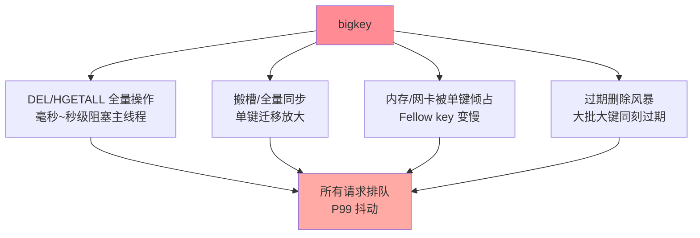

# bigkey 治理与异步删除：大对象的识别与拆除

> bigkey 是 Redis 里最「温吞」的隐患：平时相安无事， DEL 它一下、搬槽搬一下、过期删一下，整实例跟着抖。这篇讲透 bigkey 的危害机制、三类识别手段、删除的异步化（UNLINK 与 lazy free）与治理的完整流程。

## 一句话摘要

bigkey 的危害全部来自**单线程模型下的长耗时操作**：DEL 一个百万元素的集合是毫秒到秒级阻塞（阻塞期间所有请求排队）、搬槽/全量同步被大键放大、内存与网络被单个 key 倾占。治理闭环：**识别**（`--bigkeys` 扫描 / `MEMORY USAGE` 定点 / RDB 离线分析）→ **评估**（元素数与值长的阈值分级）→ **拆除**（拆分多 key / 压缩 / 冷热分离）→ **删除异步化**（`UNLINK` + lazyfree 线程，把阻塞变成后台回收）。**预防优于治理**——写入侧的 key 设计规范是根治点。

## 🎯 本文核心

**核心一句话：bigkey 的四条危害链（全量操作阻塞/迁移放大/资源倾占/过期风暴）同源于单线程串行执行——治理闭环「识别三板斧 → 阈值分级 → 拆缩冷三招 → UNLINK/lazyfree 异步化」，删除只是其中一族解，写入端规范才是根治。**

机制链：单线程阻塞的传导 → 识别三板斧（在线扫描/定点核查/离线分析）→ 阈值分级触发动作 → 拆分/压缩/冷热分离 → UNLINK 异步的机制边界 → 双写迁移拆大 Hash。全文一句话可重构：「长耗时操作是万恶之源，UNLINK 只治删除一族，预防在写入端」。

## 前置阅读

- 入门层篇 11《内存管理与大 Key 治理》：识别命令与基本概念
- 特性层《深入理解底层编码系列》：编码视角的 bigkey 归因
- 特性层《深入理解高可用系列》篇 3：搬槽与 bigkey 的联动

## 目标导向

本文是什么：bigkey 的危害机制、识别体系与治理流程。功能是什么：把「实例偶发抖动」这类疑难归因到 bigkey 并给拆除路径。能得到什么：识别三板斧的适用场景、阈值分级标准、UNLINK/lazyfree 的机制与边界。为什么用：抖动排查、Cluster 扩容前置、缓存体系健康度评审，必看。

## 一、边界：既有篇目讲过什么，本文讲什么

| 内容 | 已有篇目 | 本文 |
|---|---|---|
| bigkey 概念与 `--bigkeys` | 入门篇 11 ✅ | 不重复 |
| 危害的机制拆解 | 提了一句 | **本文核心一** |
| 识别三板斧与阈值分级 | 未讲 | **本文核心二** |
| UNLINK/lazyfree 与治理流程 | 未讲 | **本文核心三** |

## 二、危害机制：一切皆因单线程



四条危害链的共同机制在架构层面同源：**Redis 的命令执行在主线程串行**（I/O 多线程不改命令执行模型，入门篇 2 的结论）——任何一个操作耗时变长，全实例的 P99 跟着变长。bigkey 就是「自带长耗时」的 key：DEL 一个亿级元素的 Set 是秒级操作，这一秒全实例停摆。

## 三、识别三板斧与阈值分级

| 手段 | 适用 | 局限 |
|---|---|---|
| `redis-cli --bigkeys`（在线扫描） | 常规巡检，按类型取 Top | 只看元素数不看字节；生产加 `-i` 限速 |
| `MEMORY USAGE key`（定点） | 怀疑对象定点核查 | 要先有候选 key |
| RDB 离线分析（rdb-tools 类） | 全量盘点、离线无压力 | 时效性差，非实时 |

阈值分级（业内常用口径，按实例规格调整）：**String 值 > 10KB、集合类元素数 > 5000/字节总量 > 1MB** 列为观察项，**String > 1MB、集合 > 5 万元素/10MB** 列为治理项——阈值的价值是「分级触发动作」，不是统一红线。

## 四、拆除路径与异步删除

**治理三板斧**（按 key 形态选，拆分粒度是空间与查询代价的 Trade-off）：**① 拆分**——大 Hash 按 field 哈希拆 N 个子 key、大 List 按时间窗切段（配合业务查询形态）；**② 压缩**——大 String 的值压缩/序列化精简（JSON 转 protobuf 类，值长砍半常见）；**③ 冷热分离**——历史元素移到冷库/异构存储，热 key 瘦身。

**删除异步化**：`UNLINK key` 替代 `DEL`——主线程只做「摘除引用」，真正的内存回收丢给 lazyfree 后台线程；配套参数 `lazyfree-lazy-expire/lazy-eviction/lazy-server-del` 把「过期删除、淘汰删除、隐式删除」全部异步化。**机制边界**：UNLINK 异步的是回收，遍历引用的瞬间仍在主线程——「亿级元素的一瞬间」依然存在但被压到微秒级；且异步回收的内存释放有延迟，内存水位观察要算上「待回收」部分。

**批量删除的纪律**：SCAN 分批 + UNLINK + 批间隔——`KEYS` 一把梭是生产事故级写法（入门篇 11 的结论在此重申）。

## 五、预防：写入侧的 key 设计规范

治理是亡羊补牢，**规范是治未病**：

```text
□ String 值上限写入评审（>100KB 的值需说明理由）
□ 集合类写入带「容量预算」（TTL 上限 / 元素数上限 / ZREMRANGEBYRK 定期裁剪）
□ 禁止把大对象 JSON 塞 String（走压缩或拆字段）
□ 定长列表用 LTRIM 收口（时间线/消息流场景）
□ bigkey 扫描进日常巡检（周级），新增大 key 告警
```

## 什么时候做哪件事：治理决策速查

- **什么时候扫描**：常态周级巡检 + 两个触发时机——内存曲线异常爬坡、集群扩容排期确定
- **什么时候直接删 vs 拆**：业务已下线的 key 直接 UNLINK；还在用的按「拆缩冷」三招改造——删是止损，拆是治本
- **什么时候必须配 lazyfree**：新集群默认全开；存量集群在「出现过大 key 删除抖动」后立即开——成本为零不必等事故
- **怎么选拆分粒度**：按查询形态反推（业务总按子维度查 → 按子维度拆；总是整取 → 压缩而不是拆）——拆分粒度与查询模式匹配才有意义

## 业内惯例

> 💡 **实战提示**
> - 什么时候启动 bigkey 专项：P99 毛刺与「慢日志无慢命令」并存（毛刺来自大 key 而非慢命令）、或集群扩容排期确定——两个场景都是专项启动信号
> - 拆分方案先答「业务怎么查」：大 Hash 按 field 哈希拆 N 份后，业务必须支持「路由到子 key」的查询改写——查不动的拆分方案是废案
> - UNLINK 与 lazyfree 作为新集群默认：成本为零的防御性配置——等出事再开，你已经经历了本可避免的那次阻塞
> - 治理优先级按「体积 × 访问频率」排序：大且高频的 key 是阻塞事故预备役，大但冷的可缓办——扫描榜单要叠上访问数据才有行动价值

- **bigkey 巡检周级化**：扫描结果进报表，新增大 key 追归属——「谁写的大 key 谁治理」，责任到人才能收敛
- **拆分方案跟着查询形态走**：大 Hash 拆分后，业务按「field 的哈希路由子 key」——拆分方案要先过「业务怎么查」这一关
- **UNLINK 全量推广 + lazyfree 默认开**：成本几乎为零的防御性配置，新集群标配
- **搬槽/迁移前 bigkey 专项清理**：进扩容 checklist 的第一项（扩缩容篇的结论在此落地）

## 六、常见误区

- **「DEL 换 UNLINK 就万事大吉」**：UNLINK 治「删除阻塞」，不治「HGETALL 全量读」「搬槽搬大键」——长耗时操作家族里它只解决一族
- **「bigkey 只看字节大小」**：元素数大的集合（十万元素的 Set）即使总量不大，单元素操作的全量命令同样是阻塞源——字节与元素数双维度看
- **「lazyfree 线程越多越快」**：回收线程默认 1 个足够覆盖绝大多数场景，盲目调大挤占 CPU——按 `lazyfree` 队列积压监控决定
- **「大 key 拆分后业务无感」**：拆分改变了 key 结构与查询方式——「无感拆分」不存在，方案要连业务改造一起评审

## 七、与相邻机制的关系

- 本目录篇 2《内存分析与淘汰调优》：内存水位与淘汰策略——bigkey 治理的另一半
- 特性层底层编码篇：编码视角的 bigkey 归因（该切没切的编码漂移）
- tips 互指：搬槽联动（高可用篇 3）、过期风暴（持久化系列）、SCAN 语义（入门篇 11）

## 你们可能会问

**Q1：UNLINK 后内存什么时候真正释放？**
lazyfree 线程异步回收——队列空时秒级完成，积压时按队列消化速度；`MEMORY USAGE` 的全局水位观察要等回收完成，瞬时水位含「待回收」是正常现象。

**Q2：怎么在不影响业务的情况下拆一个大 Hash？**
双写迁移模式：


上下游各环节按七阶段纪律对齐，纪律同源。

**Q3：`--bigkeys` 扫描对线上有影响吗？**
SCAN 渐进遍历本身友好，但全量扫描仍占带宽与 CPU——生产加 `-i` 间隔参数限速，或直接走 RDB 离线分析。

## 八、自测三问

1. bigkey 四条危害链的共同机制是什么？
2. 识别三板斧各自的适用与局限？阈值分级为什么要有？
3. UNLINK 异步的是什么、不异步的是什么？批量删除的纪律是什么？

## 开放问题

- Redis 7+ 的多部分 AOF 与 function 生态让「数据治理脚本」有了新载体，bigkey 的自动巡检-拆分-验证闭环在向平台化演进。
- 客户端 SDK 层的「写入时大值拦截」（SDK 侧阈值告警）把治理再前移一层，社区 SDK 陆续支持中。

## 🎯 核心带走

- **核心一句话**：bigkey 四条危害链同源于单线程串行——识别三板斧、阈值分级、拆缩冷三招、UNLINK/lazyfree 异步化；删除异步化只治一族，写入端规范才是根治
- **治理链**：识别 → 评估分级 → 拆除三招 → 异步删除 → 双写迁移 → 预防规范
- **哪里会坏**：DEL/搬槽/过期三处阻塞、UNLINK 万能错觉、拆分无感错觉、扫描无频次
- **边界**：本篇管「识别与拆除」；内存水位与淘汰的另一半在本目录篇 2，编码归因在特性层底层编码系列

## 📌 数据与事实声明

- 写于 2026-09-08，机制以 Redis 8.0 主线为准（UNLINK/lazyfree 参数为官方能力）
- 阈值分级（10KB/5000/1MB 等）为业内常用口径，按实例规格调整
- 免责：参数默认值以 redis.io 官方文档为准

## 📚 参考资料

| 类型 | 标题 | 来源 |
|---|---|---|
| 官方文档 | Lazy Free / SCAN / redis-cli --bigkeys | redis.io/docs |
| 实战书 | 《Redis 开发与运维》付磊/张益军（大 key 章） | 公开出版 |
| 离线工具 | rdb-tools 类开源分析工具 | 公开项目文档 |
