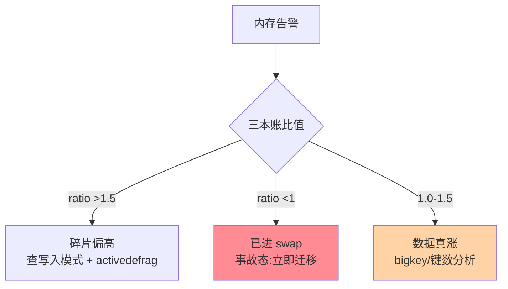
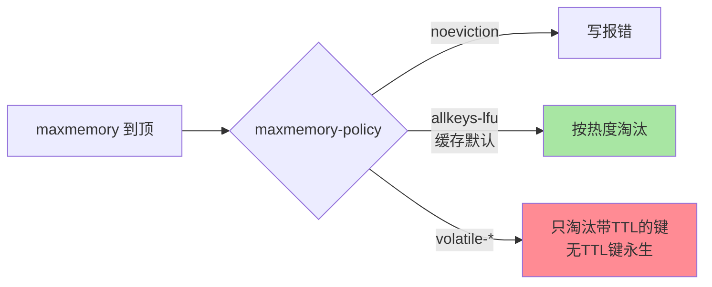

# 内存分析与淘汰调优：水位、碎片与淘汰策略

> Redis 的内存是「用过就要还的地方」：水位怎么算、碎片从哪来、maxmemory 到顶后淘汰策略怎么选——这三个问题的答案决定实例是「稳态运行」还是「周期性抽风」。这篇把内存的账本与淘汰的机制一次讲清。

## 一句话摘要

内存分析三把尺：**`INFO memory` 的 used_memory（数据账）/ RSS（操作系统账）/ 两者的差（碎片与透明大页的账）**；碎片治理靠 `activedefrag`（在线碎片整理）与分配器特性；淘汰调优的核心是 **maxmemory 到顶后的 8 种策略**——生产默认 **allkeys-lfu 或 volatile-lfu**（LFU 替代 LRU 是近年演进的共识方向），配合 `maxmemory 只设物理内存 50%-60%` 的守门线（fork 与 COW 的余量，持久化篇的结论）。

## 🎯 本文核心

**核心一句话：内存治理 = 三本账判读（used/RSS/ratio，<1 进 swap 即事故）+ 碎片按需 activedefrag（治疗不是预防）+ 淘汰策略按「TTL 覆盖率」选（volatile 系的前提是键全带 TTL，否则策略摆设）——LFU 以对数计数近似长期热度，是对抗扫描污染的主流选择。**

机制链：三本账与告警归因树 → 碎片来源与 defrag 三条件 → THP never 铁律 → LFU/LRU 的机制对比 → volatile 系的失效条件 → 输出缓冲的隐藏账。全文一句话可重构：「账本先分三类，碎片治而不防，淘汰看 TTL 覆盖率」。

## 前置阅读

- 入门层篇 10/11：过期删除与内存管理的用法层
- 特性层《深入理解持久化系列》篇 1：fork 与 COW——余量守门线的机制来源

## 目标导向

本文是什么：内存账本解读、碎片治理与淘汰策略调优。功能是什么：把「内存为什么涨」「淘汰为什么打错键」归因到机制。能得到什么：INFO memory 的字段读法、activedefrag 的使用条件、八种淘汰策略的选型表。为什么用：内存告警排查、淘汰误删复盘、容量规划评审，必看。

## 一、边界：既有篇目讲过什么，本文讲什么

| 内容 | 已有篇目 | 本文 |
|---|---|---|
| 淘汰策略的名字与过期机制 | 入门篇 10 ✅ | 不重复 |
| INFO memory 账本解读 | 未讲 | **本文核心一** |
| 碎片与 activedefrag | 提了一句 | **本文核心二** |
| LFU/LRU 的机制与选型 | 未讲 | **本文核心三** |

## 二、INFO memory：三本账一起看

```text
used_memory: 10.0G   ← Redis 分配器视角:数据+缓冲的实际用量
used_memory_rss: 12.5G ← 操作系统视角:进程驻留内存
mem_fragmentation_ratio: 1.25 ← RSS/used:碎片与开销的比值
```

告警排查的归因架构图：



读账三规则：**比值 1.0-1.5 健康**；**>1.5 碎片偏高**（频繁变长改短的写入模式是典型病因，SDS 预分配与释放的代价在实例级显形）；**<1 则危险**（RSS 低于 used = 部分内存被换出到 swap——Redis 进 swap 后延迟数量级劣化，属于事故态）。另两笔常被漏看的账：**复制缓冲与客户端缓冲**（输出缓冲无上限配置时可被慢客户端打爆，`client-output-buffer-limit` 要按场景设上限）与 **lua/查询缓冲**——内存告警先分「数据涨了」还是「缓冲漏了」两类归因。

## 三、碎片与 activedefrag：在线整理的机制与条件

碎片来源：**分配器按尺寸类分配 + 变长数据的反复改写**（SDS 追加与缩短、过期删除留下的空洞）。`activedefrag` 开启后 Redis 在后台扫描并**搬移数据腾出连续空间**，在线降低 fragmentation ratio。三个使用条件：

1. 分配器支持（jemalloc 的特性接口，libc 分配器不可用）
2. 资源余量：整理本身耗 CPU——低峰开启 + `active-defrag-cycle-min/max` 限速
3. 指标驱动：ratio 持续 >1.5 才开——**它是治疗不是预防**，常态高碎片应先查写入模式（大量变长 value 反复改写是病根）

透明大页（THP）：`never` 是铁律——THP 让 fork 的 COW 复制粒度从 4KB 变 2MB，持久化期间的内存膨胀被放大数百倍（持久化篇结论的 OS 侧注脚）。

## 四、淘汰策略：LFU 为什么赢了 LRU

maxmemory 到顶后按 `maxmemory-policy` 淘汰：

| 策略 | 范围 | 适用 |
|---|---|---|
| noeviction（默认） | 不淘汰，写报错 | 强完整数据（互斥锁 key 类不可丢） |
| allkeys-lru / volatile-lru | 全部 / 带 TTL 的键 | 经典缓存 |
| **allkeys-lfu / volatile-lfu** | 同上 | **访问频率视角的缓存——近年演进的主流选择** |
| allkeys-random / volatile-* | 随机 | 少用 |
| volatile-ttl | 快过期的先走 | 特定 TTL 语义场景 |

策略行为一眼版：



LFU 赢 LRU 的机制原因：**LRU 只看「最近是否被访问」，一次冷扫描（全量遍历类任务）就能把真热点冲出缓存**；LFU 用对数衰减的访问计数近似「长期热度」，抗偶发扫描——几字节内存换热度判断，是一笔划算的 Trade-off。Redis 的 LFU 是 Morris 计数器变体（对数计数 + 按时间衰减，`lfu-log-factor/lfu-decay-time` 调参）——内存每键仅占几位的轻量实现。

**淘汰与过期的边界要分清**：过期（TTL 到期）是「主动删除」，淘汰（内存到顶）是「被动让位」——`volatile-*` 系列只淘汰「设了 TTL 的键」，没设 TTL 的键在任何 volatile 策略下永生——**「设了 maxmemory 但大量键无 TTL」的实例，volatile 策略等于摆设**，这是淘汰调优翻车第一名。

## 五、源码与实现关键路径

- 淘汰：`evict.c` 的 `performEvictions`——按策略采样（maxmemory-samples，默认 5）选取淘汰候选，LFU/LRU 的时钟字段在 RedisObject 的 lru 位里
- LFU：`evict.c` 的 `LFUDecrAndReturn`——对数计数与衰减公式
- 碎片整理：`defrag.c`——扫描 + 搬移 + 引用更新
- 内存统计：`INFO memory` 的字段映射在 `zmalloc.c` 与 `serverCron` 的采样

阅读建议：带一条「写入触发 maxmemory」的路径走 `performEvictions`，观察采样池与策略分支——淘汰的一切行为都在这个函数里。

## 典型场景

- **纯缓存实例**：allkeys-lfu + maxmemory 60% + TTL 全覆盖——标准缓存形态
- **混合实例**（缓存 + 锁 + 队列）：volatile-lfu + 锁键不放 TTL 陷阱要防——更优解是**按用途拆实例**（锁、缓存、队列分家），淘汰互相不牵连
- **内存告警排查**：按上下游顺序——先看三本账比值定「真涨 vs 碎片 vs swap」→ 数据真涨走大 key 与键数分析（本目录篇 1）→ 碎片走高看写入模式与 defrag

## 业内惯例

> 💡 **实战提示**
> - 什么时候开 activedefrag：ratio 持续 >1.5 且实例无法安排重启迁移——开之前确认 jemalloc + 低峰限速参数；有维护窗口的场景重启更干脆
> - 什么时候从 LRU 换 LFU：业务存在「扫描类偶发流量」（离线任务遍历、运维全量操作）污染热度的迹象——双实例同流量对比一周，命中率数据说话
> - 淘汰策略选型前先查 TTL 覆盖率：`SET without TTL` 的键占比高就先治 TTL 覆盖，否则 volatile 系全部失效——顺序错了调什么策略都白调
> - 输出缓冲上限按客户端类型分设：普通客户端、复制客户端、Pub/Sub 客户端三档——慢消费者打爆实例的经典防线

- **maxmemory = 物理内存 50%-60%**：给 fork/COW/缓冲留余量的守门线（持久化篇结论），实例内用途越杂余量越要留足
- **LFU 参数用默认起步**：log-factor/decay-time 的默认值适配「小时级热度周期」——按业务热度周期实测调整，不拍脑袋
- **输出缓冲上限必配**：`client-output-buffer-limit` 按普通客户端与复制/订阅客户端分开设——慢客户端拖垮实例的经典防线
- **淘汰量进监控大盘**：`evicted_keys` 持续增长 = 容量不足或 TTL 设计失效——它是淘汰调优的哨兵指标

## 六、常见误区

- **「maxmemory 设到物理内存 90% 更充分」**：常态利用率高了，持久化 fork 一来 COW 膨胀直接 OOM——余量是给关键时刻的，不是浪费
- **「volatile-lru 最安全因为只动有 TTL 的」**：没 TTL 的键永生 = 淘汰机制失效——策略选择的前提是「TTL 覆盖率」，覆盖率不足先治 TTL
- **「碎片率高重启一下就好」**：重启清碎片但杀业务——activedefrag 在线治；且碎片是写入模式的投影，模式不改碎片会回来
- **「LFU 计数大的键就是热点」**：对数计数的语义是「相对热度」——按 OBJECT FREQ 排序看分布比看绝对值有意义

## 七、与相邻机制的关系

- 本目录篇 1：bigkey 治理——内存上涨的数据侧归因
- 特性层持久化系列：fork 余量与 maxmemory 守门线的机制来源
- tips 互指：过期删除的细节（入门篇 10）、写入模式与编码漂移（底层编码篇）、Cluster 分片的容量摊薄（高可用系列）

## 你们可能会问

**Q1：`evicted_keys` 在涨但业务没感知，要处理吗？**
要——淘汰在「静默丢数据」，今天的被淘汰键是明天的缓存 miss（击穿风险）甚至业务错误（以为在缓存里的数据没了）。涨势 = 容量或 TTL 设计失败的先行指标。

**Q2：怎么量化「该换 LFU 了」？**
对比实验：LFU/LRU 双实例同流量跑一周，比 `keyspace_hits` 与热 key 的留存率——LFU 的收益在「扫描类偶发流量」占比高的场景最明显，纯稳态热点场景两者差异小。

**Q3：swap 发生了怎么救？**
先止血（把实例迁到内存充裕的机器/重启加载），再治因（容量规划与余量纪律）——swap 状态下的 Redis 已不可服务，任何在线调优都是浪费时间。

## 八、自测三问

1. INFO memory 三本账各记什么？比值的三段判读是什么？
2. LFU 赢 LRU 的机制原因是什么？它用几个字节实现？
3. volatile 策略的失效条件是什么？淘汰与过期的边界怎么分？

## 开放问题

- 内存池（jemalloc）版本演进与 Redis 的协同持续深化，分配器特性（大小类、透明页）对实例内存行为的影响值得版本级跟踪。
- 云形态的「内存分级」（热内存 + 冷存储引擎）产品化后，maxmemory/淘汰的语义边界在被平台重新定义。

## 🎯 核心带走

- **核心一句话**：三本账判读（ratio >1.5 碎片 / <1 swap 事故）+ 碎片 activedefrag 治而不防 + 淘汰按 TTL 覆盖率选 LFU——LFU 的对数计数是对抗扫描污染的主流答案
- **机制链**：三本账 → 归因树 → defrag 三条件 → LFU/LRU 对比 → volatile 失效条件 → 隐藏的缓冲账
- **哪里会坏**：maxmemory 贴顶 OOM、volatile 遇无 TTL 键失效、THP 放大 COW、输出缓冲被慢客户端打爆
- **边界**：本篇管「内存与淘汰」；bigkey 的识别拆除在本目录篇 1，fork 余量的机制在特性层持久化篇 1

## 📌 数据与事实声明

- 写于 2026-09-08，机制以 Redis 8.0 主线源码为准；LFU 自 4.0 引入、activedefrag 依赖 jemalloc 为官方口径
- 「50%-60% 守门线」「ratio 1.0-1.5 健康」为业内经验口径
- 免责：参数默认值以 redis.io 官方文档为准

## 📚 参考资料

| 类型 | 标题 | 来源 |
|---|---|---|
| 官方文档 | Memory Optimization / LRU-LFU / INFO | redis.io/docs |
| 官方源码 | redis/redis（src/evict.c、defrag.c） | github.com/redis/redis |
| 实战书 | 《Redis 开发与运维》付磊/张益军（内存章） | 公开出版 |
