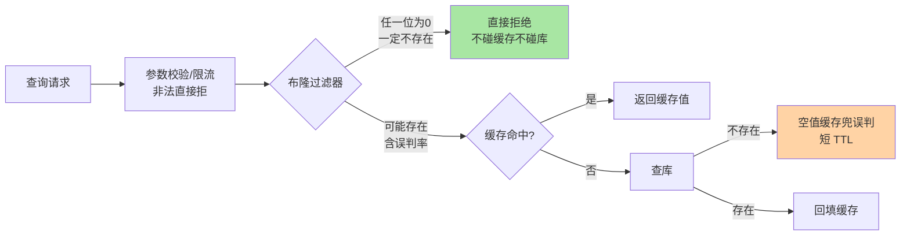
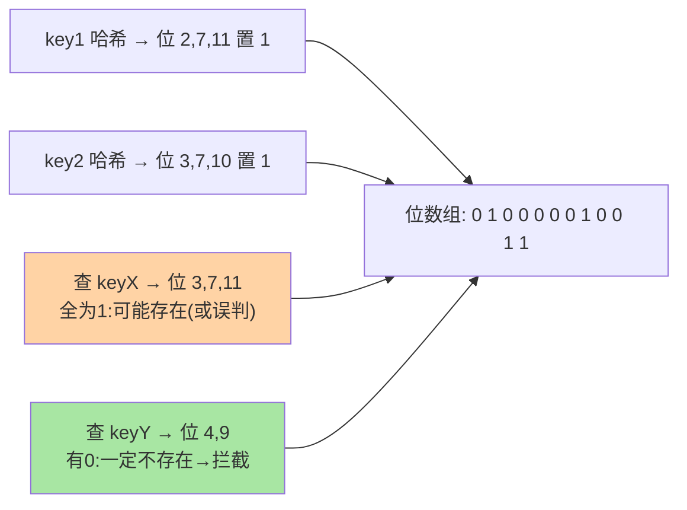

# 缓存穿透与布隆过滤器：拦住「根本不存在的请求」

> 缓存防的是「已缓存数据的访问压力」，但有一类请求**永远不命中**：查询根本不存在的数据。每次都打穿到数据库——穿透的可怕在于它天然适合被恶意放大。这篇讲透穿透与击穿/雪崩的本质区别、空值缓存与布隆过滤器两代解法、以及布隆的误判率工程账。

## 一句话摘要

缓存穿透 = 请求的数据**在缓存和数据库里都不存在**，缓存永远无法拦截。两代解法：**空值缓存**（不存在的 key 也缓存短 TTL 的空标记，实现最简、能被随机 key 绕过）与**布隆过滤器**（把全量合法 key 装进位数组，不存在的请求在缓存前就被拦截，误判率与内存可量化权衡）。**组合姿势是业内默认**：布隆挡主力 + 空值缓存兜误判 + 参数校验与限流兜恶意。

## 🎯 本文核心

**核心一句话：穿透与其他两兄弟的本质区别是「持态 vs 暂态」——数据不存在则缓存永远不可能命中，天然适合被恶意放大；解法是纵深五层（参数校验→限流→布隆→空值缓存→库侧保护），布隆的「任一位为 0 = 一定不存在」的确定语义让它成为主力拦截层，误判漏网由空值缓存兜底。**

机制链：穿透的特殊性（持态攻击面）→ 空值缓存的能与不能 → 布隆的确定语义 → 误判率公式与内存账 → 五层纵深组合。全文一句话可重构：「布隆管确定不存在，空值兜误判，纵深才有韧性」。

## 前置阅读

- 入门层篇 18《缓存三大问题》：三兄弟的现象层
- 本目录篇 2/3：击穿与雪崩——三兄弟的另外两兄弟

## 目标导向

本文是什么：穿透的机制分析与两代解法的工程化。功能是什么：把「不存在的请求打穿数据库」从现象讲到拦截方案与误判账本。能得到什么：布隆误判率的计算与调参、空值缓存的设计细节、多层防御的组合姿势。为什么用：缓存防护体系设计、恶意流量治理、大促前防护评审，必看。

## 一、边界：入门层讲过什么，本文讲什么

| 内容 | 入门层 | 本文 |
|---|---|---|
| 穿透/击穿/雪崩的现象区分 | ✅ 讲过 | 不重复 |
| 空值缓存与布隆的机制细节 | 提了一句 | **本文核心一** |
| 误判率的工程账与调参 | 未讲 | **本文核心二** |
| 多层防御的组合 | 未讲 | **本文核心三** |

## 二、穿透的特殊性：为什么它最危险

击穿是「热 key 失效的一瞬间」，雪崩是「大面积同时失效」——两者的前提都是**数据存在**，故障是暂态的。穿透不同：**数据根本不存在**，缓存永远不可能命中，每一次请求都是全量回源——攻击者用随机 ID 打接口，QPS 1 万就是 1 万次数据库全表查。**暂态 vs 持态**，是穿透与其他两兄弟的本质区别，也是它「值得单独建防线」的理由。

## 三、两代解法：空值缓存与布隆过滤器

**空值缓存**：查库确认不存在后，往缓存写一个短 TTL 的空标记（如 `key → "" , TTL 60s`）。同一 key 的后续请求被空标记拦截。优点：实现五分钟；局限：**随机 key 攻击绕过**——攻击者每次换 key，空标记永远追不上，只对「重复查询同一不存在 key」有效（典型：恶意爬虫探测已删除数据）。

**布隆过滤器**：把全量合法 key 经 k 个哈希函数映射进 m 位的位数组。查询时同哈希计算：**任一位为 0 → key 一定不存在**（拦截）；全为 1 → 可能存在（放行，去缓存/库走正常链路）。



误判的机制一目了然：



## 四、布隆的工程账：误判率与内存的定量权衡

误判的机制根源：**不同 key 的哈希位可能重叠**——不存在的 key 的 k 个位恰好都被别的 key 置 1。三个变量的关系（标准布隆公式口径）：

```text
误判率 p ≈ (1 - e^(-k·n/m))^k
n = 已装元素数, m = 位数组长度, k = 哈希函数个数
最优 k ≈ (m/n)·ln2  →  每 key 占 m/n ≈ 1.44·log2(1/p) 位

经验换算:误判率 1%  ≈ 每 key 约 9.6 位(不到 2 字节)
        误判率 0.1% ≈ 每 key 约 14.4 位(不到 2 字节)
```

**一亿个合法 key、误判率 1%，约 120MB**——用极小的内存换「确定不存在的请求全拦截」，这笔账在绝大多数场景极度划算。两个工程代价：**① 标准布隆不支持删除**（位共享，删一个 key 会影响别的 key）——需要删除用计数布隆/布谷鸟过滤器变体；**② 全量 key 要预装载**——数据动态增长时过滤器要重建或扩容（Redis 侧直接用 RedisBloom 模块的 `BF.ADD/BF.EXISTS`，支持自动扩缩的伸缩式布隆）。

## 五、多层防御：组合才是生产形态

单一方案都有绕过路径，生产的穿透防线是纵深组合（见第三节图）：**入口参数校验**（格式非法的 ID 直接拒，成本最低的拦截层）→ **限流熔断**（超出容量的请求无差别降级，tips 互指 Sentinel 系列）→ **布隆过滤器**（合法形态但不存在的主力拦截）→ **空值缓存**（布隆误判漏网的兜底）→ **数据库自身的并发保护**（连接池上限作为最后闸门）。每层各拦一段，攻击面被逐层收窄——**单层方案的「被绕过」不等于失败，纵深才有韧性**。

## 业内惯例

> 💡 **实战提示**
> - 什么时候必须上布隆：合法 key 规模大（百万级以上）且攻击面存在（toC 接口、开放 API）——小规模内部服务空值缓存就够，别为不存在的攻击面付费
> - 布隆与 DB 的同步策略怎么选：数据删除频繁选「定时全量重建 + 双过滤器灰切」，基本只增选「增量 BF.ADD + 容量告警」——按删除频率定主从策略
> - 误判率目标按「库的富余容量」定：1% 漏网 QPS < 数据库富余承载即合格——过度压低误判率的内存代价陡增，数字够用就好
> - 五层防线逐层压测：每层单独验证拦截效果 + 整链路穿透演练——没有演练过的防线等于没有

- **布隆装载率监控**：n/m 超过设计值后误判率快速劣化——过滤器容量告警与重建/伸缩机制是标配
- **数据删除少的场景才用标准布隆**：频繁删除的数据集选布谷鸟过滤器或定期全量重建——选型先看数据的删除频率
- **空值缓存的 TTL 短且随机化**：60 秒上下加抖动，避免「同一瞬间大量空标记同时过期」制造小型雪崩
- **穿透防护纳入全链路压测**：大促前用随机 key 打一遍验证各层生效——「防线上没有演练过等于没有」

## 六、常见误区

- **「上了布隆就不会穿透」**：布隆有误判率——漏过的请求靠空值缓存与库侧保护兜住；「多层」不是冗余是必需
- **「误判率调到 0.0001% 才安全」**：每 key 位数随误判率对数增长，过度压低误判的内存代价陡增——按「误判漏网的 QPS 是否超过库的富余容量」定目标，不追极端数字
- **「空值缓存可以替代布隆」**：随机 key 攻击下空标记的写放大本身成为攻击面——两者是互补层级不是替代关系
- **「把布隆当缓存用」**：布隆只回答「一定不存在/可能存在」，**不存在「查值」能力**——它是指令牌不是存储，架构位置在缓存之前

## 七、与相邻机制的关系

- 本目录篇 2/3：击穿与雪崩——三兄弟各自的解法体系
- tips 互指：限流层（Sentinel 热点参数与集群流控）、大 Key 治理（本目录 bigkey 专题）、布隆的 Redis 模块实现（RedisBloom 文档）
- 数据库侧：唯一索引等约束挡「恶意创建不存在语义」的写攻击，与本篇读侧防线互补

## 你们可能会问

**Q1：布隆过滤器的 key 集合怎么维护与 DB 保持一致？**
全量重建（定时/触发式）为主——重建期间双过滤器灰切；增量维护（插入时同步 BF.ADD）实时性好但删除语义缺失——业内按「删除频率」定主从策略。

**Q2：Redis 里的布隆用什么实现？**
RedisBloom 模块（`BF.RESERVE/ADD/EXISTS`）是主流选择——支持伸缩（error_rate 与 capacity 声明后自动扩容）；自研位数组方案适合极简场景但误判率管理要自己做。

**Q3：穿透与击穿同时发生怎么办？**
真实攻击场景常是多症状并发——防线的分层设计天然兼容：布隆挡穿透、互斥/逻辑过期挡击穿、限流兜总量（篇 2/3 的机制在同一张防御图里各就各位）。

## 八、自测三问

1. 穿透与击穿/雪崩的本质区别是什么？为什么穿透更危险？
2. 布隆误判率的三个变量关系是什么？1% 误判率的内存成本量级？
3. 复述纵深防御的五层，每层各拦什么？

## 开放问题

- 可逆布隆（Cuckoo/Xor Filter 族）在删除支持与空间效率上持续演进，「按数据集特征选过滤器」的选型表在快速迭代。
- 服务网格/网关层前置缓存防护（WAF 与 API 网关的穿透规则）让防线更靠前，应用层布隆的职责边界在向上游转移。

## 🎯 核心带走

- **核心一句话**：穿透 = 「不存在数据的持态攻击」，纵深五层防御——布隆的确定语义当主力、空值缓存兜误判、参数校验与限流清外围；1% 误判 ≈ 每 key 不到 2 字节
- **机制链**：持态 vs 暂态 → 两代解法 → 误判公式 → 五层纵深
- **哪里会坏**：单层防御被绕过、装载率超限误判劣化、空值缓存无上限反噬、把布隆当存储用
- **边界**：本篇管穿透；击穿与雪崩在本目录篇 2/3，布隆结构原理在入门层篇 7

## 📌 数据与事实声明

- 写于 2026-09-08，布隆公式与 9.6 位/1% 为标准算法口径；RedisBloom 为开源模块（官方文档口径）
- 「120MB/一亿 key」为按公式计算的示例值
- 免责：模块参数以官方文档为准

## 📚 参考资料

| 类型 | 标题 | 来源 |
|---|---|---|
| 开源模块 | RedisBloom（BF.* 命令） | github.com/RedisBloom/RedisBloom |
| 实战书 | 《Redis 深度历险》钱文品（布隆过滤器章） | 公开出版 |
| 实战书 | 《Redis 核心技术与实战》蒋德钧（缓存问题章） | 公开出版 |
