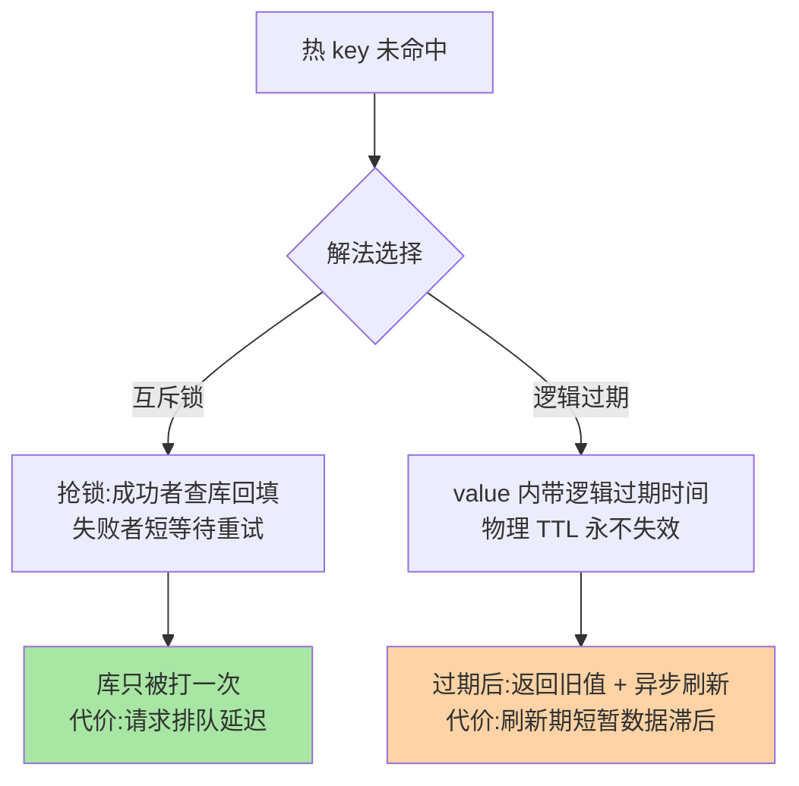
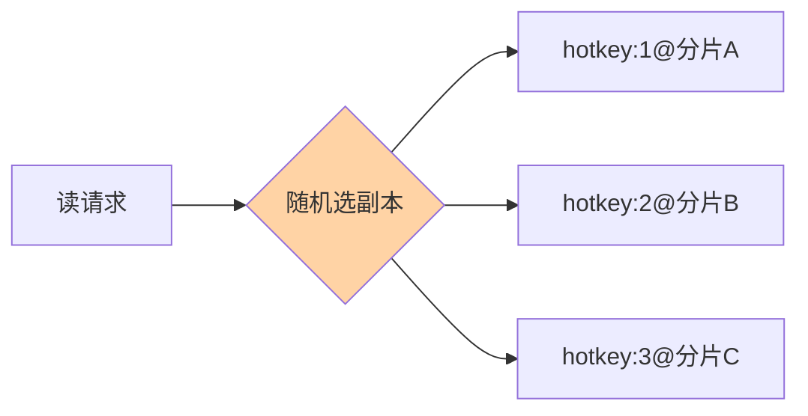

# 击穿、互斥回填与热点 Key：热数据的防线

> 一个热 key 失效的瞬间，成千上万请求同时砸向数据库——击穿的杀伤力来自「集中在一点」。这篇讲透互斥锁与逻辑过期两代解法的取舍、热点 key 的发现与治理、以及「删缓存引发的回填风暴」这条隐蔽链路。

## 一句话摘要

缓存击穿 = **单个（少数）热 key 过期的瞬间**，大量并发同时未命中、同时回源。两代解法：**互斥锁**（单飞回填——拿锁的一人查库回填，其余等待/重试，保证库只被打一次，代价是等待延迟）与**逻辑过期**（物理 TTL 永不失效，值内带逻辑过期时间，过期后异步刷新、期间返回旧值，代价是短暂旧读）。**热点 key 的治理先于击穿**：发现（监控客户端命令统计）、隔离（独立分片/本地缓存）、打散（副本 key 带后缀分摊）三步走。

## 🎯 本文核心

**核心一句话：击穿 = 热 key 失效瞬间的并发集中回源，两代解法是「一致性 vs 体验」的取舍——互斥锁单飞回填保库只被打一次（代价排队），逻辑过期免等待返回旧值（代价短暂滞后）；热点治理三步（发现/隔离/打散）先于击穿发生，删缓存动作会人为制造击穿，一致性方案与击穿防护必须联合设计。**

机制链：两代解法的取舍表 → 热点发现三类手段 → 隔离与副本打散 → 删缓存联动预热 → 与穿透/雪崩的防线互补。全文一句话可重构：「一致性选互斥、体验选逻辑过期，热点治理在击穿之前」。

## 前置阅读

- 入门层篇 18《缓存三大问题》：三兄弟现象层
- 本目录篇 1：穿透——同一防御图里的邻座
- 特性层《深入理解分布式锁系列》篇 1：互斥锁实现——击穿防护的锁从哪来

## 目标导向

本文是什么：击穿的两代解法与热点 key 治理。功能是什么：给「热 key 失效打穿库」一套从发现到防护的完整动作。能得到什么：互斥 vs 逻辑过期的选型表、热点发现的三类手段、副本打散的实现细节。为什么用：大促防护、热点事件应对（爆品/热搜）、缓存防护体系评审，必看。

## 一、边界：入门层讲过什么，本文讲什么

| 内容 | 入门层 | 本文 |
|---|---|---|
| 击穿的现象与基本解法名字 | ✅ 讲过 | 不重复 |
| 互斥 vs 逻辑过期的机制与取舍 | 提了一句 | **本文核心一** |
| 热点 key 发现与治理 | 未讲 | **本文核心二** |
| 删缓存与击穿的联动 | 未讲 | **本文核心三** |

## 二、两代解法：等待 vs 旧读的取舍

选型表：

| 维度 | 互斥锁单飞回填 | 逻辑过期 |
|---|---|---|
| 一致性 | 回填后即新值 | 刷新窗口内读旧值 |
| 延迟 | 等待者排队（回填耗时级） | 无等待 |
| 实现复杂度 | 锁 + 重试（Redisson 现成） | 值结构改造 + 异步刷新线程 |
| 适用 | 强一致诉求的击穿防护 | 高并发且容忍旧读（活动页/配置类） |

业内默认：**多数场景互斥锁（Redisson 现成、语义清晰）**；「绝对不能排队」的极端热点（秒杀开售页）用逻辑过期——两把刀各切各的场景，别用一致性标准去否决旧读方案，也别拿旧读方案去碰强一致数据。

## 三、热点 key：先发现，再治理

击穿只是热 key 问题的爆点之一，**持续热点本身就在制造单分片瓶颈**（Cluster 下一个槽的热 key 把整个分片打满）。治理三步：

1. **发现**：客户端命令统计（Redis 7 的 `redis-cli --hotkeys`/`hotkey` 参数扫描）、`MONITOR` 抽样（生产慎用）、代理层/客户端埋点统计 Top key——发现体系是热点治理的架构地基，事件发生时才有数据（事后找热点 = 考古）
2. **隔离**：热点 key 迁到独立实例/分片，把它的读写压力与主池的上下游隔开——爆炸半径控制是容量架构的核心动作
3. **打散**：副本方案——同一个值存 N 份（`key:1` ~ `key:N`），读随机命中副本，写时全部更新：

把单 key 的读压力摊到 N 个分片。——同一个值存 N 份（`key:1` ~ `key:N`），读随机命中副本，写时全部更新；把单 key 的读压力摊到 N 个分片。本地缓存（应用内存 + 订阅失效）是对「读热点」更彻底的解，代价是失效通知链路（多级缓存细节见篇 3）

## 四、删缓存与击穿的隐藏联动

缓存一致性方案（特性层系列）的「删除缓存」动作会人为制造击穿：**删除热 key 的瞬间 = 强制过期**。联动设计要点：删除后立刻「预热」（提前触发互斥回填，由删除方自己承担回源）而不是等流量撞上来；批量删除（活动下线）做**分批 + 随机间隔**，把集中回填摊开——这条链路是缓存一致性设计与击穿防护的交叉点，评审时两案要放一起看。

## 业内惯例

> 💡 **实战提示**
> - 什么时候用逻辑过期：极端热点（秒杀开售页/爆品）且业务容忍秒级旧读——普通流量场景互斥锁更简单，逻辑过期的值结构改造别到处推广
> - 互斥重试必须带退避与上限：等待超时快速失败走降级——无上限自旋是把击穿变成自造雪崩
> - 删缓存后立即预热：一致性方案的删除动作触发「自己人先回填」——删缓存与击穿防护联合评审是缓存治理的交叉必修项
> - 热点发现体系平时就要建：事件驱动的临时排查永远慢一拍——Top key 统计进日常大盘是发现能力的地基

- **热 key 发现常态化**：Top key 统计进日常监控大盘——发现能力的有无是大厂与初创缓存体系的分水岭
- **本地缓存只放「读极热 + 变化慢」**：用户级本地缓存容量失控是常见翻车点——本地缓存 key 白名单化管理
- **预热是活动标配**：大促前把确定的热点提前回填——「预热比任何防护都便宜」是压测演练的常客结论
- **副本数按热点倍数定**：N = 预估热流量 ÷ 单分片安全吞吐，压测校准——拍脑袋副本数要么浪费要么不够

## 五、常见误区

- **「互斥锁等待用 while 循环重试」**：无上限自旋 = 自造雪崩——重试要带退避与次数上限，超时快速失败走降级
- **「逻辑过期 = 不设 TTL」**：物理 TTL 仍要设（防御异步刷新线程挂掉后的死值）——逻辑过期是「新增」一层过期判断，不是「删除」物理过期
- **「热点治理就是加缓存」**：本地缓存/副本治读热点，写热点（同一 key 高频更新）要靠合并写/异步落盘——先分清热的是读还是写
- **「击穿只防护 DB」**：回填风暴同样打垮缓存自身带宽与连接数——防护目标是一整条链路，不是单一组件

## 六、与相邻机制的关系

- 本目录篇 1/3：穿透与雪崩——同一张纵深防御图的另两层
- 特性层《深入理解分布式锁系列》篇 1：互斥锁的实现底座（看门狗/重入）
- tips 互指：多级缓存与失效通知（篇 3）、一致性方案的删缓存联动（特性层缓存一致性系列）、热点参数限流（Sentinel 系列）

## 你们可能会问

**Q1：怎么区分击穿和穿透的监控告警？**
看 key 是否存在：击穿的告警特征是「已知热 key 的回源突增」（单 key QPS 尖刺），穿透是「大量不同 key 全量回源」——监控按 key 维度聚合一分便知。

**Q2：单飞回填的锁挂在 Redis 上，Redis 挂了怎么办？**
锁的可用性继承 Redis 的可用性——Redis 故障时击穿防护与缓存本身一起失效，此时靠库侧限流兜底；「防护系统的失效模式」要在方案评审里显式回答。

**Q3：逻辑过期的异步刷新怎么保证不重复刷新？**
刷新动作本身用互斥（CAS 或 Redis 锁）保证单飞——逻辑过期解决「用户等待」，互斥解决「重复回源」，两代解法在极端热点下是组合而非互斥。

## 七、自测三问

1. 互斥与逻辑过期各用什么换什么？选型的判定标准是什么？
2. 热点 key 治理三步是什么？副本打散的 N 怎么定？
3. 删除缓存为什么会引发击穿？联动设计的两个要点是什么？

## 开放问题

- 客户端缓存（RESP3 推送失效）普及后，「击穿」的发生层级从 Redis 向应用本地缓存上移，防护体系随之分层重构。
- 自适应预热（按预测模型提前回填）与流量预测结合，是缓存防护从「被动响应」到「主动预防」的演进方向。

## 🎯 核心带走

- **核心一句话**：击穿 = 热 key 失效瞬间的集中回源——互斥锁（一致性）与逻辑过期（体验）按业务取舍；热点治理三步（发现/隔离/打散）在击穿之前，删缓存联动预热在击穿之后
- **机制链**：两代解法取舍 → 发现三手段 → 副本打散 → 删缓存联动
- **哪里会坏**：自旋重试自造雪崩、逻辑过期忘了物理 TTL、读写热点不分、防护只盯 DB 不盯缓存链路
- **边界**：本篇管击穿与热点；穿透在本目录篇 1、雪崩在篇 3，互斥锁实现在特性层分布式锁系列

## 📌 数据与事实声明

- 写于 2026-09-08，机制描述为业界工程共识的归纳；`redis-cli --hotkeys` 为 Redis 官方功能
- 「N 副本计算法」为经验公式口径，需压测校准
- 免责：参数与行为以 redis.io 官方文档为准

## 📚 参考资料

| 类型 | 标题 | 来源 |
|---|---|---|
| 官方文档 | Redis Hotkeys / LFU 淘汰 | redis.io/docs |
| 实战书 | 《Redis 核心技术与实战》蒋德钧（缓存问题章） | 公开出版 |
| 关联系列 | 本仓库 Sentinel 系列（热点参数限流互指） | docs/middleware/sentinel/ |
