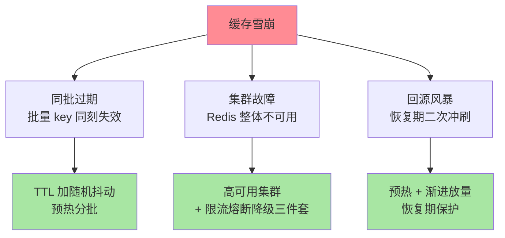

# 雪崩、过期打散与多级缓存：把系统性风险摊开

> 击穿是一个点的失效，雪崩是**面的失效**：大面积 key 同时过期、或缓存集群整体不可用，数据库在两分钟内被冲垮。雪崩的治理思想与击穿不同——不追求「拦住某一发」，而是**把任何单点的失效方式都摊开、兜底**。这篇讲透三类雪崩源、三组解法与多级缓存的体系化降险。

## 一句话摘要

缓存雪崩三源三治：**同批过期**（大批 key 同刻失效）→ 过期时间加随机抖动打散；**缓存集群故障**（Redis 整体不可用）→ 高可用集群 + 熔断降级限流三件套（库前限流保护、服务降级兜底、快速熔断止损）；**回源风暴**（恢复期的二次冲刷）→ 预热与渐进放量。**多级缓存（本地 → Redis → 库）是体系性降险架构**——任何一级失效，下一级仍有缓冲，雪崩从「全有全无」变成「逐级衰减」。

## 🎯 本文核心

**核心一句话：雪崩是「面的失效」，治理思想是把任何单点失效摊开兜底——三源三治（同批过期打散/集群故障三件套/回源风暴预热渐放），限流阈值按「数据库极限容量的 70%-80%」定（闸门保库不保体验），多级缓存把雪崩从「全有全无」变成「逐级衰减」。**

机制链：三源判别 → 抖动打散的 spread 反推 → 三件套的雪崩配置观 → 恢复期二次冲刷 → 多级缓存的失效隔离与白名单纪律。全文一句话可重构：「按最坏情况定闸门，按演练结果定预案，多级缓存买逐级衰减」。

## 前置阅读

- 入门层篇 18《缓存三大问题》：三兄弟现象层
- 本目录篇 1/2：穿透与击穿——防御图的其他两层
- tips 互指：Sentinel 系列（限流熔断降级三件套的实现）

## 目标导向

本文是什么：雪崩的分类治理与多级缓存架构。功能是什么：把「缓存挂了库怎么办」从恐慌变成预案。能得到什么：三类雪崩源的判别与对应解法、限流降级在雪崩场景的配置思路、多级缓存的层次设计。为什么用：大促容灾预案、缓存架构评审、故障复盘，必看。

## 一、边界：入门层讲过什么，本文讲什么

| 内容 | 入门层 | 本文 |
|---|---|---|
| 雪崩的现象与「加随机 TTL」 | ✅ 讲过 | 不重复 |
| 三类雪崩源的完整治理 | 提了一句 | **本文核心一** |
| 限流/降级/熔断在雪崩中的配置 | 未讲 | **本文核心二** |
| 多级缓存架构 | 未讲 | **本文核心三** |

## 二、三类雪崩源与对应解法

- **同批过期**：业务天然批量（整点活动、同批灌入的缓存）导致同刻失效。抖动打散：`TTL = base + random(0, spread)`——spread 按「库能承受的回填峰值」反推；配合预热分批，把失效尖峰削成平缓曲线
- **集群故障**：最恶性的一类。防线分两层——**事前**：Redis 高可用（哨兵/Cluster，互指特性层高可用系列）降低故障概率；**事中**：库前限流（按 DB 容量设闸，宁可拒绝部分请求保住整体）、服务降级（非核心功能返回兜底数据/默认页）、快速熔断（回源超时率超阈值即熔断，把失败收敛到最小范围）——三件套的具体实现互指 Sentinel 系列，这里强调**配置视角**：限流阈值按「数据库的极限容量」定而不是按「正常流量」定
- **回源风暴**：被忽视的「恢复期事故」——Redis 恢复/重启后缓存全空，全量流量瞬间变成回源流量，库在「最不该挂的时刻」被二次冲垮。解法：**预热先行**（核心数据提前回填再放量）+ 网关层渐进放量（恢复期流量按比例爬坡）

## 三、限流降级的雪崩配置观

雪崩场景的三件套与日常限流不是同一套参数：

- **库前限流阈值 = DB 安全容量**：按压测得出的库极限 QPS 的 70%-80% 设闸——这是以牺牲部分请求为代价的 Trade-off，闸门保护的对象是数据库，不是用户体验
- **降级分级预案**：核心链路（交易）不降级走库、次核心降级为静态兜底、非核心直接关闭——降级预案在演练里预演过才有资格叫预案
- **熔断要快也要恢复**：半开探测（放少量流量试探）控制恢复节奏，防止「熔断打开—瞬间恢复—再熔断」的振荡

一句话收口：**雪崩防护的配置哲学是「按最坏情况定闸门，按演练结果定预案」**。

## 四、多级缓存：体系性降险

多级缓存是「性能收益与复杂度代价」之间 Trade-off 的体系化答案，它的价值不只是「更快」，更是**失效隔离**：Redis 雪崩时本地缓存仍在挡第一波（热数据多在本地），库的瞬时压力被显著削峰——雪崩从「Redis 挂 = 库挂」变成「逐级衰减」。设计三问：

1. **哪些数据放本地**：读极热 + 变化慢 + 容量小（商品头图配置、开关类）——本地缓存的白名单纪律（篇 2 的结论）
2. **失效怎么同步**：Redis Pub/Sub / MQ 广播失效事件（本地缓存 TTL 只作兜底）——失效链路的可靠性决定多级缓存的一致性上限
3. **本地缓存的爆炸半径**：单机容量上限、对象泄漏、刷新线程失控——本地缓存的治理成本不比 Redis 低，白名单是纪律

## 什么时候做哪个动作：雪崩治理决策速查

- **什么时候加 TTL 抖动**：任何批量灌缓存/整点活动的场景——一条配置的事，永远是第一个动作
- **什么时候上多级缓存**：Redis 层可用性无法承诺（无哨兵/Cluster 的单点）或延迟预算压到毫秒以内——它是体系工程，不是单点优化
- **什么时候配库前限流**：数据库压测出了极限容量数字之后——没有压测数字，限流阈值就是拍脑袋
- **怎么选降级形态**：按业务分级——交易链路不降级、次核心降级为兜底快照、非核心直接熔断关闭；降级形态在预案里逐链路预定义

## 业内惯例

> 💡 **实战提示**
> - 什么时候做「Redis 全挂」演练：大促前 + 每年至少一次——拔网线级别的演练验证的是「分级降级预案」的真实可用性，纸面预案不算数
> - 降级分级怎么定：按业务链路分级（交易不降/次核心兜底快照/非核心熔断）——分级清单提前写好并进预案文档，临场分级必然出错
> - 库前限流独立设闸：与业务限流分开（保库 vs 保鲜是两个目标），阈值来自压测的数据库极限容量——没有压测数字的限流是装饰
> - 恢复期操作手册化：缓存重启后的预热清单与放量爬坡节奏写进运维手册——恢复期的手速不该靠临场发挥

- **TTL 抖动是无脑必做**：成本一条配置，收益砍掉第一类雪崩——这是三源三治里演进验证过的最高性价比动作，没有理由不做
- **雪崩预案进大促 checklist**：「Redis 全挂」的演练（拔网线级别）每年至少一次——预案没演练过等于没有
- **库前限流独立于业务限流**：两套闸门职责不同（保库 vs 保鲜），混用一套参数是常见事故源
- **恢复期操作手册化**：缓存集群重启后的放量节奏写进运维手册——「恢复时的手速」不该靠临场发挥

## 五、常见误区

- **「加了随机 TTL 就不怕雪崩」**：它只治「同批过期」，集群故障与回源风暴要靠另两组解法——三源三治，别一招包打天下
- **「降级预案就是返回错误页」**：降级是「低配但可用」——兜底数据、缓存快照、静态化页面都是降级形态，纯报错是最差的降级
- **「多级缓存 = 随处加本地缓存」**：每加一级就多一套失效与一致性问题——本地缓存白名单纪律失效的多级缓存是事故放大器
- **「熔断阈值越敏感越好」**：过快熔断在正常抖动下反复打开——阈值按「正常波动的上界」定，敏感度用演练校准

## 六、与相邻机制的关系

- 本目录篇 1/2：穿透与击穿——纵深防御图的完整拼图
- tips 互指：限流熔断降级的实现（Sentinel 系列）、Redis 高可用（特性层高可用系列）、缓存一致性（失效事件驱动多级缓存刷新）
- 架构侧：静态化与 CDN 把「可静态的内容」移出缓存体系，是最彻底的雪崩免疫（架构域互指）

## 你们可能会问

**Q1：TTL 抖动的 spread 设多大？**
反推法：库在单位时间能承受的回填峰值 ÷（受影响 key 数量）= 最小摊开时长——按库容量定，不拍脑袋；典型量级为 TTL 的 10%-20%。

**Q2：Redis 全挂时业务怎么办才是对的？**
预案分三级：核心链路库前限流保交易、次核心走兜底快照、非核心直接熔断——**「全挂」的正确响应是按预案分级降级，不是全员重试把库打穿**。这份分级清单要提前写好并演练。

**Q3：本地缓存与 Redis 的一致性怎么保？**
失效广播（Pub/Sub/MQ）为主、短 TTL 兜底——一致性要求高的数据根本不该进本地缓存（白名单纪律的第一条），这是「能用本地缓存」的前提而不是实现细节。

## 七、自测三问

1. 三类雪崩源分别是什么？各自的解法核心是什么？
2. 雪崩场景的限流阈值按什么定？为什么不同于日常限流？
3. 多级缓存的「失效隔离」价值是什么？本地缓存白名单的三问是什么？

## 开放问题

- 云原生形态下多级缓存的「本地」边界在变化（边缘节点、sidecar 缓存），失效广播的拓扑复杂度上升，统一的缓存协同层是潜在演进方向。
- AI 容量预测（按流量预测预热与抖动参数）开始出现在云产品中，雪崩防护从人工参数向自适应系统演进。

## 🎯 核心带走

- **核心一句话**：雪崩三源三治——同批过期打散、集群故障三件套（限流降级熔断）、回源风暴预热渐放；多级缓存买「逐级衰减」，配置哲学是「按最坏情况定闸门，按演练定预案」
- **机制链**：三源判别 → spread 反推 → 三件套配置观 → 多级缓存的失效隔离
- **哪里会坏**：一招 TTL 打天下、降级只返回错误页、本地缓存无白名单、熔断阈值过敏感振荡
- **边界**：本篇管雪崩与体系化降险；穿透/击穿在本目录篇 1/2，三件套实现在 Sentinel 系列，Redis 高可用在特性层高可用系列

## 📌 数据与事实声明

- 写于 2026-09-08，分类与解法为业界工程共识的归纳；「70%-80% 容量设闸」「spread 10%-20%」为经验口径
- 多级缓存失效广播的语义以 Redis Pub/Sub 与常见 MQ 文档为准
- 免责：具体参数按业务压测定值

## 📚 参考资料

| 类型 | 标题 | 来源 |
|---|---|---|
| 实战书 | 《Redis 核心技术与实战》蒋德钧（缓存问题章） | 公开出版 |
| 关联系列 | 本仓库 Sentinel 系列（三件套实现） | docs/middleware/sentinel/ |
| 社区沉淀 | 大促缓存防护的公开复盘文章（多方博客） | 技术社区公开文章 |
