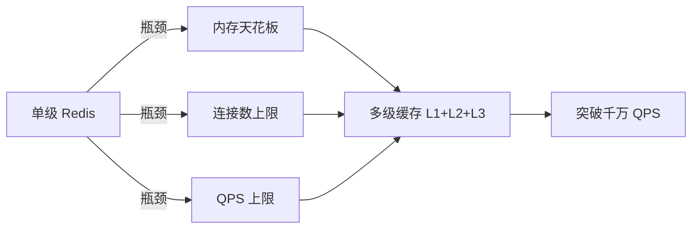

# 从零开始认识多级缓存架构系列

> 本系列目标：让你从零理解「多级缓存架构」的核心机制、生产落地、选型决策与从零实现。

## 本文核心

**一句话摘要**：多级缓存 = L1(本地) + L2(分布式) + L3(DB) 三级缓存架构，用不同延迟/容量/一致性的存储层级覆盖不同热度数据，是突破单级 Redis 千万 QPS 天花板的核心方案。

**核心机制链**：单级瓶颈 → 多级引入动机 → 三级分工 → 数据流 → 一致性协议 → 热点治理 → 监控告警

## 系列结构（L1-L4 从点到面）

| 层级 | 内容 | 规模 |
|---|---|---|
| 入门层 | 从零开始认识多级缓存架构系列（核心概念 + 机制） | 8 篇（0_导读 + 7 正文） |
| 特性层 | 深入理解多级缓存系列（协议/一致性/参数调优/生产事故） | 5 篇 |
| 专题层 | 多级缓存选型决策 + 亿级架构实战 | 2 篇 |
| 整合层 | 从零实现多级缓存架构（一致性协议 + 压测） | 1 个 Demo |

## 第 1 组 认知与基础（3 篇）

| # | 篇目 | 一句话定位 |
|---|---|---|
| 1 | 多级缓存是什么与为什么需要 | 单级缓存的瓶颈 + 多级缓存的引入动机 |
| 2 | 缓存三级架构（L1/L2/L3） | Caffeine/Redis/DB 三级分工与数据流 |
| 3 | 缓存一致性模型 | 强一致/最终一致/读写一致性 的语义与代价 |

## 第 2 组 核心机制（2 篇）

| # | 篇目 | 一句话定位 |
|---|---|---|
| 4 | 缓存穿透/击穿/雪崩 机制深挖 | 三大问题的本质、触发条件、防护策略 |
| 5 | 缓存一致性协议（Redis+本地） | Write-through/Write-behind/Invalidate 的选择 |

## 第 3 组 生产落地（2 篇）

| # | 篇目 | 一句话定位 |
|---|---|---|
| 6 | 多级缓存热点 Key 治理 | 热点发现 + 打散 + 本地缓存降级 |
| 7 | 多级缓存监控与告警 | 命中率/延迟/不一致 的监控大盘 |

## 5W 速记卡

| 维度 | 内容 |
|---|---|
| **What** | 多级缓存 = L1(本地) + L2(分布式) + L3(DB) 三级缓存架构 |
| **Why** | 单级缓存有内存/连接/QPS 天花板，多级缓存用不同延迟/容量/一致性的存储层级覆盖不同热度数据 |
| **When** | 千万 QPS 以上或单机 Redis 连接数/内存/QPS 触红线 |
| **Where** | 大促商品详情/社交 Feed 流/金融风控规则/广告投放 |
| **Who** | 缓存架构师/后端开发/SRE |

## 自测三问

1. 单级 Redis 缓存的瓶颈是什么？何时必须上多级缓存？
2. L1/L2/L3 三级缓存的分工原则是什么？数据流如何流转？
3. 缓存穿透/击穿/雪崩的区别是什么？各用什么策略防护？

## 核心带走

- **核心一句话**：多级缓存的本质是「用不同延迟/容量/一致性的存储层级，覆盖不同热度数据」，每级只存该级能扛住的热度
- **核心链条**：瓶颈识别 → 多级引入 → 三级分工 → 数据流 → 一致性 → 热点治理 → 监控告警
- **失效点**：L1/L2 数据不一致（失效传播延迟）、L1 OOM（本地缓存无界增长）、L2 穿透到 DB（热点 Key 过期）
- **边界**：多级缓存增加架构复杂度——不是所有系统都需要，量级未到时先用单级 + 优化
- **跨周期经验**：多级缓存从单机 Redis 演进到多级架构，通常经历「单级瓶颈 → 加集群 → 加本地缓存 → 全链路缓存」四个阶段，每个阶段都有典型事故——预热不足、失效风暴、双写不一致
- **demo 验证点**：压测对比单级 vs 多级缓存的 QPS/延迟/命中率；验证 L1 命中率、L2 命中率、DB QPS 变化趋势；模拟 Redis 故障观察降级效果

## 💡 实战提示（Tips）

- **起步建议**：先监控单级 Redis 的 QPS/内存/连接数/命中率，确认触红线再上多级——避免过早优化
- **L1 选型**：Caffeine（Java 高并发首选）> Guava Cache（中低并发）> Ehcache（需持久化）
- **L2 集群**：Redis Cluster 16384 Slots，Master-Slave 复制，**避免使用 Sentinel 作主节点**（Sentinel 仅做故障转移，不做数据分片）
- **一致性**：先写 DB 再失效缓存（推荐），不要双写——双写难保证一致性
- **常见坑**：L1 本地缓存无 TTL 导致 OOM；L2 热点 Key 未打散导致击穿；批量 Key 相同 TTL 导致雪崩

## ❓ 你们可能会问（QA）

**Q1：单级 Redis 不够用，为什么不直接扩容 Redis 集群？**
A：集群扩容有代价——跨 Slot 请求增加 RTT、运维复杂度线性增长、内存成本翻倍。多级缓存用「本地 + 分布式」组合拳，以更低成本突破瓶颈。

**Q2：L1 本地缓存怎么保证集群间一致性？**
A：L1 是进程级缓存，不保证集群间强一致。通过 Pub/Sub 或 Canal 订阅 binlog 广播失效消息，窗口期通常 ms 级——最终一致即可。

**Q3：什么时候不该用多级缓存？**
A：QPS < 100w、数据量 < 10GB、团队运维能力有限时——单级 Redis + 优化就够了。多级缓存增加复杂度，没有量级压力不要用。

## 🤔 思考（开放问题/反思）

- **本地缓存 vs 分布式缓存的边界在哪？** L1 的粒度（应用级 vs 集群级）如何决策？Caffeine 的 W-TinyLFU 在冷启动场景是否最优？
- **一致性 vs 可用性的取舍**：金融场景要求强一致，Write-through 同步写 Redis 的延迟能否接受？是否有更优方案？
- **多级缓存的监控粒度**：L1 命中率 vs L2 命中率 vs 整体命中率，如何关联分析定位瓶颈？

## ⚖️ Trade-off（代价与反方案）

| 方案 | 优势 | 代价 | 反方案 |
|---|---|---|---|
| **多级缓存** | 突破单机瓶颈、延迟分层、弹性扩展 | 架构复杂、一致性窗口、运维成本高 | 单级 Redis 集群 + 读写分离 |
| **单级 Redis** | 简单可靠、运维成熟 | 内存/连接/QPS 有天花板 | 多级缓存（本文方案） |
| **CDN 缓存** | 边缘节点、离用户近 | 仅适合静态资源、不适合动态数据 | 多级缓存 + CDN 组合 |
| **本地缓存-only** | 零网络开销 | 集群不一致、OOM 风险、无法共享 | 多级缓存 L1 + L2 组合 |

## 📌 数据与事实声明

- 写于 2026-09-11，机制以 Redis 7.x / Caffeine 3.x 为基准
- 量级红线为行业认知口径（十万/百万/千万/亿），决策需按实际业务压测校准
- 典型场景为公开技术社区高频案例的匿名化复述
- 工具口径以 Redis 官方文档 + Caffeine GitHub README 为准

## 📚 参考资料

- Redis 官方文档：https://redis.io/documentation
- Caffeine GitHub：https://github.com/ben-manes/caffeine
- 《Redis 设计与实现》黄健宏
- 《高性能 MySQL（第 4 版）》规模化章

---

## 阅读路径
- 新手：从 0_系列导读 开始，按 1-7 顺序读入门层
- 进阶：进特性层深挖一致性协议 + 热点治理
- 实战：读专题层选型决策 + 从零实现 Demo
