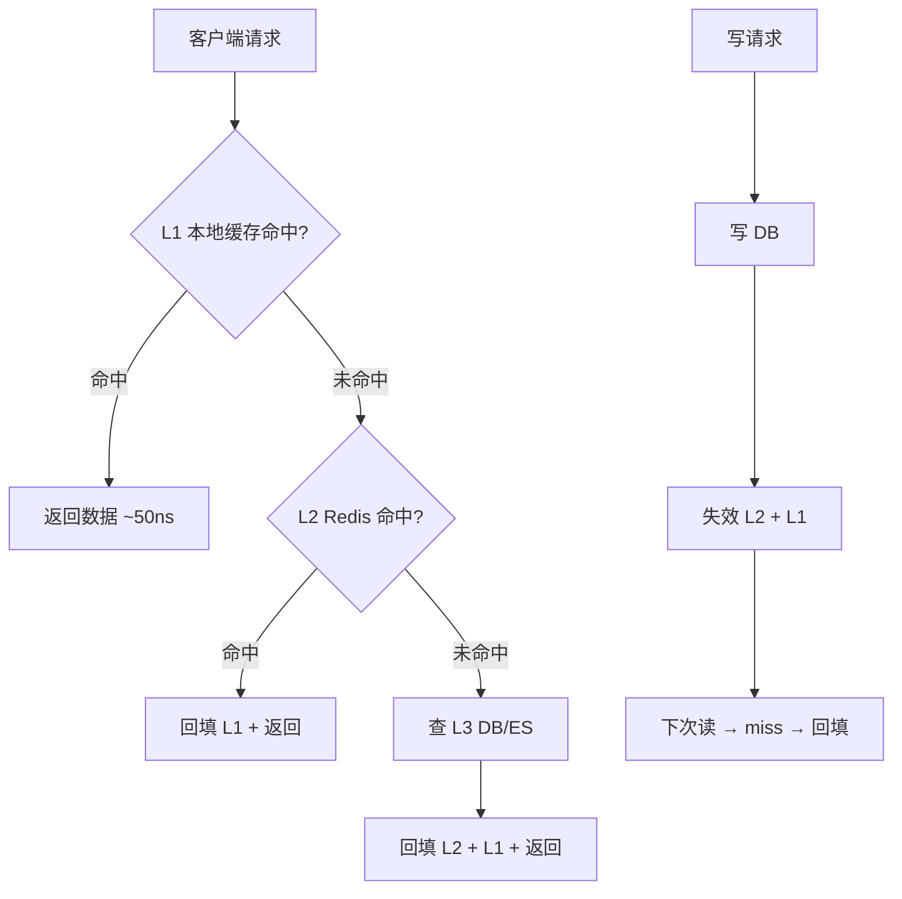
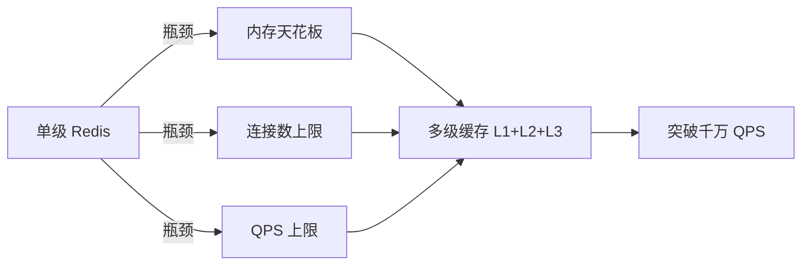

# 多级缓存是什么与为什么需要

## 本文核心

**一句话摘要**：单级 Redis 在千万 QPS 以上触天花板，多级缓存通过 L1(本地)+L2(分布式)+L3(DB) 三级分层，以不同延迟/容量/一致性覆盖不同热度数据。

**核心机制链**：单级瓶颈分析 → 多级引入动机 → 三级架构分工 → 数据流 → 一致性策略 → 量级判断

## 一、问题引出：单级缓存的瓶颈

Redis 单级缓存在中小规模（百万级 QPS、千兆内存）下完全够用。但当流量攀升到**千万级 QPS**、数据量达到**亿级**时，单级缓存暴露出根本性瓶颈：

### 瓶颈 1：单机内存天花板

```
单实例 Redis 内存上限：
├── 标准版：25GB - 100GB（社区版）
├── 云原生版：TB 级（PolarRedis/腾讯云 Redis Enterprise）
└── 但：单机内存再大，也扛不住「热数据持续增长」
→ 缓存命中率下降 → DB 压力陡增 → 雪崩
```

**核心问题**：单级缓存的容量与 QPS 都存在物理上限。

### 瓶颈 2：网络延迟叠加

```
客户端 → Redis（单机）     ≈ 1-3ms P99
客户端 → Redis 集群        ≈ 3-10ms P99（含路由跳转）
当 QPS 达到千万级：
- 单机连接数上限：10w+（受限于 fd + 内存）
- 集群分流后：跨 Slot 请求需重定向，增加 RTT
```

### 瓶颈 3：一致性压力

单级缓存下，缓存与 DB 的数据一致性靠「过期时间 + 异步刷新」。亿级流量下：
- 缓存击穿导致 DB 瞬时压力过大
- 热点 Key 过期引发大面积穿透
- 多实例间缓存状态不一致（分区容错场景）

## 二、解决方案：多级缓存架构

### 核心思路

```
┌─────────────────────────────────────────────────┐
│                 多级缓存架构                       │
│                                                     │
│  L1 (本地缓存) ← 极热数据 / 纳秒级延迟 / 几 KB    │
│    ↓ miss                                          │
│  L2 (分布式缓存) ← 热数据 / 微秒级 / 几 GB-几十GB │
│    ↓ miss                                          │
│  L3 (DB/ES) ← 冷数据 / 毫秒级 / 海量            │
└─────────────────────────────────────────────────┘
```

**设计原则**：
- 越靠近 CPU 的缓存，容量越小但速度越快
- 越靠近存储的缓存，容量越大但速度越慢
- 每一级缓存只存「该级能扛住的热度」数据



### 三级架构分工

| 层级 | 技术选型 | 容量 | 延迟 | 数据类型 | 一致性策略 |
|---|---|---|---|---|---|
| **L1 本地缓存** | Caffeine / Guava Cache / Ehcache | 几 MB - 几 GB | ns-μs | 极热点 + 不常变 | TTL + 主动失效 |
| **L2 分布式缓存** | Redis Cluster / Redis Enterprise | 几 GB - 几十 GB | μs-ms | 热点 + 变化适中 | TTL + binlog 订阅 |
| **L3 数据存储** | MySQL / ES / HBase | TB 级 | ms | 全量 + 冷热分离 | 主从同步 + 对账 |




## 三、为什么「需要」多级缓存

### 量级判断口诀

```
量级  < 100w QPS     → 单级 Redis 足够
量级  100w - 1000w   → Redis 集群 + 本地缓存补充
量级  > 1000w QPS    → 多级缓存架构（L1+L2+L3）
```

### 典型场景

| 场景 | 为何需要多级 | L1 承担 | L2 承担 | L3 承担 |
|---|---|---|---|---|
| 大促商品详情 | 瞬时 QPS 10w+，热点集中 | 品牌/类目基础信息 | 商品实时价格/库存 | 商品详情全文 |
| 社交 Feed 流 | 用户个性化 + 高频访问 | 用户最近 10 条 | 好友最近 50 条 | 全量历史 |
| 金融风控规则 | 规则秒级变更 + 全量匹配 | 最新规则（短 TTL） | 规则集缓存 | 规则源库 |
| 广告投放 | 实时竞价 + 海量候选 | 用户画像片段 | 广告主配置 | 广告素材库 |

## 四、核心带走

- **核心一句话**：多级缓存的本质是「用不同延迟/容量/一致性的存储层级，覆盖不同热度数据」，每级只存该级能扛住的热度
- **何时上多级**：单机 Redis 连接数/内存/QPS 触红线，或缓存命中率因数据量增长持续下降
- **哪里会坏**：L1/L2 数据不一致（失效传播延迟）、L1 OOM（本地缓存无界增长）、L2 穿透到 DB（热点 Key 过期）
- **边界**：多级缓存增加架构复杂度——不是所有系统都需要，量级未到时先用单级 + 优化
- **跨周期经验**：多级缓存从单机 Redis 演进到多级架构，通常经历「单级瓶颈 → 加集群 → 加本地缓存 → 全链路缓存」四个阶段，每个阶段都有典型事故——预热不足、失效风暴、双写不一致
- **demo 验证点**：压测对比单级 vs 多级缓存的 QPS/延迟/命中率；验证 L1 命中率、L2 命中率、DB QPS 变化趋势；模拟 Redis 故障观察降级效果

## 💡 实战提示（Tips）

- **起步建议**：先监控单级 Redis 的 QPS/内存/连接数/命中率，确认触红线再上多级
- **L1 选型**：Caffeine（Java 高并发首选）> Guava Cache（中低并发）> Ehcache（需持久化）
- **L2 集群**：Redis Cluster 16384 Slots，Master-Slave 复制
- **一致性**：先写 DB 再失效缓存（推荐），不要双写
- **常见坑**：L1 本地缓存无 TTL 导致 OOM；L2 热点 Key 未打散导致击穿

## ❓ 你们可能会问（QA）

**Q1：单级 Redis 不够用，为什么不直接扩容 Redis 集群？**
A：集群扩容有代价——跨 Slot 请求增加 RTT、运维复杂度线性增长、内存成本翻倍。多级缓存用「本地 + 分布式」组合拳，以更低成本突破瓶颈。

**Q2：L1 本地缓存怎么保证集群间一致性？**
A：L1 是进程级缓存，不保证集群间强一致。通过 Pub/Sub 或 Canal 订阅 binlog 广播失效消息，窗口期通常 ms 级——最终一致即可。

**Q3：什么时候不该用多级缓存？**
A：QPS < 100w、数据量 < 10GB、团队运维能力有限时——单级 Redis + 优化就够了。

## 🤔 思考（开放问题/反思）

- **本地缓存 vs 分布式缓存的边界在哪？** L1 的粒度（应用级 vs 集群级）如何决策？
- **一致性 vs 可用性的取舍**：金融场景要求强一致，Write-through 同步写 Redis 的延迟能否接受？
- **多级缓存的监控粒度**：L1 命中率 vs L2 命中率 vs 整体命中率，如何关联分析定位瓶颈？

## ⚖️ Trade-off（代价与反方案）

| 方案 | 优势 | 代价 | 反方案 |
|---|---|---|---|
| **多级缓存** | 突破单机瓶颈、延迟分层、弹性扩展 | 架构复杂、一致性窗口、运维成本高 | 单级 Redis 集群 + 读写分离 |
| **单级 Redis** | 简单可靠、运维成熟 | 内存/连接/QPS 有天花板 | 多级缓存（本文方案） |
| **CDN 缓存** | 边缘节点、离用户近 | 仅适合静态资源、不适合动态数据 | 多级缓存 + CDN 组合 |
| **本地缓存-only** | 零网络开销 | 集群不一致、OOM 风险、无法共享 | 多级缓存 L1 + L2 组合 |


## 5W 速记卡

| 维度 | 内容 |
|---|---|
| **What** | 多级缓存 = L1(本地) + L2(分布式) + L3(DB) 三级缓存架构 |
| **Why** | 单级缓存有内存/连接/QPS 天花板，多级缓存用不同延迟/容量/一致性的存储层级覆盖不同热度数据 |
| **When** | 千万 QPS 以上或单机 Redis 连接数/内存/QPS 触红线 |
| **Where** | 大促商品详情/社交 Feed 流/金融风控规则/广告投放 |
| **Who** | 缓存架构师/后端开发/SRE |

## 自测三问

1. 单级 Redis 缓存的瓶颈是什么？何时必须上多级缓存？
2. L1/L2/L3 三级缓存的分工原则是什么？数据流如何流转？
3. 缓存穿透/击穿/雪崩的区别是什么？各用什么策略防护？

## 📌 数据与事实声明

- 写于 2026-09-11，机制以 Redis 7.x / Caffeine 3.x 为基准
- 量级红线为行业认知口径（十万/百万/千万/亿），决策需按实际业务压测校准
- 典型场景为公开技术社区高频案例的匿名化复述
- 工具口径以 Redis 官方文档 + Caffeine GitHub README 为准

## 📚 参考资料

- Redis 官方文档：https://redis.io/documentation
- Caffeine GitHub：https://github.com/ben-manes/caffeine
- 《Redis 设计与实现》黄健宏
- 《高性能 MySQL（第 4 版）》规模化章
- 《数据密集型应用系统设计》Martin Kleppmann