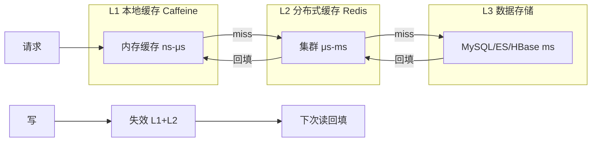

# 缓存三级架构（L1/L2/L3）

## 本文核心

**一句话摘要**：L1 极热数据纳秒级返回，L2 热数据微秒级共享，L3 全量数据兜底——三级各司其职，数据流读命中逐级返回、写失效逐级清除。

**核心机制链**：L1 本地缓存（Caffeine）→ L2 分布式缓存（Redis Cluster）→ L3 数据存储（MySQL/ES/HBase）→ 失效传播 → 回填策略

## 一、架构全景

```
┌─────────────────────────────────────────────────────────┐
│                    多级缓存数据流                           │
│                                                            │
│  请求 → L1 (本地缓存) ──命中──→ 返回                        │
│       ↓ 未命中                                                │
│       L2 (分布式缓存) ──命中──→ 回填 L1 → 返回               │
│       ↓ 未命中                                                │
│       L3 (DB/ES) ──查询──→ 回填 L2 + L1 → 返回              │
│                                                            │
│  写操作 → 同时失效 L1/L2 → 下一读命中 L3                    │
└─────────────────────────────────────────────────────────┘
```




## 二、L1 本地缓存

### 定位

- **最近的内存缓存**，运行在应用进程内
- 零网络开销，延迟 **纳秒~微秒级**
- 容量受限于**单机内存**（通常几 MB ~ 几 GB）

### 技术选型对比

| 实现 | 语言 | 特点 | 适用场景 |
|---|---|---|---|
| **Caffeine** | Java | W-TinyLFU 淘汰 + 写穿 | 高并发 Java 服务首选 |
| **Guava Cache** | Java | LRU + 容量限制 | 中低并发场景 |
| **Ehcache** | Java | 堆内/堆外/磁盘三级 | 需要持久化的本地缓存 |
| **Varnish** | C | HTTP 代理缓存 | 边缘节点静态资源 |

### 核心参数

```yaml
Caffeine 关键参数:
maximumSize: 10000        # 最大条目数
maximumWeight: 50_000_000  # 最大权重（字节）
expireAfterWrite: 60s     # 写后过期
expireAfterAccess: 300s   # 访问后过期
refreshAfterWrite: 45s    # 异步刷新（避免缓存击穿）
recordStats: true         # 开启统计（命中率/加载耗时）
```

### 数据流

```
读请求：
1. 查 L1 → 命中：返回（~50ns）
2. L1 miss → 查 L2

写请求：
1. 写 DB
2. 失效 L1（delete key）
3. 失效 L2（del key）
4. 下次读 → L1 未命中 → L2 未命中 → 查 DB → 回填
```

## 三、L2 分布式缓存

### 定位

- **跨实例共享缓存**，运行在独立 Redis 集群
- 有网络开销，延迟 **微秒~毫秒级**
- 容量可达 **几十 GB ~ TB 级**（集群模式）

### 集群架构

```
Redis Cluster (16384 Slots)
├── Master 1 (Slots 0-5460)     ── Slave 1a
├── Master 2 (Slots 5461-10922) ── Slave 2a
├── Master 3 (Slots 10923-16383)── Slave 3a
└── Proxy/Client 直连模式
```

### 核心参数

```yaml
Redis Cluster 关键参数:
# 连接层
maxclients: 100000          # 最大客户端连接数
timeout: 300                  # 空闲超时(秒)
tcp-keepalive: 60           # TCP 保活

# 内存层
maxmemory: 32gb               # 实例内存上限
maxmemory-policy: allkeys-lru # 淘汰策略

# 持久化
save: 900 1 300 10 60 10000  # RDB 快照策略
appendonly: yes               # AOF 开启
appendfsync: everysec         # AOF 刷盘策略

# 复制
repl-backlog-size: 256mb    # 复制积压缓冲区
repl-timeout: 60              # 复制超时
```

### 淘汰策略选型

| 策略 | 含义 | 适用场景 |
|---|---|---|
| **allkeys-lru** | 所有 Key LRU 淘汰 | 热点明显 + 冷数据可丢失 |
| **allkeys-lfu** | 所有 Key LFU 淘汰 | 热点长期存在 + 频次区分 |
| **volatile-lru** | 仅带 TTL 的 Key LRU | 必须保留无 TTL 数据 |
| **volatile-ttl** | 优先淘汰剩余 TTL 短的 | TTL 语义明确的场景 |
| **noeviction** | 不淘汰，写入拒绝 | 数据强一致要求 |

## 四、L3 数据存储

### 定位

- **最终数据存储**，持久化、全量
- 延迟 **毫秒级**，但数据完整
- 作为 L1/L2 的「兜底数据源」

### 与 L2 的分工

```
┌─────────────┐     ┌─────────────┐     ┌─────────────┐
│    L2        │     │    L3        │     │    L2        │
│  Redis       │     │  MySQL/ES    │     │  Redis       │
│  (热数据)    │     │  (全量数据)  │     │  (热数据)    │
├─────────────┤     ├─────────────┤     ├─────────────┤
│ 覆盖: 今日    │     │ 覆盖: 全量   │     │ 覆盖: 历史    │
│ 增量: 实时    │     │ 增量: T+1   │     │ 增量: T+1   │
│ 延迟: μs     │     │ 延迟: ms    │     │ 延迟: μs     │
│ 容量: GB     │     │ 容量: TB    │     │ 容量: GB     │
└─────────────┘     └─────────────┘     └─────────────┘
```


## 五、一致性策略对比

| 策略 | L1 一致性 | L2 一致性 | 延迟 | 适用场景 |
|---|---|---|---|---|
| **Write-through** | 强一致 | 强一致 | 高（同步写） | 金融/账务 |
| **Write-behind** | 弱一致 | 弱一致 | 低（异步写） | 社交/Feed |
| **Invalidate** | 最终一致 | 最终一致 | 中 | 电商/商品 |
| **Read-through** | 应用层控制 | 应用层控制 | 低 | 读多写少 |

## 六、核心带走

- **核心一句话**：L1 极热数据纳秒级返回，L2 热数据微秒级共享，L3 全量数据兜底——三级各司其职
- **数据流**：读命中逐级返回，写失效逐级清除
- **哪里会坏**：L1/L2 失效不同步导致短暂不一致、L1 OOM 无界增长、L2 热点 Key 击穿
- **选型原则**：L1 选 Caffeine（Java）/ 直写（Go）/ LRU（Node）；L2 选 Redis Cluster；L3 按业务选 MySQL/ES/HBase
- **跨周期经验**：多级缓存从单机 Redis 演进到多级架构，通常经历「单级瓶颈 → 加集群 → 加本地缓存 → 全链路缓存」四个阶段，每个阶段都有典型事故——预热不足、失效风暴、双写不一致
- **demo 验证点**：压测对比单级 vs 多级缓存的 QPS/延迟/命中率；验证 L1 命中率、L2 命中率、DB QPS 变化趋势；模拟 Redis 故障观察降级效果

## 💡 实战提示（Tips）

- **L1 容量规划**：Caffeine `maximumWeight` 按堆内存 1/4 分配，避免 OOM
- **L2 淘汰策略**：热点明显选 allkeys-lfu，冷数据可丢选 allkeys-lru
- **L3 兜底**：L2 miss 必须回填 L1+L2，避免每次请求都穿透到 DB
- **双写风险**：先写 DB 再失效缓存，不要双写——双写难保证一致性
- **监控重点**：L1 命中率、L2 命中率、L3 回填率、失效延迟

## ❓ 你们可能会问（QA）

**Q1：L1 和 L2 都缓存同一份数据，不会浪费内存吗？**
A：L1 只存极热点（通常 Top 100-1000 Key），L2 存热数据（Top 10w），重叠度低。总内存 = L1 几 MB + L2 几 GB，远小于单级 Redis 集群。

**Q2：L1 本地缓存如何防 OOM？**
A：Caffeine `maximumWeight` 限制 + `expireAfterWrite` TTL + 堆内监控。生产环境通常限制 L1 不超过 JVM 堆的 1/4。

**Q3：为什么 L2 选 Redis Cluster 而不是 Redis Sentinel？**
A：Sentinel 仅做故障转移，不做数据分片。Cluster 16384 Slots 自动分片，支持水平扩展——这是亿级 QPS 的必要条件。

## 🤔 思考（开放问题/反思）

- **L1 粒度**：应用级缓存 vs 集群级缓存（如 Redis Local），如何选择？
- **W-TinyLFU vs LRU**：Caffeine 默认 W-TinyLFU 在冷启动场景是否最优？是否需要自定义淘汰器？
- **L3 选型**：MySQL vs ES vs HBase，如何根据查询模式决策？

## ⚖️ Trade-off（代价与反方案）

| 方案 | 优势 | 代价 | 反方案 |
|---|---|---|---|
| **三级架构** | 延迟分层、容量弹性、热点隔离 | 架构复杂、一致性窗口、运维成本高 | 单级 Redis 集群 |
| **两级架构**（L1+L2） | 简化运维、降低一致性窗口 | L1 容量受限、冷数据直接到 L2 | 三级架构（本文方案） |
| **仅 L2**（无本地缓存） | 零不一致风险 | 多一次网络 RTT、L2 压力更大 | 三级架构（本文方案） |


## 5W 速记卡

| 维度 | 内容 |
|---|---|
| **What** | L1 本地缓存 + L2 分布式缓存 + L3 数据存储的三级缓存架构 |
| **Why** | 单级缓存有内存/连接/QPS 天花板，三级分层以不同延迟/容量覆盖不同热度数据 |
| **When** | 千万 QPS 以上或单机 Redis 连接数/内存/QPS 触红线 |
| **Where** | 大促商品详情/社交 Feed 流/金融风控规则/广告投放 |
| **Who** | 缓存架构师/后端开发/SRE |

## 自测三问

1. L1/L2/L3 三级缓存的分工原则是什么？数据流如何流转？
2. Caffeine 和 Redis Cluster 的核心参数分别是什么？
3. 写操作如何保证 L1/L2/L3 的一致性？

## 📌 数据与事实声明

- 写于 2026-09-11，机制以 Redis 7.x / Caffeine 3.x 为基准
- 量级红线为行业认知口径，决策需按实际业务压测校准
- 典型场景为公开技术社区高频案例的匿名化复述
- 工具口径以 Redis 官方文档 + Caffeine GitHub README 为准

## 📚 参考资料

- Redis 官方文档：https://redis.io/documentation
- Caffeine GitHub：https://github.com/ben-manes/caffeine
- 《Redis 设计与实现》黄健宏
- 《数据密集型应用系统设计》Martin Kleppmann