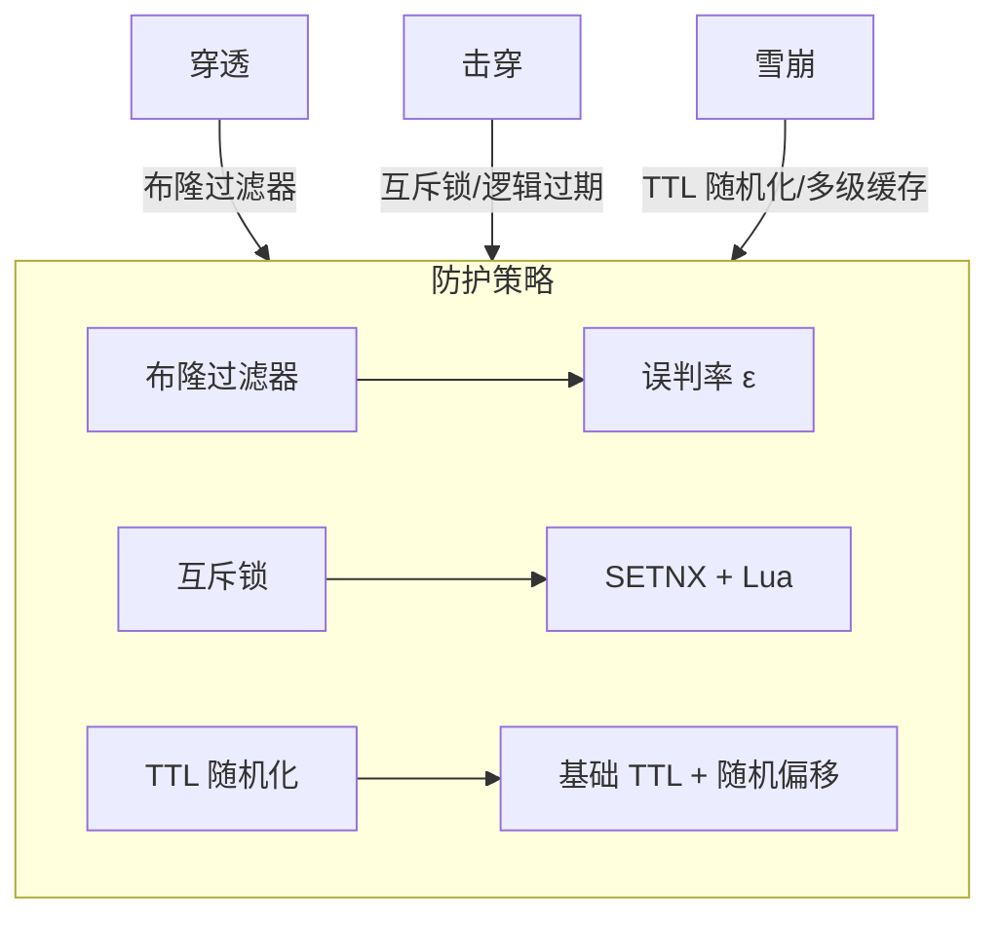
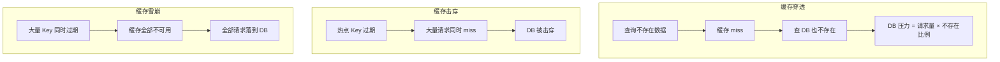

# 缓存穿透/击穿/雪崩 机制深挖

## 本文核心

**一句话摘要**：穿透防「不存在的数据」、击穿防「热点 Key 过期瞬间」、雪崩防「大面积 Key 同时失效」——三类问题本质不同，防护策略必须对症。

**核心机制链**：问题定义 → 触发条件 → 防护策略 → 量级参数对照 → 生产事故 → 核心带走

## 一、三大问题本质

### 1.1 缓存穿透（Cache Penetration）

**定义**：查询**不存在**的数据，缓存不命中 → 每次请求都落到 DB。

```
请求流程图：
客户端 → 缓存 → miss → DB → 也不存在 → 返回 null
↑ 下次相同请求 → 又是 miss → 又是 DB 查询
↓
DB 压力 = 请求量 × 不存在比例
```

**典型场景**：
- 恶意攻击/爬虫：故意查询不存在的 ID
- 业务 Bug：前端传了非法参数（如 user_id = -1）
- 数据确实不存在：刚注册的用户查历史订单

**量级影响**：
- 千万 QPS 下，即使 1% 穿透，DB 也承受 10w QPS 的无效查询
- DB 连接数被打满 → 正常请求也受影响

### 1.2 缓存击穿（Cache Breakdown）

**定义**：**热点 Key 过期瞬间**，大量请求同时落到 DB。

```
时间线：
T0: 热点 Key K 设置 TTL = 30min
T1: K 过期
T2: 请求 A 查 K → miss → 查 DB → 写入缓存
T3: 请求 B 查 K → miss → 查 DB → 写入缓存
...
Tn: 大量请求同时 miss → DB 被击穿
```

**与穿透的区别**：
- 穿透：数据**不存在**，缓存永远不会命中
- 击穿：数据**存在 + 热点**，只是**刚好过期**

### 1.3 缓存雪崩（Cache Avalanche）

**定义**：**大量 Key 同时过期**（或缓存服务不可用），导致全部请求落到 DB。

```
雪崩三因：
① 批量 Key 设置了相同 TTL → 同时过期
② 缓存集群故障 → 全部 miss
③ DB 故障恢复后 → 缓存重建压力大
```




## 二、防护策略

### 2.1 穿透防护

| 策略 | 实现 | 量级适配 | 代价 |
|---|---|---|---|
| **布隆过滤器** | 前置过滤不存在 Key | 千万级 QPS 必选 | 少量误判 |
| **空值缓存** | null 也缓存（短 TTL） | 中小规模 | 多存无效数据 |
| **参数校验** | 拦截非法 ID | 所有量级 | 无 |
| **限流** | 同一 IP/Key 限频 | 大规模 | 误伤正常用户 |

**布隆过滤器原理**：

```
位数组（m bit）+ k 个哈希函数
插入：h1(x), h2(x), ..., hk(x) → 置 1
查询：h1(x), h2(x), ..., hk(x) → 全 1 则「可能存在」

误判率公式：
ε ≈ (1 - e^(-kn/m))^k

m=10^8 bit (12.5MB), n=10^8, k=7 → ε ≈ 0.8%
m=10^9 bit (125MB), n=10^8, k=7 → ε ≈ 0.008%
```

### 2.2 击穿防护

| 策略 | 实现 | 量级适配 | 代价 |
|---|---|---|---|
| **互斥锁** | 只允许一个线程重建缓存 | 所有量级 | 略有延迟 |
| **永不过期** | 逻辑过期 + 异步刷新 | 千万级 | 实现复杂 |
| **逻辑过期** | Key 永不过期，值内嵌过期时间 | 千万级 | 需客户端支持 |

**互斥锁实现**：

```java
// Redis SETNX 互斥锁
String lockKey = "lock:" + cacheKey;
String requestId = UUID.randomUUID().toString();

// 尝试获取锁
Boolean locked = redis.setIfAbsent(lockKey, requestId, 30, TimeUnit.SECONDS);
if (Boolean.TRUE.equals(locked)) {
try {
// 查 DB → 写缓存
Object data = db.query(key);
redis.setex(cacheKey, ttl, data);
return data;
} finally {
// 释放锁（Lua 脚本保证原子性）
redis.eval(UNLOCK_SCRIPT, lockKey, requestId);
}
} else {
// 等待后重试
Thread.sleep(50);
return redis.get(cacheKey);
}
```

### 2.3 雪崩防护

| 策略 | 实现 | 量级适配 | 代价 |
|---|---|---|---|
| **TTL 随机化** | 基础 TTL + 随机偏移 | 所有量级 | 简单有效 |
| **多级缓存** | L1/L2 分层 | 千万级 | 架构复杂 |
| **高可用** | Redis Cluster + Sentinel | 所有量级 | 成本高 |
| **降级** | 缓存不可用时直接查 DB + 限流 | 所有量级 | DB 压力大 |

**TTL 随机化**：

```java
// 基础 TTL 30min + 随机 0-10min 偏移
int baseTtl = 30 * 60;    // 30min
int jitter = ThreadLocalRandom.current().nextInt(10 * 60); // 0-10min
int actualTtl = baseTtl + jitter;
redis.setex(key, actualTtl, value);
```

## 三、量级参数对照表

| 量级 | 穿透防护 | 击穿防护 | 雪崩防护 | 缓存 TTL |
|---|---|---|---|---|
| **十万 QPS** | 空值缓存 + 参数校验 | SETNX 锁 | TTL 随机化 | 10-30min |
| **百万 QPS** | 布隆过滤器 + 空值缓存 | 逻辑过期 | L1 + L2 分层 | 5-30min |
| **千万 QPS** | 布隆过滤器（集群化） | 逻辑过期 + 热点探测 | 多级缓存 + 集群高可用 | 1-30min 动态 |
| **亿级 QPS** | 布隆过滤器 + 本地缓存 | 多级互斥 + 永不过期 | 全链路缓存 + 自适应 | 动态计算 |




## 四、生产事故案例

### 事故 1：热点 Key 过期击穿

**场景**：某电商大促，商品详情页缓存 TTL = 30min，0 点集中过期。

**根因**：
- 大量商品同时设置 30min TTL
- 0 点时同时过期
- DB 瞬时 50w QPS → DB 连接池满 → 服务不可用

**修复**：
1. TTL 随机化（基础 30min + 0-10min 偏移）
2. 热点 Key 永不过期 + 异步刷新
3. DB 连接池扩容 + 限流降级

### 事故 2：缓存服务不可用雪崩

**场景**：某金融系统 Redis 集群故障，缓存全部不可用。

**根因**：
- Redis 集群主节点故障，Slave 切换耗时 30s
- 30s 内全部请求落到 DB
- DB 连接数从 500 暴增至 5000 → DB CPU 100%

**修复**：
1. 缓存降级策略：Redis 不可用时直接查 DB + 本地缓存兜底
2. 本地缓存 Caffeine 作为二级兜底
3. DB 连接池限流 + 自动扩容

## 五、核心带走

- **核心一句话**：穿透防「不存在的数据」、击穿防「热点 Key 过期瞬间」、雪崩防「大面积 Key 同时失效」
- **三者的本质区别**：穿透是数据不存在，击穿是单点热点过期，雪崩是全局同时失效
- **防护优先级**：布隆过滤器（穿透）> 互斥锁/逻辑过期（击穿）> TTL 随机化（雪崩）
- **量级递进**：十万 QPS 用基础方案，百万 QPS 加布隆过滤器，千万 QPS 加多级缓存，亿级 QPS 加自适应策略
- **跨周期经验**：多级缓存从单机 Redis 演进到多级架构，通常经历「单级瓶颈 → 加集群 → 加本地缓存 → 全链路缓存」四个阶段，每个阶段都有典型事故——预热不足、失效风暴、双写不一致
- **demo 验证点**：压测对比单级 vs 多级缓存的 QPS/延迟/命中率；验证 L1 命中率、L2 命中率、DB QPS 变化趋势；模拟 Redis 故障观察降级效果

## 💡 实战提示（Tips）

- **布隆过滤器部署**：生产环境用 RedisBloom 或本地 Guava BloomFilter，避免单点
- **互斥锁超时**：SETNX 锁必须设超时（30s），防止死锁
- **TTL 随机化**：基础 TTL + 随机偏移是最简单有效的雪崩防护，优先做
- **热点 Key 探测**：通过监控 QPS + Redis `keyspace_hits`/`keyspace_misses` 识别热点
- **降级策略**：Redis 不可用时直接查 DB + 本地缓存兜底，避免级联故障

## ❓ 你们可能会问（QA）

**Q1：布隆过滤器误判怎么办？**
A：误判率 ε = (1-e^(-kn/m))^k。m=10^9 bit, n=10^8, k=7 时 ε≈0.008%。误判只会多查一次 DB，不会导致数据不一致——可接受。

**Q2：互斥锁和逻辑过期怎么选？**
A：互斥锁实现简单但有延迟（等待重建）；逻辑过期无延迟但实现复杂（客户端需支持）。千万 QPS 选逻辑过期，百万以下选互斥锁。

**Q3：缓存雪崩和缓存击穿有什么区别？**
A：雪崩是**大面积 Key 同时失效**（全局），击穿是**单个热点 Key 过期**（单点）。防护策略不同：雪崩靠 TTL 随机化+多级缓存，击穿靠互斥锁+逻辑过期。

## 🤔 思考（开放问题/反思）

- **布隆过滤器的维护**：数据删除时如何更新布隆过滤器？——计数型布隆过滤器（Counting Bloom Filter）vs 定时重建
- **逻辑过期的客户端实现**：如何保证客户端解析内嵌过期时间的准确性？时钟漂移怎么办？
- **自适应 TTL 的边界**：动态 TTL 是否会导致缓存命中率波动？如何稳定？

## ⚖️ Trade-off（代价与反方案）

| 方案 | 优势 | 代价 | 反方案 |
|---|---|---|---|
| **布隆过滤器+互斥锁** | 精准防护、误判可控 | 实现复杂、需维护过滤器 | 空值缓存+SETNX |
| **空值缓存** | 实现简单 | 存储无效数据、内存浪费 | 布隆过滤器 |
| **TTL 随机化** | 简单有效 | 仍有过期窗口 | 逻辑过期+永不过期 |
| **多级缓存** | 弹性扩展、热点隔离 | 架构复杂、一致性窗口 | 单级 Redis 集群 |


## 5W 速记卡

| 维度 | 内容 |
|---|---|
| **What** | 缓存穿透（查不存在数据）、击穿（热点 Key 过期）、雪崩（大面积 Key 同时失效） |
| **Why** | 三类问题触发条件不同，防护策略必须对症——布隆过滤器/互斥锁/TTL 随机化 |
| **When** | 千万 QPS 以上或大促热点场景 |
| **Where** | 商品详情/订单/库存/广告 |
| **Who** | 后端开发/SRE/缓存架构师 |

## 自测三问

1. 缓存穿透/击穿/雪崩的本质区别是什么？各用什么策略防护？
2. 布隆过滤器的误判率如何计算？生产环境怎么选？
3. 互斥锁和逻辑过期怎么选？各自适用什么量级？

## 📌 数据与事实声明

- 写于 2026-09-11，机制以 Redis 7.x / Caffeine 3.x 为基准
- 量级红线为行业认知口径，决策需按实际业务压测校准
- 事故案例为公开技术社区高频案例模式的匿名化复述
- 工具口径以 Redis 官方文档 + Caffeine GitHub README 为准

## 📚 参考资料

- Redis 官方文档：https://redis.io/documentation
- Caffeine GitHub：https://github.com/ben-manes/caffeine
- 《Redis 设计与实现》黄健宏
- 《大型网站技术架构：核心原理与案例分析》
- 《数据密集型应用系统设计》Martin Kleppmann