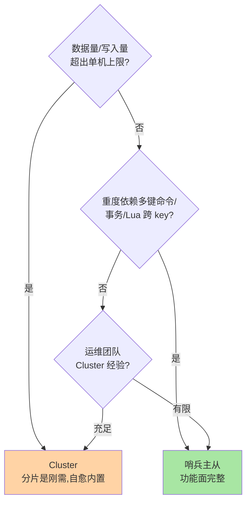

# 哨兵主从 vs Cluster：高可用选型决策树

> 「Redis 高可用怎么搭」的真正问题是「你的瓶颈在哪」：**可用性问题选哨兵主从，容量问题才选 Cluster**。这条分界线背后是两套完全不同的复杂度账单——这篇给一张可评审的决策树与迁移路径。

## 一句话摘要

哨兵主从解决「**挂了怎么办**」（故障切换，数据仍全量在每台主库上），Cluster 解决「**放不下了怎么办**」（分片容量 + 内置自愈）。选型的三个判定维度：**数据量与写入量**（超单机上限必须 Cluster）、**多键命令与事务依赖**（重度依赖选哨兵）、**运维成熟度**（哨兵心智简单、Cluster 运维面更大）。**单机能扛就哨兵，到顶再 Cluster，中间别停在「主从无哨兵」的裸奔态**。

## 🎯 本文核心

**核心一句话：高可用选型 = 先分清瓶颈是「可用性」还是「容量」——可用性问题哨兵主从（功能面完整、运维简单），容量问题 Cluster（分片刚需），三维判定（容量硬门槛/功能面软约束/运维成熟度现实权重）；迁移的主体成本在应用层改造，不在数据搬运。**

决策链：三维决策树 → 代价清单对照（七维度）→ 迁移双路径与隐性成本 → 「主从无哨兵非法态」的底线。全文一句话可重构：「单机扛就哨兵，到顶再 Cluster，裸奔态不存在」。

## 前置阅读

- 入门层篇 16/17：哨兵与集群的用法层
- 特性层《深入理解高可用系列》三篇：两套机制的完整细节

## 目标导向

本文是什么：两条高可用路线的选型决策与迁移路径。功能是什么：把「我们该用哪套」变成可评审的维度对比。能得到什么：三维判定标准、代价清单对照、扩容迁移的演进路径。为什么用：架构选型评审、容量规划、从主从向 Cluster 演进的立项，必看。

## 一、边界：入门层与特性层讲过什么，本文讲什么

| 内容 | 已有篇目 | 本文 |
|---|---|---|
| 两套机制的原理 | 特性层三篇 ✅ | 不重复 |
| 选型维度与决策树 | 未讲 | **本文核心一** |
| 代价清单对照 | 未讲 | **本文核心二** |
| 主从 → Cluster 迁移 | 未讲 | **本文核心三** |

## 二、决策树：三个维度定路线

- **维度一（容量）是硬门槛**：单机内存上限（业内常见 10-25GB 级的合理工作区，太大则持久化 fork 代价失控，见持久化篇）与写入 QPS 上限——到了就是到了，哨兵救不了容量
- **维度二（功能面）是软约束**：Cluster 的多键同槽限制（hash tag 补救）对业务模型的侵入是持续的——业务重度依赖跨 key 操作时，哨兵主从的功能完整性是决定性优势
- **维度三（运维成熟度）是现实权重**：哨兵的心智模型（主从 + 判定器）远比 Cluster（槽表/gossip/竞选）简单——团队没接触过 Cluster 时，「能运维好」比「架构先进」重要

## 三、代价清单对照

| 维度 | 哨兵主从 | Cluster |
|---|---|---|
| 解决的核心问题 | 故障切换 | 容量分片 + 切换 |
| 容量上限 | 单机内存 | 线性扩展（槽再分） |
| 多键命令/事务 | 完整支持 | 同槽限制（hash tag） |
| 客户端要求 | 哨兵协议 | 智能客户端（槽表） |
| 运维复杂度 | 低（主从 + 哨兵进程） | 高（槽迁移/拓扑/竞选） |
| 扩容方式 | 加从库（读扩）+ 换更大机器（容量） | reshard 在线扩槽 |
| 故障切换速度 | 秒到十秒级（判定流程） | 秒级（内置竞选） |

**一句话总结各自的地盘**：读多写少、数据集可控 → 哨兵主从（配读写分离）；数据持续增长、写压力分布 → Cluster。两者都要求「主从跨故障域 + 至少一从」的高可用底线。

## 四、迁移路径：主从到 Cluster 的演进

业务从哨兵主从演进到 Cluster 是「数据大搬家」，完整演进链：

两条路：

1. **双写迁移**（应用层改造，停机窗口小）：新 Cluster 与旧主从并行、双写、存量回灌、灰度切读切写——与 MySQL 分库分表迁移的七阶段同构（互指分库分表篇 3），迁移纪律完全可复用
2. **工具迁移**：`redis-cli --cluster import` 在线导入——适合可容忍窗口的中等数据集；大实例仍推荐双写纪律

**迁移的隐性成本**在应用层：客户端从哨兵协议换智能客户端、多键操作按 hash tag 改造、（跨槽）事务与 Lua 重构——**改造量评估是迁移立项的主体**，数据搬运反而是简单部分。

## 业内惯例

> 💡 **实战提示**
> - 什么时候启动 Cluster 评估：内存水位持续超 60% 单机舒适区上限、或写入峰值逼近单实例 QPS——两个信号任一持续出现就立项评估，不要等到撞墙
> - 选型评审的三份材料：业务多键操作清单（维度二证据）、容量增长曲线（维度一证据）、团队运维经验盘点（维度三证据）——三维都要有数据支撑
> - 迁移立项按「应用改造量」评估：客户端更换、hash tag 改造、跨槽事务重构的清单是成本主体——数据搬运反而是简单部分
> - 「主从无哨兵」作为评审红线：任何存量架构盘点发现该形态直接立专项——它是已知的最高频事故源

- **「主从无哨兵」是非法状态**：只有主从没有自动切换 = 高可用裸奔——任何评审里见到直接打回
- **上线即定终态演练**：选型后立即演练「主库挂了怎么办」（哨兵切换/Cluster 竞选）——选型正确但没演练过的切换照样出事
- **云托管弱化自建选型**：云 Redis 的高可用形态（主备/集群版）把哨兵与 Cluster 封装成产品参数——自建选型的方法论仍适用于「选产品形态」
- **容量红线前置监控**：内存水位、写入峰值逼近单机上限时启动 Cluster 评估——选型是渐进决策不是一次性豪赌

## 五、常见误区

- **「Cluster 一定比哨兵先进」**：先进性要买单——功能面收窄 + 运维复杂度是固定代价，单机扛得住的场景 Cluster 是负优化
- **「哨兵主从不能横向扩容」**：读扩（加从库）在哨兵体系内完成；容量扩（更大机器 + 数据搬迁）成本高但低增长业务可接受——「不能扩」是误解，「扩得贵」是事实
- **「选了 Cluster 就不用管持久化」**：每台主库仍需持久化决策（RDB/AOF），fork 代价按分片实例计——持久化纪律不因 Cluster 豁免
- **「hash tag 能解决所有多键问题」**：tag 把 key 聚到同槽 = 人工制造热点——tag 是逃生舱不是万能钥匙，滥用即倾斜

## 六、与相邻机制的关系

- 特性层高可用系列三篇：两套机制的原理底座，本文是决策层
- 本目录篇 2《扩缩容与迁移演练》：Cluster 扩容的执行细节与演练
- tips 互指：持久化 fork 代价与实例大小的关系（持久化系列）、Redis 分片后的 key 设计与分库分表思想同源（MySQL 分库分表互指）

## 你们可能会问

**Q1：单机内存的安全上限到底多少？**
没有绝对数字——上限由「持久化 fork 阻塞时长 + COW 余量 + 主从全量同步窗口」联合决定，业内常见舒适区 10-25GB。用「BGSAVE 耗时监控」实测自己的上限，比背数字可靠。

**Q2：读写分离在两套体系里怎么定位？**
哨兵主从的从库读是常规操作（注意复制延迟与一致性诉求匹配）；Cluster 的从库读是可选（默认客户端直连主库，READONLY 显式开启）——两套体系对「读扩散」的支持深度不同，方案设计别想当然。

**Q3：已用 Cluster 但业务重度依赖多键，怎么办？**
三选一：hash tag 重构键模型（评估热点代价）、多键操作改到应用层组装、退回哨兵主从 + 拆业务域——都不便宜，所以维度二要在选型前想清楚。

## 七、自测三问

1. 三个选型维度中哪个是硬门槛？为什么？
2. 两套体系的功能面差异核心是什么？hash tag 的定位是什么？
3. 主从迁 Cluster 的两条路径是什么？迁移成本的主体在哪？

## 开放问题

- 云托管 Redis 的「主备无缝切换 + 透明分片」产品形态持续吸收自建体系的能力，自建哨兵/Cluster 的场景在收窄但方法论不贬值。
- Redis 多活（跨地域）方案成熟后，高可用选型将叠加「地域分布」第四维度，决策树会再长一枝。

## 🎯 核心带走

- **核心一句话**：可用性问题选哨兵主从、容量问题选 Cluster——容量是硬门槛、功能面是软约束、运维成熟度是现实权重；迁移成本主体在应用层改造
- **决策链**：三维决策树 → 七维代价对照 → 双迁移路径 → 裸奔态红线
- **哪里会坏**：单机扛得住硬上 Cluster、多键依赖没审计就迁移、主从无哨兵裸奔、hash tag 滥用造热点
- **边界**：本篇是选型决策；两套机制原理在特性层高可用三篇，Cluster 扩容执行在本目录篇 2

## 📌 数据与事实声明

- 写于 2026-09-08，两套机制以 Redis 8.0 官方文档为准；「10-25GB 舒适区」为行业认知口径
- 迁移路径参考 redis-cli cluster import 官方能力与业内双写迁移实践
- 免责：选型建议需按业务负载与团队现状评审

## 📚 参考资料

| 类型 | 标题 | 来源 |
|---|---|---|
| 官方文档 | Sentinel / Cluster /cluster import | redis.io/docs |
| 实战书 | 《Redis 开发与运维》付磊/张益军（集群章） | 公开出版 |
| 关联系列 | 本仓库特性层高可用三篇 | docs/middleware/redis/特性层/ |
