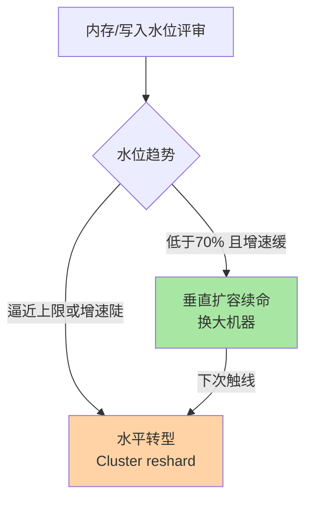

# 扩缩容与迁移演练：容量演进的操作手册

> Redis 的容量演进不是「扛不住再说」：主从换机器、Cluster 加节点搬槽、机房迁移——每一步都有「业务无感」的标准动作与翻车姿势。这篇把三类扩缩容的操作手册与演练清单一次讲全。

## 一句话摘要

容量演进三条路径：**垂直扩容**（主从换大机器——数据量可控时最简单，代价是切换窗口与 fork 代价上移）、**Cluster 水平扩容**（加节点 reshard 搬槽——在线渐进，前提是 key 设计无隐患）、**平台迁移**（云间/机房迁移——双写纪律复用）。**所有路径的共同底线是演练**：扩容操作没在预发环境跑过一遍，就等于在生产做第一次实验。

## 🎯 本文核心

**核心一句话：容量演进三路径——垂直（借复制链路换机器，简单但 fork 代价随规格上移）、水平（reshard 分批搬槽，分批本身就是滚动回滚设计）、平台迁移（双写七阶段纪律复用）；八项风险检查表 + 四项演练是所有路径的共同通行证——演练报告是变更审批的通行证。**

机制链：水位趋势定路径 → 垂直的复制借力 → reshard 分批纪律 → 双写迁移复用 → 检查表八项 → 演练四项。全文一句话可重构：「水位定路径，分批做回滚，演练换通行证」。

## 前置阅读

- 本目录篇 1：选型决策——扩容路径由选型决定
- 特性层《深入理解高可用系列》篇 3：槽迁移机制——reshard 的原理层
- tips 互指：MySQL 分库分表篇 3 的迁移七阶段（双写纪律同源）

## 目标导向

本文是什么：三类扩缩容路径的操作手册与演练方法。功能是什么：把「容量到顶了怎么办」变成有清单的工程动作。能得到什么：各路径的操作步骤、风险点与检查表、演练方案。为什么用：容量规划落地、大促前扩容、机房迁移项目，必看。

## 一、边界：既有篇目讲过什么，本文讲什么

| 内容 | 已有篇目 | 本文 |
|---|---|---|
| 槽迁移机制 | 特性层高可用篇 3 ✅ | 不重复 |
| 三类路径的操作手册 | 未讲 | **本文核心一** |
| 风险点与检查表 | 未讲 | **本文核心二** |
| 演练方案 | 未讲 | **本文核心三** |

## 二、三条路径的操作手册

### 路径一：垂直扩容（主从换大机器）

路径选择先看水位趋势：




要点：新机从库同步天然完成数据搬迁——复制链路即迁移通道，借既有架构完成搬迁，不造新轮子；提升动作低峰执行（切换秒级窗口）；**先升主再动旧主**，回滚 = 把复制关系换回来。注意大内存机器的 fork 代价随规格上移——「扩内存」要重估持久化余量（持久化篇的 30%-40% 守门线按新规格重算）。

### 路径二：Cluster 水平扩容（reshard 搬槽）

`redis-cli --cluster reshard` 的操作纪律：**前置**——bigkey 治理（迁移风暴眼）、客户端槽表兼容性验证；**执行**——低峰、分批迁移槽（每批 N 个槽观察指标再继续）、迁移速率限制（MIGRATE 的 timeout/拷贝参数）；**验收**——MOVED/ASK 命中率回落基线、各节点内存均衡、慢查询无突增。回滚：反向 reshard 搬回（可行但成本翻倍）——所以分批推进本身就是滚动回滚的设计。

### 路径三：平台迁移（换云/换机房）

双写纪律的完整复用（七阶段，互指 MySQL 分库分表篇 3）：双写开启 → 存量同步（RDB 迁移或 DTS 类工具）→ 追平 → 校验（keyspace 抽样比对）→ 灰度切读 → 全量切写 → 停旧观察。**Redis 特有项**：持久化文件不跨平台兼容的版本核对、客户端连接拓扑与哨兵/Cluster 模式适配、时延敏感业务的新机房 RTT 实测。

## 三、风险点检查表

```text
□ bigkey 已治理（搬槽风暴眼 / 大 key 搬迁超时）
□ 持久化余量按新规格重算（fork 代价 / COW 空间）
□ 客户端兼容性验证（槽表 / 哨兵协议 / 连接池参数）
□ 复制带宽评估（全量同步的网络成本，跨机房翻倍）
□ 切换窗口的业务预案（写失败的秒级窗口，重试与幂等就绪）
□ 回滚路径演练过（反向 reshard / 复制关系回切）
□ 监控基线已留存（扩容前后对比的依据）
□ 低峰窗口与变更审批完成
```

**量级演进视角**：10GB 级实例换机器是分钟级运维动作；50GB 级要按「迁移项目」立项（同步窗口、校验、预案齐备）；Cluster 集群的槽再平衡是常态化能力建设——**量级决定这套动作是「运维」还是「工程」**。

## 四、演练方案：没演过的操作等于没做

| 演练项 | 注入方式 | 验收点 |
|---|---|---|
| 主库切换 | 手动 failover / kill 主库 | 切换时长、丢失窗口、客户端恢复速度 |
| Cluster 节点下线 | kill 一主一从 | 竞选接管、槽可用性、多数派存活 |
| reshard 中断 | 搬槽中途 kill | 状态机恢复（MIGRATING/IMPORTING 残留清理） |
| 迁移回滚 | 灰度切读后回切 | 回滚时长、数据零丢失验证 |

演练在预发/隔离环境按「注入—观测—恢复」三段执行，生产变更前必须有一份对应的演练报告——**演练报告是变更审批的通行证**，这是容量演进与混沌工程的交界纪律。

## 业内惯例

> 💡 **实战提示**
> - 什么时候启动扩容：水位 70% 线（季度评审的趋势数据）而不是 95% 被动救火——扩容是计划工程，救火是事故
> - 垂直还是水平的最终判断：水位年增速 <20% 且绝对值在舒适区 → 垂直续命；指数增长或已触线 → 水平转型——方向错了的纠偏成本极高
> - reshard 中断不无脑重跑：MIGRATING/IMPORTING 状态机残留按工具恢复流程清理——强行重跑可能卡死槽状态
> - 演练数据量对齐生产：fork/搬槽/全量同步耗时都与数据量正相关——小数据量的演练结论不可信

- **扩容走「先观察后推进」**：上下游链路每批操作后指标观察期（分钟级）——问题在第一批暴露，别让第十批引爆
- **变更窗口「低峰 + 业务知情」**：Redis 的秒级切换窗口对敏感业务也可见（写失败重试）——业务方知情与预案对齐是纪律
- **容量水位季度评审**：内存/带宽/QPS 水位趋势图进季度评审，扩容在 70% 水位线启动而不是 95% 被动救火
- **工具版本一致性**：reshard/import 工具版本与服务端版本匹配——跨版本工具是迁移翻车的隐蔽源

## 五、常见误区

- **「加内存就是扩容」**：内存上去了 fork 代价、全量同步窗口、网络带宽全部联动——垂直扩容的资源联动账要一起算
- **「reshard 可以随时中断没关系」**：状态机残留（MIGRATING/IMPORTING）需要清理，中断后强行重跑可能卡死——按工具的恢复流程处理，不是无脑重试
- **「迁移校验抽样几条键就行」**：键数量级比对 + 分类抽样（按 hash 槽/按 key 前缀）双校验——「抽几条看看」挡不住系统性漏迁
- **「演练环境数据量无所谓」**：fork/搬槽/全量同步的耗时都与数据量正相关——演练数据量必须与生产同一量级才有参考价值

## 六、与相邻机制的关系

- 本目录篇 1：选型决定扩容路径——本文是决策的执行层
- 特性层高可用篇 1/3：全量同步与搬槽的机制底座
- tips 互指：MySQL 迁移七阶段（双写纪律）、bigkey 治理（本目录 bigkey 专题）、持久化余量（持久化系列）

## 你们可能会问

**Q1：扩容期间业务需要配合什么？**
理想状态零配合（在线 reshard/无感切换）；实际要业务确认的是「写失败重试已就绪」与「低峰窗口知情」——把业务侧的准备项写进变更单，别让配合依赖默契。

**Q2：怎么判断该垂直还是水平？**
看增长曲线：内存水位年增长 < 20% 且绝对值在舒适区 → 垂直续命；指数增长或已触线 → 水平转型。判断错误的方向性成本极高——水位评审（篇 1 的惯例）就是为这个判断供数。

**Q3：迁移后旧集群保留多久？**
观察期双跑 + 旧集群只读保留（月级起步）——「查旧集群」是数据争议的最终裁判，与 MySQL 迁移的归档期纪律同源。

## 七、自测三问

1. 三条扩容路径各自的适用场景与核心风险是什么？
2. reshard 的分批推进为什么是「滚动回滚」设计？
3. 演练四项各验什么？「演练报告是变更审批的通行证」背后的纪律是什么？

## 开放问题

- 云数据库的「在线变配」正在把垂直扩容的切换窗口压缩到亚秒级，自建体系的窗口管理价值向「多云与混合形态」迁移。
- 控制面自动化（自动识别水位触发扩容 + 自动 reshard）在托管产品中演进，「人执行手册」的时代在向「人审批机器的手册」过渡。

## 🎯 核心带走

- **核心一句话**：三路径（垂直借复制换机器/水平 reshard 分批搬槽/平台迁移双写七阶段）+ 八项检查表 + 四项演练——水位 70% 启动，演练报告是变更通行证
- **机制链**：水位定路径 → 复制借力 → 分批滚动回滚 → 双写复用 → 检查表 → 演练
- **哪里会坏**：95% 被动救火、fork 余量没按新规格重算、reshard 中断无脑重跑、演练数据量不对齐
- **边界**：本篇是执行层手册；选型决策在本目录篇 1，搬槽机制在特性层高可用篇 3，双写纪律与 MySQL 分库分表篇 3 同源

## 📌 数据与事实声明

- 写于 2026-09-08，操作口径以 redis-cli --cluster 官方文档与主流云迁移工具文档为准
- 「70% 水位启动扩容」「演练报告通行证」为业内工程纪律口径
- 免责：具体工具行为以官方文档为准

## 📚 参考资料

| 类型 | 标题 | 来源 |
|---|---|---|
| 官方文档 | Redis Cluster reshard / replication | redis.io/docs |
| 关联系列 | 本仓库 MySQL《分布式 ID 衔接与平滑迁移》（双写纪律互指） | docs/data/mysql/ |
| 实战书 | 《Redis 开发与运维》付磊/张益军 | 公开出版 |
