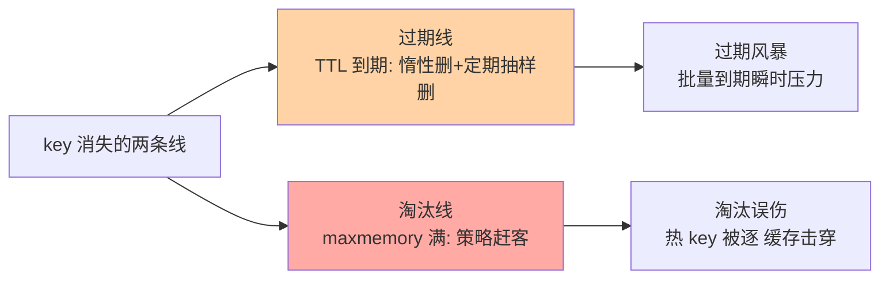
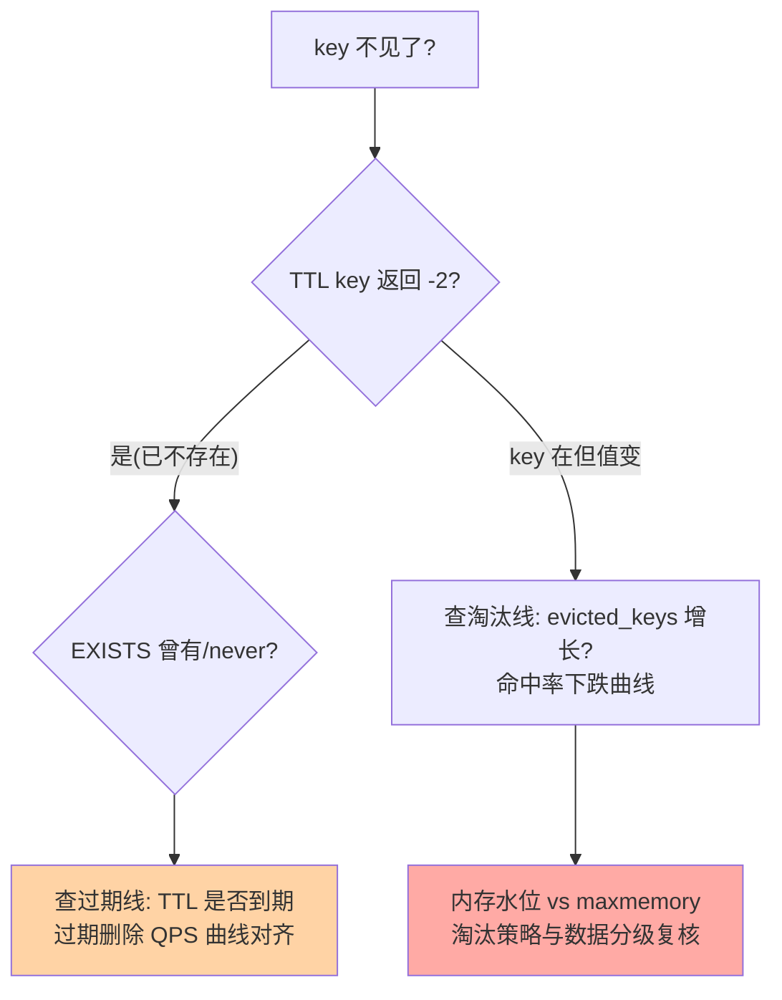

# 过期与内存淘汰：key 的两种死亡方式

> 一句话：过期是「key 到了自己设定的死线」（惰性 + 定期两种清理），淘汰是「内存满了被迫赶客」（LRU/LFU 等策略择优保留）——两套机制一个管生命周期，一个管容量上限，别混着理解。

## 🎯 本文核心

**核心一句话：过期策略（定时到期的 key 怎么删：惰性访问时删 + 定期抽样批量删）与内存淘汰（maxmemory 满了怎么选人出局：LRU/LFU/随机/TTL）是两条独立机制——前者回答「到期谁删」，后者回答「没到期但内存不够谁走」；排查「key 怎么没了」先分清是哪条线。**

组织主线：

## 一句话摘要

**过期策略**解决「设置了 TTL 的 key 到期后谁来删」：Redis 不用定时器逐个盯（百万级定时器成本不可接受），而是**惰性删除**（访问时发现过期才删，代价是冷 key 占着内存不清理）与**定期删除**（后台周期性抽样一批带 TTL 的 key 检查，过期即删，控制每次时长防阻塞）的组合。**内存淘汰**解决「写入把内存顶到 maxmemory 怎么办」：按 `maxmemory-policy` 策略选牺牲者——noeviction（拒绝写入）、allkeys-lru（全键 LRU，缓存默认）、volatile-lru（仅带 TTL 的键）、allkeys-lfu（4.0+ 频率优先）等八种——淘汰是容量治理的保命机制，不是容量规划工具。

## 一、过期策略：为什么不逐个定时

给每个 key 挂一个到期定时器在百万级 key 下不可行（定时器本身是巨量内存与 CPU）。Redis 的组合拳是「省钱但留死角」：**惰性删除**——key 被访问时才检查 TTL，过期即删并返回空（冷 key 永不被访问就永不被删，内存白白占着）；**定期删除**——后台每 100ms 级周期随机抽一批带 TTL 的 key 检查，过期比例高就继续抽（限时长），把「冷 key 滞留」的概率压低。两者的组合覆盖了「访问到的、抽样抽到的」，仍可能有漏网冷 key——内存水位靠淘汰线最终兜底。

## 5W 速记卡

| 维度 | 一句话 |
|---|---|
| What | 过期（惰性 + 定期抽样）与淘汰（八种 maxmemory 策略）两套机制 |
| Why | TTL 到期需要清理机制；内存上限需要驱逐机制 |
| When | 排查「key 怎么没了」、容量规划、缓存命中率治理 |
| Where | 服务端后台 + 访问路径；策略由 maxmemory-policy 配置 |
| How | 惰性/定期删过期；LRU/LFU 选淘汰对象 |

## 二、内存淘汰：八种策略怎么选

`maxmemory` 设上限，`maxmemory-policy` 定「满了之后谁出局」：

| 策略 | 候选范围 | 规则 | 适用 |
|---|---|---|---|
| noeviction（默认） | — | 内存满拒绝写入 | 数据不可丢（持久化语义） |
| **allkeys-lru** | 全部 key | 淘汰最久未访问 | 纯缓存默认选择 |
| volatile-lru | 仅带 TTL | 最久未访问优先 | 部分缓存部分持久 |
| allkeys-lfu | 全部 key | 淘汰访问频率最低（4.0+） | 有明显冷热分层 |
| volatile-ttl / random、allkeys-random | 相应范围 | 按 TTL 剩余 / 随机 | 特定语义 |

**选型主线是「数据的可丢性」**，从架构上看，淘汰策略是「应用层数据分级」与「存储层容量」的衔接点：应用把「可丢性」写进 TTL 与 key 规划，存储层按策略执行驱逐——分级做得清楚，策略就简单；分级混乱（重要数据与临时数据混住），任何策略都会误伤：纯缓存（丢了可重建）→ allkeys-lru/lfu；混合实例（部分不可丢）→ volatile 系（只动带 TTL 的）；事实源 → noeviction（宁可不写不能丢）。**LFU vs LRU**：LRU 只看「最近」，偶发批量扫描会污染热度（MySQL Buffer Pool 的新旧子链防同一个问题）；LFU 看「频率」，对偶发扫描免疫——访问模式有长尾抖动的缓存选 LFU 更稳。

## 三、过期风暴与淘汰误伤：两套机制各自的坑

**过期风暴**：大量 key 同一时刻到期（整点批量写入的缓存），到期删除 + 未命中穿透叠加，数据库瞬时压力尖峰。防法是 key 设计规范篇的「TTL 随机抖动」——把同时到期打散成均匀过期。**淘汰误伤**：allkeys-lru 下一个访问少但业务重要的 key（如配置缓存）被热数据挤出局——它没到期却被淘汰，读回源成本陡增。防法是分层：重要且小的数据用 volatile 系隔离（给足 TTL 就不会被 allkeys 系误伤），或干脆分实例。

> 💡 **实战提示**
> - 排查「key 怎么没了」先问两条线：`TTL key` 看是否自然过期（-2 = 已不存在）→ 查 `evicted_keys` 指标看是否被淘汰——两条线的治理动作完全不同
> - 淘汰开始即告警：`evicted_keys` 持续增长说明内存进入「拆东墙补西墙」状态——命中率会随之下跌，加内存或降容量是唯二出路
> - 缓存实例把 maxmemory 设为物理内存的 70-80%（业内口径）：剩余留给 fork 写时复制与碎片——贴着物理内存跑的实例在 bgsave 时 OOM
> - LFU 的计数有衰减因子（lfu-decay-time）：长期不访问的热 key 热度会衰减——理解它再调，默认值适合多数场景

## 四、与「MySQL 过期数据清理」的区别

数据库没有「行自动过期」的原生语义（靠业务作业清理），Redis 把 TTL 做成 key 的一等属性——差异源于角色：数据库行是事实（不过期），Redis key 是热数据（有生命周期）。淘汰机制同样只有 Redis 需要：内存是它唯一的存储介质，容量到顶必须即时决策；数据库「满」是磁盘容量与运维预警问题，节奏完全不同。理解「Redis 的内存即生命」，容量规划的所有纪律（警戒线、淘汰告警、拆分预案）都有了根。

## 五、典型使用场景

- **纯缓存实例**：allkeys-lru/lfu + maxmemory 70-80% + 淘汰告警——标准缓存形态
- **会话存储**：volatile 系 + 会话 key 全带 TTL——隔离持久数据防误伤
- **限流计数**：key 短 TTL + noeviction 倾向（限流数据被淘汰会导致放行异常）——重要小数据要么隔离要么保活
- **过期风暴治理**：批量缓存 TTL 加抖动 + 监控「过期删除 QPS」曲线对齐数据库压力曲线

## 六、误区与代价

- ❌ **「淘汰策略可以弥补容量不足」**：淘汰开始 = 命中率下降 + 热数据颠簸，它是保命不是扩容——容量治理的正解是拆分与加内存
- ❌ **「TTL 设得越长越安全」**：过期只是缓存新鲜度的上限，TTL 长只意味着「旧数据留得久」——新鲜度需求与淘汰压力要分开算
- ❌ **「定期删除会准时删掉过期 key」**：它是抽样不是全量扫描——依赖「过期后立刻释放内存」的设计会失望，内存水位靠监控而不是靠机制承诺
- ❌ **「noeviction 最安全」**：内存满后拒绝写入，业务侧写失败——对持久语义正确，对缓存实例是「缓存拒绝服务」

## 七、你们可能会问

**Q1：过期 key 还没被删除时读它，会读到旧值吗？**
不会——惰性删除在访问路径上，读到前先检查 TTL，过期即删并返回空（等于未命中）。滞留的过期 key 只是占内存，不影响读语义。

**Q2：LFU 的「频率」是怎么算的？**
每个 key 记一个对数计数器 + 时间衰减（lfu-decay-time 分钟级衰减）：短期刷高不代表长期热——比 LRU 的「最后访问时间」更能代表稳定热度，但也意味着新 key 起步权重低（可能被误逐，lfu-log-factor 可调）。

**Q3：淘汰会不会把正在使用的热 key 删掉？**
LRU/LFU 的排序意义就是保热逐冷——正常流量下热 key 安全；但一次性批量扫描（如全量导出）会让 LRU 误判冷热、把真热点挤出去——批量操作避开缓存实例或用 LFU，这正是 LFU 的防御价值。

## 八、什么时候用 / 不用

- ✅ 纯缓存：allkeys-lru/lfu + 上限告警——标准答案
- ✅ 混合实例：volatile 系隔离不可丢数据 + 显式 TTL 纪律
- ❌ 不把 noeviction 用于缓存实例——拒绝写入对缓存是灾难
- ❌ 不用淘汰策略替代容量规划——「满了会淘汰」不是「可以放心塞」的理由

## 排查流程图：key 没了先走这张图

## 九、自测三问

1. 过期与淘汰两条线的机制与职责分别是什么？排查「key 没了」先问什么？
2. 八种淘汰策略的选型主线是什么？LFU 对 LRU 的防御优势在哪？
3. 过期风暴怎么防？淘汰误伤怎么隔离？

下一篇讲「内存管理与大 Key 治理」：把内存账本算细——分配器、碎片与大 key 的专项治理。

## 开放问题

- 惰性删除与定期抽样的组合在超大 key 规模下的内存回收时延，社区持续调优（每次定期删除的时长上限与频率参数化）
- 淘汰策略与客户端缓存的联动（被淘汰 key 的主动失效通知）尚无原生机制，缓存一致性在淘汰场景的一致性窗口是开放话题

## 🎯 核心带走

- **核心一句话**：过期（惰性+定期抽样）管 TTL 生命周期，淘汰（LRU/LFU 八策略）管容量上限——「key 怎么没了」先分线归因，淘汰告警是缓存健康的第一指标
- **主线**：两条死亡线 → 过期组合拳 → 八策略选型 → 风暴与误伤
- **哪里会坏**：过期风暴打穿数据库、allkeys 误伤重要 key、maxmemory 贴物理内存 bgsave OOM
- **边界**：本篇管「两种死亡方式」；内存分配与碎片账本在下一篇，bigkey 专项在专题层 bigkey 篇

## 📌 数据与事实声明

- 写于 2026-09-10；过期策略（惰性/定期）、八种 maxmemory-policy、LFU 参数（4.0+）以 Redis 官方文档公开口径为准
- 「maxmemory 设物理内存 70-80%」为业内经验口径，按是否开持久化调整
- 免责：策略名与默认值随版本演进可能调整，以官方文档为准

## 📚 参考资料

| 类型 | 标题 | 来源 |
|---|---|---|
| 官方文档 | Redis Topics: Expiration / LRU / Memory Optimization | redis.io/docs |
| 官方源码 | redis/redis（expire.c、evict.c） | github.com/redis/redis |
| 系列导航 | Redis 系列目录 | `docs/middleware/redis/index.md` |
