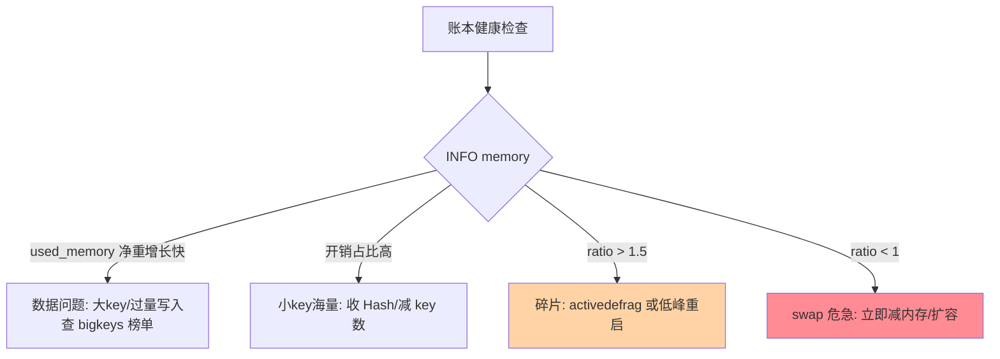

# 内存管理与大 Key 治理：把内存账本算细

> 一句话：Redis 的内存账本有三层——数据本身、每 key 元数据开销、分配器碎片；大 key 治理是账本失控后的专项手术，防大于治。

## 🎯 本文核心

**核心一句话：Redis 内存 = 数据净重 + 结构开销（每 key 元数据 + 编码头）+ 碎片（分配器与删除残留）——「used_memory 与数据量的差值」就是开销与碎片；大 key 是账本里最危险的科目，治理口诀「拆、缩、异、防」。**

组织主线（架构上是「应用写入端 → 存储账本 → 淘汰线」的上下游传导：写入粒度决定账本结构，账本状态决定淘汰压力）：


## 一句话摘要

Redis 内存管理的账本比「数据多大」复杂一层：每个 key 有约 50-90 字节的元数据与结构头（业内估算口径），小 key 海量时开销反客为主；分配器（jemalloc）按尺寸分级分配，删除与变更留下**碎片**——`mem_fragmentation_ratio`（used_memory_rss / used_memory）大于 1.5 即碎片明显。**大 key**（单 key 体积或元素量超警戒线）是账本里最危险的科目：它让单线程阻塞、集群迁移卡顿、过期删除抖动、内存曲线突变。治理口诀四字：**拆**（分桶分 key）、**缩**（减字段减体积，大值外移）、**异**（UNLINK 异步删除）、**防**（写入端粒度规范，治理前移到设计期）。

## 一、内存账本：三层结构怎么看

`INFO memory` 是账本入口：**used_memory**（Redis 分配器视角：数据 + 开销）、**used_memory_rss**（操作系统视角：实际物理内存）、**mem_fragmentation_ratio**（两者比值）。健康判读：ratio 1.0-1.5 正常（分配器固有开销）；大于 1.5 碎片明显（大量删除变更后的实例常见）；**小于 1 危险**——rss 小于 used 说明部分数据被换出到 swap，延迟会灾难性恶化。容量规划的动作顺序：先看数据净重的增长斜率，再查开销占比（小 key 海量型实例的重点），最后治碎片。

## 5W 速记卡

| 维度 | 一句话 |
|---|---|
| What | 数据 + 结构开销 + 碎片的三层账本；大 key 四字治理 |
| Why | 内存是 Redis 唯一介质，账算不清就是事故 |
| When | 容量规划、内存曲线异常、大 key 专项 |
| Where | INFO memory / 分析工具 / 业务写入端 |
| How | 度量 → 拆缩异防 → activedefrag 兜底 |

## 二、大 key 治理：拆缩异防

```text
拆：大 Hash/Set 按业务维度分桶（时间窗、hash(id)%N），读写路由在应用层
缩：只存业务必要字段；大值（图片/长文）外移对象存储，Redis 存引用
异：UNLINK 替代 DEL（后台线程异步释放），lazy-free 开启让过期淘汰也异步
防：写入端粒度规范（键设计规范篇的三问），上线前体积评估——治理的最高形态是不产生
```

发现大 key 用 `redis-cli --bigkeys`（采样、在线安全）或离线全量分析（RDB 分析工具），产出「top 体积 + top 元素量」两张榜单——治理按「体积 × 访问频率」排优先级：体积大且高频访问的 key 是阻塞事故预备役，优先动刀。

> 💡 **实战提示**
> - 碎片治理开 activedefrag（4.0+）：`activedefrag yes` 让 Redis 在分配器支持下边跑边整理——但它是 CPU 换内存的操作，开启前压测 CPU 影响
- 碎片的另一个来源是「TTL 大批到期 + 不均衡写入」：过期风暴后 ratio 常见跳升——碎片曲线与过期曲线对齐看
> - 内存曲线的「锯齿形」多为重写导致：AOF 重写与 RDB 的写时复制让 RSS 瞬时抬升——锯齿是健康信号（持久化在工作），持续爬坡才是危机
> - 大 key 重命名的隐藏风险：RENAME 不搬数据只改字典，但集群模式下跨槽 RENAME 会报错——迁移类操作前先查 key 的槽位归属

## 三、与 maxmemory 淘汰机制的区别

内存账本与淘汰机制（上篇）是「日常记账」与「破产处理」的关系：账本健康（开销可控、无巨型 key、碎片平稳）时 maxmemory 有充足余量，淘汰永不触发；账本失控（大 key 塞积、碎片膨胀）时淘汰天天开工，命中率下滑、热数据颠簸。**淘汰曲线是账本的健康晴雨表**——`evicted_keys` 开始增长的那天，就该回头查账本而不是调淘汰策略。



## 四、典型使用场景

- **容量规划评审**：按「数据净重 × 1.5 增长系数 + 开销 + 碎片余量」定实例规格——账本思维替代拍脑袋
- **大 key 专项治理**：扫描出榜 → 按访问频率排优先级 → 拆缩组合落地 → UNLINK 清理旧 key
- **碎片异常排查**：ratio > 1.5 时先查「删除密集型业务」（缓存高频过期类），activedefrag 或低峰重启实例（重启即重排，需有从库承接流量）
- **写入端规范落地**：键设计三问进代码评审，大 key 体积测试进上线检查单

## 五、误区与代价

- ❌ **「used_memory 等于数据大小」**：元数据与结构头是隐藏大头（海量小 key 场景开销可占三成）——容量估算按「净重 × 系数」而不是净重本身
- ❌ **「碎片率低就不用管」**：ratio 正常但绝对值爬坡仍要关注——碎片是过程指标，趋势比单点重要
- ❌ **「大 key 删掉就完了」**：DEL 大 key 的同步删除本身就是事故（阻塞秒级）——删除也是大 key 操作，必须 UNLINK
- ❌ **「治理靠事后扫描」**：扫描只能发现已产生的大 key——防（写入端规范）才是治理的主战场，扫描是兜底

## 六、你们可能会问

**Q1：activedefrag 什么时候开、什么时候别开？**
碎片 ratio 持续 >1.5 且实例无法安排重启（无从库或流量无窗口）时开；CPU 已打满的实例别开（整理抢业务 CPU）——有维护窗口的场景，低峰重启比在线整理更干脆。

**Q2：怎么估算「一亿个小 key」的真实内存？**
净重 + 每 key 元数据（约 50-90B）+ 字典表开销 + 碎片余量，粗估系数 1.5-2 倍净重——精确值用测试实例灌真实数据分布实测，任何公式都替代不了实测。

**Q3：集群模式下大 key 治理有什么额外约束？**
迁移以 key 为原子单位——大 key 迁移期间源槽阻塞式同步，是集群扩容卡顿的第一原因；治理优先级要「集群化前」完成，拆分后每个分片 key 保持小体积是集群健康的前提。

## 七、什么时候用 / 不用

- ✅ 例行账本体检：INFO memory 三指标 + bigkeys 榜单进巡检周期
- ✅ 大 key 上线前预防：写入端规范 + 体积评估——治理成本最低的时点
- ❌ 不用 activedefrag 解决「该拆的 key」——碎片整理治碎片，不治结构失衡
- ❌ 不在业务高峰做大 key 手术——拆、缩、删全部安排低峰 + 从库兜底

## 八、开放问题

- 内存分析工具链（RDB 离线分析、在线采样）在多_key 结构（Hash 字段级开销）的精细度上仍在演进，字段级账本可视化是工具方向
- activedefrag 与不同分配器（jemalloc 版本）的配合行为差异微妙，「碎片治理的自动化策略」社区仍在积累经验

## 九、自测三问

1. 内存账本三层是什么？ratio 大于 1.5 和小于 1 分别意味着什么？
2. 大 key 治理四字的完整含义是什么？哪个环节成本最低？
3. 淘汰曲线为什么是账本的晴雨表？

下一篇讲「事务与 Lua 脚本」：单线程模型下的原子性工具——MULTI/EXEC 与 EVAL 的分工。

## 🎯 核心带走

- **核心一句话**：内存账本三层（数据/开销/碎片），大 key 治理四字（拆缩异防）——度量先行、预防为主，淘汰曲线是账本晴雨表
- **主线**：三层账本 → 度量工具 → 四字治理 → 碎片整理
- **哪里会坏**：海量小 key 开销反客为主、碎片 >1.5、DEL 大 key 卡顿、RSS < 1 进 swap
- **边界**：本篇管「内存怎么算、大 key 怎么治」；淘汰机制在上篇，bigkey 深度案例在专题层 bigkey 篇

## 📌 数据与事实声明

- 写于 2026-09-10；INFO memory 指标、activedefrag、UNLINK/lazy-free 以 Redis 官方文档公开口径为准
- 「每 key 元数据 50-90B」「ratio 1.5 警戒」为业内经验口径，按分配器与版本实测
- 免责：参数与工具行为随版本演进可能调整，以官方文档为准

## 📚 参考资料

| 类型 | 标题 | 来源 |
|---|---|---|
| 官方文档 | Redis Topics: Memory Optimization / Latency | redis.io/docs |
| 官方文档 | INFO memory 字段 / activedefrag 配置 | redis.io/docs |
| 系列导航 | Redis 系列目录 | `docs/middleware/redis/index.md` |
