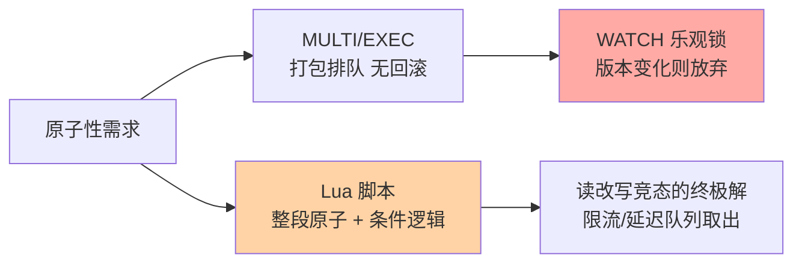
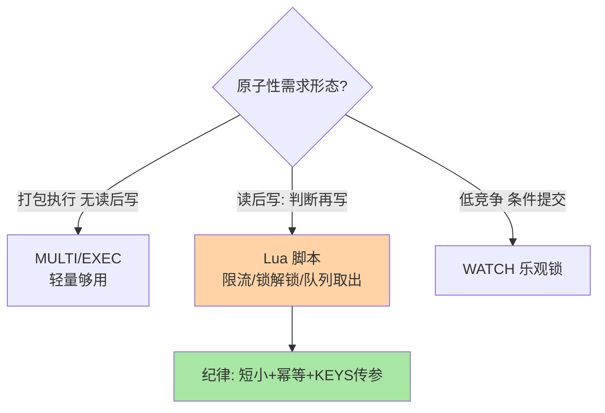

# 事务与 Lua 脚本：单线程下的原子性工具

> 一句话：MULTI/EXEC 提供「命令打包排队」的弱事务（无回滚），Lua 脚本提供「整段原子执行」的真原子（还能读后写）——需要原子性用 Lua，需要打包发送用事务。

## 🎯 本文核心

**核心一句话：Redis 的原子性工具分两级——MULTI/EXEC 只保证「打包执行不被插队」（命令入队一次性执行，但单条语法错不回滚），Lua 脚本保证「整段逻辑原子」（脚本执行期间无其他命令插入，且能读取中间结果做条件分支）——「读后写」的原子需求只能 Lua。**

组织主线（底层机制：单线程串行执行是原子性的原理地基，两种工具都在这条机制上做应用层封装）：



## 一句话摘要

Redis 命令天然原子（单线程），但**多条命令的组合**可能被其他客户端插队——两个工具补这个缺口：**事务（MULTI/EXEC）**把一组命令打包，EXEC 时整批按序执行、中间不被插队；但它「不保证全部成功」（单条语法错在入队时会让 EXEC 拒绝执行，运行时错——如对 String 执行 LPUSH——只报错该条、其余照常执行），也**不提供回滚**。**Lua 脚本（EVAL）**把一段脚本作为一个命令原子执行（底层机制：脚本执行期间事件循环不处理其他客户端，串行性由架构保证）：脚本内可以读值、判断、再写——「检查余额再扣减」这类读改写竞态只有它能原子解决。WATCH 提供乐观锁：事务执行前监视 key，被改过则 EXEC 放弃。

## 一、MULTI/EXEC：打包但不回滚

```text
MULTI
SET cart:1001:count 5
INCR stats:carts
EXEC          ← 三条命令一次性按序执行，中间无插队
```

两个必须认清的边界：**①没有回滚**——运行时错误（类型错）只报错该条，已执行的不撤销（官方立场：Redis 错误源于编程 bug 而非运行态，回滚不值得付出性能）；**②入队即校验语法**——MULTI 后命令先入队，语法错在入队时就标脏，EXEC 直接拒绝整批。所以事务的定位是「打包与执行序保证」，不是「数据库事务的原子回滚」——语义落差是误用的第一大来源。

## 5W 速记卡

| 维度 | 一句话 |
|---|---|
| What | MULTI/EXEC 打包事务 + Lua 脚本原子段 + WATCH 乐观锁 |
| Why | 多命令组合需要「不被插队」甚至「读后写原子」 |
| When | 批量写、读改写竞态、限流计数、延迟队列取出 |
| Where | 客户端流水线之上的两种原子工具 |
| How | MULTI...EXEC；EVAL script keys args；WATCH/MULTI/EXEC |

## 二、Lua 脚本：读改写竞态的终极解

```lua
-- 限流：判断 + 计数原子化（KEYS[1]=限流key, ARGV=窗口/上限）
local current = tonumber(redis.call('GET', KEYS[1]) or '0')
if current + 1 > tonumber(ARGV[2]) then
    return 0
end
redis.call('INCR', KEYS[1])
redis.call('EXPIRE', KEYS[1], ARGV[1])
return 1
```

Lua 的不可替代性在「**读后写**」：GET 结果决定后续写什么——这个模式在单线程插队风险下无法用裸命令安全实现。典型场景：限流（判断+计数）、延迟队列取出（ZRANGEBYSCORE + ZREM 原子化）、分布式锁解锁（GET 校验 token + DEL，防止误删他人的锁，见特性层分布式锁系列）。脚本纪律：**短小纯操作**（循环计算会卡单线程）、**幂等设计**（脚本超时重试要安全）、**KEYS/ARGV 传参**（key 写死在脚本里会让集群路由失效）。

> 💡 **实战提示**
> - 脚本超时是单线程事故：`busy-reply-threshold`（旧名 lua-time-limit）后 Redis 只能对其他请求回「忙」，脚本跑不完谁都进不来——循环逻辑放应用侧，脚本只做短原子段
- 脚本变更与数据结构变更同步管理：脚本依赖 key 的结构（是 Hash 还是 ZSet），结构改版时脚本同步改版——把脚本当「存储过程」管理进版本库
> - 集群模式的脚本路由：脚本访问的所有 key 必须同槽（hash tag `{...}` 归组），跨槽脚本直接报错——设计 key 时就要为脚本留好 hash tag
> - WATCH 适合低竞争：高竞争下「执行前被改 → 重试」的重试风暴不如直接上 Lua——竞争度是两者选型的分水岭

## 三、与「数据库事务」的区别

同名「事务」，语义差两个等级：数据库事务有 ACID 的 A 与 C（回滚 + 约束一致），Redis 事务只有「打包不被插队」（I 由单线程天然成立，D 靠持久化）——没有回滚、没有约束校验、没有隔离级别可选（执行期串行天然隔离）。**别用数据库事务的心智写 Redis 事务**：需要「全成全败」的语义时，用 Lua 在脚本内自行处理失败分支，或把事务语义留给数据库。这个认知差是「从数据库转过来」的开发者最高频的误用。



## 四、典型使用场景

- **分布式锁解锁**：Lua「GET 校验 token + DEL」——防止锁过期后误删别人的锁（锁演进见特性层）
- **限流器**：上文的「判断 + 计数 + 续期」原子段——固定窗口与滑动窗口的 Lua 实现都是几行
- **延迟队列消费**：ZSet「取到期 + 删」原子化——防多消费者重复取（ZSet 篇的遗留问题在此闭环）
- **计数器组合语义**：INCR 后判断阈值再触发动作（超限报警标记）——判断与写必须原子
- **批量原子写**：MULTI 打包多 key 写入（无读后写需求时够用，且比 Lua 轻）

## 五、误区与代价

- ❌ **「MULTI/EXEC 会回滚」**：不会——运行时错误不撤销已执行命令，「当数据库事务用」的预期直接导致脏数据
- ❌ **「Lua 里写循环聚合」**：脚本执行占住单线程，百万级循环 = 全实例冻结——计算逻辑在应用侧，脚本只做「读判写」的短原子段
- ❌ **「脚本不幂等照上重试」**：网络超时后客户端无法区分「没执行/执行了」，非幂等脚本重试 = 重复扣减——写脚本先写「重试安全」分析
- ❌ **「WATCH 盯住就万无一失」**：WATCH 的重试成本随竞争度暴涨，且 EXEC 空转也是一次往返——高竞争场景直接 Lua

## 六、你们可能会问

**Q1：事务和流水线（pipeline）什么区别？**
流水线只是「攒一批一次发送省网络往返」，不保证整批原子（其他客户端的命令可穿插执行）；MULTI/EXEC 保证整批按序不被插队。性能优化用 pipeline，原子性用事务/Lua——两类需求别混。

**Q2：脚本执行到一半 Redis 崩了怎么办？**
AOF 记录的是脚本本体（而非执行效果），重启后重放脚本——前提是脚本确定性（不依赖时间/随机）。非确定性脚本（TIME/RANDOMKEY 类命令）在 AOF 场景有复制与重放风险，编写时要规避。

**Q3：EVALSHA 为什么比 EVAL 好？**
EVAL 每次传脚本全文（网络开销 + 大脚本慢），EVALSHA 传脚本 SHA1 缓存引用（一次加载反复调用）——生产标准做法：加载时处理 NOSCRIPT 异常回退 EVAL，客户端库一般已封装。

## 七、什么时候用 / 不用

- ✅ Lua：一切「读后写」原子需求——限流、锁解锁、队列取出、条件更新
- ✅ MULTI/EXEC：无读后写的批量写入打包——比 Lua 轻，语义刚好
- ❌ 不用事务求回滚——Redis 没有回滚，语义缺位时用应用层补偿
- ❌ 不用 Lua 做计算与批量搬运——脚本的长与重是单线程事故的直通车

## 八、开放问题

- Redis Functions（7.x，服务端持久化函数库）让脚本从「客户端携带」演进为「服务端注册」，脚本版本管理与多客户端共享的工程形态正在重塑
- 脚本的资源隔离（防长脚本阻塞）没有完美方案，执行配额与超时细粒度化的讨论长期存在——「短脚本纪律」仍是当下唯一可靠实践

## 九、自测三问

1. MULTI/EXEC 保证什么、不保证什么？「不回滚」的官方理由是什么？
2. 为什么「读后写」只能用 Lua？举三个典型场景。
3. 事务与 pipeline 的区别是什么？WATCH 适用的竞争度范围？

下一篇讲「Pipeline 与批量操作」：省网络往返的正确姿势与边界。

## 🎯 核心带走

- **核心一句话**：原子性两级工具——事务打包不插队（无回滚），Lua 整段原子可读后写；「读改写竞态」一律 Lua，脚本短小幂等是纪律
- **主线**：两级工具 → 事务边界 → Lua 三场景 → WATCH 分工
- **哪里坏**: 当回滚用、长脚本卡实例、非幂等重试、跨槽脚本
- **边界**：本篇管原子性工具；pipeline 在下一篇，锁的完整演进在特性层分布式锁系列

## 📌 数据与事实声明

- 写于 2026-09-10；MULTI/EXEC、EVAL/EVALSHA、Functions（7.x）、busy-reply-threshold 改名以 Redis 官方文档公开口径为准
- 「脚本短小纯操作」「KEYS/ARGV 传参」为业内脚本纪律，非官方强制
- 免责：命令与配置名随版本演进可能调整，以官方文档为准

## 📚 参考资料

| 类型 | 标题 | 来源 |
|---|---|---|
| 官方文档 | Redis Topics: Transactions / Lua Scripts / Functions | redis.io/docs |
| 官方源码 | redis/redis（src/t_string.c、src/script.c、src/transactions.c） | github.com/redis/redis |
| 系列导航 | Redis 系列目录 | `docs/middleware/redis/index.md` |
