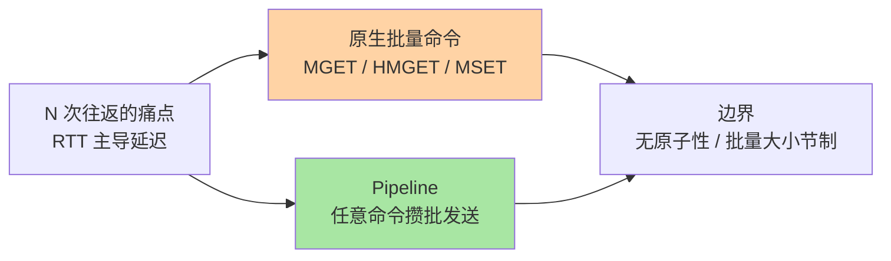
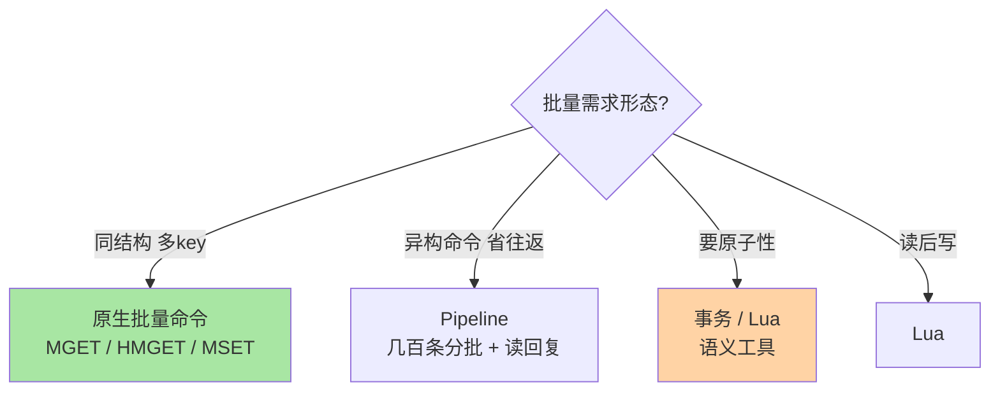

# Pipeline 与批量操作：把网络往返省出来

> 一句话：Redis 命令执行微秒级、网络往返毫秒级——性能优化的第一杠杆不是让命令更快，而是让往返更少：原生批量命令（MGET/MSET）优先，跨结构批量用 Pipeline。

## 🎯 本文核心

**核心一句话：批量化的本质是把 N 次网络往返压成 1 次——原生批量命令（MGET/MSET/HMGET）是同结构批量的一等公民，Pipeline 是任意命令组合的打包通道；两者都不保证原子（与事务的区别），省的是时间不是语义。**

组织主线：

## 一句话摘要

Redis 单条命令执行是微秒级，但每次网络往返（RTT）是亚毫秒到毫秒级——「一次取 100 个 key」若发 100 次 GET，时间被网络吃掉 99%。两种批量化手段：**原生批量命令**——MGET/MSET（String）、HMGET（Hash 字段）等，一条命令服务多 key，语义内建；**Pipeline**——客户端把任意多条命令攒在缓冲区一次发送、一次接收，往返从 N 次降为 1 次，不要求命令同构。两者都不提供原子性（批量执行中间可能插入其他客户端命令）——批量是性能工具不是事务工具（原子性分工见上篇）。

## 一、原生批量命令：先查有没有现成的

选型的第一动作是「找原生批量命令」：取多个 String 用 MGET、设多个用 MSET、取多个 Hash 字段用 HMGET、判断多个存在用 EXISTS 多参——原生命令比 Pipeline 更好：一次解析一次执行，语义完整。用 Pipeline 模拟原生命令能做的事，是「没想到查命令」的浪费。原生批量的边界：**集群模式下 MGET 跨槽会退化**（客户端按槽分组发多次请求或报错，取决于客户端实现）——key 设计规范篇的 hash tag（`{user1001}:cart`）就是为批量与脚本预留的路由归组手段。

## 5W 速记卡

| 维度 | 一句话 |
|---|---|
| What | 原生批量命令 + Pipeline 打包通道，RTT 压缩的两级工具 |
| Why | RTT 主导延迟，批量是第一性能杠杆 |
| When | 一次取/写多个值、批量预热、读扩散聚合 |
| Where | 客户端缓冲区到服务端的传输层优化 |
| How | MGET/HMGET 优先；任意组合用 Pipeline；配合 Lua 做原子 |

## 二、Pipeline：任意命令的攒批通道

Pipeline 的机制：客户端把命令写入发送缓冲区攒批，一次 flush 发出；服务端逐条执行后把结果攒批一次返回——**省的是往返，不是执行时间**（执行总量不变，仍是逐条）。三重收益场景：页面聚合取多缓存（往返 100 → 1）、批量写入预热（写 1 万条）、混合读写序列。三条使用纪律：**①批要节制**——一次攒 1 万条命令，服务端的结果缓冲区与客户端内存同时承压，按几百到上千条分批；**②每批要读回复**——只发不读会让缓冲区双向膨胀；**③失败要处理**——pipeline 中某条命令失败不影响其他条（无原子性），逐条校验结果。

> 💡 **实战提示**
> - 批量大小从 100-1000 起压测：单批过大让服务端结果缓冲膨胀、客户端响应等待变长——「最大批」与「最优批」按 value 大小实测
> - 什么时候用 Lua 替代 Pipeline：需要「上条结果决定下条」或原子性时——pipeline 是并行的省时，Lua 是串行的原子，语义不同
> - 集群下 pipeline 的槽位拆分：客户端库一般自动按槽分组发多次 pipeline——理解这点才能解读「集群下批量没有单机快」的观测
> - 大 value 批量再打折扣：批 500 条大 JSON 的返回体可能数十 MB——批量大小与单值大小一起算总账

演进视角：从「逐条命令」到「原生批量」到「pipeline」再到「RESP3 推送」，Redis 的传输效率演进主线就是把「网络往返」逐步压扁——客户端与服务端的上下游协同（缓冲、协议、 batching 策略）共同决定最终延迟。

## 三、与「MULTI/EXEC 事务」的区别

两者都会「攒一批一次交互」，容易混淆：**事务**的目的是原子语义（整批不被插队执行），**pipeline** 的目的是网络效率（往返合并，不保证不被插队）；事务可以跑在 pipeline 里（MULTI...EXEC 攒批发送，既是原子的又是省往返的）。判据一句话：**怕被插队用事务/Lua，只省往返用 pipeline**——把 pipeline 当事务用是竞态事故的常见源头。

## 四、典型使用场景

- **页面聚合读**：一次 pipeline 取齐「用户信息 + 购物车 + 推荐」多缓存——页面级 RT 从 N 次往返压到 1 次
- **批量预热**：启动时/定时任务批量灌缓存——MSET 或 pipeline SET，配合 TTL 抖动
- **计数聚合**：多个计数 key 的 MGET 汇总——监控看板批量取数
- **删除清理**：批量 UNLINK 打包——治理类任务的标配形态

## 五、误区与代价

- ❌ **「pipeline 攒越大越快」**：单批过大双向缓冲膨胀、尾部命令等待头部——批大小压测定，常见几百条一档
- ❌ **「pipeline 有原子性」**：执行中间可穿插其他客户端命令——原子需求上事务/Lua，混用语义是竞态源头
- ❌ **「集群下 MGET 一定一次往返」**：跨槽 key 会被分组多次请求——批量友好度是分片键设计的隐藏考量
- ❌ **「只发不读」当异步用**：pipeline 的回复必须消费，缓冲区膨胀会让连接假死——它是同步省时工具不是异步队列

## 六、你们可能会问

**Q1：pipeline 一次发 100 条，服务端是一条条执行还是并行执行？**
仍是一条条串行执行（单线程模型），pipeline 省的是「每条一次往返」的等待，不是并行计算——所以批量的收益上限 = (N-1) × RTT，执行时间本身省不掉。

**Q2：pipeline 中途连接断了怎么办？**
已发送的命令可能部分执行、部分丢失，客户端无法精确知道执行到哪——需要确定性的批量写用事务或 Lua，或按「幂等重试」设计批量任务。

**Q3：什么时候原生批量命令不如 pipeline？**
命令不同构时（一条 GET + 一条 HGETALL + 一条 ZRANGE）只能 pipeline；同构批量永远优先原生（MGET 一条命令的解析与分发成本低于 pipeline 里十条 GET）。

## 七、什么时候用 / 不用

- ✅ 同结构多 key 读写：原生批量命令（MGET/HMGET/MSET）第一优先
- ✅ 异构命令聚合与批量写：pipeline + 几百条分批 + 逐条读回复
- ❌ 不用 pipeline 求原子——语义工具是事务/Lua
- ❌ 不无节制攒批——批量大小与单值大小共同决定单批上限

## 八、开放问题

- 客户端库的「自动 pipeline 化」（命令缓冲自动攒批）在各家库实现程度不一，「透明批量」与「显式控制」的权衡是客户端生态的持续话题
- RESP3 协议的 out-of-band 推送（7.x）让服务端主动推送与批量的交互有了新空间，协议层对批量的影响值得跟踪

## 九、自测三问

1. 原生批量命令与 pipeline 的优先级关系是什么？集群下批量的额外考量？
2. pipeline 省的是什么、不省的是什么？三条例行纪律？
3. pipeline 与事务的判据一句话是什么？

下一篇讲「消息能力」：Pub/Sub 与 Stream——Redis 从缓存走向消息的两级跳。

## 🎯 核心带走

- **核心一句话**：批量 = RTT 压缩的第一杠杆——原生命令优先、Pipeline 管异构、几百条分批、原子需求另请事务/Lua
- **主线**：RTT 账 → 原生批量 → pipeline 机制与纪律 → 与事务的判据
- **哪里会坏**：无原子假设竞态、巨批缓冲膨胀、只发不读、集群跨槽退化
- **边界**：本篇管传输层优化；原子工具在上篇，Stream 消息语义在下一篇

## 📌 数据与事实声明

- 写于 2026-09-10；pipeline 机制、批量命令语义、RESP3 推送以 Redis 官方文档公开口径为准
- 「100-1000 条/批」为业内经验起点，按 value 大小压测定
- 免责：客户端行为与集群路由策略因实现而异，以所用客户端文档为准

## 📚 参考资料

| 类型 | 标题 | 来源 |
|---|---|---|
| 官方文档 | Redis Pipelining / Redis on Massively Parallel Servers | redis.io/docs |
| 官方文档 | RESP3 协议规范 | github.com/redis/redis-specifications |
| 系列导航 | Redis 系列目录 | `docs/middleware/redis/index.md` |
