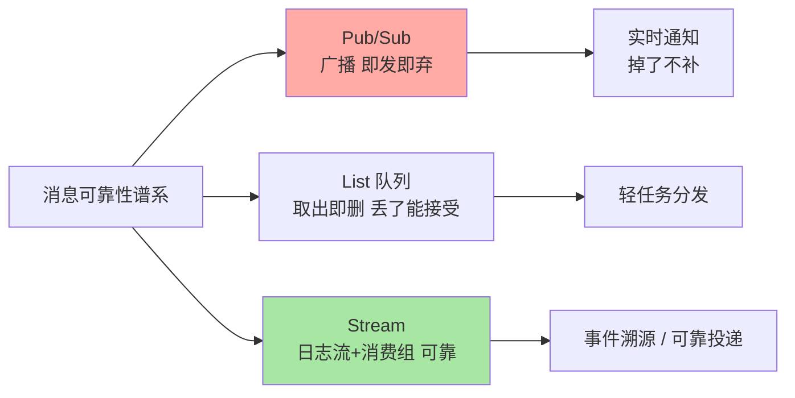
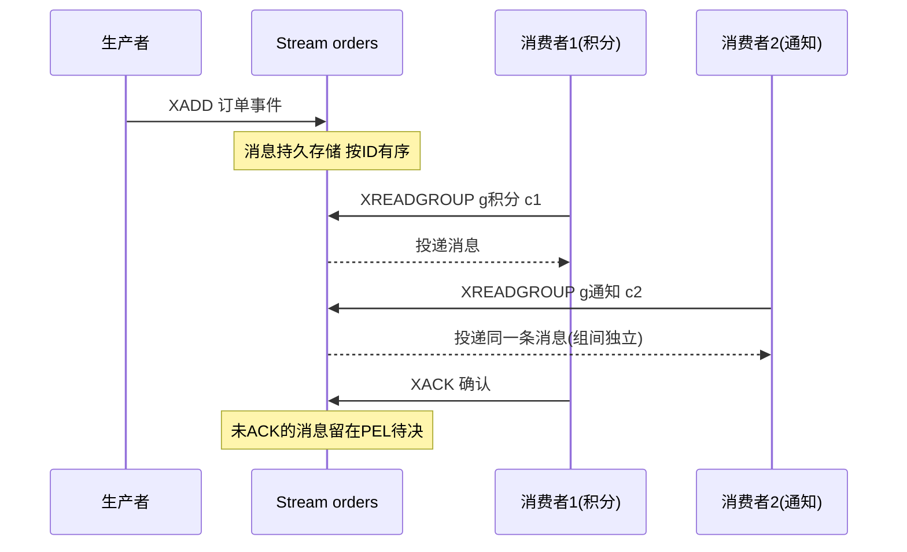

# 消息能力：Pub/Sub 即发即弃与 Stream 可靠流

> 一句话：Pub/Sub 是「在线广播」（不存储、掉线即丢），Stream 是「可回放的日志流」（消费组、确认、持久化）——两级消息语义对应两种可靠性等级，List 队列居其中间。

## 🎯 本文核心

**核心一句话：Redis 的两级消息能力按可靠性分层——Pub/Sub 纯转发不存储（订阅者必须在线，掉线期间的消息永久丢失），Stream 是 append-only 日志 + 消费组（消息落盘可回放、确认与待决机制保证不丢）；消息可靠性需求决定选哪级，越级使用是丢消息事故的源头。**

组织主线：



## 一句话摘要

Redis 提供两级消息语义：**Pub/Sub**——发布者 PUBLISH 频道，所有在线订阅者立即收到，服务端不存任何消息：延迟极低、实现极简，但「订阅者断线期间的消息」与「新订阅者看不到历史」是结构性的（它根本没有存储）。**Stream**（5.0+）是 append-only 日志结构：消息带 ID 按序持久存储，消费组（consumer group）支持多消费者分工、XACK 确认、PEL 待决列表追踪「已投递未确认」——离线消费者回来还能从上次位置继续，是「可靠队列 + 可回放日志」的完整形态。两者加上 List 队列，构成 Redis 内的可靠性三级谱系。

## 一、Pub/Sub：极低延迟的在线广播

```text
SUBSCRIBE chat:room:1001        # 订阅频道（支持模式订阅 PSUBSCRIBE）
PUBLISH chat:room:1001 "hello"  # 发布，所有在线订阅者立即收到
```

Pub/Sub 的全部特性都源于「不存储」：转发是内存级的所以延迟极低；没有持久化所以掉线即丢；没有历史所以新订阅者白纸一张。适用判据一句话：**「错过就错过」的消息才用 Pub/Sub**——实时行情推送、聊天室在线消息、配置变更通知（客户端断线后会全量拉一次配置兜底）。「错过会造成业务状态不一致」的消息（订单事件、库存变更）是 Stream 或专业 MQ 的领地。

## 5W 速记卡

| 维度 | 一句话 |
|---|---|
| What | Pub/Sub 在线广播 + Stream 持久日志流（消费组/确认/回放） |
| Why | 「实时通知」与「可靠事件流」是两种可靠性等级 |
| When | Pub/Sub：在线通知；Stream：订单事件、审计流、任务队列 |
| Where | 服务端内存（Stream 受 MAXLEN/持久化约束） |
| How | PUBLISH/SUBSCRIBE；XADD/XREADGROUP/XACK |

## 二、Stream：日志流 + 消费组的完整形态

```text
XADD orders * order_id 1001 amount 99     # 追加消息（* 自动生成 ID）
XGROUP CREATE orders g1 0                  # 建消费组 g1
XREADGROUP GROUP g1 consumer1 COUNT 10 STREAMS orders >   # 消费者取新消息
XACK orders g1 <message-id>                # 处理完成确认
XPENDING orders g1                          # 查「已投递未确认」的待决列表
```

Stream 的可靠性机制三件：**消息持久存储**（受 MAXLEN 截断与持久化配置约束，可回放历史）；**消费组分工**（组内多消费者分摊，互不重复消费）；**PEL 待决追踪**（投递后未 XACK 的消息记录在案，消费者恢复后 XCLAIM 认领重处理）——「至少一次投递」的语义靠这套机制闭环。消息 ID 是「毫秒时间戳-序列号」，天然按时间有序，`XREAD` 从任意 ID 读起，让 Stream 同时具备「队列」与「事件日志」双重身份。



## 三、三级谱系的选型判据

| 结构 | 可靠性 | 存储 | 消费语义 | 适用 |
|---|---|---|---|---|
| Pub/Sub | 即发即弃 | 无 | 在线广播 | 行情/通知/信令 |
| List 队列 | 取出即删 | 有（不回放） | 竞争消费 | 轻任务分发 |
| **Stream** | 至少一次 | 有（可回放） | 消费组 + 确认 | 事件流/可靠队列 |

判据链：「错过可接受吗」——可接受用 Pub/Sub；「处理失败要重试吗」——不要重试用 List，要确认与重试用 Stream。「专业 MQ（RocketMQ/Kafka）该上场吗」——消息量大、需要堆积、需要事务消息、需要重试死信体系时，Redis 的消息能力是轻量替代不是等价物——**按消息的规模与可靠性预算选级，Redis 流是轻量级答案不是终局答案**。

> 💡 **实战提示**
> - Stream 必须配 MAXLEN（如 `XADD ... MAXLEN ~ 100000`）：不截断的 Stream 是无限增长的巨型 key——`~` 近似截断性能好于精确值
> - PEL 待决消息要监控：消费者取走后崩溃，消息滞留 PEL——定时 XAUTOCLAIM（6.2+）认领闲置消息，或告警人工介入
> - Pub/Sub 的「订阅必须先于发布」是排障高频点：先 PUBLISH 后 SUBSCRIBE 收不到不是 bug 是语义；时序敏感场景用 Stream 落历史再消费
> - 消费者处理逻辑要幂等：至少一次投递意味着可能重复收到（XACK 前崩溃重投）——幂等是消费端的义务

## 四、与「专业 MQ」的区别

Stream 对标 Kafka 的「日志 + 消费组」心智模型，能力差距在规模与治理：Kafka 的分区并行、海量堆积（磁盘级）、重试/死信主题体系、事务消息，Stream 都没有对应物（PEL 是最简待决，无死信队列；堆积受内存约束）。定位分工：**Redis Stream 服务「轻量、低量级、与缓存同域」的消息**（实例内事件、小规模任务流）；跨系统的事件总线、高吞吐管道是专业 MQ 的主场。选型逻辑与「缓存 vs 数据库」同构：能力边界内的轻量方案优先，边界外不硬撑。

## 五、典型使用场景

- **实时通知**：Pub/Sub 推送聊天消息、行情报价、协同编辑信令——在线广播语义
- **配置变更广播**：Pub/Sub 通知各实例「配置变了」，客户端收到后全量拉取——通知与数据分离的稳妥组合
- **订单事件流**：Stream 记录「创建/支付/发货」事件，消费组分别驱动积分、通知、对账——一个事件多个下游
- **轻量任务队列**：Stream + 消费组替代 List 队列——需要确认与重试的场景升级到此
- **审计与操作日志**：Stream 的时间序 + 可回放，XREAD 从头重放审计轨迹

## 六、误区与代价

- ❌ **「Pub/Sub 丢消息是 bug」**：不存储是它的设计而不是缺陷——把「不能丢」的消息发进 Pub/Sub 是选型错误不是实现故障
- ❌ **「Stream 不配 MAXLEN 上线」**：内存级日志无限增长，直到内存淘汰开始误伤全实例——截断策略是 Stream 落地的第一行配置
- ❌ **「XREADGROUP 取了就算消费了」**：未 XACK 的消息在 PEL 里反复认定待决——确认语义是消费组的灵魂，处理完必 XACK
- ❌ **「用 Redis 流扛核心交易消息」**：堆积能力、死信体系、运维生态与专业 MQ 差距明确——核心链路的消息选型按终局规模算账

## 七、你们可能会问

**Q1：消费组内消息会重复投递给两个消费者吗？**
不会——组内一条消息只投给一个消费者（分工语义）；会重复的场景是「投了没 XACK → 消费者离线 → 被其他消费者 XCLAIM 认领」，这是至少一次语义的重投，靠消费端幂等消化。

**Q2：Stream 的消息 ID 能自己指定吗？**
可以（XADD 指定 `毫秒-序列`），但要严格递增——自定 ID 的价值在于「业务事件时间戳」与「消息序」对齐（如从其他系统同步事件进 Stream 保持原序）。

**Q3：Pub/Sub 怎么做「不丢」的兜底？**
架构级兜底：通知消息里只带「事件发生了」的信号，消费端收到后全量拉取最新状态——把「消息可靠性」问题转化为「信号 + 拉取」，Pub/Sub 只承担信号通道。

## 八、什么时候用 / 不用

- ✅ Pub/Sub：错过无损的实时广播——信令、通知、行情
- ✅ Stream：轻量级事件流与可靠队列——实例域内、量级可控、需要确认回放
- ❌ 核心交易消息、海量堆积、复杂重试——专业 MQ 的领地，边界外不硬用
- ❌ Pub/Sub 承载状态同步——状态走「信号 + 拉取」，不走「广播即事实」

## 九、自测三问

1. 三级消息谱系的可靠性语义分别是什么？判据链怎么走？
2. Stream 的可靠性三件（存储/消费组/PEL）各自解决什么问题？
3. Stream 与专业 MQ 的边界怎么判？三个关键差距是什么？

## 开放问题

- Stream 消费组的故障转移与负载再平衡仍是手工配置为主（对比 Kafka 的协调器自动分配），自动化消费组治理是社区演进方向
- Redis 作为「轻事件总线」在可观测性（消息轨迹、积压可视化）上的工具链成熟度不足，与专业 MQ 的运维差距是选型的隐性权重

下一篇讲「主从复制」：Redis 的副本如何同步——全量 RDB + 增量命令流的两段式。

## 🎯 核心带走

- **核心一句话**：Pub/Sub 在线广播（不存即丢）、List 取出即删、Stream 持久日志 + 消费组（至少一次可回放）——按可靠性预算选级，边界外交给专业 MQ
- **主线**：可靠性谱系 → Pub/Sub 语义 → Stream 三件套 → 选型判据链
- **哪里会坏**：Pub/Sub 承载不可丢消息、Stream 无 MAXLEN、XACK 缺失 PEL 堆积、消费端不幂等
- **边界**：本篇管消息语义；List 队列在篇 4，主从复制如何保消息数据安全在下一篇

## 📌 数据与事实声明

- 写于 2026-09-10；Pub/Sub、Stream（5.0+）、消费组/PEL/XAUTOCLAIM（6.2+）以 Redis 官方文档公开口径为准
- 「MAXLEN 近似截断」「消费端幂等」为业内落地纪律
- 免责：命令与行为随版本演进可能调整，以官方文档为准

## 📚 参考资料

| 类型 | 标题 | 来源 |
|---|---|---|
| 官方文档 | Redis Topics: Pub/Sub / Redis Streams Tutorial | redis.io/docs |
| 官方源码 | redis/redis（src/t_stream.c、src/pubsub.c） | github.com/redis/redis |
| 系列导航 | Redis 系列目录 | `docs/middleware/redis/index.md` |
