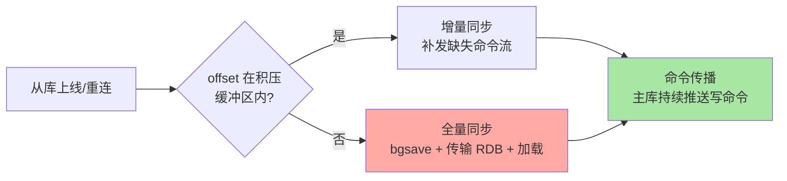
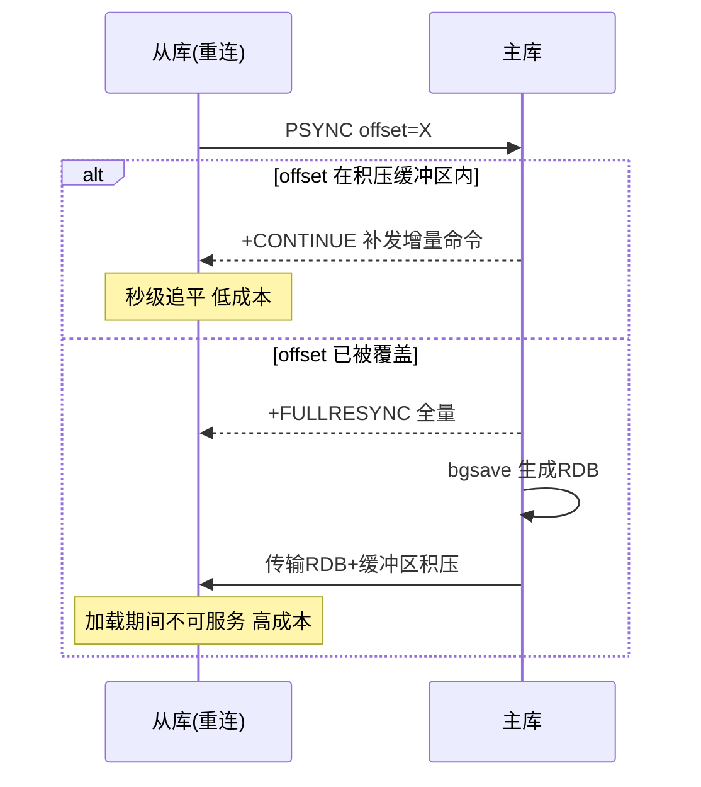

# 主从复制：全量快照加增量命令流的两段式同步

> 一句话：从库首次同步拿一份 RDB 全量快照，之后主库把写命令实时流过来——「全量打底 + 增量续传」与 MySQL 复制同构，速度极快但断线重连可能触发代价高昂的全量重来。

## 🎯 本文核心

**核心一句话：Redis 主从复制 = 全量同步（主库 bgsave 生成 RDB 传给从库）+ 增量同步（复制积压缓冲区的写命令流）——从库 offset 追得上缓冲区就增量续传，追不上（断线太久）就重新全量；复制的健康度取决于「缓冲区够不够大」与「断线够不够短」。**

组织主线：

## 一句话摘要

Redis 主从复制的架构：从库 `REPLICAOF` 指向主库后，先走**全量同步**——主库 bgsave 生成 RDB 传输给从库加载，期间的写命令暂存进「复制积压缓冲区」（repl-backlog，环形缓冲区）随后补发；之后进入**命令传播**——主库把每条写命令实时推给从库，从库记录复制偏移量（offset）。从库断线重连时带上自己的 offset：还在积压缓冲区范围内就只补增量（便宜），超出范围（断线太久或缓冲区太小）只能重新全量（昂贵——bgsave + 全量传输对主库与网络都是一次冲击）。复制默认异步：主库不等从库确认，主从延迟与主库故障时的数据丢失窗口由此而来。

## 一、全量同步的代价账

全量同步是复制体系里最昂贵的动作，账单有四笔：主库 bgsave 的 fork 停顿与写时复制内存放大、RDB 传输的网络带宽、从库加载期间不可服务、传输期间的新写命令继续积压。**触发它的场景要重点管理**：新从库上线（不可避免，选低峰）、断线过久 offset 失效（调大 `repl-backlog-size` 提高增量命中率）、主从切换后全拓扑重新同步（拓扑设计的重点考量）。业内经验：积压缓冲区按「写入速率 × 容忍断线时长」估算（如 10MB/s 写入 × 60 秒 = 600MB 起步），让常见抖动都落在增量区间。

## 5W 速记卡

| 维度 | 一句话 |
|---|---|
| What | 全量 RDB 打底 + 积压缓冲区增量续传 + 命令实时传播 |
| Why | 读扩展与数据冗余依赖副本 |
| When | 一主多从是生产默认形态；切换与扩容时理解复制行为 |
| Where | 主库（bgsave/积压缓冲区/命令推送）→ 从库（加载/回放） |
| How | REPLICAOF 配置；调 repl-backlog-size 保增量命中 |

## 二、读写分离：复制最大的受益场景

读多写少的业务把读流量分摊到从库：主库专注写，从库承接查询。工程要点三件：**①容忍延迟**——从库数据「不新于」主库，读扩散业务要能容忍秒级旧读；**②写后读自己**——改完立刻要见结果的请求走主库（应用层路由规则），或用 `WAIT` 命令等从库追平；**③从库只读**——`replica-read-only yes` 防止误写。与 MySQL 读写分离（主从延迟篇）的心智同源：副本的延迟是结构性的，治理靠路由策略而非期望它消失。

> 💡 **实战提示**
> - 积压缓冲区给足：断线重连走增量还是全量的分水岭——监控主从断线事件，全量同步频率高就加倍 backlog
> - 什么时候必须关注复制延迟：读扩散承担核心查询时——`master_repl_offset` 与 `slave_repl_offset` 的差值进监控
> - 从库扛读也要容量评估：从库同时承担「回放写命令 + 服务读查询」，规格与主库倒挂 = 延迟结构性恶化（与 MySQL 同一红线）
> - 无盘复制（repl-diskless-sync）适合磁盘慢网络快的场景：RDB 直接走网络不落盘——权衡是主库内存压力（网络缓冲）

## 三、与「MySQL 主从复制」的区别

同构的两段式（全量打底 + 增量续传），介质决定速度与形态：Redis 增量是「命令流」（内存命令直接转发，毫秒内追平），MySQL 增量是「binlog 重放」（从库 SQL 线程执行，延迟以秒计）；Redis 全量是 bgsave 快照传输，MySQL 全量是备份导入——Redis 复制通常快两个数量级，但堆积能力弱（积压缓冲区是内存环形区，容量有限；MySQL binlog 可磁盘堆积很久）。**快而短的缓冲 vs 慢而长的日志**是两者复制体系的画像差异。

## 四、典型使用场景

- **读扩展**：一主多从分摊读流量——缓存集群的标准部署形态
- **数据冗余**：主库磁盘损坏后从库顶上（配合哨兵自动切换，见下一篇）
- **持久化分担**：从库承担 RDB/AOF 落盘，主库关持久化省性能——但主库至少留一份快照防「空主清空全集群」（持久化篇的事故）
- **级联复制**：从库挂从库，减轻主库推送压力——大扇出拓扑的标配手段

## 五、误区与代价

- ❌ **「复制 = 备份」**：主库误删的命令原样流向所有从库——`FLUSHALL` 数秒内清空全集群；备份与复制是两道独立防线（与 MySQL 同一铁律）
- ❌ **「积压缓冲区用默认值就行」**：默认 1MB 在现代写入量下极小，断线几秒就触发全量重做——按写入速率估算是必做动作
- ❌ **「主从延迟可以忽略」**：Redis 复制虽快但非零——写后读一致性敏感的业务要么读主要么显式 WAIT
- ❌ **「级联链越长越好」**：级联降低主库压力但延迟逐级累积、故障影响面链式放大——层级控制在两层内是稳妥口径

## 六、你们可能会问

**Q1：主库故障后从库会自动顶上吗？**
不会——主从复制只管数据同步，故障检测与切换是哨兵（或集群）的职责；纯主从架构下主库挂了需要人工提升从库（`REPLICAOF NO ONE`）。自动化切换见下一篇哨兵机制。

**Q2：从库可以写数据吗？**
技术上从库默认拒绝写入（replica-read-only），写入从库的数据不会同步回主库也不参与复制语义——「从库写数据」在任何意义上都是错误用法，只读是唯一正确姿态。

**Q3：复制积压缓冲区只有一个吗？**
是——主库维护**一个**积压缓冲区服务所有从库（共享环形区），这正是它的容量要按「最快从库 × 最长容忍断线」估算的原因；MySQL 的 binlog 则是所有从库共享同一份日志文件，形态不同道理相通。

## 七、什么时候用 / 不用

- ✅ 一主多从 + 读写分离：生产默认形态，读扩展与冗余双收益
- ✅ 调大积压缓冲区 + 监控复制偏移差：让断线尽量落在增量区间
- ❌ 不用复制替代备份：误操作传播是复制语义的一部分
- ❌ 不手工提升从库当日常——计划内切换走哨兵或人工 SOP，明确「谁当主」

## 八、开放问题

- 复制的 diskless 模式与无盘化趋势（快照直传不落盘）在容器化/云盘场景的适用边界持续演进
- 多主写入（CRDT 类 conflict-free 结构）在 Redis 企业版存在，开源主线的多主语义仍未落地——「主从单写」的模型边界是社区长期共识

## 九、自测三问

1. 全量同步的触发条件与四笔代价账是什么？
2. 积压缓冲区的大小怎么估算？它是主库一个还是每从库一个？
3. 读写分离的三个工程要点是什么？「复制 = 备份」错在哪？

下一篇讲「哨兵机制」：给主从架构装上「故障检测 + 自动切换」的大脑。

## 🎯 核心带走

- **核心一句话**：复制 = 全量 RDB 打底 + 积压缓冲区增量续传 + 命令实时传播——快而短（缓冲区内存限），健康度靠 backlog 容量与断线时长共同决定
- **主线**：两段式同步 → 全量代价账 → 读写分离三要点 → 与 MySQL 的形态差异
- **哪里会坏**：backlog 太小频繁全量、主从延迟伤读扩散、空主清空集群、级联过深
- **边界**：本篇管「数据怎么同步」；故障怎么自动切换在哨兵篇，同步细节（PSYNC/部分重同步）在特性层高可用系列

## 📌 数据与事实声明

- 写于 2026-09-10；PSYNC/积压缓冲区/无盘复制机制以 Redis 官方文档与源码公开口径为准
- 「backlog 按写入速率 × 断线时长估算」「层级两层内」为业内经验口径
- 免责：配置项与默认值随版本演进可能调整，以官方文档为准

## 📚 参考资料

| 类型 | 标题 | 来源 |
|---|---|---|
| 官方文档 | Redis Topics: Replication | redis.io/docs |
| 官方源码 | redis/redis（src/replication.c） | github.com/redis/redis |
| 系列导航 | Redis 系列目录 | `docs/middleware/redis/index.md` |
