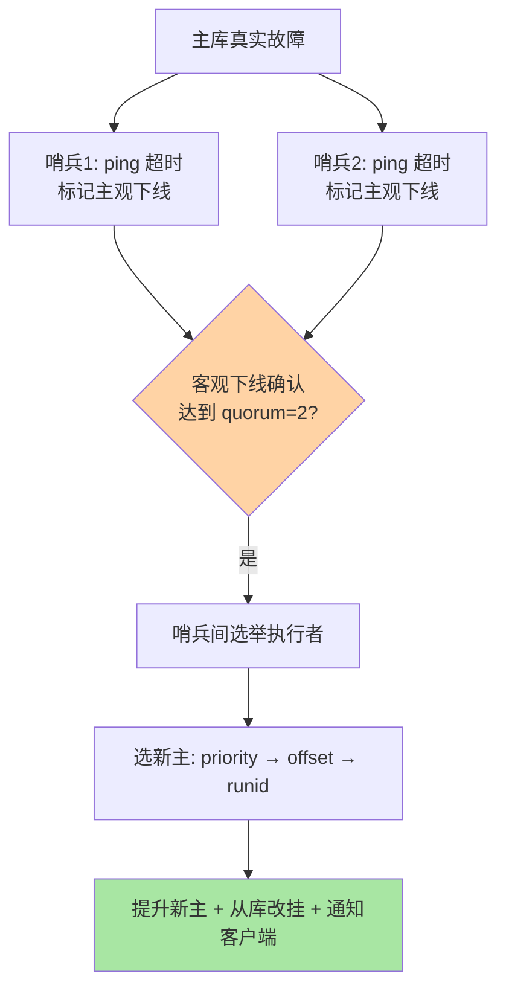

# 哨兵机制：故障检测与自动切换的大脑

> 一句话：哨兵是独立于数据节点的一组监控进程——多数派投票确认「主库真挂了」、从从库中选出新主、通知客户端改连——把人工切换变成秒级自动动作。

## 🎯 本文核心

**核心一句话：哨兵（Sentinel）解决主从架构「谁来切」的问题——多哨兵部署避免单点误判（主观下线 → 多数派确认 → 客观下线），Raft 式选举选出执行哨兵，按优先级/offset 规则挑新主，通知全量客户端改连；哨兵至少三节点且分布在不同故障域，这是它自身防脑裂的底线。**

组织主线：

## 一句话摘要

主从复制解决了「数据有副本」，但主库挂了「谁来判断、谁来切、客户端连谁」三个问题无解——**哨兵（Sentinel）**是独立的监控进程集群补上这块：每个哨兵定期 ping 主库，单哨兵认为挂了叫**主观下线**（可能误判——网络抖动）；超过 quorum 配置数量的哨兵都认为挂了升级为**客观下线**（确认故障）；哨兵之间再选举出一个执行者，从从库中按规则（优先级 → 复制 offset 最大 → runid）挑选新主提升，其余从库改挂新主，并把新主地址通知客户端。哨兵自己也要多节点部署（至少 3 个、分布在不同机器/机架）——监控者自身不能单点，且多数派机制要求奇数节点防投票僵局。

## 一、主观下线与客观下线：两道防误判关卡

网络抖动下「ping 不通」可能是主库挂了，也可能只是哨兵与主库之间的链路问题——单点判断不可靠。哨兵的设计：某哨兵 ping 超时先记**主观下线**（这是我一个人的看法），同时询问其他哨兵「你们看它挂了吗」；达到 quorum 数量（如 5 哨兵配 quorum=2）一致认定才升级**客观下线**（大家都这么看）。两道关卡把「网络抖动误切主」的概率压到极低——误切的代价（切换风暴 + 数据风险）远高于晚切几秒，**宁可慢不可错**是故障检测的设计基调。

## 5W 速记卡

| 维度 | 一句话 |
|---|---|
| What | 独立监控进程集群：故障确认、新主选举、客户端通知 |
| Why | 主从复制没有「谁来切」的答案，人工切换慢且易错 |
| When | 主库故障自动容错的场景；至少 3 哨兵跨故障域部署 |
| Where | 与数据节点分离部署的哨兵进程 |
| How | quorum 配置确认阈值；自动选举新主并通知 |

## 二、新主怎么选：优先级 → offset → runid

客观下线确认后，执行哨兵按三级规则从从库中挑新主：**① replica-priority**（配置的优先级数值越小越优先——运维可指定「这台机器最像主库」）；**② 复制 offset 最大**（数据最全，丢得最少）；**③ runid 最小**（前两者相同时的确定性决胜）。三级规则的本质：先尊重运维意图，再保证数据损失最小，最后保证结果确定——任何情况下选举结果唯一。切换执行的三步：新主执行 `REPLICAOF NO ONE` 提升、其余从库改挂新主、旧主降级为新主的从库（它恢复后自动跟进）。

> 💡 **实战提示**
> - 哨兵三节点起步且跨故障域：同机架的三个哨兵会在机架断电时一起失聪——跨机器/机架/机房是部署底线，奇数个防投票僵局
> - quorum 别配成哨兵总数：5 哨兵配 quorum=3（过半略余）比配 5 稳健——单哨兵失联不阻塞故障确认
> - 客户端必须用哨兵模式连接：直连主库 IP 的客户端在切换后连到旧主（已降级为从库，写入报错）——客户端支持 sentinel 参数是架构前提，上线前核查
> - 脑裂窗口要认知：主库「假死」（客户端网络隔离但哨兵看它正常）期间旧主还在收写，切换后这段写入会丢——`min-replicas-to-write`（最少从库数）配置可收紧写入条件，减少脑裂丢失（机制细节见特性层哨兵脑裂篇）

## 三、与「MySQL 主从切换工具」的区别

同为「检测 + 切换」，形态差异：MySQL 的切换由外部工具（orchestrator/MHA）或组复制协议承担，哨兵是 Redis 官方的内置方案（进程形态独立但生态一体）；切换速度上 Redis 哨兵秒级（数据量小、提升动作轻——一条 REPLICAOF 命令），MySQL 提升涉及 GTID 校验与拓扑重建相对更重。共同的设计哲学：**多数派确认防误判、数据最全者优先、切换必须通知全量客户端**——高可用体系的核心思想跨数据库通用，学一套懂一类。

## 四、典型使用场景

- **标准高可用部署**：一主二从三哨兵——Redis 主从容错的教科书形态
- **客户端透明容错**：应用通过哨兵发现主库地址，故障切换后自动改连——业务无感的故障恢复
- **多主库集群托管**：一套哨兵集群监控多组主从（sentinel monitor 多条配置）——中小规模多实例的省资源形态（大规模用 Cluster）
- **切换演练**：定期 kill 主库验证哨兵链路——与 MySQL 切换演练同一纪律（没演练过的高可用等于没有）

## 五、误区与代价

- ❌ **「两个哨兵就够了」**：两个哨兵无法形成可靠的多数派（一个失联就僵局），quorum 语义失效——3 起步是硬底线
- ❌ **「哨兵和数据节点混部」**：哨兵与主库同机，机器挂 = 监控与数据同时消失——监控进程必须独立故障域
- ❌ **「切换后客户端自动就对了」**：客户端直连 IP 的话切换对它不可见——哨兵感知的客户端接入是架构前提，不是哨兵单方面能保证的
- ❌ **「有了哨兵就不会丢数据」**：异步复制 + 脑裂窗口下，切换仍可能丢「已写未同步」的数据——哨兵解决可用性，不承诺零丢失

## 六、你们可能会问

**Q1：哨兵会不会误切？正常主库被换下来怎么办？**
多数派 + 两道下线关卡让误切概率极低；万一误切，旧主会以从库身份重新加入（哨兵通知它复制新主），数据经同步对齐——代价是短暂的主从角色颠簸，不是数据灾难。

**Q2：主库「半死不活」（慢但不挂）哨兵管吗？**
标准哨兵只判「通不通」（ping 超时），不判「慢不慢」——主库慢引发的可用性问题靠客户端超时与业务降级处理；「慢节点剔除」是 Cluster 或应用层路由的职责。边界清晰：哨兵管死活，不管性能。

**Q3：为什么切换后应用偶尔报「READONLY You can't write against a read only replica」？**
客户端连接池里的旧连接还指向已降级的旧主——哨兵通知了地址变更，但池中存量连接需要失效重建；这提示客户端的哨兵支持实现不完整（连接池刷新逻辑缺失），换完整实现的客户端库。

## 七、什么时候用 / 不用

- ✅ 一主多从 + 三哨兵起步：需要自动容错的 Redis 标准架构
- ✅ 客户端全量接入哨兵发现：切换透明的完整闭环
- ❌ 不用哨兵扛数据分片：它只管高可用不管数据分布——容量扩展是 Cluster 的职责（下一篇）
- ❌ 不在单机部署全部哨兵——监控者的独立性是整个机制的根基

## 八、开放问题

- 哨兵与 Cluster 模式的功能边界（前者管高可用后者管分片+高可用）在社区讨论中时有整合提案，两套体系的统一是长期方向
- 容器/K8s 环境下哨兵的传统部署形态（独立进程 + 手工 quorum 配置）与 Operator 化自动运维的融合在快速演进，云原生改造了哨兵的部署面

## 九、自测三问

1. 主观下线与客观下线的两道关卡如何防误判？quorum 配置的原则是什么？
2. 新主选举的三级规则是什么？各自表达什么意图？
3. 为什么哨兵至少三节点跨故障域？脑裂窗口的写入丢失怎么收紧？

下一篇讲「集群模式」：哨兵解决「挂了怎么办」，Cluster 解决「容量不够怎么办」。

## 🎯 核心带走

- **核心一句话**：哨兵 = 多数派故障确认 + 三级规则选新主 + 全量客户端通知——把人工切换变成秒级自动动作；三节点跨故障域 + 客户端哨兵接入是两大部署前提
- **主线**：三问题（谁判/谁切/连谁）→ 两道下线关卡 → 选举与切换 → 脑裂认知
- **哪里坏**: 单点哨兵失聪、客户端直连 IP、误信零丢失、慢主问题找错对象
- **边界**：本篇是高可用入门；脑裂与选举细节在特性层哨兵脑裂篇，数据分片在下一篇 Cluster

## 📌 数据与事实声明

- 写于 2026-09-10；SDOWN/ODOWN、选举规则、min-replicas-to-write 以 Redis 官方文档公开口径为准
- 「三哨兵跨故障域」「quorum 过半略余」为业内部署惯例
- 免责：配置项与切换行为细节随版本演进可能调整，以官方文档为准

## 📚 参考资料

| 类型 | 标题 | 来源 |
|---|---|---|
| 官方文档 | Redis Sentinel 文档 | redis.io/docs |
| 官方源码 | redis/redis（src/sentinel.c） | github.com/redis/redis |
| 系列导航 | Redis 系列目录 | `docs/middleware/redis/index.md` |
