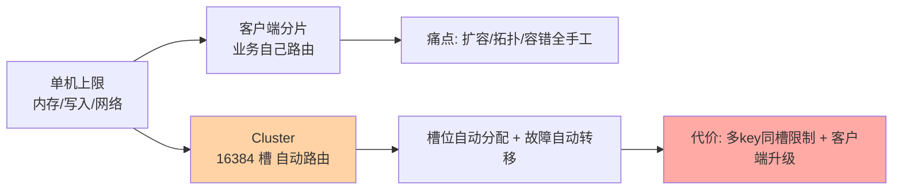
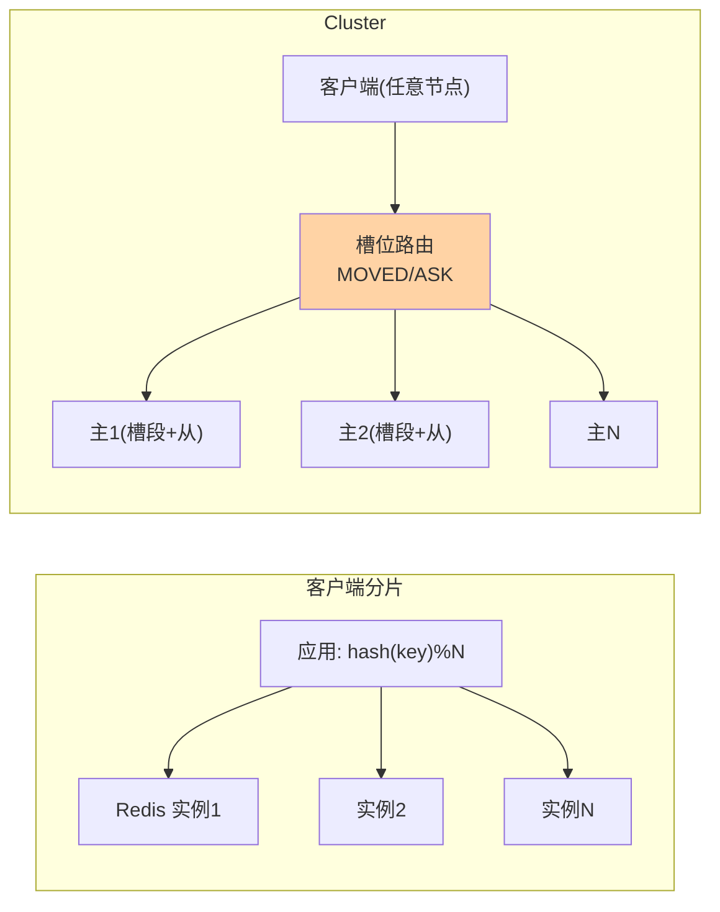

# 集群模式：16384 个哈希槽的分片世界

> 一句话：Cluster 把数据按「slot = CRC16(key) mod 16384」分到多主多从的节点上——哨兵解决「挂了怎么办」，Cluster 同时解决「挂了怎么办 + 容量不够怎么办」，代价是多 key 操作与事务的槽位限制。

## 🎯 本文核心

**核心一句话：Redis Cluster 用「16384 个哈希槽」做数据分片——key 按槽归属节点，每个主节点管一段槽并带从库容错，节点间 gossip 协议交换拓扑；客户端直连路由（MOVED/ASK 重定向），「数据分布」与「高可用」一体化，但多 key 操作被槽位约束。**

组织主线：

## 一句话摘要

单实例的内存与写入上限到达后，Redis Cluster 官方答案是把数据水平分片：**16384 个哈希槽**，每个 key 按 `CRC16(key) mod 16384` 归属槽位，槽再分配给各主节点（如 3 主各管 5461 槽），每个主节点带从库容错——数据分布与故障转移一体化（不再需要哨兵）。节点间用 gossip 协议交换集群视图，客户端可直连任意节点，key 不归它管时返回 MOVED 重定向（智能客户端本地缓存槽位表，只在拓扑变化时重新学习）。代价：**多 key 操作/事务/Lua 要求 key 同槽**（hash tag `{}` 归组解决），客户端必须支持集群协议，运维复杂度上升——它是「规模到了」的答案，不是默认形态。

## 一、哈希槽：为什么是 16384 而不是直接哈希到节点

「key → 槽 → 节点」的两层映射是 Cluster 的架构核心：直接哈希到节点，扩缩容时要重新映射全部 key；先映射到固定数量的槽，**扩缩容只是「槽在节点间搬家」**——槽的归属关系可调整，key 跟着槽走，路由表（槽 → 节点）一改即完成再平衡。16384 这个数字是心跳包大小（gossip 消息携带槽位图，16384 位 = 2KB）与集群规模上限（官方建议 ≤1000 节点）的折中。**固定槽位是「逻辑分片」思想（MySQL 分库分表篇的 1024 逻辑槽同源）在 Redis 的官方实现**。

## 5W 速记卡

| 维度 | 一句话 |
|---|---|
| What | 16384 哈希槽分片 + gossip 拓扑 + 内建故障转移的集群形态 |
| Why | 单实例内存/写入到顶；客户端分片运维太重 |
| When | 数据量与写入量超单实例容量、需要水平扩展时 |
| Where | 多主多从节点组网，客户端直连任意节点 |
| How | hash tag 归组多 key；客户端集群模式接入；槽位迁移扩容 |

## 二、hash tag：多 key 操作的槽位约束解法

集群下 MGET、事务、Lua 脚本、Set 交并差等**多 key 操作要求所有 key 同槽**——`{user1001}:profile` 与 `{user1001}:cart` 的大括号内容相同 → 同槽，这类操作合法；不同槽则报 CROSSSLOT 错误。hash tag 的设计权衡：**按业务实体归组**（同一用户的多个 key 同槽，该用户的多 key 操作全部可用），代价是「热点用户的数据集中在一个节点」——归组粒度就是热点粒度，与分库分表的分片键设计同构。不使用 hash tag 的普通 key 按完整 key 哈希，天然均匀但多 key 操作受限。

> 💡 **实战提示**
> - 迁移到 Cluster 前先审计多 key 操作：把业务里的 MGET/事务/Lua 全部翻出来，逐个判断「key 是否同槽」——迁移后才发现的每一个 CROSSSLOT 都是线上故障
> - 客户端必须选「集群感知」库：自动处理 MOVED/ASK 重定向与槽位表缓存——直连型客户端在 Cluster 下不可用，这是接入前提不是优化项
> - 扩容迁移期间用 ASK 语义的容错：槽迁移中的 key 可能两次查询（ASK 到新节点），客户端实现要跟随——压测覆盖「迁移中」状态
> - Cluster 下大 key 是双倍危险：迁移以 key 为单位（阻塞式同步），bigkey 治理在集群化之前完成是顺序纪律

## 三、与「客户端分片」的区别

客户端分片（应用层 `hash(key) % N` 路由到多个独立 Redis 实例）是 Cluster 出现前的主流方案，两者对比决定选型：客户端分片简单直接、命令无限制，但扩容要重算路由搬数据（一致性哈希缓解）、拓扑与容错全靠自建；Cluster 把分布、容错、拓扑管理收进服务端，代价是多 key 限制与客户端要求。**中小规模、操作形态复杂 → 客户端分片仍有价值；规模大、增长快、团队要省心 → Cluster**——这个取舍与「分库分表 vs 原生分布式数据库」的结构完全同源，学一遍通用两界。

## 四、典型使用场景

- **大容量缓存集群**：单实例内存到顶（如 64GB+）后的水平扩展标准答案
- **高写入分摊**：写入 QPS 单实例瓶颈，多主分片并行写
- **多租户隔离**：按租户 hash tag 归组，同租户数据同槽——隔离与批量操作的平衡
- **从哨兵架构演进**：容量增长后从「哨兵主从」平滑迁移到 Cluster（数据迁移用工具滚动）

## 五、误区与代价

- ❌ **「Cluster 是默认该用的形态」**：它解决的是容量与写入的分片问题——数据量单机够用时，主从 + 哨兵更简单（多 key 操作无限制、运维更轻）
- ❌ **「hash tag 随便加」**：把大量 key 归到同一 tag = 制造热点节点——归组粒度按「业务实体」而不是「业务大类」
- ❌ **「Cluster 下事务和 Lua 都不能用了」**：同槽内完全可用——是「要求同槽」不是「禁止」，hash tag 就是官方给的解法
- ❌ **「故障转移有了就不用管拓扑」**：节点下线后其槽位悬空（无从库可提升时），集群部分槽不可服务——每主带从 + 监控槽位完整性是运维底线

## 六、你们可能会问

**Q1：为什么是 16384 个槽，不是 65536 或 1024？**
作者的解释：心跳包携带槽位图，16384 位 = 2KB 是合理心跳体积；官方建议集群 ≤1000 节点，16384 槽足够均分（1000 节点每节点约 16 槽）；再多的槽只会让心跳变大没有收益——数字是「够用且不浪费」的工程折中。

**Q2：MOVED 和 ASK 两种重定向有什么区别？**
MOVED 说「这个槽已永久归别的节点，更新你的槽位表」——拓扑变化的最终答案；ASK 说「这个 key 正在迁移中，本次先去新节点试，但别改路由表」——迁移过程的临时答案。客户端正确处理两种重定向是集群接入的必修课。

**Q3：Cluster 模式下怎么扩容？**
reshard 工具把部分槽从现有节点迁到新节点——迁移以 key 为单位（源节点逐 key MIGRATE 到目标节点），迁移中的槽处于「过渡状态」（ASK 重定向）。扩容期间的服务质量靠「低峰操作 + 小批量迁移 + 大 key 提前治理」保障。

## 七、什么时候用 / 不用

- ✅ 数据量或写入量明确超过单实例容量——Cluster 的核心适用判据
- ✅ 业务可接受「多 key 操作按 hash tag 设计」的约束——接入前审计过的前提
- ❌ 单机够用强行上 Cluster——复杂度白付，多 key 操作受限
- ❌ 极端多 key 交互的业务（跨用户聚合频繁）——客户端分片或业务改造先评估

## 八、开放问题

- Cluster 的多 key 能力边界（跨槽事务、跨槽集合运算）是用户呼声最高的扩展方向，社区对「分布式多 key 原语」的态度仍保守——模型边界短期难破
- 云托管 Redis 的「proxy 化集群」（代理层抹平槽位限制）与原生 Cluster 的竞争，让「集群透明化」的路线出现分层——proxy 的额外延迟与原生的一致性是长期权衡

## 九、自测三问

1. 「key → 槽 → 节点」两层映射的好处是什么？16384 怎么来的？
2. hash tag 解决什么问题？它的热点代价怎么权衡？
3. MOVED 与 ASK 的区别是什么？扩容期间客户端要处理什么？

下一篇讲「缓存三大问题」：穿透、击穿、雪崩——缓存体系最经典的三类故障与防御。

## 🎯 核心带走

- **核心一句话**：Cluster = 16384 槽分片 + gossip 拓扑 + 内建容错——「分布 + 高可用」一体化的规模答案，代价是多 key 同槽约束与客户端升级
- **主线**：两层映射 → hash tag → 与客户端分片的取舍 → MOVED/ASK
- **哪里会坏**：CROSSSLOT 突袭、hash tag 热点、bigkey 迁移卡顿、槽位悬空
- **边界**：本篇是分片入门；槽迁移细节与运维在特性层高可用系列，哨兵与 Cluster 的选型对照在特性层「哨兵 vs 集群选型」专题

## 📌 数据与事实声明

- 写于 2026-09-10；哈希槽、gossip、MOVED/ASK 语义以 Redis 官方集群规范（公开）为准
- 「≤1000 节点建议」「2KB 心跳」来自作者的公开解释与集群规范口径
- 免责：集群行为细节随版本演进可能调整，以官方文档为准

## 📚 参考资料

| 类型 | 标题 | 来源 |
|---|---|---|
| 官方文档 | Redis Cluster Specification / Tutorial | redis.io/docs |
| 官方源码 | redis/redis（src/cluster.c） | github.com/redis/redis |
| 系列导航 | Redis 系列目录 | `docs/middleware/redis/index.md` |
