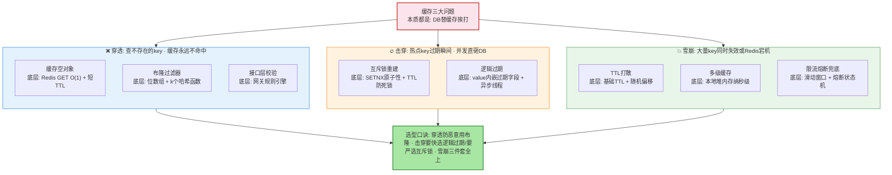
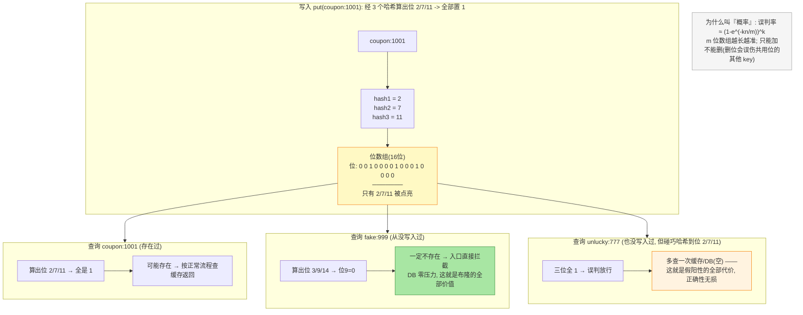
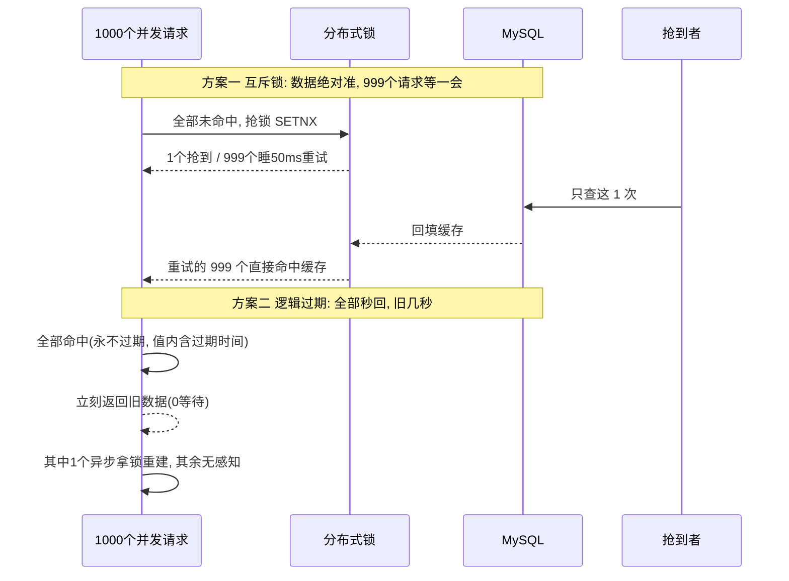
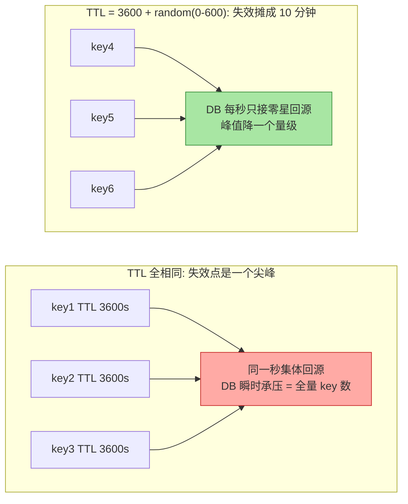
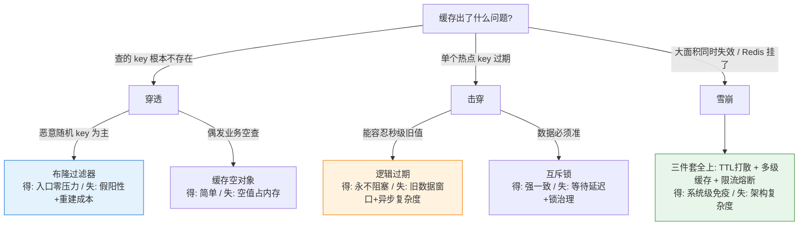

# 缓存三大问题：穿透、击穿、雪崩的一图看懂与底层支撑

> 先看图，再看字——第一张图是全文全景，第二张图是布隆过滤器的章节替身。

## 一图看懂：三大问题与防御全景

**读图三步**：三色分区即三类问题（蓝穿透/橙击穿/绿雪崩）；每格里上为方案名、下为**底层支撑**——余下部分把每个底层拆开讲透；口诀收尾。

## 一句话摘要

三大问题本质都是「DB 替缓存挨打」：布隆过滤器靠位数组+概率论拦穿透、互斥锁靠 Redis 原子性防击穿、逻辑过期靠数据与过期时间解耦、TTL 打散+多级缓存+限流熔断防雪崩——不背方案背原理。

## 5W 速记卡

| 维度 | 一句话 |
|---|---|
| What | 穿透（查不存在）/ 击穿（热点过期）/ 雪崩（大面积失效） |
| Why | 三者都让 DB 替缓存挨打——流量越大量级越致命 |
| When | 缓存命中率跌、DB 回源尖峰时先定性再选方案 |
| Where | 穿透拦在入口、击穿拦在回源、雪崩拦在 DB 前 |
| How | 每个方案有底层支撑：概率论/原子性/解耦/随机化 |

## 🎯 本文核心

三类问题本质相同：**DB 替缓存挨打**。穿透是「查不存在的数据」（恶意为主），击穿是「单个热点 key 过期瞬间」（并发回源），雪崩是「大量 key 同时失效或 Redis 宕机」（系统性风险）。防御方案背后都有明确的技术底层：布隆过滤器靠**位数组+概率论**、互斥锁靠**Redis 单线程原子性**、逻辑过期靠**数据与过期时间解耦**、TTL 打散靠**随机化离散**。选型口诀：穿透防恶意用布隆；击穿二选一（要快选逻辑过期、要严选互斥锁）；雪崩三件套全上。

## 一、穿透：查「不存在的数据」——三个方案的原理与底层支撑

**场景**：攻击者拿一批不存在的用户 ID 狂打接口——缓存里永远没有，每次都打到 DB。

### 方案一：缓存空对象

- **原理**：DB 查完不存在，把「空结果」也写进缓存（特殊标记，TTL 短如 60 秒）
- **为什么有效**：下次同 key 直接命中空标记，不再回源
- **底层支撑**：Redis GET O(1) 哈希查找 + TTL 自动清理——空值不会永久占内存

### 方案二：布隆过滤器（核心方案）

- **原理**：长**位数组** + **k 个独立哈希函数**。写入：k 个哈希各算一位置 1；查询：k 个位**有一个 0 就一定不存在**，直接拒
- **为什么有效**：不存在的 key 在第一次查询前就被拦掉，不碰缓存和 DB；空间 O(k) 位/key——1 亿 key 约 1.2GB（k=10，业内认知）
- **底层支撑（概率论）**：假阳性可能（哈希碰撞），**假阴性不可能**（存过的 key 一定置过位）——说「不存在」100% 可信，说「存在」需再查一次确认
- **误判率怎么来**：位数组 m 位、key 数 n、哈希 k 个时，误判率约 (1-e^(-kn/m))^k——m 和 k 是设计参数，按预期 n 算好即可；这就是「位数组越大越准」的数学来源

一张图看懂布隆过滤器全貌（章节替身——图看懂了，字可跳过）：

### 方案三：接口层校验

- **原理**：格式/权限/频次校验前置到网关；**为什么有效**：恶意流量不进业务层；**底层支撑**：网关规则引擎匹配执行

## 二、击穿：热点 key 过期瞬间——两个方案的原理与底层支撑

在缓存架构里，三类问题发生在链路的不同位置——穿透在入口（key 路由之前）、击穿在缓存与 DB 之间（回源路径）、雪崩是架构级风险。位置决定方案。

**场景**：百万 QPS 的热点 key 过期一瞬间，全部请求同时涌向 DB。

### 方案一：互斥锁（强一致选择）

- **原理**：缓存失效时先 `SET lock:key nx ex 10` 抢锁，**只有抢到的线程**回源重建，其余睡眠重试读缓存
- **为什么有效**：回源并发从 N 降到 1
- **底层支撑**：Redis **单线程执行**——SETNX 原子，并发只有一个成功；锁带 TTL 防崩溃死锁，value 存标识防误删

### 方案二：逻辑过期（高可用选择）

- **原理**：热点 key **不设 TTL**，过期时间存在 **value 里**；读到已过期：先返回旧数据（用户无感），再异步拿锁重建
- **为什么有效**：用户**永远拿到数据**，无缓存真空瞬间
- **底层支撑**：**数据与过期时间解耦**——过期判断从 Redis 层挪到应用层，靠异步线程池 + 分布式锁；代价是秒级旧数据窗口

**两张行为图，看出差异在哪一眼**：

**二选一**：要快、容忍秒级旧数据（资讯/详情）→ 逻辑过期；要准（库存/额度）→ 互斥锁。两个都实现按 key 打标分通道是业内常态。

## 三、雪崩：同时失效或整体宕机——三件套的原理与底层支撑

**场景一（大量 key 同时到期）**：批量导入设相同 TTL，同一秒集体失效。

- **TTL 打散**：**原理**：过期 = 基础值 + 随机偏移（3600 + random(600)）；**为什么有效**：失效点从「一个点」离散成「一段线」；**底层支撑**：随机数——简单但最有效

打散前后，DB 看到的回源曲线完全不同：

**场景二（Redis 整体宕机）**：缓存层消失，流量直灌 DB。

- **多级缓存**：**原理**：本地缓存（Caffeine，进程内堆内存）挡第一波；**为什么有效**：纳秒级堆内读取，Redis 挂了它还在；**底层支撑**：堆内存 + 短 TTL 兜一致性
- **限流熔断兜底**：**原理**：Redis 不可用时对回源限流，其余快速失败返回降级值；**为什么有效**：牺牲体验保住 DB 不死；**底层支撑**：滑动窗口统计 + 熔断状态机（互指 Sentinel 特性层）

## 四、三类问题的区分诊断

| 维度 | 穿透 | 击穿 | 雪崩 |
|---|---|---|---|
| key 存在性 | **不存在** | 存在但过期 | **大量**同时过期 |
| 波及范围 | 单个/批量随机 key | **单个热点** | 大面积或整体 |
| 典型来源 | 攻击/爬虫 | 大促爆款 | 同 TTL 导入/Redis 故障 |
| 一线判断 | 命中率跌 + DB 查多空 | 单 key 回源尖峰 | 回源台阶式跳升 |

诊断一句话：**看 DB 回源查询的 key 分布**——空 key 多是穿透、集中一个 key 是击穿、满屏 key 是雪崩。

**与「缓存一致性」的区别**：三大问题是「缓存里**没有**」（失效类），一致性问题是「缓存里**有但不对**」（不一致类）——口诀：没数据找失效类，数据不对找一致类。

## 五、误区与代价

- ❌ 给所有 key 上布隆过滤器：位数组与重建成本随量涨——只对「不存在查询占比高」的场景上
- ❌ 互斥锁当万能药：锁竞争是新热点，全量 key 上锁 = 自己制造击穿
- ❌ 逻辑过期不隔离异步线程池：重建洪峰挤占业务线程，旧问题变新事故
- 代价总账：每个方案都在花复杂度/内存/一致性窗口——**选型的本质是为问题买对保险，不是买最贵的保险**

## 六、追问链（质疑者三连）

- **追问一**：布隆过滤器位数组全 1 了怎么办？——位数组不能删除（删位误伤其他 key），全 1 = 失效为全放行。解法：计数式布隆（位变计数器）或定期重建（DB 全量重灌）
- **再追问**：逻辑过期「返回旧数据」，旧多久能接受？——看数据下游用途：详情旧 10 秒无感；用旧库存做支付扣减就是资损。**数据用途决定过期容忍度**
- **打破砂锅**：雪崩为什么不堆 DB 配置硬扛？——DB 单行更新串行化天花板是物理的，堆硬件是假装扛得住；**限流熔断是承认扛不住之后的生存策略**

## 七、你们可能会问

**Q1：布隆过滤器误判了真 key 怎么办？** 误判只有假阳性方向（不存在判成可能存在）——后果是多查一次缓存/DB，正确性无损。永远不会有假阴性，所以「不存在」的判定可直接拒。

**Q2：逻辑过期返回旧数据能接受吗？** 按数据敏感性分：详情类无感换「永不真空」非常值；库存额度类不能容忍——用互斥锁。按类型分工，没有万能方案。

**Q3：三件套都上会不会过度设计？** 按量级：十万级 TTL 打散就够；百万级加多级缓存；大促单点风险场景熔断兜底必须有。三件套防三种不同形态，不是同一问题的三重保险。

## 八、什么时候用 / 不用

- ✅ 布隆：key 集合固定、有攻击风险、量大
- ✅ 互斥锁：热点少、准确性优先、能等待
- ✅ 逻辑过期：热点明确、速度优先、容忍旧窗口
- ❌ 缓存空对象对付海量随机攻击——那要用布隆
- ❌ 全量 key 上互斥锁——锁竞争自己制造击穿

## 方案选型决策树与 Trade-off 总表

从「出了什么问题」走到「用哪个方案」，每条边上标着 Trade-off：

| 方案 | 一句话原理 | 得到什么 | 付出什么 | 适用 |
|---|---|---|---|---|
| 缓存空对象 | 空结果也缓存（短 TTL） | 实现最简 | 空值占内存 | 业务性空查 |
| 布隆过滤器 | 位数组 + k 哈希，假阴性不可能 | 入口零压力 | 误判率 + 重建成本 | 恶意穿透 |
| 接口校验 | 合法性前置网关 | 攻击不进业务层 | 规则维护 | 所有场景标配 |
| 互斥锁 | 抢锁回源，其余重试 | 数据绝对准 | 等待延迟 + 锁治理 | 库存/额度 |
| 逻辑过期 | 永不过期 + 异步重建 | 零阻塞 | 秒级旧数据 | 详情/资讯 |
| TTL 打散 | 过期时间随机化 | 一行代码 | 无 | 雪崩标配 |
| 多级缓存 | 本地挡第一波 | Redis 挂了还有兜底 | 本地一致性窗口 | 高并发标配 |
| 限流熔断 | 承认扛不住，保 DB 不死 | 系统生存权 | 部分请求失败 | 大促/单点风险 |

## 九、自测三问

1. 布隆过滤器为什么「假阳性可能、假阴性不可能」？对使用方式意味着什么？
2. 互斥锁和逻辑过期的本质差异与底层支撑各是什么？
3. 雪崩三件套分别防什么形态？如何用 key 分布快速定性？

## 💡 实战提示

- 💡 穿透选型先问攻击来源：恶意随机 key 用布隆；业务性空查用空对象就够
- 💡 互斥锁等待线程要有重试上限+兜底超时——重建卡住不能让用户无限等
- 💡 逻辑过期异步重建线程池独立隔离——复用业务池会在重建洪峰拖垮主业务
- 💡 TTL 随机偏移要够大（±10% 以上）——偏 1 秒等于没打散
- 💡 监控三指标对应三问题：命中率跌+空 key 多=穿透；单 key 尖峰=击穿；整体台阶=雪崩

## 开放问题

- RedisBloom 服务端布隆与本地 Guava 布隆的选型边界（分布式一致性 vs 网络开销），随 Redis Stack 普及值得重估
- 逻辑过期与多级缓存叠加时旧数据窗口的量化观测，是缓存体系最薄弱的可观测环节

## 🎯 核心带走

- **一图一句**：三类问题本质都是 DB 替缓存挨打——穿透防恶意（布隆=位数组+概率论）、击穿防热点过期（互斥锁=原子性/逻辑过期=解耦）、雪崩防系统风险（打散+多级+兜底）
- **双防线思想**：布隆拦在入口、互斥锁拦在回源、熔断拦在 DB 前
- **按数据类型分工**：要快选逻辑过期、要准选互斥锁
- **诊断入口**：DB 回源查询的 key 分布——空 key 多=穿透、单 key=击穿、满屏=雪崩

## 📌 数据与事实声明

- 写于 2026-09-24（信息图式重构：一图看懂海报 + 布隆四要素章节替身图 + 每方案三问）；机制以 Redis 官方文档与 Guava/Sentinel 公开口径为准
- 「1 亿 key 约 1.2GB」为布隆过滤器公开公式推算（k=10）
- 免责：组件默认值随版本演进，以官方文档为准

## 📚 参考资料

| 类型 | 标题 | 来源 |
|---|---|---|
| 官方文档 | Redis Commands（SET NX、EXPIRE） | redis.io/docs |
| 工程实现 | Guava BloomFilter | github.com/google/guava |
| 关联系列 | Sentinel 熔断机制 | `docs/middleware/sentinel/特性层/` |
| 系列内 | 篇 19 多级缓存与一致性 | 本系列 |
