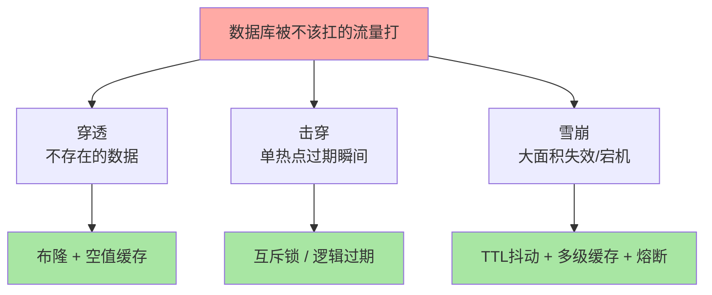
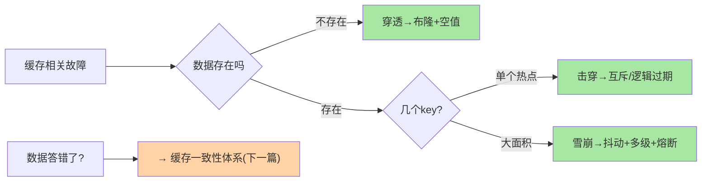

# 缓存三大问题：穿透、击穿、雪崩的防御体系

> 一句话：穿透是「查不存在的数据」（缓存永远不命中）、击穿是「热点 key 过期瞬间」（并发全打数据库）、雪崩是「大面积同时失效或缓存整体宕机」——三类故障共同的根是「数据库被不该它扛的流量打到」，防御共同思路是让缓存在故障时仍能挡住。

## 🎯 本文核心

**核心一句话：三类缓存故障的归因与防御各有其主——穿透（不存在数据）防在「入口拦截」：布隆 + 空值缓存；击穿（单热点过期）防在「重建互斥」：分布式锁或逻辑过期；雪崩（大面积失效/宕机）防在「打散与降级」：TTL 抖动、多级缓存、熔断兜底——共同哲学是「缓存出任何状况，数据库都不能直接裸奔」。**

组织主线：



## 一句话摘要

**穿透**：请求的数据在缓存与数据库都不存在（恶意 ID 或参数攻击），每次都穿透缓存打数据库——防御靠布隆过滤器（入口拦截「一定不存在」）+ 空值缓存（查过的「不存在」也缓存一小段 TTL）。**击穿**：某个热点 key 在过期瞬间，成百上千并发同时未命中、同时回源数据库——防御靠互斥（只放一个请求回源重建，其余等待）或逻辑过期（物理不过期、异步刷新）。**雪崩**：大量 key 同时过期（同一批写入同 TTL）或缓存实例整体宕机，数据库被全量流量冲击——防御靠 TTL 随机抖动、多级缓存、限流熔断兜底。三者常被混为一谈，区分的关键问题：「数据存在吗（穿透 vs 另两个）」与「是一个 key 还是一大片（击穿 vs 雪崩）」。

## 一、穿透：不存在的数据最伤人

攻击者构造随机 ID 高频请求——缓存没有（不存在永远不命中）、数据库也没有（每次白查一遍）。防御组合：

```text
① 布隆过滤器：全量合法 ID 进布隆，「一定不存在」的请求第一道门直接拒绝
② 空值缓存：查询确认不存在的 key 也缓存（value=空标记，短 TTL 如 60 秒）
   ——下一次同 ID 请求在缓存层就返回空
③ 参数校验：格式非法（长度/字符集/枚举外）的请求在网关层就拦下
```

三层是纵深防御：布隆挡大头、空值缓存兜住布隆误判与漏网、参数校验清掉最廉价的攻击流量。

## 5W 速记卡

| 维度 | 一句话 |
|---|---|
| What | 穿透（不存在）/击穿（单热点过期）/雪崩（大面积失效）三类故障与防御 |
| Why | 缓存失效的形态不同，防御姿势完全不同 |
| When | 缓存架构设计、大促备战、异常流量应急 |
| Where | 应用与缓存/数据库的请求链路上 |
| How | 布隆+空值；互斥+逻辑过期；抖动+多级+熔断 |

## 二、击穿：热点 key 过期瞬间的并发回源

热点 key（秒杀商品、爆款详情）过期的瞬间，成百上千请求同时未命中——全部回源数据库重建缓存，数据库瞬间承压。两种防御姿势的取舍：

| 方案 | 机制 | 优点 | 代价 |
|---|---|---|---|
| **互斥重建** | 分布式锁，只放一个请求回源，其余等待重读缓存 | 数据始终新鲜 | 等待线程阻塞、锁组件引入 |
| **逻辑过期** | value 内嵌过期时间、物理不过期；发现「逻辑过期」由异步线程刷新 | 无阻塞、体验顺滑 | 刷新间隙读到旧数据 |

选型口诀：**一致性敏感（价格/库存）用互斥重建，体验敏感（资讯/排行）用逻辑过期**——两者的共同哲学是「永远只让一个线程去重建，重建期间其他人有东西可读」。

## 三、雪崩：把「同时」打散、把「宕机」兜住

雪崩的两个来源对应两组防御：**同时失效**（同批 key 同 TTL）→ TTL 加随机抖动（±10%）打散过期时间、热点数据永不过期 + 异步刷新；**缓存整体宕机** → 多级缓存（本地缓存挡第一波）、限流熔断（数据库自我保护，宁可部分降级不可全站瘫痪）、快速恢复预案（备份实例 + 预热脚本）。雪崩防御的本质是**接受缓存会整体失效的假设，为数据库设计「降级时的生存方式」**——限流阈值就是数据库在无缓存状态下的真实承载能力，这个数字要提前压测知道。

> 💡 **实战提示**
> - 空值缓存的 TTL 要短（30-120 秒）且监控命中率：空值 key 被攻击者随机枚举撑爆内存是反噬——上限配额 + 短 TTL 控制
> - 互斥重建的锁要带超时与兜底：拿到锁的线程重建失败，等待者要能超时降级（直接读库或返回默认值），不能无限等
> - 大促前的三查：布隆覆盖率（新商品 ID 是否已入过滤器）、热点 key TTL 分布（是否扎堆）、熔断阈值（压测过的数据库真实承载）
> - 缓存与数据库「同时压测」：只压数据库不知道缓存失效时的生存线，只压缓存不知道回源风暴的真实形态——两类场景各压一轮

## 四、与「缓存一致性」的区别：失效 vs 不一致

三类问题研究「缓存失效后数据库被打」，下一篇的缓存一致性研究「缓存与数据库数据不同步」——前者是容量与可用性故障，后者是数据正确性故障；三类问题的防御保数据库，一致性方案保数据对。两个主题常被并提但故障形态与治理动作完全不同，归因时先分清「是打得疼还是答得错」。



## 五、三类问题的区分诊断

线上「数据库被打」时的归因树：**查的数据存在吗**——不存在 → 穿透（看空值缓存与布隆是否生效）；存在且是单个 key → 击穿（看该 key 的过期与重建日志）；存在且是大面积 → 雪崩（看过期分布与缓存实例健康）。归因错位是治理低效的第一原因：拿雪崩的药（打散 TTL）治穿透（不存在的数据），药不对症。

## 六、典型使用场景

- **商品详情**：逻辑过期 + 异步刷新（体验优先）+ 布隆防恶意 ID
- **秒杀库存预占**：互斥重建（一致性优先）+ 限流兜底
- **资讯 feed**：多级缓存（本地 Caffeine + Redis）+ TTL 抖动——雪崩防御的标准配置
- **开放 API**：参数校验 + 空值缓存短 TTL——面对未知流量形态的通用防御

## 七、误区与代价

- ❌ **「三问题记混归因错」**：三种故障的药完全不同——区分题先答「数据存在吗」「一个还是一片」，再套防御
- ❌ **「空值缓存不设上限」**：攻击者枚举的随机 ID 会把空值缓存撑成内存灾难——空值也要有配额与短 TTL
- ❌ **「逻辑过期无脑用」**：它让所有数据物理不过期（内存只增不减），且刷新间隙读旧——数据量大且一致性敏感的场景不适用
- ❌ **「熔断阈值拍脑袋」**：无缓存状态数据库的真实承载要压测得知——拍一个数要么挡不住要么误杀正常流量

## 八、你们可能会问

**Q1：穿透和击穿都是「缓存没挡住」，本质区别是什么？**
数据存在性：穿透是「数据根本不存在」（缓存无论如何都不命中），击穿是「数据存在但恰好过期」（重建后缓存恢复）——前者要「入口拦截」，后者要「重建互斥」，方向完全不同。

**Q2：互斥重建的分布式锁本身故障了怎么办？**
锁是辅助组件不能成为新单点：锁获取失败按「降级读库 + 本地节流」处理，锁服务故障时退化为「有限并发的数据库回源」——防御体系里每个组件的故障模式都要预先想好退路。

**Q3：多级缓存会不会引入一致性问题雪上加霜？**
会引入（本地缓存与 Redis 的不一致窗口），所以多级缓存的本地层通常 TTL 极短（秒级）或只存「可容忍旧读」的数据——一致性敏感数据不上本地层。多级是容量与延迟的分层设计，不是无脑堆缓存。

## 九、什么时候用 / 不用

- ✅ 三层穿透防御 + 击穿双方案 + 雪崩三件套：作为缓存架构的设计清单逐项过
- ✅ 大促前专项演练：模拟「热点 key 集中失效」「缓存实例宕机」两类场景的数据库承压
- ❌ 不为小流量系统全套上防御——布隆、多级缓存的复杂度要匹配流量规模，简单场景简单做
- ❌ 不绕过压测直接上熔断阈值——数字没有来源就是摆设

## 十、自测三问

1. 三类故障的归因树怎么走？两个区分问题是什么？
2. 击穿的两个防御方案的取舍口诀是什么？
3. 雪崩的「同时失效」与「整体宕机」各配什么防御？熔断阈值怎么来？

## 开放问题

- 云厂商的「缓存代理层自动防御」（穿透拦截/热点探测内置化）逐步产品化，应用侧防御与平台防御的分工边界在移动
- 逻辑过期与「缓存 prefetch（预测性刷新）」结合的智能预热方案在演进，「过期治理」从被动防御走向主动管理，值得跟踪

下一篇讲「缓存一致性」：缓存与数据库双写时的同步难题——先更库还是先删缓存。

## 🎯 核心带走

- **核心一句话**：穿透（不存在）防入口、击穿（单热点过期）防重建并发、雪崩（大面积失效/宕机）打散加兜底——共同哲学：任何缓存状况下数据库都不裸奔
- **主线**：归因树 → 三类各自的防御组合 → 互斥 vs 逻辑过期 → 多级缓存与熔断
- **哪里会坏**：归因错位药不对症、空值缓存无上限、锁组件成新单点、熔断阈值拍脑袋
- **边界**：本篇管「失效类故障」；双写一致性在下一篇，布隆原理在篇 7，bigkey 与过期风暴的关联在篇 8/10

## 📌 数据与事实声明

- 写于 2026-09-10；穿透/击穿/雪崩的防御模式为业内通用实践归纳；空值缓存、逻辑过期、TTL 抖动为公开技术社区成熟方案
- 「TTL ±10% 抖动」「空值 30-120 秒」为常见经验参数，按业务压测校准
- 免责：具体阈值随业务与硬件而异，无官方标准

## 📚 参考资料

| 类型 | 标题 | 来源 |
|---|---|---|
| 官方文档 | Redis Use Cases: Caching Patterns | redis.io/docs |
| 社区沉淀 | 各大厂公开的缓存治理与故障复盘文章 | 技术社区公开文章 |
| 系列导航 | Redis 系列目录 | `docs/middleware/redis/index.md` |
