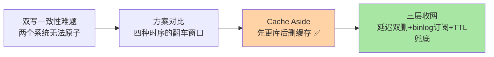
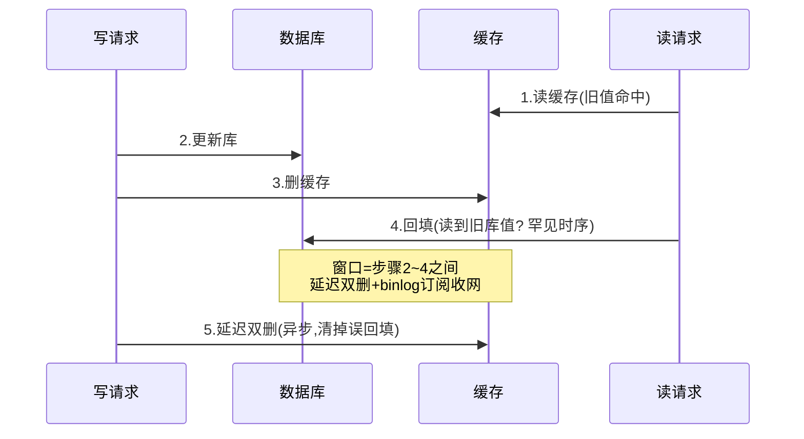

# 缓存一致性：先更库还是先删缓存的终极权衡

> 一句话：缓存与数据库是两个独立系统，双写的一致性没有银弹——「Cache Aside（先更库后删缓存）」是业内收敛的主流解，配「延迟双删 + 订阅 binlog 兜底」应对各类乱序窗口；追求的是最终一致 + 可收敛，不是强一致。

## 🎯 本文核心

**核心一句话：双写一致性的四个候选方案各有翻车窗口——先更库后删缓存（Cache Aside）的失败概率最低（需「写库慢于读旧值」的苛刻时序），成为主流；剩余窗口用延迟双删、订阅 binlog 删除、过期时间兜底三层收网——目标是从「不一致」快速收敛到「一致」，而不是消灭不一致窗口。**

组织主线：



## 一句话摘要

更新数据要同时动数据库与缓存，两个系统无法原子操作——四种时序各有一个翻车窗口：**先更缓存后更库**（缓存写了新值，库更新失败 → 缓存是脏的且无过期兜底）、**先删缓存后更库**（删除后、库更新完成前，读请求把旧值回填缓存 → 脏到下次过期）、**先更库后删缓存（Cache Aside，推荐）**——失败窗口是「读请求在库更新后、删缓存前读了旧缓存」，概率极低（要求读比写还慢）；**双写（都更新）**——两个写操作乱序即脏。主流收敛方案：Cache Aside + 删除失败重试（订阅 binlog 异步补偿）+ 过期时间最终兜底——**不追求强一致，追求「窗口极小且必然收敛」**。

## 一、四种时序的翻车窗口推演

把「写请求 W」与「并发读请求 R」放在一起推演：

```text
① 先更缓存，后更库：
   W 更缓存成功 → 更库失败 → 缓存留新值、库是旧值 → 永久脏（直到过期）
   ✗ 最差：失败即脏且无自愈

② 先删缓存，后更库：
   W 删缓存 → R 未命中读库（旧值）→ R 回填旧值 → W 才更库
   → 缓存留旧值直到过期 ✗ 脏窗口 = TTL

③ 先更库，后删缓存（Cache Aside）：
   R 读缓存（旧）→ W 更库 → W 删缓存 → 下次 R 读库回填新值
   翻车需「R 读库在 W 更库前、R 回填在 W 删缓存后」——读比写慢的罕见时序
   ✓ 概率最低，业内默认

④ 双写（更库 + 更缓存）：
   两个写操作到达顺序不确定 → 乱序即脏
   ✗ 时序依赖应用串行化，复杂度高收益低
```

③ 的胜出不是「没有窗口」而是「窗口最窄」：它要求读请求「在写者更库之前读库、却在写者删缓存之后才回填」——读跨越了整个写操作时长，而写通常毫秒级完成。

## 5W 速记卡

| 维度 | 一句话 |
|---|---|
| What | 双写四种时序对比 + Cache Aside 主流方案 + 三层收敛兜底 |
| Why | 缓存与数据库无法原子双写，必须选窗口最小的时序 |
| When | 任何「写库 + 写缓存」并存的设计；一致性专项治理 |
| Where | 应用服务层数据访问逻辑 / binlog 订阅组件 |
| How | 先更库后删缓存；删除失败走 binlog 订阅补偿；TTL 终极兜底 |

## 二、三层收网：让不一致必然收敛




Cache Aside 的残余窗口与「删缓存失败」由三层兜底收网：**第一层 延迟双删**——更库后删一次缓存，延迟几百毫秒再删一次（清理「删后回填的旧值」，延迟覆盖读请求的回填窗口）；**第二层 订阅 binlog 异步删**——由 Canal 类组件订阅数据库变更日志、异步删缓存（与业务代码解耦，删失败可重试，业务方不背一致性逻辑）；**第三层 TTL 终极兜底**——就算前两层全部失手，过期后必然回源新值，不一致窗口的上限 = TTL。三层的共同哲学：**一致性方案的设计目标是「必然收敛」，收敛速度按业务容忍度配置**。

> 💡 **实战提示**
> - 延迟双删的「延迟」要覆盖回填窗口：按「读库 P99 + 回填耗时」估，常见 500ms-1s——异步执行别阻塞主流程
> - 什么时候必须上 binlog 订阅：多团队写同一缓存、删除逻辑散落难审计、删除失败率不可控——把一致性收口成基础设施能力
> - 强一致需求的正确出口：读写都走库（不缓存）或加分布式锁串行化——缓存方案的尽头是「接受窗口」，接受不了就别缓存
> - 删缓存失败的监控：重试队列长度、binlog 订阅延迟是两个健康指标——不一致窗口在放大时最先感知

## 三、与「数据库主从一致性」的区别

同为「两个副本的一致性」，机制路径不同：MySQL 主从靠「复制协议 + GTID 判定追平」（系统内建、可查询进度），缓存一致性靠「应用层删除动作 + 时间兜底」（应用自建、进度不可查）。差异根源：数据库主从是同一系统的受控同步，缓存与库是跨系统的业务编排——**能靠系统协议的别靠应用约定**，这是所有双写场景选型的元原则（Redis Stream 事件流能部分弥补，见消息能力篇）。

## 四、典型使用场景

- **读多写少的标准缓存**：Cache Aside 裸用 + TTL——覆盖八成场景
- **写后立刻读的业务**（用户改资料刷新可见）：写后读自己走库 + Cache Aside 并存——一致性敏感读不依赖缓存
- **删除可靠性要求高**：binlog 订阅统一删缓存——基础设施化的一致性收口
- **列表页 + 详情页混存**：详情用 Cache Aside，列表页放弃实时一致（依赖短 TTL + 可容忍旧读）——按数据维度分级一致性要求

## 五、误区与代价

- ❌ **「先删缓存后更库更安全（缓存永远最新）」**：删后回填旧值的窗口更长（覆盖整个写库耗时），且脏到过期才愈——直觉反了，事实是先更库后删缓存窗口更窄
- ❌ **「延迟双删的延迟拍脑袋」**：延迟短于回填窗口等于没删第二次——延迟要按读链路 P99 估并有依据
- ❌ **「把不一致窗口当不存在」**：秒级窗口对某些业务就是资损（余额显示）——一致性要求必须逐数据维度显式分级
- ❌ **「双写（都更新）更一致」**：两个独立写操作没有顺序保障，乱序即脏且无自愈——「都更新」不等于「更一致」

## 六、你们可能会问

**Q1：为什么不「更新缓存」而要「删除缓存」？**
删除是惰性语义：下次读时按库的最新值回填，天然一致；更新缓存则要求「缓存值是库值的确定性函数」——但凡有并发写、有加工逻辑，更新值就可能错。删除让「缓存重建」永远以库为准，这是简单性的胜利。

**Q2：有没有强一致的缓存方案？**
有但代价高：读写锁串行化（性能大降）或「写后读走库」（绕过缓存）。缓存的价值本身就来自「允许短暂不一致」——需要强一致的数据本来就不该进缓存，这是架构分层的判断而不是技术问题。

**Q3：binlog 订阅组件本身挂了怎么办？**
它是不一致窗口放大的风险点：订阅中断期间所有变更未同步删缓存——监控订阅延迟与中断事件，恢复后从断点续传补删；TTL 是最终兜底但窗口可能太长，所以订阅组件自身的高可用要按基础设施标准建设。

## 七、什么时候用 / 不用

- ✅ Cache Aside + TTL：读多写少场景的标准答案，默认从这里开始
- ✅ 一致性要求升级时按层加码：双删 → binlog 订阅 → 强一致数据不缓存
- ❌ 不为「绝对一致」过度设计：一致性与性能的账要算给业务看
- ❌ 不接受窗口的数据不进缓存——这是唯一没有权衡余地的原则

## 八、开放问题

- 「缓存一致性即服务」的中间件（变更捕获 + 缓存失效自动编排）在云厂商侧逐步产品化，应用层一致性代码的基础设施化是明显趋势
- 分布式事务体系与缓存失效的联动（事务提交即失效、回滚即不失效）在 NewSQL + 缓存组合中的标准化方案仍是空白地带

## 九、自测三问

1. 四种双写时序各自的翻车窗口是什么？Cache Aside 为什么胜出？
2. 三层收网分别兜住什么？TTL 的兜底意义是什么？
3. 为什么「删除」优于「更新」缓存？强一致需求的正确出口在哪？

下一篇讲「分布式锁」：从 SETNX 到看门狗——互斥语义在 Redis 上的完整演进。

## 🎯 核心带走

- **核心一句话**：双写无银弹——Cache Aside（先更库后删缓存）窗口最窄成主流，延迟双删 + binlog 订阅 + TTL 三层收网保「必然收敛」，强一致数据不进缓存
- **主线**：四时序推演 → Cache Aside → 三层收网 → 与主从一致性的元原则
- **哪里会坏**：先删后更的长脏窗、双写乱序、延迟拍脑袋、订阅组件单点
- **边界**：本篇管「双写一致性」；失效类故障在上一篇，binlog 订阅的工程细节在特性层缓存一致性系列

## 📌 数据与事实声明

- 写于 2026-09-10；Cache Aside 与四种时序分析为公开技术社区的成熟共识（多篇高引用文章沉淀）
- 「延迟 500ms-1s」为常见经验区间，按读链路 P99 估算校准
- 免责：具体窗口时长随链路耗时而异，无官方标准

## 📚 参考资料

| 类型 | 标题 | 来源 |
|---|---|---|
| 官方文档 | Redis Use Cases: Caching Patterns | redis.io/docs |
| 开源组件 | Canal / Debezium（binlog 订阅类 CDC） | 公开项目文档 |
| 系列导航 | Redis 系列目录 | `docs/middleware/redis/index.md` |
