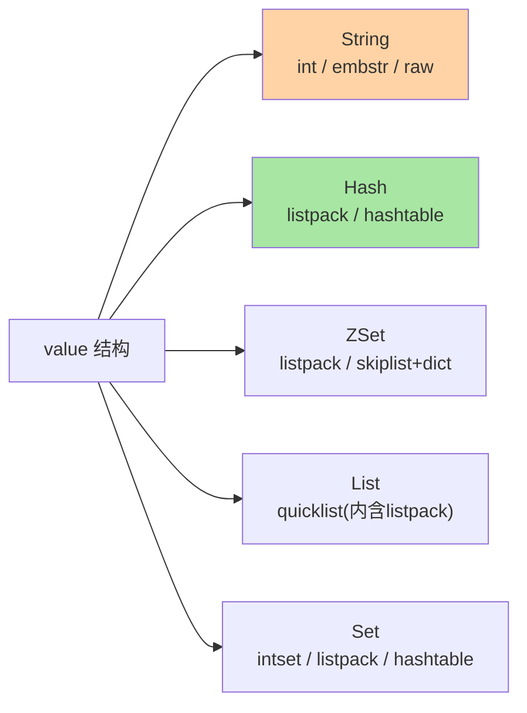

# Redis 是什么与数据模型：内存键值数据库的全景

> 一句话：Redis 把数据放在内存里、用「全局字典 + 多态 value」的极简模型提供毫秒内的读写——它不是「更快的 MySQL」，而是一种以内存为前提、以简单模型换极致延迟的另一种数据库。

## 🎯 本文核心

**核心一句话：Redis = 纯内存存储 + 单线程命令执行 + IO 多路复用，数据模型是一张全局字典（key → 各类 value），value 内部有多态编码按数据形态自动切换——「简单模型 + 内存介质」是它一切性能与边界（贵、易失、无复杂查询）的总根源。**

组织主线（本篇四段全挂这条线）：


看懂「介质决定模型」，为什么 Redis 适合缓存不适合账本、为什么 key 要短、为什么大 key 危险，全部有了同一处原理源头。

## 一句话摘要

Redis（Remote Dictionary Server）是开源的内存键值数据库：所有数据组织成一张全局字典，key 是字符串，value 支持字符串/哈希/列表/集合/有序集合五大结构（外加 Bitmap/HyperLogLog/Stream/Geo 等特化形态），每个结构内部还有多种紧凑编码按数据量自动切换。因为数据在内存、命令单线程执行、IO 多路复用扛连接，Redis 提供亚毫秒级延迟与十万级 QPS（业内量级认知），成为缓存、计数、排行榜、分布式锁、消息队列等场景的默认选项。

## 一、为什么需要 Redis：磁盘数据库接不住的延迟

典型场景：商品详情页每次访问都查 MySQL——磁盘数据库单次查询毫秒级，热点商品每秒数万次查询直接把数据库打满。Redis 的角色是把这些热数据搬进内存：读延迟从毫秒级降到百微秒级，数据库只承担「缓存未命中 + 写入」。它不是替代数据库，而是在数据库前面挡住「重复的热读」——缓存与存储是上下游分工，不是竞争关系（与 MySQL 的完整对比见下表）。

| 维度 | Redis | MySQL |
|---|---|---|
| 介质 | 内存（+持久化文件兜底） | 磁盘（Buffer Pool 缓存） |
| 模型 | KV 字典 + 多态结构 | 关系模型 + SQL |
| 延迟 | 亚毫秒 | 毫秒级起步 |
| 查询能力 | 按 key 精确操作 | 任意条件、JOIN、聚合 |
| 数据可靠性 | 持久化有窗口（RDB/AOF 权衡） | 事务 + redo 保证 crash-safe |
| 成本 | 内存贵，容量小 | 磁盘便宜，容量大 |

## 5W 速记卡

| 维度 | 一句话 |
|---|---|
| What | 内存键值数据库：全局字典 + 多态 value 结构 |
| Why | 磁盘数据库接不住热点的延迟与 QPS |
| When | 缓存、计数器、排行榜、分布式锁、轻量队列 |
| Where | 数据库前的缓存层 / 独立的实时数据服务 |
| How | 按 key 操作五大结构；过期淘汰与持久化策略按场景配 |

## 二、核心机制：全局字典与多态编码

### 2.1 一张全局字典

Redis 所有数据在逻辑上就是一张巨大的哈希表：`SET user:1001:name "tom"`、`HSET user:1001 age 18`——两个命令操作不同结构的 value，但 key 都在同一个全局字典里查找。由此推出 key 设计的基本原则：**key 即索引**，没有二级查询能力（不能按 value 找 key），key 命名要自含业务语义（`业务:对象:ID` 三段式是业内惯例）、宜短（key 本身也占内存，千万级 key 的命名长度是真金白银）。

### 2.2 value 的多态编码

每个数据结构内部不是单一实现，而是「小数据用紧凑编码、大数据换标准结构」：



例如哈希结构只有几个小字段时用 listpack（紧凑连续内存，省指针省元数据），字段多或值大时自动转 hashtable。这个设计让「一万个小哈希」的内存占用远小于朴素想象——底层编码的演进是 Redis 每个大版本省内存的主要来源（编码细节在特性层「底层编码系列」展开）。

### 2.3 动手验证：三个最小实验

概念读十遍不如亲手做一遍——三个五分钟实验把本篇核心变成体感：

```bash
# 实验一：看多态编码自动切换（验证 2.2 节）
HSET h f1 v                         # 造一个小哈希
OBJECT ENCODING h                   # → listpack（紧凑编码）
# 持续写入更多字段直到超过阈值，再看 OBJECT ENCODING —— 自动换成 hashtable

# 实验二：key 即索引，没有二级查询（验证 2.1 节）
SET user:1001:name tom
GET tom                             # → (nil)：值不能反查 key，key 必须自含业务语义

# 实验三：TTL 与生命周期（验证「每个 key 都该回答活多久」）
SET tmp demo EX 60
TTL tmp                             # → 剩余秒数；过期后内存被回收（惰性 + 定期策略，篇 10 展开）
```

三个实验分别对应「编码多态」「key 即索引」「生命周期管理」——做完再回头读「误区与代价」一节，三条红线会有不一样的体感。

> 💡 **实战提示**
> - 用 `OBJECT ENCODING key` 观察编码切换：理解你的数据在什么阈值会从紧凑编码退化，是内存优化的第一步
> - 场景选结构：对象存 Hash（可改单字段）还是 String 存 JSON（整体读写），按「读改模式」定——高频改单字段用 Hash，整体存取用 String
> - 大 key 是内存与延迟的双料杀手：单个 value 超过 10KB（业内常用阈值，按业务定）就该警惕，治理见专题层 bigkey 篇
> - Redis 8.x 时代新增了向量集等新结构（公开口径），选型前核对自己版本的官方文档——本系列以 8.x 通用能力为基准

## 三、与 MySQL 的区别：分工不是替代

最深的差异在**查询模型**：MySQL 按「任意条件」检索（WHERE 任何列、JOIN、聚合），Redis 只能按 key 精确定位——想按「值」反查就得自己维护反向索引（Set 存关系）。这个差异决定了分工：**业务数据的事实源在 MySQL，Redis 存「派生的热数据」**（缓存、计数、排行）。把 Redis 当事实源的业务要直面持久化窗口与无事务查询的代价——多数踩坑源于混淆了两者角色。

## 四、典型使用场景

- **缓存**：热点读挡在数据库前，过期 + 淘汰策略管理生命周期（缓存三兄弟治理在专题层）
- **计数器**：`INCR` 原子自增，限流、点赞、库存预占的原子性天然成立
- **排行榜**：ZSet 按分数排序，`ZRANGE` 拿 Top N，O(log N) 更新
- **分布式锁**：`SET key value NX EX` 的原子互斥（进阶演进见特性层分布式锁系列）
- **轻量队列**：List 的 LPUSH/BRPOP 或 Stream 的消费组——重消息语义仍归专业 MQ

## 五、误区与代价

- ❌ **「Redis 当主数据库用」**：持久化有窗口（异步落盘），无二级查询无复杂事务——事实源进 Redis 的代价在故障日集中爆发
- ❌ **「内存无限，什么都塞」**：内存是 Redis 最贵的资源，无 TTL 的 key 积累 = 主动制造内存危机——每个 key 都该回答「活多久」
- ❌ **「一个 key 存整张表」**：大 key 让单线程被一次操作卡住（删除/迁移/过期全部放大），key 设计要「粒度小、分而治之」
- ❌ **「Redis 挂了业务挂了」**：缓存角色下 Redis 故障应退化为「穿透到数据库的降级读」，架构上要预设这条退路（缓存三兄弟篇展开）

## 六、你们可能会问

**Q1：Redis 是数据库还是缓存？**
两者都是——官方定位是 data structure server（数据结构服务器）。工程上的角色由你的架构决定：当缓存用就预设穿透降级，当存储用就必须配齐持久化与备份演练。角色不清是 Redis 事故的第一大来源。

**Q2：为什么单线程还这么快？**
三个乘数：内存读写百纳秒级（介质快）、单线程免锁免上下文切换（模型简）、epoll 扛数万连接（IO 不等）。瓶颈天然在内存与网络，不在 CPU——篇 2 展开这条机制链。

**Q3：Redis 的数据会丢吗？**
取决于持久化配置：RDB 快照有间隔窗口、AOF 每秒刷盘丢一秒内的、`always` 模式不丢但写性能折半——「丢多少」是配置决策，与 MySQL 的 crash-safe（redo 保证不丢已提交）语义等级不同，别拿存储的标准要求缓存。

**Q4：Memcached 也是内存 KV，为什么新项目默认选 Redis？**
三点差距：**数据结构**——Memcached 只有字符串，Redis 有五大结构加特化形态，业务语义能直接落到结构上（排行榜就是 ZSet，不用自己排）；**持久化**——Memcached 重启即失，Redis 有 RDB/AOF 兜底，缓存重建成本低一个量级；**生态与演进**——客户端、代理、托管服务全链成熟。Memcached 在极简多线程 + 一致性哈希的老场景还有余温，但默认选 Redis 是业内现状——完整选型对比在整合层收束。

### 追问链：把「介质决定模型」再问穿一层

质疑者视角不会停在「Redis 快」——往下追问，每一层的答案都是下一层问题的入口：

- **追问一：内存快，那大 value 也快吗？**——恰恰相反。介质快只保证「每次访问」快，而单线程模型让一次 10MB value 的读写占住整个事件循环——长尾由操作粒度决定，不由介质决定。这就是大 key 危险的机制根源（治理见专题层 bigkey 篇）。
- **再追问：那为什么不用多线程消掉长尾？**——反直觉的是，Redis 6.0 引入多线程后命令执行依然是单线程，多线程只接管网络读写。数据结构操作要保原子语义，加锁的复杂度与竞态风险会吃掉简单模型换来的可靠性——「单线程」是设计选择，不是技术局限。
- **打破砂锅：内存又贵又易失，为什么不干脆放弃它？**——因为缓存的正确心态是「数据可由事实源重建」：丢的是副本，不是事实。放弃内存等于退回毫秒级磁盘延迟；保留内存的代价（贵、易失）用持久化 + 重建机制对冲——这笔账怎么算，是后面持久化与缓存治理全部内容的总纲。

## 七、什么时候用 / 不用

- ✅ 用：热点读加速、原子计数、排行榜、锁、轻量队列——低延迟 + 简单模型的场景全命中
- ✅ 数据全部可由事实源重建（缓存语义）——丢了我能补回来，才是缓存的健康心态
- ❌ 不用：复杂条件查询、强事务、大数据量低成本存储——这是关系数据库的主场
- ❌ 不用：把 Redis 写满还指望淘汰策略兜底——淘汰是保命的机制，不是容量规划的工具

## 八、开放问题

- Redis 的多线程化演进（6.0 多线程 IO、7.x 函数与多部分 AOF）正在缓慢突破单线程边界——「单线程模型还能走多远」是社区长期议题（机制见篇 2）
- 向量检索等新场景进入内存数据库，Redis 新增结构与专用向量库的竞争边界，随 AI 负载的演进值得持续观察

## 九、自测三问

1. Redis 为什么快？三个乘数分别是什么？
2. value 的多态编码是什么意思？它如何省内存？
3. Redis 与 MySQL 的角色怎么分工？什么数据不该进 Redis？

下一篇讲「单线程模型与 IO 多路复用」：把「为什么快」的第二、第三个乘数拆开讲透。

## 🎯 核心带走

- **核心一句话**：Redis = 内存介质 + 单线程执行 + 多路复用 IO，全局字典 + 多态编码的数据模型——简单模型换极致延迟，代价是贵、易失、无复杂查询
- **主线**：定位 → 快的三个乘数 → 全局字典 → 编码多态 → 边界
- **哪里会坏**：当事实源用（持久化窗口）、无 TTL 积累（内存危机）、大 key 卡单线程
- **边界**：本篇是全景定位；单线程机制在篇 2，五大结构逐个在篇 3-6，编码实现在特性层底层编码系列

## 📌 数据与事实声明

- 写于 2026-09-10；数据模型、编码机制（listpack 等）以 Redis 官方文档与源码公开口径为准；Redis 8.x 新结构以官方发布说明为准
- 「亚毫秒延迟、十万级 QPS」为业内量级认知，具体依硬件与负载实测
- 免责：配置项与编码阈值随版本演进可能调整，以官方文档为准

## 📚 参考资料

| 类型 | 标题 | 来源 |
|---|---|---|
| 官方文档 | Redis Data Types / Topics | redis.io/docs |
| 官方源码 | redis/redis（t_hash、t_zset 等） | github.com/redis/redis |
| 系列导航 | Redis 系列目录 | `docs/middleware/redis/index.md` |
