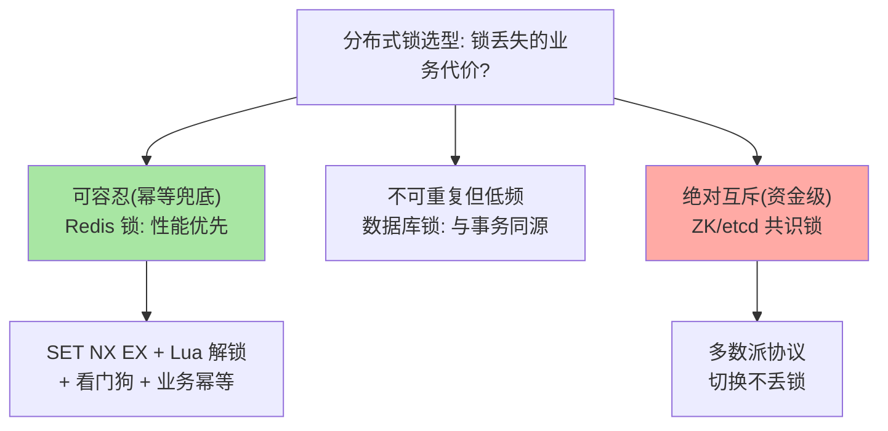

# 分布式锁：从 SET NX 到看门狗的互斥演进

> 一句话：`SET key token NX EX` 一条命令完成原子加锁是起点，解锁要用 Lua「校验 token 再删」防误删，锁过期与业务未完成的时间差用看门狗续期——每一步演进都在堵一个具体的竞态窗口。

## 🎯 本文核心

**核心一句话：Redis 分布式锁 = SET NX EX 原子加锁 + Lua 校验解锁 + 看门狗续期——三个部件分别堵住三个竞态窗口（非原子加锁/误删他人锁/锁先于业务过期）；锁的可靠性天花板是「异步复制的故障切换丢锁」，关键业务要么接受要么换共识系统。**

组织主线（锁协议在「应用客户端 → Redis 主从集群」的上下游之间传递，主从复制的异步语义决定了锁可靠性的天花板）：


## 一句话摘要

分布式锁让多个应用实例互斥访问共享资源（防重复下单、防并发定时任务）。Redis 实现的完整演进：**①原子加锁**——早期 SETNX + EXPIRE 两条命令在中间崩溃会留下永不解锁的死锁，`SET key token NX EX 30` 一条命令原子解决；**②安全解锁**——锁可能已过期且被他人持有，裸 DEL 会误删别人的锁，Lua「GET 校验 value（唯一 token）一致才 DEL」保证只删自己的；**③看门狗续期**——业务耗时不确定，锁固定 TTL 可能先于业务完成过期，Redisson 看门狗机制在业务持有期间自动续期。天花板认知：主从异步复制下主库加锁后宕机、锁未同步到从库，切换后新主上锁消失——另一个实例可再次加锁，互斥被打破；RedLock 多节点方案争议多年，关键业务的终局答案是接受窗口或换 ZooKeeper/etcd 共识锁。

## 一、三步演进：每步堵一个竞态窗口

```text
① SETNX + EXPIRE 两步写（远古）：
   SETNX 成功后进程崩溃 → 无 TTL 死锁
   → 堵法：SET key token NX EX 30 一条命令原子完成

② 解锁裸 DEL（常见错误）：
   A 的锁已过期被 B 持有 → A 执行完 DEL → 删掉了 B 的锁 → C 又加锁
   → 堵法：Lua 脚本「value == 我的 token 才 DEL」，token 每次加锁随机生成

③ 固定 TTL 赶不上业务（长任务）：
   业务执行 40 秒，锁 30 秒过期 → 第 31 秒起互斥已失效
   → 堵法：看门狗（Redisson 默认 30 秒锁每 10 秒续期），业务结束主动释放
```

三个窗口的共同教训：**锁的正确性是「时序敏感」的，任何两步操作之间的缝隙都是竞态入口**——原子命令与 Lua 把缝隙压到零。

## 5W 速记卡

| 维度 | 一句话 |
|---|---|
| What | SET NX EX 原子加锁 + Lua 安全解锁 + 看门狗续期的完整锁形态 |
| Why | 多实例并发访问共享资源需要跨进程互斥 |
| When | 防重复任务、防并发下单、资源抢占类场景 |
| Where | 应用与 Redis 之间的锁协议（token + TTL） |
| How | SET NX EX；Lua 解锁；Redisson 看门狗或自建续期 |

## 二、看门狗与业务完成的握手

固定 TTL 与业务时长的矛盾有三种处理姿势：**①TTL 给足**——按业务 P99 耗时 × 余量设 TTL，简单但业务抖动即失效；**②看门狗自动续期**——Redisson 加锁时不设 TTL 而启动后台任务周期续期，业务完成主动 unlock 停止续期（注意：进程崩溃后无人续期，锁按 30 秒兜底过期——这是它仍能自愈的关键）；**③业务侧幂等兜底**——假设锁失效，重复执行靠业务的唯一键/状态机挡住。生产实践常是组合拳：看门狗保主流程 + 幂等兜底极端态——**锁保互斥，幂等保正确**，两层缺一不可。

> 💡 **实战提示**
> - token 必须唯一且随锁随机：用 UUID，解锁 Lua 校验——token 复用等于放弃「只删自己的锁」的保证
> - 加锁与业务资源操作要有合理超时：拿锁超时快速返回（降级/排队），别在拿锁上无限等待形成线程堆积
> - 看门狗别滥用：长事务式依赖（锁挂 10 分钟）说明业务形态该改造——锁是短互斥工具不是业务状态
> - 什么时候必须评估锁的丢失风险：资源操作涉及资金/库存等不可重复语义时，逐场景回答「锁丢失的后果 + 幂等是否兜得住」——答不了就升级共识锁



## 三、与「数据库锁 / 共识锁」的区别

三选一的选型逻辑：**Redis 锁**——性能最高（亚毫秒），可靠性受主从切换窗口约束，适合「互斥失败代价可容忍」的多数场景；**数据库锁**（唯一键插入/SELECT FOR UPDATE）——与业务事务同源、无额外组件，性能与锁等待在数据库侧；**共识锁**（ZooKeeper/etcd）——多数派协议保证锁不因单点切换丢失，可靠性最高、性能最低（毫秒级 + 部署成本）。选型判据一句话：**锁丢失的业务代价定可靠性等级**——降级可容忍用 Redis，绝对不可丢用共识系统，两者之间的用数据库锁。

## 四、典型使用场景

- **定时任务防重复**：多实例部署的调度任务，抢到锁的执行——锁丢失最坏是「任务跑两次」，幂等兜底即可
- **防重复下单/支付回调**：业务幂等键为主、Redis 锁为前置加速——不可重复语义的典型组合
- **库存扣减互斥**：Redis 锁或 Lua 原子扣减（原子扣减常优于锁——无锁化更快，按冲突度选）
- **缓存击穿的互斥重建**：单线程回源重建（缓存三兄弟篇的击穿防御在此落地）

## 五、误区与代价

- ❌ **「SETNX + EXPIRE 分两步写」**：中间崩溃即死锁——这条 2010 年代的错误至今仍在新人代码里出现，一条 SET NX EX 是底线
- ❌ **「解锁裸 DEL」**：误删他人锁 = 互斥直接失效——token 校验是锁协议的一部分不是优化
- ❌ **「TTL 给很大一劳永逸」**：持有者崩溃后，资源被锁死到 TTL 结束（可用性问题）——TTL 是「崩溃自愈时间」与「业务时长覆盖」的权衡
- ❌ **「Redis 锁是绝对可靠的」**：主从切换丢锁窗口客观存在——按业务代价分级选型是成熟度标志，把 Redis 锁当万能互斥是认知债务

## 六、你们可能会问

**Q1：RedLock 是什么，为什么有争议？**
RedLock 是作者提出的「向 N 个独立 Redis 主节点同时加锁、多数成功才算持有」的方案，意图消除单主切换丢锁；争议点（分布式系统学者的著名质疑）：跨节点时钟与延迟能否支撑「锁的有效时间」判断。工程结论：多数场景普通 Redis 锁 + 幂等已够，真要共识保证直接上 ZooKeeper/etcd——RedLock 处在「比单锁复杂、比共识弱」的中间态，慎用。

**Q2：看门狗续期的周期怎么定？**
Redisson 默认锁 TTL 30 秒、每 10 秒续期（TTL/3）——续期周期要小于 TTL 的 1/3，保证续期失败两轮内锁仍有效。自建续期时同样按此比例，且续期失败要有告警与业务降级路径。

**Q3：加锁成功但 Redis 网络闪断，锁状态怎么算？**
客户端无法确定「锁是否仍被自己持有」（续期可能失败）——严谨的实现要求业务在关键操作前校验锁仍持有（再 GET token），或在设计上接受窗口。锁协议的每一步都要想「网络分区时状态是什么」，这是分布式锁区别于单机锁的核心心智。

## 七、什么时候用 / 不用

- ✅ Redis 锁：互斥失败可容忍/可幂等兜底的并发防护——性能优先的默认选择
- ✅ 组合拳：Redis 锁加速 + 数据库唯一键兜底正确性——多数业务的终局形态
- ❌ 资金类绝对互斥：共识锁（ZK/etcd）或数据库锁，不赌切换窗口
- ❌ 用锁替代业务设计：能靠状态机/原子操作解决的竞态不要加锁——锁是最后手段不是第一反应

## 八、开放问题

- 分布式锁的「正确性证明」在异步网络模型下的理论边界（FLP 类结论的工程映射）在社区长期讨论，工程实践与理论保证的差距是这类工具的共同宿命
- 云原生环境（Pod 频繁漂移）让「持有者身份」的稳定性下降，锁协议与租约体系的重新设计（lease-based）在 Kubernetes 生态有独立演进

## 九、自测三问

1. 三步演进各堵住哪个竞态窗口？每一步的实现要点是什么？
2. 看门狗的续期周期怎么定？进程崩溃后锁如何自愈？
3. Redis 锁、数据库锁、共识锁的选型判据一句话是什么？RedLock 为什么慎用？

## 开放问题

- 锁服务与业务幂等体系的「责任边界」工具化（框架级自动幂等 + 锁联动）在部分公司内部平台已有实践，通用化方案尚未出现
- lease-based 锁在弱网与长 GC 暂停下的行为仍是最容易出错的领域，锁协议的形式化验证工具在学术与工业界持续探索

下一篇讲「性能监控与调优」：把前面所有机制的运行状态变成可观测指标。

## 🎯 核心带走

- **核心一句话**：分布式锁 = SET NX EX + Lua 校验解锁 + 看门狗续期，三部件堵三竞态窗口；锁保互斥幂等保正确，可靠性天花板是主从切换丢锁——按业务代价分级选型
- **主线**：三步演进 → 看门狗握手 → 三锁选型 → RedLock 争议
- **哪里会坏**：两步加锁死锁、裸 DEL 误删、TTL 先于业务过期、误信绝对可靠
- **边界**：本篇是锁的入门演进；Redisson 实现细节与 RedLock 深度争议在特性层分布式锁系列

## 📌 数据与事实声明

- 写于 2026-09-10；SET NX EX、Lua 解锁、Redisson 看门狗（默认 30s TTL/10s 续期）以官方文档与开源项目公开口径为准
- RedLock 及其争议（Martin Kleppmann 与 antirez 的公开论战）为分布式社区公开资料
- 免责：客户端库行为随版本演进可能调整，以所用库文档为准

## 📚 参考资料

| 类型 | 标题 | 来源 |
|---|---|---|
| 官方文档 | Redis Topics: Distributed Locks | redis.io/docs |
| 开源项目 | redisson/redisson（看门狗实现） | github.com/redisson/redisson |
| 公开资料 | How to do distributed locking（Kleppmann）与作者回应 | 各作者博客（公开） |
| 系列导航 | Redis 系列目录 | `docs/middleware/redis/index.md` |
