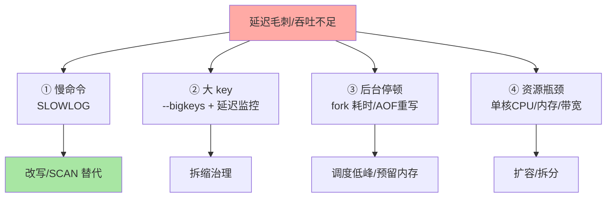
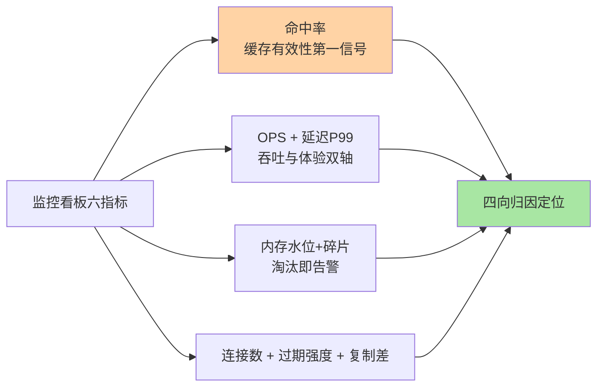

# 性能监控与调优：从延迟四分位到指标看板

> 一句话：Redis 调优的第一性是「延迟预算分解」——单线程模型下，延迟毛刺只可能来自四个方向：慢命令、大 key、持久化/fork、资源（CPU/内存/网络）——监控看板按这四向布防，调优按归因动手。

## 🎯 本文核心

**核心一句话：Redis 的性能问题收敛为「延迟毛刺」与「吞吐不足」两类，归因走四向模型——慢命令（SLOWLOG）、大 key（bigkeys）、后台任务停顿（持久化 fork/重写）、资源瓶颈（单核 CPU/内存/网络）——每个方向有确定指标与确定动作，调优不靠猜。**

组织主线（架构视角：客户端 → 网络 → 单线程执行 → 后台任务 → 资源，五个环节的上下游中任一环节堵住都表现为「延迟毛刺」——归因就是在链路上找堵点）：

## 一句话摘要

Redis 的性能观测核心是 `INFO` 指标族与 SLOWLOG：**延迟**看 `latency` 监控（LATENCY HISTORY 可查历史毛刺事件）、慢命令看 SLOWLOG、fork 耗时看 `latest_fork_usec`；**吞吐**看 ops_per_sec 与连接数；**内存**看 used_memory 与碎片率（内存管理篇的账本）；**命中率**看 keyspace hit/miss 比——命中率下跌是「缓存有效性」的第一信号。调优的动作序列固定：先归因（四向模型）→ 再动手（每向一个药方）→ 后验证（对比指标），与数据库优化同一套「诊断先于动手」的纪律。

## 一、四向归因模型：每个方向一张指标卡

| 方向 | 核心指标 | 阈值直觉 | 动作 |
|---|---|---|---|
| 慢命令 | SLOWLOG（`slowlog-log-slower-than`） | 慢命令 QPS > 0 就该治理 | SCAN 替 KEYS、拆大集合操作 |
| 大 key | `--bigkeys` 扫描 + 单 key 命令耗时 | 体积/元素量警戒线 | 拆缩异防（内存管理篇） |
| 后台停顿 | `latest_fork_usec`、AOF 重写曲线 | fork 毫秒级正常、百毫秒级预警 | 低峰调度、内存预留 |
| 资源瓶颈 | 单核 CPU、带宽、连接数、swap | 主线程单核打满是红线 | 扩容/读写分离/集群分片 |

四向之外的第五类「网络抖动」由基础设施层负责——客户端与服务端之间的 RTT 抖动在 Redis 侧表现为「命令都很快但客户端慢」，用 `redis-cli --latency` 与应用侧埋点对账定位。

## 5W 速记卡

| 维度 | 一句话 |
|---|---|
| What | 四向归因（慢命令/大key/后台停顿/资源）+ INFO 指标看板 |
| Why | 单线程模型下延迟毛刺来源有限，归因可收敛 |
| When | 延迟告警、容量规划、大促备战、例行巡检 |
| Where | INFO 指标族 / SLOWLOG / LATENCY 子系统 / 客户端埋点 |
| How | 先归因到向，再按向执行药方，前后指标对比验证 |

## 二、监控看板的最小指标集

生产实例的看板不必大而全，六个指标覆盖九成场景：**① 命中率**（keyspace_hits / (hits+misses)——缓存有效性的第一信号，下跌即异常）；**② ops_per_sec 与延迟 P99**（吞吐与体验的双轴）；**③ 内存水位与碎片率**（容量与碎片双监控，淘汰开始即告警）；**④ 连接数**（被阻塞连接堆积 = 单线程被堵的间接信号）；**⑤ keyspace 大小与过期强度**（expired_keys 突增对应过期风暴）；**⑥ 复制偏移差**（有从库时）。看板之外，SLOWLOG 与 LATENCY 是「出事后深挖」的两把探针。

> 💡 **实战提示**
> - 延迟毛刺对账法：LATENCY HISTORY 拿到毛刺时间点 → 对照 fork 耗时与 AOF 重写曲线 → 对照慢命令时间戳——三方对齐即可锁定毛刺来源
> - 命中率阈值按业务定基线：波动比绝对值重要——命中率周环比下滑 5% 就该查「谁改了缓存逻辑/谁加了新 key 不带 TTL」
> - 单核 CPU 的监控姿势：`top -H` 拆线程看 redis-server 主线程——机器整体 CPU 30% 而主线程 100% 是最常见的误读
> - 巡检周期化：SLOWLOG 清空式巡检（每周归档对比）、bigkeys 月度扫描、内存曲线周报——三张报表是 Redis 运维的基本盘

## 三、与「数据库慢查询优化」的区别

同为「诊断先于动手」，归因维度不同：数据库慢查询首查执行计划（优化器决策空间大），Redis 没有执行计划概念——命令复杂度是固定的（O(1)/O(logN)/O(N) 已由数据结构与命令决定），Redis 的「慢」几乎都来自「命令用错（大集合全量操作）」「key 太大」「后台任务」「资源」四向。因此 Redis 调优的动作更收敛（改写/拆分/调度/扩容四类），但每一类都指向「单线程阻塞」这同一个原理根源——理解机制比背指标更重要。

## 四、典型使用场景

- **例行巡检**：六指标看板 + 周期报表——容量与健康的日常盘面
- **延迟毛刺应急**：LATENCY + SLOWLOG + fork 曲线三方对账——毛刺归因的标准流程
- **大促备战**：压测（redis-benchmark 模拟真实命令分布）+ 熔断阈值校准 + 扩容预案
- **升级前基线**：版本升级前后跑同一套基准，性能回归有据

## 五、误区与代价

- ❌ **「只盯 OPS 不看延迟」**：吞吐健康不代表体验健康——毛刺对用户是真实的，P99/P999 比均值重要
- ❌ **「SLOWLOG 设太宽形同虚设」**：阈值 10ms 时微秒级毛刺全部漏掉——按业务延迟预算定阈值（延迟预算的 1/10 起步）
- ❌ **「调优从改配置开始」**：与数据库同理——先归因再动手，配置参数（io-threads/tcp-backlog 类）是最后手段
- ❌ **「监控 Redis 实例就完事」**：客户端连接池（拿不到连接/连接泄漏）与网络链路的故障形态与实例故障一模一样——监控要覆盖链路全程

## 六、你们可能会问

**Q1：LATENCY 子系统和 SLOWLOG 有什么区别？**
SLOWLOG 记「哪些命令慢」（命令视角），LATENCY 记「哪些时间点发生了延迟事件及事件类型」（时间点视角，含 fork、AOF、过期风暴等系统事件）——一个按命令归因，一个按时间归因，配合使用互为印证。

**Q2：redis-benchmark 的结果能代表我的业务吗？**
不能直接代表——benchmark 默认是 GET/SET 简单命令的理想分布，真实业务的命令分布、value 大小、key 热点分布完全不同。正确用法：`redis-benchmark -n` 自定义命令组合模拟真实分布，压测才有参考价值。

**Q3：命中率多少算健康？**
没有通用数字：热点集中的业务 95%+ 健康，长尾分布业务 80% 也可能正常——基线比对（自己的历史）与趋势监控（什么时候开始跌的）比绝对阈值有意义。

## 七、什么时候用 / 不用

- ✅ 六指标看板 + 四向归因：生产实例的标准监控配置
- ✅ 应急走「三方对账」流程：LATENCY 时间点、SLOWLOG 命令、fork 曲线
- ❌ 不为指标而指标：每个看板项都要有对应的处置动作，否则是仪表盘装饰
- ❌ 不跳过压测调熔断/扩容——数字来源只有压测与真实流量

## 八、开放问题

- 延迟观测的客户端视角工具（客户端埋点聚合、全链路 Redis 延迟画像）在可观测性体系中的标准化程度不足，「实例指标 + 客户端视角」的融合是演进方向
- Redis 8.x 的新指标与可观测性接口（公开口径）随版本持续扩充，监控体系的版本适配是长期工作

## 九、自测三问

1. 四向归因模型是哪四向？各配什么指标与动作？
2. 监控最小六指标是哪些？命中率为什么是第一信号？
3. 延迟毛刺应急的「三方对账」怎么走？

下一篇讲「安全与 ACL」：认证、授权与命令管控的三层防线。

## 🎯 核心带走

- **核心一句话**：Redis 调优 = 四向归因（慢命令/大key/后台停顿/资源）+ 六指标看板 + 三方对账——诊断先于动手，每个指标对应一个处置动作
- **主线**：延迟预算 → 四向模型 → 最小看板 → 应急流程
- **哪里会坏**：只盯吞吐漏毛刺、SLOWLOG 阈值太宽、单核盲区、客户端连接池故障误判实例
- **边界**：本篇是监控入门；bigkey 治理细节在专题层 bigkey 篇，内存账本在篇 11

## 📌 数据与事实声明

- 写于 2026-09-10；INFO 字段、SLOWLOG、LATENCY 子系统、redis-benchmark 以 Redis 官方文档公开口径为准
- 「SLOWLOG 阈值按延迟预算 1/10」「看板六指标」为业内经验归纳
- 免责：指标名与阈值随版本演进可能调整，以官方文档为准

## 📚 参考资料

| 类型 | 标题 | 来源 |
|---|---|---|
| 官方文档 | Redis Topics: Latency Monitoring / redis-benchmark | redis.io/docs |
| 官方文档 | INFO 指标说明 | redis.io/docs |
| 系列导航 | Redis 系列目录 | `docs/middleware/redis/index.md` |
