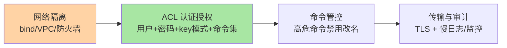
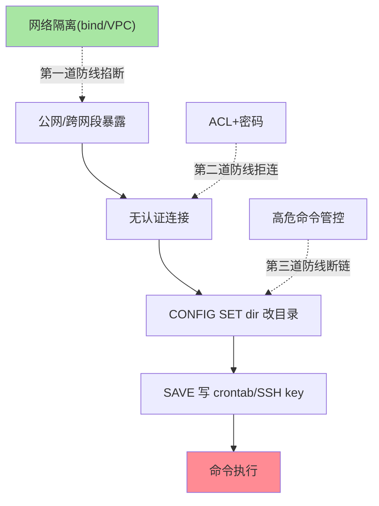

# 安全与 ACL：认证授权与命令管控的三层防线

> 一句话：Redis 安全 = 网络隔离（第一道也是最有效的防线）+ 认证授权（ACL 按用户分配 key 模式与命令白名单）+ 命令管控（高危命令禁用/改名）——Redis 历史上的大部分安全事故源于「裸奔在内网且信任内网」，三层防线每一层都别省。

## 🎯 本文核心

**核心一句话：Redis 的安全模型自 6.0 的 ACL 起完成三级收敛——用户级认证（每个用户独立密码）、授权细粒度（按 key 模式 + 命令类别分权）、命令管控（危险命令禁用）——但第一道防线永远是网络隔离：Redis 设计假设是「可信环境内使用」，把裸奔实例暴露公网等于把服务器拱手让人。**

组织主线（三条防线的底层原理：Redis 为极致性能放弃了内建加密与重鉴权开销，安全模型建立在「部署在可信网络」的前提上——前提成立时防线轻量高效，前提被破坏（暴露公网）时一切内建防护都不足以兜底）：



## 一句话摘要

Redis 的安全建设分三层：**网络隔离**——`bind` 绑定内网地址 + 防火墙/VPC 限制来源，Redis 的性能设计放弃了内建加密与复杂鉴权的开销，官方立场明确「不要把 Redis 直接暴露到不可信网络」——历史上大规模的 Redis 入侵事件（公网裸奔实例被写入 crontab）全部源于绕过这道防线。**ACL 认证授权**（6.0+）——多用户模型：每个用户独立密码、可限制 key 模式（只能访问 `app1:*`）、可限制命令类别（只给读命令），把「单实例多业务/多角色」的权限边界做细。**命令管控**——FLUSHALL/KEYS/CONFIG 等高危命令通过 `rename-command` 改名或 ACL 禁用。此外 TLS（传输加密）在 6.0 起官方支持。

## 一、ACL：6.0 起的细粒度权限

```text
ACL SETUSER app1 on >pass1 ~app1:* +@read +@write -@dangerous
#             ↑启用 ↑密码 ↑只能访问app1:*前缀 ↑可读写 ↑禁危险类

ACL SETUSER readonly_user on >pass2 ~mall:* +@read
ACL GETUSER app1          # 查看用户权限配置
ACL CAT dangerous         # 列出危险命令类别
```

ACL 的三维权度的价值：**key 模式**实现「同一实例多业务隔离」（每个业务只能碰自己的前缀——比「一个实例一个业务」省钱，比「完全共享」安全）；**命令类别**（@read/@write/@dangerous/@admin）让授权按角色表达而不是逐条命令；**多用户**替代了旧版全局 `requirepass` 的单一密码模式——旧模式下密码即全权，泄露即失守。ACL 规则持久化在 ACL 文件（`aclfile` 配置），版本管理随配置库走。

## 5W 速记卡

| 维度 | 一句话 |
|---|---|
| What | 网络隔离 + ACL 用户授权 + 命令管控 + TLS 的三层防线 |
| Why | Redis 设计假设可信环境，暴露即风险；多业务共实例需要细粒度权限 |
| When | 实例上线即配置；多业务共用、对外服务时必须完善 |
| Where | 网络层（bind/防火墙）→ 访问层（ACL）→ 命令层（管控） |
| How | ACL SETUSER 定义用户；rename-command/ACL 禁高危；TLS 加密 |

## 二、高危命令管控：把事故入口焊死

`FLUSHALL/FLUSHDB`（清库）、`KEYS`（阻塞）、`CONFIG SET`（运行时改配置，历史上多条 RCE 链的入口）、`DEBUG`、`SHUTDOWN` 是五类最危险命令。管控三板斧：**①ACL 禁用**——日常业务用户不带 @dangerous 类；**②rename-command 改名**——把 FLUSHALL 改成随机串（运维工具持有真名），误操作物理上无法触发；**③管理通道隔离**——管理命令走独立端口/独立用户，业务用户无从接触。注意 rename-command 让「官方文档/工具」失效（改名后按新名调用），ACL 方案更规范，rename 是老版本的兼容做法——两种都有的实例要统一治理策略。

> 💡 **实战提示**
> - 上线安全检查单三行起步：bind 内网 + requirepass/ACL 非空 + 高危命令已管控——三行任缺其一不允许接生产流量
- 多业务共实例的 ACL 设计：每业务一用户 + key 前缀隔离 + 最小命令集——「前缀即命名空间」与键设计规范篇的三段式命名天然衔接
> - TLS 的性能代价按版本实测：6.0 初版 TLS 开销明显，后续版本持续优化——内网高吞吐链路是否上 TLS 要压测数据说话（合规要求优先于性能）
> - ACL 变更走审批与审计：ACL LOG（记录被拒绝的访问）是安全审计的现成数据源，异常拒绝频次进告警



## 三、与「数据库权限体系」的区别

MySQL 有完善的用户-库-表-列权限体系与审计插件，Redis 的 ACL 只到「key 模式 + 命令类别」粒度——差异源于定位：数据库是事实源（权限是产品核心能力），Redis 定位可信环境内的数据结构服务（安全是外围防线）。这决定了 Redis 安全的工程哲学：**外围防线（网络）重于内建防线（ACL）**——数据库安全建设从权限表开始，Redis 安全建设从网络拓扑开始。ACL 让 Redis 补上了多租户场景的能力缺口，但「Redis 默认可信」的设计假设从未改变。

## 四、典型使用场景

- **多业务共用大实例**：ACL 按业务前缀分用户——省资源与权限隔离的平衡
- **只读副本对外**：只读用户 + @read 类别——报表/分析场景的安全开放
- **运维与业务分离**：管理命令独立用户 + 业务用户无 @admin/@dangerous——误操作与越权双防
- **合规要求场景**：TLS + ACL 审计（ACL LOG）+ 网络白名单——金融类客户的常见合规组合

## 五、误区与代价

- ❌ **「内网就是安全的」**：内网横向渗透是真实攻击面——内网也要 ACL + 最小权限，网络隔离只是第一道不是唯一道
- ❌ **「ACL 配置完就不管了」**：用户权限随业务演进膨胀（权限蔓延），ACL LIST 定期审计回收——权限治理与 key 治理同节奏
- ❌ **「rename-command 改了就安全」**：改名的真名如果写进运维脚本仓库（公开/泄露），等于没改——rename 是混淆不是加密，ACL 才是正解
- ❌ **「TLS 一开性能随便掉」**：不同版本 TLS 开销差异大，决策按实测——不测就上或不测就不上都是拍脑袋

## 六、你们可能会问

**Q1：Redis 被入侵的典型路径是什么？**
公网/跨网段暴露 + 无认证 → 攻击者连接后利用 CONFIG SET dir + SAVE 写 crontab/SSH key 实现命令执行——整条链路的根源是「不该暴露的实例暴露了」。防线回归第一层：网络隔离做实，后面的攻击链全部失效。

**Q2：ACL 能限制「读某个 key 的值」但不能「限制读某字段」吗？**
不能——ACL 的粒度是 key 模式与命令级，field/成员级（Hash 的字段、Set 的元素）不可控。字段级权限需求要么拆 key（field 变 key），要么在应用层实现——ACL 不背应用层的权限模型。

**Q3：旧版本（6.0 前）怎么做多用户隔离？**
旧版只有全局 requirepass 单密码——变通方案是多实例隔离（每业务一实例 + 各自密码）或前置代理层做鉴权。长期方案是升级到 6.0+ 用 ACL，旧版的安全债按升级计划偿还。

## 七、什么时候用 / 不用

- ✅ 网络隔离 + ACL + 高危管控 + 审计：生产实例的四件套标准配置
- ✅ 多业务共实例时 ACL 前缀隔离：省钱与安全的工程平衡
- ❌ 不用「强密码」替代网络隔离——密码挡不住暴露面
- ❌ 不为极小内网工具实例堆全套复杂 ACL——安全投入与资产价值匹配，但 bind + 密码的底线永远要有

## 八、开放问题

- ACL 与云原生身份体系的融合（IAM/K8s ServiceAccount 动态映射 Redis 用户）在托管产品中初步出现，传统静态 ACL 与动态身份的治理差异是新的运维话题
- Redis 的多租户强隔离（计算与内存配额）仍靠实例级拆分实现，进程内多租户的公平性（慢命令互相影响）是社区长期议题

## 九、自测三问

1. 三层防线分别是什么？为什么网络隔离是第一道？
2. ACL 的三维权度的价值是什么？key 模式隔离与三段式命名怎么衔接？
3. 高危命令管控的两条路径是什么？rename-command 的局限在哪？

## 开放问题

- ACL 与动态身份体系（IAM/服务账号）的融合在云产品中初现，静态 ACL 的治理模式将随多租户形态演进
- 进程内多租户的公平隔离（慢命令不影响邻居）仍是架构级难题，实例级拆分在短期内仍是答案

下一篇讲「客户端与连接池」：安全防线之外，客户端侧的正确姿势。

## 🎯 核心带走

- **核心一句话**：Redis 安全三层——网络隔离（bind/VPC）是根基，ACL（用户×key模式×命令类别）做细粒度，高危命令管控焊死事故入口；「默认可信环境」的设计假设决定外围防线优先
- **主线**：三层防线 → ACL 三维度 → 高危管控 → 审计与治理
- **哪里会坏**：公网裸奔、权限蔓延、rename 真名泄露、TLS 不测就上
- **边界**：本篇是安全入门；ACL 命令细节以官方文档为准，客户端连接安全在下一篇

## 📌 数据与事实声明

- 写于 2026-09-10；ACL（6.0+）、TLS（6.0+）、rename-command 以 Redis 官方文档公开口径为准
- 历史入侵事件的攻击链模式为公开安全事件复盘的通识口径
- 免责：命令与配置随版本演进可能调整，以官方文档为准

## 📚 参考资料

| 类型 | 标题 | 来源 |
|---|---|---|
| 官方文档 | Redis Topics: ACL / TLS / Security | redis.io/docs |
| 官方文档 | ACL SETUSER 语法与命令类别 | redis.io/docs |
| 系列导航 | Redis 系列目录 | `docs/middleware/redis/index.md` |
