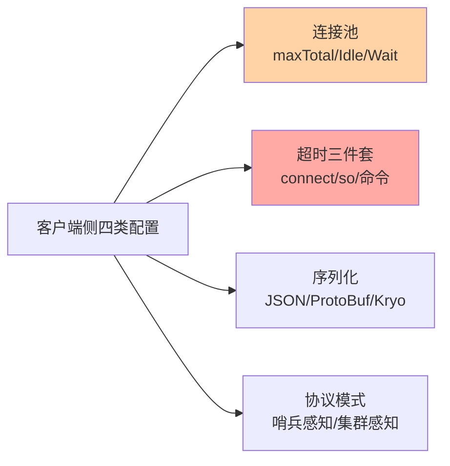
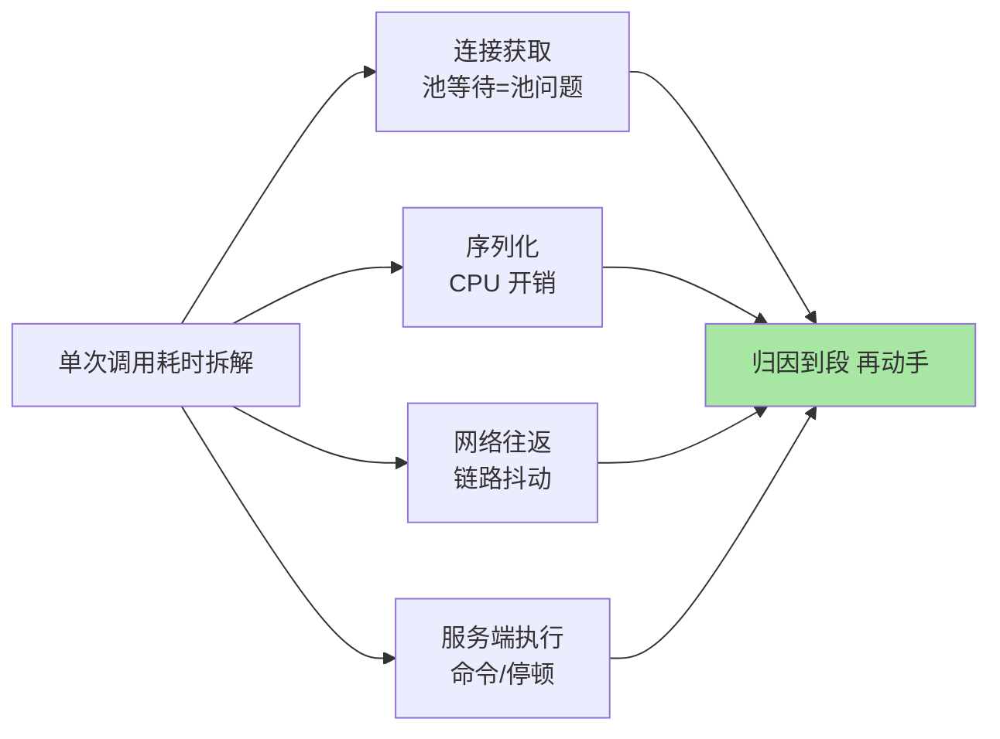

# 客户端与连接池：服务端之外的另一半性能

> 一句话：线上 Redis 故障有相当比例根源在客户端侧——连接池打满、连接泄漏、序列化开销、超时配置不当——「Redis 慢了」的排查永远要覆盖客户端这半个战场。

## 🎯 本文核心

**核心一句话：客户端侧的四类配置决定 Redis 体验的上半场——连接池参数（maxTotal/maxIdle/maxWait 决定并发上限与排队行为）、超时三件套（connect/so/命令超时决定故障传导方式）、序列化选型（性能与可读性）、协议与模式（哨兵/集群感知决定容错透明性）——服务端指标正常但业务慢，先查这四类。**

组织主线：

## 一句话摘要

应用通过客户端库（Jedis/Lettuce/redis-py/go-redis）访问 Redis，客户端侧的工程决策直接影响体验：**连接池**——建立 TCP + 认证的连接成本高，池化复用是标配；`maxTotal`（最大连接数）要与 Redis 的 `maxclients` 和业务并发匹配，`maxWait`（拿不到连接等多久）决定「池打满时是快速失败还是线程堆积」。**超时三件套**——连接超时、socket 读写超时、（部分库的）命令级超时，超时缺失 = 服务端故障把应用线程无限挂起。**序列化**——JSON 可读通用、二进制（ProtoBuf/Kryo）更快更省，大 value 场景序列化 CPU 常超过网络。**协议与模式**——客户端需支持哨兵发现（自动切换）与集群协议（MOVED 处理），这是架构选型的接入前提。

## 一、连接池：三个参数的行为画像

| 参数 | 含义 | 配错的形态 |
|---|---|---|
| `maxTotal` | 池内最大连接数 | 太小 = 业务排队等连接（表现为「偶发慢」）；太大 = 压向 Redis maxclients |
| `maxIdle` | 空闲连接保留数 | 远小于 maxTotal = 高峰反复建连（建连成本高） |
| `maxWait` | 借不到连接的等待上限 | 无限等 = 故障时线程雪崩堆积 |

**容量估算的直觉**：maxTotal ≈ 单实例并发线程数峰值（每线程同时只占一个连接执行一条命令），JVM 应用常见 50-200；借还配对（try-finally 归还）是连接泄漏的防线——「连接数只涨不跌」是泄漏的典型指纹。Lettuce 类基于 Netty 单连接多路复用的库形态不同（底层原理：协议层的请求-响应配对让单 TCP 连接上多请求流水线交错，单连接即可跑高并发，无传统池），但其连接与事件循环的配置同样是"客户端四类配置"的范畴。

## 5W 速记卡

| 维度 | 一句话 |
|---|---|
| What | 连接池参数 + 超时三件套 + 序列化 + 协议模式的客户端四类配置 |
| Why | 客户端是 Redis 故障与慢的另一半根源 |
| When | 接入选型、偶发慢排查、故障应急 |
| Where | 应用进程内的客户端库配置 |
| How | 池参数按并发峰值配；超时必有；序列化按 value 形态选 |

## 二、超时三件套：故障传导的开关

超时配置决定「Redis 出问题时应用怎么死」：**connect timeout**——建连上限（常见 1-3 秒，网络故障快速暴露）；**socket/so timeout**——读写等待上限（常见 1-5 秒，覆盖命令执行 + 网络）；命令级超时——部分客户端支持单命令细粒度。缺失超时的后果是灾难链：Redis 抖动 → 应用线程全部挂起等回复 → 线程池耗尽 → 整个应用不可用（故障从缓存层传导为全站故障）。**「快速失败 + 降级读库」优于「无限等待」**——超时配齐 + 失败降级预案（缓存三兄弟篇的兜底哲学在客户端侧的落地）。

> 💡 **实战提示**
> - 偶发慢的第一排查动作：连接池指标（活跃/等待/泄漏数）与借还耗时埋点——「偶发 200ms 的慢」多数是 maxWait 排队而不是命令慢
> - 序列化按 value 形态选：大 JSON 高频读写换二进制序列化（ProtoBuf/Kryo）CPU 与带宽双省；纯缓存整存整取可用更快的 Kryo；可读性要求高（人工排查）保留 JSON
> - Lettuce 与 Jedis 的形态差异：Jedis 连接池模型直观传统，Lettuce 单连接多路复用天然适配高并发与响应式——选型按团队并发形态与运维习惯，两者都是生产可用
> - 客户端版本跟随服务端：集群/哨兵协议、RESP3 的新特性依赖客户端版本支持——服务端升级时把客户端兼容性纳入检查单

## 三、与「服务端调优」的区别

同为性能工程，抓手不同：服务端调优动的是「实例参数与数据结构」（前几篇的主题），客户端调优动的是「应用进程内的访问方式」（连接、序列化、超时、路由）。归因时要分侧：**服务端慢**（命令执行长、CPU 满、持久化停顿）vs **客户端慢**（池等待、序列化 CPU、GC 停顿、网络抖动）——三方对账（客户端埋点 → 网络 → 服务端指标）是性能监控篇「延迟毛刺对账法」的完整版。经验上「Redis 慢」的工单里客户端侧根因占相当比例，先查客户端常常更快。

## 四、典型使用场景

- **高并发读服务**：Lettuce 多路复用 + 二进制序列化 + 本地缓存前置——低延迟客户端栈
- **多实例共用的中间层**：连接池 maxTotal 按共享方峰值总和配 + maxWait 快速失败——防相互拖垮
- **哨兵/集群接入**：客户端哨兵感知（masterName 配置）/ 集群感知（MOVED 处理）——容错透明的接入前提
- **大 value 场景**：序列化协议升级 + pipeline 分批 + 压缩权衡——客户端与服务端联动优化

## 五、误区与代价

- ❌ **「连接不用池化，现连现用」**：TCP 建连 + 认证的毫秒级成本在高频访问下是性能灾难——池化是默认，直连是特例
- ❌ **「超时设很大求稳」**：超时大 = 故障传导慢 = 线程堆积雪崩——超时按「正常 P99 的数倍」配，快速失败优于慢死
- ❌ **「连接泄漏不设防」**：未归还的连接把池耗干，表现为「运行一段时间后开始报 pool 耗尽」——借还配对 + 池指标监控双防
- ❌ **「序列化随手用默认」**：Java 原生序列化（又慢又大又不安/全）仍在存量代码常见——序列化是显式选型不是默认值

## 六、你们可能会问

**Q1：maxWait 设 0 和设 -1 有什么区别？**
不同库语义不同（Jedis 的 -1 是无限等待）——核心是「借不到连接时等多久」：生产环境永远显式配置有限等待（如 1-3 秒）+ 超时后快速失败降级，任何「无限等待」形态都是线程雪崩的隐患。

**Q2：Lettuce 单连接为什么能扛高并发？**
基于 Netty 事件驱动 + 协议层的请求-响应配对（单 TCP 连接上多请求流水线交错）——与 pipeline 的思想同源：省的是连接数与往返，命令在服务端仍串行执行。它的连接数少不等于并发能力弱。

**Q3：怎么判断「慢」在客户端还是服务端？**
客户端埋点拆解单次调用耗时：连接获取耗时（池问题）+ 序列化耗时（CPU 问题）+ 网络往返（链路问题）——只有三段都排除才看服务端指标。埋点齐全时一次告警就能定位到段。

## 七、什么时候用 / 不用

- ✅ 池化 + 显式超时 + 显式序列化选型：一切生产客户端的默认三件套
- ✅ 池指标埋点进监控：活跃数、等待数、借还耗时——客户端侧的「INFO」
- ❌ 不用直连裸建连接承载高频访问——除脚本类一次性工具
- ❌ 不依赖客户端默认值上生产——默认值面向开发便利，不面向生产负载

## 八、开放问题

- 客户端可观测性标准（各语言库的统一指标埋点规范）尚缺，跨语言团队的客户端监控口径不一是治理痛点
- RESP3 的客户端推送（invalidation 消息等）让客户端库承担更多协议复杂度，客户端库的「协议能力版本差异」成为选型的新维度

## 九、自测三问

1. 客户端四类配置是什么？连接池三参数配错的形态各是什么？
2. 超时三件套缺失的故障传导链是什么？「快速失败」为什么优于无限等待？
3. 「Redis 慢」怎么分侧归因？客户端埋点拆哪三段？

下一篇讲「版本演进与 Redis 8 新特性」：沿版本时间线收束全系列，看 Redis 的过去与将来。

## 🎯 核心带走

- **核心一句话**：客户端四类配置（连接池/超时/序列化/协议模式）是 Redis 体验的另一半——「Redis 慢」的工单先查客户端，池参数与超时是两大事故源
- **主线**：连接池三参数 → 超时三件套 → 序列化选型 → 协议模式接入
- **哪里会坏**：池打满排队、连接泄漏、超时缺失线程雪崩、默认序列化拖性能
- **边界**：本篇管客户端侧；服务端监控在篇 21，哨兵/集群接入语义在篇 16/17

## 📌 数据与事实声明

- 写于 2026-09-10；Jedis/Lettuce 池参数语义以各开源项目官方文档为准；RESP3 客户端要求以 Redis 官方协议文档为准
- 「maxTotal 50-200」「超时按 P99 数倍」为业内经验起点，按并发模型实测
- 免责：客户端库 API 与默认值随版本演进可能调整，以所用库文档为准

## 📚 参考资料

| 类型 | 标题 | 来源 |
|---|---|---|
| 开源项目 | redis/jedis、lettuce-io/lettuce-core | github.com（官方文档） |
| 开源项目 | redis/redis-py、redis/go-redis | github.com（官方文档） |
| 系列导航 | Redis 系列目录 | `docs/middleware/redis/index.md` |
