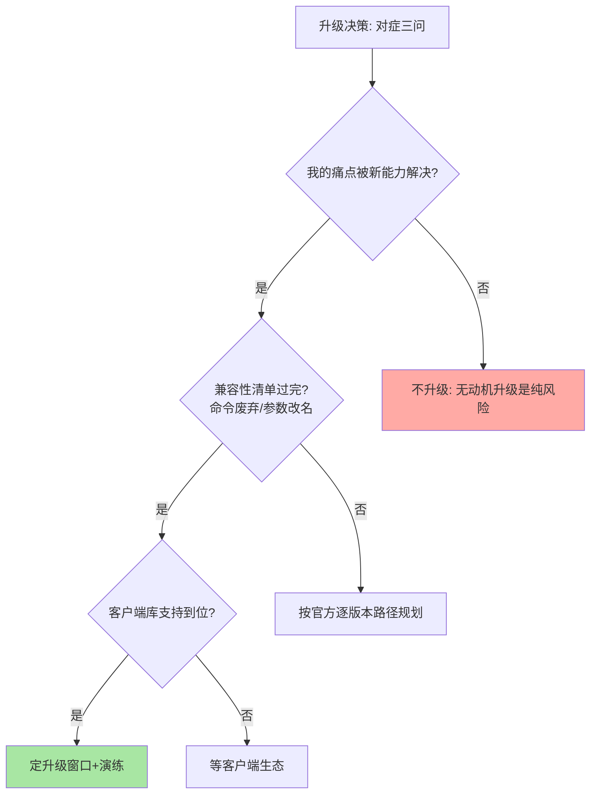

# 版本演进与 Redis 8：从缓存工具到数据平台

> 一句话：Redis 的大版本演进有两条清晰主线——「执行模型的边界扩展」（单线程 → 多线程 IO → Functions）与「能力版图的持续外扩」（缓存 → 消息 → JSON/搜索 → 向量）——读版本史就是读 Redis 从缓存工具演化为实时数据平台的路径。

## 🎯 本文核心

**核心一句话：Redis 的版本演进两条主线——性能侧「在不破坏单线程原子性的前提下扩边界」（6.0 多线程 IO、7.x Functions），能力侧「特化结构持续吸收新负载」（5.0 Stream、8.0 向量集）——升级决策的判据是「新版本的哪个能力解决你的哪个具体问题」，不为新而新。**

组织主线：

## 一句话摘要

Redis 的版本史是能力版图的扩张史：**3.x**（集群正式版）奠定分片基座；**4.0** 混合持久化 + lazy-free 异步删除；**5.0** Stream 补齐消息能力；**6.0** 是里程碑——多线程 IO、ACL 细粒度权限、RESP3 协议、客户端缓存；**7.0/7.2** Functions（服务端函数库）、多部分 AOF、Sharded Pub/Sub（集群下按槽广播不扩散）；**8.0**（2025 年发布，公开口径）性能再上台阶并吸收向量检索等 AI 负载，同时许可证演进（AGPL 等多许可形态）改变生态格局。读版本演进的目的：理解每个能力的「因什么问题而生」，升级决策从「追新」变为「对症」。

## 一、性能主线：单线程边界的四次扩展

Redis 的性能演进始终围绕「怎么在不破坏原子性的前提下突破边界」：**4.0 的 lazy-free** 把大 key 删除移出主线程（后台释放）；**6.0 的多线程 IO** 把网络读写并行化（命令执行仍单线程，篇 2 的模型边界）；**7.x 的异步任务细分**（unblock 客户端等更多主线程外操作）；**8.0 的执行层优化**（公开口径：命令执行与 IO 进一步提速）。这条主线的哲学一以贯之：**「搬运与杂务可以并行，决定与执行保持串行」**——单线程原子性是 Redis 的产品根基，所有演进都在这个约束内寻找空间。

## 5W 速记卡

| 维度 | 一句话 |
|---|---|
| What | 3.x → 8.x 的版本演进主线与各版本招牌能力 |
| Why | 升级决策需要理解「能力因什么而生」 |
| When | 版本升级评估、新技术选型、老系统现代化 |
| Where | 服务端内核 + 数据结构 + 权限/协议的全面演进 |
| How | 按需求对症选版本；升级前查兼容性清单 |

## 二、能力主线：从缓存到数据平台的版图扩张

| 版本 | 新能力 | 回答的新问题 |
|---|---|---|
| 3.x | 集群正式版 | 单机容量到顶怎么办 |
| 4.0 | 混合持久化、lazy-free | 持久化两难、大 key 删除阻塞 |
| 5.0 | Stream | 轻量可靠消息需要专业 MQ 吗 |
| 6.0 | 多线程 IO、ACL、RESP3、客户端缓存 | 多核利用、细粒度权限、协议现代化 |
| 7.x | Functions、Sharded Pub/Sub、多部分 AOF | 脚本治理、集群广播风暴、重写 IO 峰值 |
| 8.x | 向量集等新结构、性能新台阶、许可演进 | AI 负载、生态与商业化平衡 |

这条主线的终点愿景清晰：**「实时数据平台」**——缓存、消息、搜索、JSON 文档、向量检索在一个低延迟系统内完成。它同时带来新的权衡：能力越多，单实例的资源竞争面越大（各结构共享内存与 CPU），「Redis 什么都做一点」与「专用组件各做一事」的架构之争随版图扩张而更激烈。

> 💡 **实战提示**
> - 升级决策三问：我的哪个痛点被新版本能力解决（对症）？兼容性清单过完了吗（命令废弃/参数改名）？客户端库支持到位了吗（配套）——三问答完再定升级窗口
> - 6.0 是旧系统升级的目标版本底线：ACL 与多线程 IO 的收益覆盖绝大多数升级动机——跨大版本升级（如 4 → 7）按官方「逐版本迁移」路径走
> - 新结构先测后上：Stream 的 MAXLEN 纪律、向量集的内存成本（8.x）等新能力的工程约束要在压测环境消化——能力上手与容量评估同步
> - 许可证演进纳入选型（公开口径：8.x 起多许可形态含 AGPL）：自用/云托管/二次分发的合规边界不同——许可证是架构选型的正式维度，不是法律附注

## 三、与 MySQL 版本演进的气质区别

两个生态的版本演进区别一眼可见：MySQL 的版本演进保守渐进（8.0 与 5.7 的兼容过渡长达数年，升级强调平滑），Redis 的版本演进激进敏捷（大版本一年一至两代，新能力快速落地）——差异源于数据角色：数据库承载不可丢的事实源（演进以稳定为纲），Redis 承载可重建的热数据（演进以能力速度为先）。这给运维的启示：Redis 的「跟随升级」比数据库更重要（停在旧版本错过的不只是特性还有性能与修复），同时「升级演练」的成本也比数据库低——快进快出是 Redis 版本策略的底气。

## 四、典型使用场景

- **老系统现代化评估**：按本文演进主线盘点当前版本的能力缺口（4.x 无 Stream、5.x 无 ACL）——升级动机从「版本旧了」变为「缺哪个能力」
- **新项目版本选型**：主线上稳定版本（如 7.x/8.x 系）+ 客户端库生态成熟度双确认
- **AI 负载引入评估**：8.x 向量能力与专用向量库的边界对比（向量集适合「与缓存同域的轻量向量检索」，专用库服务重度向量负载）
- **许可证合规审查**：商业化产品/云服务引入 Redis 前的许可形态确认

## 五、误区与代价

- ❌ **「新版本 = 该升级」**：升级的动机只能是「解决我的问题」——每次大版本都有行为变更（参数改名/默认值调整），无动机升级是纯风险
- ❌ **「跨大版本直升」**：4.x 直升 7.x 类操作有持久化格式、命令语义、配置项的多重断层——按官方逐版本路径迁移
- ❌ **「Redis 8 的向量能力替代向量数据库」**：向量集是「与缓存同域的轻量补充」，重度向量检索（亿级、多模态、复杂过滤）是专用引擎的主场——与 Stream/MQ 的边界判断同构
- ❌ **「许可证与己无关」**：许可形态影响「怎么用、能不能托管转售」——企业选型时许可证审查是正式流程

## 六、你们可能会问

**Q1：现在新项目该从哪个版本起步？**
主线稳定的大版本系（本文写作时点的 7.x/8.x 系，公开口径），同时确认两点：客户端库对该版本的成熟支持、所用框架/中间件的兼容声明——「最新版」与「主线稳定版」不是同一个概念，起步选后者。

**Q2：Sharded Pub/Sub 解决了什么问题？**
集群模式下普通 Pub/Sub 的消息会广播到所有节点（每个节点都要处理转发，规模越大浪费越大）；Sharded Pub/Sub 按槽局部化——消息只在「拥有该频道的槽」的节点内广播。集群 + 消息广播的组合场景，7.x 起用它替代普通 Pub/Sub。

**Q3：Redis 8 的性能提升来源是什么？**
公开口径集中在：核心执行路径的重构优化、新数据结构的内存与速度改进、IO 层的进一步并行化——性能演进的配方仍是「篇 2 的模型边界」内的持续推进，未破坏单线程执行语义。

## 七、什么时候用 / 不用

- ✅ 版本升级按「对症三问」决策：痛点、兼容、客户端三问过完再动
- ✅ 新能力先压测后生产：Stream/向量集/新持久化的工程约束在测试环境消化
- ❌ 不做无动机升级、不做跨大版本直升——两条升级纪律是底线
- ❌ 不把 Redis 当「万能数据平台」全量引入新结构——能力版图扩张不改变「按场景选组件」的架构判断

## 八、开放问题

- 许可证演进后的 Redis 生态分化（开源版/多许可版/云厂商分支）将如何影响社区节奏与用户选择，是未来数年的生态主线（公开口径）
- 「实时数据平台」愿景与专用组件生态的竞争格局持续演变——向量、搜索、文档能力的边界随负载形态继续移动，每次大版本发布都值得重新评估一次

## 九、自测三问

1. 版本演进的两条主线是什么？各举三个标志性节点。
2. 升级决策的「对症三问」是什么？为什么跨大版本直升危险？
3. Redis 8 向量能力的适用边界在哪？与专用向量库怎么分工？

本篇是入门层收官：24 篇覆盖数据模型、性能、持久化、容错、安全与演进的完整入门地图。特性层将逐个机制深挖（持久化、高可用、底层编码、分布式锁、缓存一致性），专题层给治理与选型决策——入门层建立的「主线 + 边界」心智将一路复用。

## 🎯 核心带走

- **核心一句话**：Redis 版本演进两主线——性能侧在单线程约束内扩边界、能力侧向数据平台扩版图；升级按「对症三问」决策，许可证是正式选型维度
- **主线**：版本时间线 → 性能哲学 → 能力版图 → 升级纪律
- **哪里会坏**：无动机升级、跨版本直升、新能力未测即上、许可证盲区
- **边界**：本篇是入门层收官与演进总览；各能力的机制深挖分布在特性层各系列

## 📌 数据与事实声明

- 写于 2026-09-10；各版本能力节点（3.x 集群、4.0 混合持久化、5.0 Stream、6.0 多线程 IO/ACL、7.x Functions、8.x 向量与许可演进）以 Redis 官方发布说明公开口径为准
- 「8.0 于 2025 年发布」为公开报道口径；升级路径以官方文档为准
- 免责：版本节奏与能力细节以官方最新发布说明为准

## 📚 参考资料

| 类型 | 标题 | 来源 |
|---|---|---|
| 官方文档 | Redis Releases / Release Notes | redis.io/docs |
| 官方博客 | Redis 8 发布说明与许可公告 | redis.io/blog（公开） |
| 系列导航 | Redis 系列目录 | `docs/middleware/redis/index.md` |
