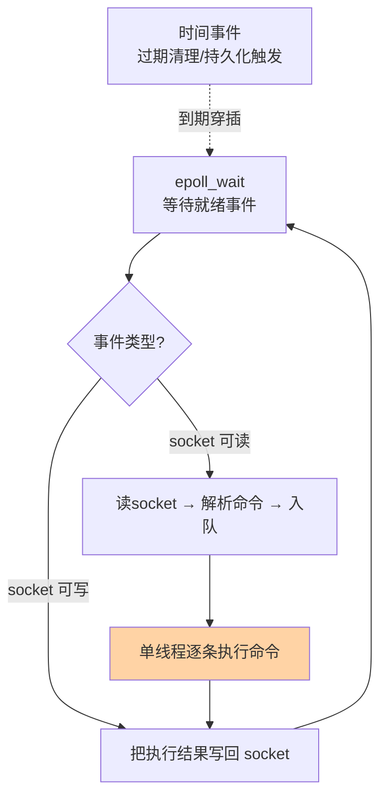

# 单线程模型与 IO 多路复用：Redis 快的第二三个乘数

> 一句话：单线程消灭了锁与上下文切换，IO 多路复用让一个线程盯住数万连接——「不等待」与「不竞争」共同构成 Redis 性能模型的另一半。

## 🎯 本文核心

**核心一句话：Redis 单线程指的是「命令执行单线程」——网络 IO 交给 epoll 多路复用事件循环，一个线程以事件驱动方式轮转处理所有连接的就绪事件；快的关键不是「线程少」，而是「从不需要等待和竞争」。** 从架构视角看，这是「内核 epoll 上报就绪 → 应用单线程消费」的上下游分工：内核管等待，应用管执行，模块边界清晰所以两头都做到极致。

组织主线：

从「为什么可以单线程」到「6.0 为什么又加了线程」，本篇四个概念是一条演进线上的四站。

## 一句话摘要

「Redis 单线程」的准确含义是：命令执行由一个主线程串行完成——没有锁、没有上下文切换、每个命令天然原子。它能以一线程扛数万连接的秘密是 **IO 多路复用**（Linux 上即 epoll）：内核替线程监视成千上万个 socket，谁就绪了唤醒谁，线程只在「有活干」时干活。6.0 引入的多线程也只并行化「网络读写与协议解析」，命令执行仍是单线程——模型边界清晰：把最贵的等待交给内核与多线程，把需要原子性的执行留在单线程。

## 一、为什么单线程反而快：反直觉的三笔账

直觉里「多线程更快」，但对 Redis 的负载形态算三笔账会反转：**①锁账**——多线程共享数据结构必须加锁，全局字典的锁竞争让并发变成排队；**②切换账**——线程上下文切换是微秒级开销，高频短命令场景切换成本可能超过命令本身；**③原子账**——单线程下 `INCR` 天然原子，多线程要靠锁或 CAS 实现。Redis 的命令都是内存级短操作（纳秒到微秒），这类负载「串行 + 不竞争」反而吞吐最高——前提是**没有慢命令**（单线程模型的一切代价都在这一点上，见误区）。

## 5W 速记卡

| 维度 | 一句话 |
|---|---|
| What | 命令执行单线程 + epoll 事件循环 + 6.0 多线程 IO 旁路 |
| Why | 短命令负载下「不竞争不等待」胜过多线程并行 |
| When | 理解性能瓶颈、排查慢命令影响、配置 IO 线程 |
| Where | 主线程跑事件循环；IO 线程（可选）处理网络读写 |
| How | `io-threads` 配置开启多线程 IO；慢命令治理靠规范 |

## 二、核心机制：epoll 事件循环

### 2.1 从 select 到 epoll：等 IO 的方式演进

一个线程怎么同时服务上万个连接？答案演进分三代：**select/poll**——每轮把全部连接传给内核挨个问「你好了吗」，连接数上万时每轮询问本身就是开销（O(n) 遍历）；**epoll**——连接注册一次（epoll_ctl），就绪的连接由内核回调放进就绪队列，线程每次只处理「确实就绪」的少量连接（O(1) 取就绪）。**「遍历所有」到「内核只报就绪」**，是高并发服务器的分水岭，Nginx、Redis、各类网关同源此理。

### 2.2 Redis 的事件循环

主线程循环两件事：处理就绪的网络事件（读命令 → 执行 → 写回）、穿插到期的时间事件（过期键清理、持久化调度）。这套 ae 事件框架就是 Redis 的心脏——理解了「一切都在这一个循环里转」，就理解了为什么**一条慢命令会阻塞所有客户端**：循环是串行的，堵一处堵全局。

### 2.3 6.0 多线程 IO：只并行「搬」，不并行「算」

6.0 的多线程只作用于网络读写与协议解析（把数据从 socket 读进缓冲区、把结果写回 socket），命令执行仍在主线程串行——「搬数据可以多人搬，做决定只能一个人做」。开启方式 `io-threads 4` 与 `io-threads-do-reads yes`（读方向默认关闭，多数场景写方向收益已够，以官方建议为准）。适用边界：大吞吐 + 大 value 的场景收益明显；小命令高 QPS 场景提升有限——多线程 IO 解决的是「网络搬运跟不上执行」，不是「执行不够快」。

> 💡 **实战提示**
> - 慢命令是单线程的天敌：`KEYS *`、大集合的全量 `SMEMBERS`、未加 LIMIT 的 `SLOWLOG GET`——一条秒级命令阻塞所有请求，生产环境用 `SCAN` 替代 `KEYS`
> - 用 `SLOWLOG GET` 建立慢命令巡检：`slowlog-log-slower-than` 按业务定（常见 10ms 内），慢命令清单是性能治理的第一张表
> - CPU 利用率看单核：Redis 的主线程是单核的，`top` 拆到单核看——「机器 CPU 20% 但 Redis 卡」的真相常是主线程那一核满了
> - io-threads 别盲开：4-8 线程起步压测对比，小 value 高 QPS 场景收益可能为负（线程协作开销）

## 三、与「MySQL 单线程写入」的区别

同为「串行化保正确」，位置不同：MySQL 的 InnoDB 是多线程引擎（后台刷脏、purge、复制多线程并行），只在「写写冲突」处用锁串行化；Redis 是全命令单线程串行。差异源于负载：数据库单条操作微秒到毫秒级、可并行价值大；Redis 单条操作纳秒到微秒级、并行收益锁不住开销。**串行化的粒度跟着操作时长走**——这是并发模型设计的通用判断式。

## 四、典型使用场景

- **原子计数**：单线程保证 `INCR` 无竞态——限流器、秒杀预占的基础
- **免锁共享状态**：业务把「需要加锁才能改的东西」放 Redis 单线程改写，用它的串行换应用的免锁
- **高并发接入层**：epoll 模型让单实例扛数万连接，作为缓存层天然匹配
- **大吞吐网关场景**：6.0 多线程 IO + 大 value 场景（如图片元数据、大 JSON 缓存）

## 五、误区与代价

- ❌ **「单线程 = 不能用多核」**：单实例只用一个核，但多实例（多端口/集群分片）轻松吃满多核——扩展问题在部署层解决，不动模型
- ❌ **「加了 io-threads 性能必涨」**：它加速的是网络搬运，执行仍单线程——瓶颈在执行侧（慢命令、大 value）时开了白开
- ❌ **「一条慢命令忍忍就过去了」**：串行循环里它是所有用户的延迟——生产禁用 `KEYS`、`FLUSHALL` 类全量命令，用 `SCAN`、配置别名或禁用（rename-command）
- ❌ **「持久化不占主线程」**：fork 子进程做 RDB 是瞬时操作但大内存实例 fork 可造成毫秒到百毫秒停顿（页表复制），AOF 重写同理——持久化调度避开高峰（持久化机制篇展开）

## 六、你们可能会问

**Q1：为什么 7.x 之后还有执行线程化的讨论，官方坚持单线程执行吗？**
执行多线程会重新引入锁与竞态，打破「命令天然原子」的模型红利——社区方向是「IO 并行、执行串行」的边界继续优化（如异步释放、后台任务细分），而不是执行多线程。原子性是 Redis 的产品价值，不轻易换。

**Q2：epoll 的边缘触发和水平触发，Redis 用哪个？**
水平触发（LT）——没处理完的事件会持续报告，模型简单不易丢事件；代价是必须一次读干净否则反复唤醒。工程上「简单可靠」优先于极致效率，与 Nginx 的 ET 选择互为参照。

**Q3：怎么确认我的 Redis 是不是被慢命令卡过？**
`SLOWLOG GET` 看历史慢命令、`INFO stats` 的 `instantaneous_ops` 曲线与延迟监控对齐——「QPS 没涨但延迟抖」的毛刺多数能在这里找到对账。

## 七、什么时候用 / 不用

- ✅ 需要原子性与免锁语义的场景：把竞态问题交给 Redis 单线程，应用侧删掉锁代码
- ✅ 大连接量接入：epoll 模型天然匹配，单实例数万连接从容
- ❌ 不把 CPU 密集计算放 Redis：Lua 脚本写循环计算 = 卡住全实例——Redis 只做「短命令的数据操作」
- ❌ 不指望 io-threads 解决执行慢：慢命令的治理靠规范与拆 key，不靠加线程

## 八、开放问题

- 「IO 多线程 + 执行单线程」的边界在多核 NUMA 与超大吞吐下的收益模型仍在社区实测演进；执行侧的异步化（如异步 unlink、后台任务细分）正逐步蚕食「必须串行」的范围——单线程模型的定义边界在缓慢漂移
- 用户态网络栈（io_uring 类）与 Redis 的结合是性能演进的下一站，官方已有实验与讨论（公开口径），值得跟踪

## 九、自测三问

1. 「Redis 单线程」的准确含义是什么？单线程换来了哪三笔账的收益？
2. epoll 相比 select/poll 的本质改进是什么？
3. 6.0 多线程 IO 并行的是什么、不并行的是什么？适用边界是什么？

下一篇讲「String 与 Hash」：进入五大结构，看最常用的两个结构怎么选、怎么省内存。

## 🎯 核心带走

- **核心一句话**：命令执行单线程（原子免锁）+ epoll 事件循环（不等待）+ 6.0 多线程 IO（只并行搬运）——「不等待不竞争」是 Redis 性能模型的另一半
- **主线**：三笔账 → select/epoll 演进 → 事件循环 → 多线程 IO 边界
- **哪里会坏**：慢命令堵全实例、误开 io-threads、fork 停顿、单核盲区
- **边界**：本篇管执行模型；String/Hash 等结构从篇 3 起，持久化的 fork 细节在持久化机制篇

## 📌 数据与事实声明

- 写于 2026-09-10；事件循环（ae）、6.0 io-threads 语义以 Redis 官方文档与源码公开口径为准
- 「4-8 io-threads 起步」「慢日志 10ms 阈值」为业内经验值，按业务压测校准
- 免责：配置项与默认值随版本演进可能调整，以官方文档为准

## 📚 参考资料

| 类型 | 标题 | 来源 |
|---|---|---|
| 官方文档 | Redis Topics: IO Threads / Latency | redis.io/docs |
| 官方源码 | redis/redis（src/ae.c、networking.c） | github.com/redis/redis |
| 系列导航 | Redis 系列目录 | `docs/middleware/redis/index.md` |
