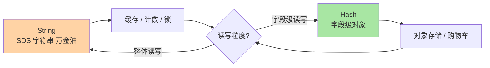
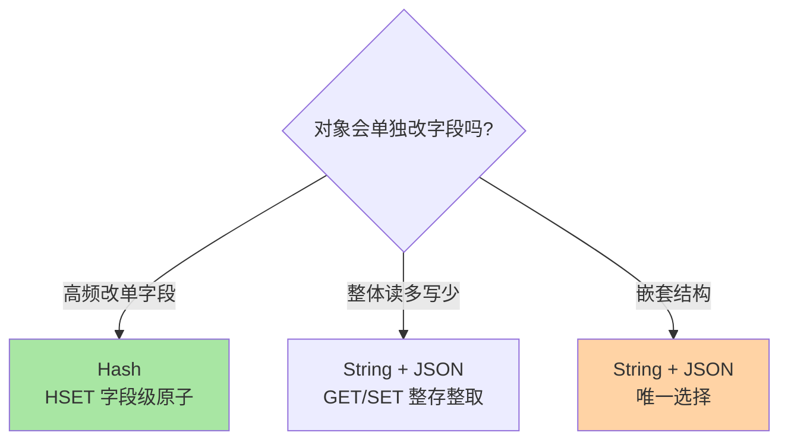

# String 与 Hash：最常用两结构的场景选型

> 一句话：String 是「整存整取的二进制安全字节数组」，Hash 是「字段级读写的mini对象」——两者覆盖 Redis 七成日常场景，选型口诀是「整体读写用 String、高频改单字段用 Hash」。

## 🎯 本文核心

**核心一句话：String 与 Hash 的选型本质是「读写粒度」之争——String 整体序列化读写（简单、省连接次数），Hash 字段级操作（省带宽、支持单字段修改）；缓存对象高频变字段时 Hash 的部分更新价值最大，纯缓存整体读写时 String 更简单。**

组织主线：



## 一句话摘要

String 是 Redis 最基础的结构：二进制安全的字节序列（底层 SDS 简单动态字符串，O(1) 取长度、预分配减 realloc），缓存 JSON、计数器（INCR 原子自增）、分布式锁载体全靠它。Hash 是「key → field → value」的两级映射：一个 key 下挂多个 field，可单独读写任一字段——存对象不用整体序列化，改昵称不用读出整个对象再写回。两者的底层编码都会按数据量在紧凑形态与标准形态间自动切换（编码细节在特性层底层编码系列展开）。

## 一、String：万金油的三个核心用法

```text
① 缓存载体    SET user:1001:profile <json> EX 3600
② 原子计数    INCR article:1001:views      ← 单线程保证无竞态
③ 互斥载体    SET lock:order:1001 token NX EX 30   ← NX+EX 原子加锁
```

三个用法对应 String 的三个特质：**二进制安全**（存什么字节都行，JSON/图片缩略数据皆可）、**原子的数值操作**（INCR/DECR/INCRBY 直接把 value 当整数加减）、**原子条件写入**（NX = 不存在才设置，分布式锁与防重的基石——锁的完整演进见特性层分布式锁系列）。

## 5W 速记卡

| 维度 | 一句话 |
|---|---|
| What | String=二进制安全字节串；Hash=key 下两级 field-value 映射 |
| Why | 整存整取与字段级读写是两类高频诉求 |
| When | String：缓存/计数/锁；Hash：对象、购物车、配置组 |
| Where | 全局字典的两种 value 形态 |
| How | SET/GET/INCR；HSET/HGET/HGETALL/HDEL |

## 二、Hash：对象存储的字段级方案

```text
HSET user:1001 name tom age 18 city sz   # 一次设多字段
HGET user:1001 age                        # 单字段读（不搬整个对象）
HINCRBY user:1001 login_count 1           # 字段级原子计数
HDEL user:1001 city                       # 删单字段
```

与「String 存 JSON」的对比是选型的核心决策：

| 维度 | String + JSON | Hash |
|---|---|---|
| 读整个对象 | ✅ 一次 GET | 需 HGETALL（字段多时慢） |
| 改单字段 | 读出→改→整体写回（读改写竞态风险） | ✅ HSET 单字段，原子 |
| 序列化开销 | 有（应用层编解码） | 无（field-value 原生存储） |
| 结构灵活性 | ✅ JSON 嵌套任意结构 | 只支持扁平 field（嵌套要自己序列化） |

**选型口诀**：整体缓存、读多写少 → String；对象字段高频独立变更（购物车加 SKU、用户改资料）→ Hash。嵌套结构（对象里套数组套对象）Hash 表达不了，老实用 String 存 JSON——**结构复杂度超出扁平模型时不要硬套**。从架构上看，这也是 Redis 与数据库的又一次上下游分工：String/Hash 管「按 key 定位后的读写」，多条件检索由 MySQL 承接，两者以缓存同步衔接而非互相替代。



> 💡 **实战提示**
> - Hash 字段过期是常见误区：EXPIRE 只作用于整个 key，**field 级没有过期**——需要字段级 TTL 的场景（验证码分字段存）要么拆 key 要么业务侧记时间戳清理
> - `HGETALL` 是大 hash 的危险命令：字段上千时一次拉全量卡单线程，改用 `HSCAN` 分批——大 key 治理的原则在所有结构通用
> - 计数器防溢出思考：INCR 的 value 上限是 long long，计数场景天然安全；把 String 当位图用（SETBIT）时注意偏移量与内存的对应关系
> - String 的缓存对象加版本号（`v2:user:1001`）比删除重建更稳：结构变更时旧缓存自然过期，避免新旧结构混存

## 三、与 MySQL 行存储的区别

Hash 存对象与 MySQL 一行记录形似神异：MySQL 行支持按任意列条件检索（WHERE age > 18）、行间事务与外键约束；Hash 只能按 key 定位后操作字段——**没有「按 field 值反查 key」的能力**（想按城市找用户要自己维护 city → user 集合的反向索引）。这个边界再次印证篇 1 的分工：Redis 存「按 key 定位的热数据」，关系检索留在数据库。

## 四、典型使用场景

- **缓存 JSON**：String 存接口返回体、页面片段——TTL 统一管理，整存整取
- **限流计数**：`INCR rate:uid:1001:2026091010` + 30 秒 EXPIRE，固定窗口限流两行搞定
- **购物车**：Hash，key=`cart:uid:1001`，field=sku_id，value=数量——加减数量原子操作
- **对象会话**：Hash 存登录会话字段，单字段更新（最后活跃时间 HSET）不搬全量
- **分布式锁载体**：String 的 `SET NX EX`（锁的看门狗、RedLock 争议在特性层展开）

## 五、误区与代价

- ❌ **「一个用户一个 key 拆得太碎」**：`user:1001:name`、`user:1001:age` 各一个 String——key 元数据开销 ×N，收进一个 Hash 才是正解；反向的「整站塞一个 Hash」则是大 key 灾难——粒度在「对象级」
- ❌ **「HGETALL 顺手就用」**：它对单线程是一次 O(N) 遍历，购物车 500 个 SKU 时一次 HGETALL 就是 500 次字段拷贝——按需 HGET / HMGET
- ❌ **「field 也设计得很长」**：field 同样占内存，`"sku_id_12345678"` 收敛为 `"12345678"`，大 hash 上是可观的节省
- ❌ **「把 Hash 当二级索引用」**：想「按 age 找用户」就为每个 age 建 Hash——这是在 Redis 里手工造数据库，检索需求请回到 MySQL 或维护显式的 Set 反向索引

## 六、你们可能会问

**Q1：String 存 JSON 改一个字段，读改写竞态怎么办？**
两个方向：改 Hash（字段级原子）；或接受「最后写赢」（缓存场景可容忍，事实源在 MySQL）。真正要紧的是别在读改写路径上放业务正确性——缓存的价值就是允许不一致窗口。

**Q2：Hash 什么时候会从紧凑编码退化为标准哈希？**
字段数或单值长度超过阈值（`hash-max-listpack-entries/values`）时自动转换——阈值可调但默认值是内存与性能的折中，理解你业务对象的典型大小后，大多数情况默认值就是对的。

**Q3：INCR 后 EXPIRE 不原子，限流有漏洞吗？**
`INCR` 返回 1（第一次）时才 EXPIRE，非首次续期会刷新窗口——固定窗口限流的经典细节。原子版可用 Lua 脚本封装或直接用 `SET key val EX ttl NX`（首次写入带 TTL），脚本方案在 Lua 篇展开。

## 七、什么时候用 / 不用

- ✅ String：整体缓存、原子计数、锁载体、序列号——一切「一个值」的语义
- ✅ Hash：对象字段级读写、购物车/配置组——一切「一个对象多个属性且会单独变」的语义
- ❌ 不用 Hash 存嵌套结构、不用 String 做字段频繁变更的对象——逆着结构语义用，两边都难受
- ❌ 不在 Redis 里建「二级索引体系」——检索是数据库的事，Redis 只服务按 key 定位

## 八、开放问题

- listpack 等紧凑编码的适用上限在持续放宽（各版本阈值演进），「小对象自动省内存」的覆盖面随版本扩大——升级大版本前复查编码阈值是省内存的低成本动作
- 字段级 TTL（hash field expiration）已在 7.4 版本进入（公开口径），「field 级没有过期」这一经典边界正在被打破——版本升级评估时值得纳入

## 九、自测三问

1. String 的三个核心用法对应哪三个语言特质？
2. String+JSON 与 Hash 的选型口诀是什么？嵌套结构怎么办？
3. Hash 字段过期怎么办？HGETALL 为什么危险？

下一篇讲「List 与 Set」：双端队列与无序集合，队列语义与关系语义的两大载体。

## 🎯 核心带走

- **核心一句话**：String 整存整取（缓存/计数/锁），Hash 字段级对象（购物车/会话）——读写粒度决定选型，嵌套结构回 JSON，检索需求回数据库
- **主线**：String 三用法 → Hash 字段级操作 → 粒度选型对照 → 边界（field 无过期/无反查）
- **哪里会坏**：HGETALL 卡线程、key 拆太碎、Hash 当索引、读改写竞态
- **边界**：本篇是结构选型层；SDS 与编码实现在特性层底层编码系列，List/Set 在下一篇

## 📌 数据与事实声明

- 写于 2026-09-10；SDS、listpack 编码、命令语义以 Redis 官方文档与源码公开口径为准；hash field TTL 为 7.4+ 能力（公开口径）
- 「大 key 10KB 阈值」「5-7 字段收 Hash」为业内经验值，按业务实测
- 免责：编码阈值与命令行为随版本演进可能调整，以官方文档为准

## 📚 参考资料

| 类型 | 标题 | 来源 |
|---|---|---|
| 官方文档 | Redis Data Types: Strings / Hashes | redis.io/docs |
| 官方源码 | redis/redis（t_string.c、t_hash.c、sds.c） | github.com/redis/redis |
| 系列导航 | Redis 系列目录 | `docs/middleware/redis/index.md` |
