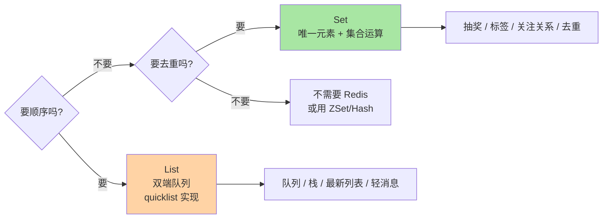
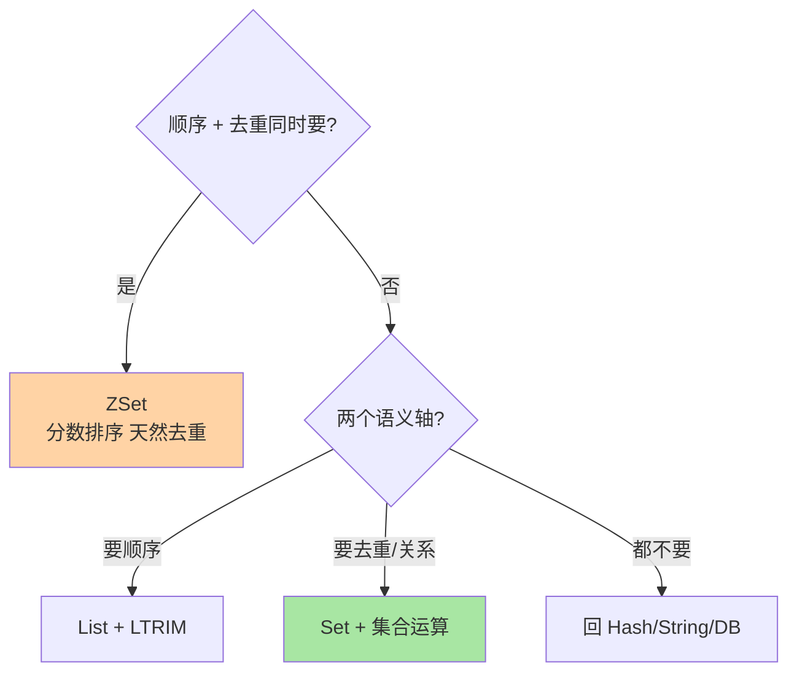

# List 与 Set：双端队列与无序集合的语义分工

> 一句话：List 提供「有序可重复」的双端队列语义（队列/栈/时间线），Set 提供「无序不重复」的集合语义（去重/关系/抽奖）——一个管顺序，一个管关系。

## 🎯 本文核心

**核心一句话：List 与 Set 的分工由两个语义轴决定——「要不要顺序」与「要不要去重」：List 有序可重复（LPUSH/RPOP 的双端操作是队列与栈的原料），Set 无序唯一（SADD 天然去重 + 交并差集合运算）——选结构先问这两个语义问题。**

组织主线：



## 一句话摘要

List 是双端链表（底层 quicklist：分段 listpack 用双向指针串起），两端插入弹出都是 O(1)：LPUSH+RPOP 组合成队列、LPUSH+LPOP 组合成栈，BRPOP 提供阻塞弹出（消费端无数据时挂起等待），是轻量队列的原生形态。Set 是无序唯一元素集（小集合 intset/listpack，大集合哈希表）：SADD 自动去重，SISMEMBER O(1) 判存在，SINTER/SUNION/SDIFF 提供交集并集差集——关注关系的共同好友、多维度标签筛选的集合运算直接落在存储层完成。

## 一、List：双端队列的三个用法

```text
① 简单队列     LPUSH queue:mail <任务>  +  RPOP queue:mail（消费）
② 阻塞消费     BLPOP queue:mail 5       ← 空队列时挂起 5 秒，省轮询
③ 最新列表     LPUSH feed:uid:1 <动态> + LTRIM feed:uid:1 0 999（只留最近千条）
```

**队列语义的注意点**：List 的弹出是「取走即删」，没有消费确认——消费者取到任务后崩溃，任务就丢了；对可靠性有要求的队列（至少一次投递）需要「取走 → 处理 → 确认」的可靠队列模式（BRPOPLPUSH 的备份变体或直接上 Stream 消费组，见消息能力篇）。**List 队列适合「丢了可接受」的轻任务**，这是它的语义边界。

## 5W 速记卡

| 维度 | 一句话 |
|---|---|
| What | List=有序可重复双端队列；Set=无序唯一元素集合 |
| Why | 顺序语义与关系语义是两类高频诉求 |
| When | List：队列/栈/最新动态；Set：去重/抽奖/标签/关系 |
| Where | 全局字典的两种 value 形态 |
| How | LPUSH/RPOP/BRPOP/LTRIM；SADD/SISMEMBER/SINTER/SPOP |

## 二、Set：去重与关系的原生载体

```text
① 去重打卡     SADD uv:20260910 <设备号>   ← 重复添加自动忽略，SCARD 拿总数
② 抽奖         SPOP lottery:1001 3         ← 随机弹出 3 个（不放回）
③ 关系运算     SINTER follow:A follow:B    ← 共同关注
               SDIFF   follow:A follow:B   ← A 关注了但 B 没关注
```

Set 的独特价值在**集合运算下沉到存储层**：共同好友、共同点赞、标签交集筛选——这类「两个集合的关系」在数据库里要 JOIN 或多次查询，在 Redis 里一条 SINTER 亚毫秒返回。代价是内存：Set 为唯一性付出的哈希表成本高于 List，亿级元素的 Set 要评估内存预算（大规模去重可考虑 HyperLogLog 的近似计数，见高级结构篇）。

## 三、List vs Set 选型对照

| 需求 | 用 List | 用 Set |
|---|---|---|
| 保留插入顺序 | ✅ | ❌ 无序 |
| 自动去重 | ❌ 重复保留 | ✅ 唯一 |
| 取「最新 N 条」 | ✅ LPUSH+LTRIM | 不适用 |
| 判断「在不在」 | ❌ 只能遍历/LPOS | ✅ SISMEMBER O(1) |
| 两集合交并差 | 不适用 | ✅ SINTER/SUNION/SDIFF |
| 随机抽取 | ❌ | ✅ SPOP/SRANDMEMBER |

口诀：**「最新、排队、时间线」想 List；「去重、关系、随机」想 Set**——两个语义问题（顺序？去重？）答完，选型自动确定。从架构分工看，Set 的集合运算是「预建维度的关系查询」——它接不住的多条件筛选退回 MySQL，检索型需求溢出到 ES，三层各守一段。



> 💡 **实战提示**
> - List 当队列必配 LTRIM：`LPUSH + LTRIM 0 N` 只保留最近 N 条，防列表无限增长变巨型 key——「生产的 List 几乎都该带 LTRIM」
- 给 BRPOP 设超时（如 5 秒）：无限阻塞的消费者在网络断开时会留下悬挂连接，超时 + 重试是队列消费的健康姿态
> - Set 元素是二进制安全的任意串，但别存结构化大对象——Set 里放序列化 JSON 会让集合运算失去意义（比的是整个串），放「业务 ID」才是正解
> - 大 Set 的 SINTER 是潜在阻塞源：两个百万级 Set 求交是 O(N×M) 级操作——大集合运算用 SINTERSTORE 到临时 key + UIED 分批，或低峰执行

## 四、与「数据库关系查询」的区别

Set 的交并差看着像 SQL 的 INTERSECT/UNION，差异在能力边界：数据库 JOIN 支持任意条件组合与部分匹配，Redis 集合运算是「整个集合级的布尔运算」——它能秒答「A 和 B 的共同关注」，答不了「A 关注的、住在北京、近 30 天活跃的人」（多条件过滤是数据库的活，Redis 里要先构建好各种维度的 Set 再运算）。**用 Set 做关系，前提是关系维度有限且可预建**；维度一多，维护 Set 的成本超过查询本身。

## 五、典型使用场景

- **消息队列（轻量）**：List 阻塞弹出——邮件/通知类「丢了能接受」的任务分发
- **最新动态**：List + LTRIM 的定长时间线——App 首页 feed 的简化实现
- **抽奖/随机**：Set 的 SPOP（不放回）与 SRANDMEMBER（可放回）——两种抽奖语义各取所需
- **标签与画像**：用户标签存 Set，运营筛选「标签 A ∩ 标签 B」SINTER 直出
- **去重统计**：Set 打 UV 精确去重（亿级换 HyperLogLog 近似，见高级结构篇）

## 六、误区与代价

- ❌ **「List 当可靠队列用」**：弹出即删无确认，消费者崩溃任务即丢——可靠投递用 Stream 消费组或专业 MQ
- ❌ **「巨型 List/Set 不分治」**：千万元素的单一 List/Set 是大 key 灾难（迁移、过期、删除全部阻塞）——按业务分桶（时间/哈希段）拆分
- ❌ **「SUNION 直接对线上大集合来」**：无 STORE 后缀的集合运算结果直接返回客户端，百万级结果既慢又占带宽——用 SINTERSTORE/SUNIONSTORE 落到临时 key 再分批取
- ❌ **「Set 元素当记录用」**：Set 只有元素没有字段与分数——需要「元素 + 排序值」上 ZSet，需要「元素 + 属性」上 Hash

## 七、你们可能会问

**Q1：BRPOP 多个消费者同时消费一个队列，会重复消费吗？**
不会——List 的弹出是原子的，每个元素只被一个消费者取走（单线程串行执行的天然保证）。这正是「把并发问题交给 Redis」的又一例：多消费者抢队列不需要应用层加锁。

**Q2：List 的随机访问（LINDEX）性能怎么样？**
O(N)——quicklist 中段定位要跨节点找。List 是为「两端操作」生的结构，按索引随机访问多的场景它就不是对的结构（考虑 Hash/ZSet 或回数据库）。

**Q3：怎么统计 Set 元素规模又不暴露全部元素？**
SCARD 拿基数 O(1)；SSCAN 分批遍历（游标式，不阻塞）——直接 SMEMBERS 全量拉取是大 Set 的禁手，与 KEYS 之于全局字典同理。

## 八、什么时候用 / 不用

- ✅ List：最新列表、轻队列、栈、定长时间线——「顺序 + 两端操作」的语义
- ✅ Set：去重、存在性判断、集合关系运算、随机抽样——「唯一 + 关系」的语义
- ❌ 顺序 + 去重同时要 → 上 ZSet（排行的结构，下一篇主角），别用 List 手工去重
- ❌ 可靠消息 → Stream/MQ，List 队列的丢失语义要先跟业务对齐

## 九、自测三问

1. List 与 Set 的两个语义轴是什么？口诀怎么记？
2. List 队列的可靠性边界在哪？怎么补救？
3. SINTER 与 SINTERSTORE 的取舍是什么？大集合运算怎么防阻塞？

## 开放问题

- List 的 quicklist 与 Stream 的 radix tree 在「队列」语义上持续分工细化，轻队列与可靠队列的结构边界随 Stream 生态成熟会更清晰
- 集合运算对超大 Set 的分批执行模式（STORE + SCAN 组合）仍是工程拼装而非原生命令，社区对「分块集合运算」的讨论值得跟踪

下一篇讲「ZSet 与排行榜」：给 Set 加上分数与排序，Redis 最精妙的结构。

## 🎯 核心带走

- **核心一句话**：List 有序可重复（队列/栈/时间线 + LTRIM 配套），Set 无序唯一（去重/关系/随机）——顺序与去重两个语义问题答完，结构自动选定
- **主线**：语义两轴 → List 双端三用法 → Set 集合运算 → 选型对照 → 可靠性边界
- **哪里会坏**：无 LTRIM 的巨型 List、大集合 SINTER 阻塞、List 当可靠队列、Set 存大对象
- **边界**：本篇是结构选型层；quicklist/intset 实现在特性层底层编码系列，ZSet 与跳表在下一篇与特性层篇 2

## 📌 数据与事实声明

- 写于 2026-09-10；quicklist、集合运算命令语义以 Redis 官方文档与源码公开口径为准
- 「List 带 LTRIM」「大集合运算低峰」为业内经验惯例，阈值按业务定
- 免责：命令复杂度与编码阈值随版本演进可能调整，以官方文档为准

## 📚 参考资料

| 类型 | 标题 | 来源 |
|---|---|---|
| 官方文档 | Redis Data Types: Lists / Sets | redis.io/docs |
| 官方源码 | redis/redis（t_list.c、t_set.c） | github.com/redis/redis |
| 系列导航 | Redis 系列目录 | `docs/middleware/redis/index.md` |
