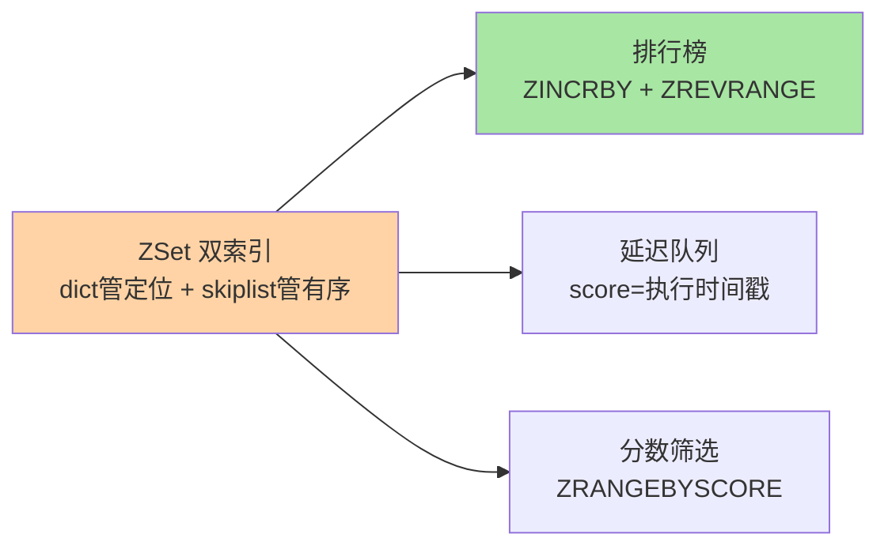
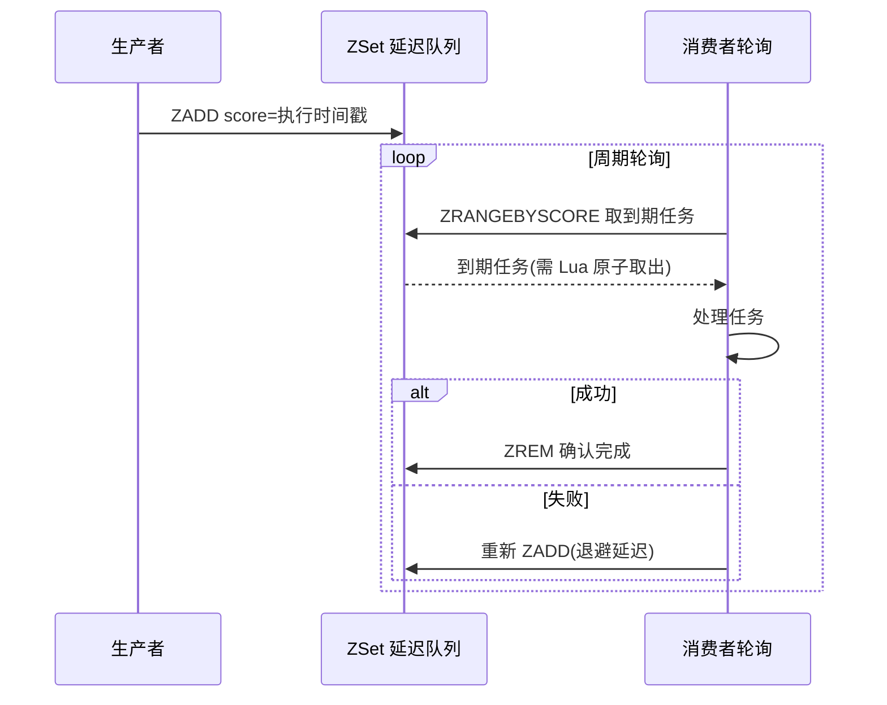

# ZSet 与排行榜：分数排序的精妙结构

> 一句话：ZSet 是「每个元素带一个分数、按分数实时有序」的唯一集合——排行榜、延迟队列、范围筛选三合一，是 Redis 结构里唯一「自带排序」的选手。

## 🎯 本文核心

**核心一句话：ZSet = 元素唯一 + 每元素绑一个 double 分数 + 按分数实时排序——内部哈希表管「元素→分数」O(1) 定位、跳表管「按分数有序」范围扫描，两个索引各答一半问题；排行榜/延迟任务/分数筛选都是「分数语义」的不同化身。**

组织主线：



## 一句话摘要

ZSet（有序集合）在 Set「元素唯一」的基础上给每个元素绑定一个 double 分数，并按分数自动排序：ZADD 添加、ZINCRBY 加分、ZREVRANGE 拿 Top N、ZRANGEBYSCORE 按分数段筛选、ZRANK 查排名——全部对数级复杂度。底层是哈希表与跳表的双索引组合：哈希表 O(1) 查「某元素的分数」，跳表 O(log N) 做「按分数的范围扫描」——一个结构两种索引各司其职，这让 ZSet 成为排行榜、延迟队列、时间线等「带权重集合」的默认答案。

## 一、排行榜：ZSet 的招牌场景

```text
ZINCRBY board:day:20260910 100 "user:1001"   # 用户加 100 分
ZREVRANGE board:day:20260910 0 9 WITHSCORES  # Top 10（分数从高到低）
ZREVRANK board:day:20260910 "user:1001"      # 我的实时排名
ZSCORE  board:day:20260910 "user:1001"       # 我的分数
```

四个命令构成完整排行榜闭环，全部亚毫秒。两个工程要点：**① 榜单周期化**——按天/周分 key（`board:day:20260910`），历史榜单自然过期，避免单一巨型 ZSet；**② 并列分数的处理**——分数相同时按元素字典序，业务需要严格次序时把「时间戳」编进分数的小数位（如 `分数 + 1 - 时间戳占比` 的编码技巧），这是排行榜设计的经典手法。

## 5W 速记卡

| 维度 | 一句话 |
|---|---|
| What | 元素唯一 + 分数排序的双索引结构（哈希表 + 跳表） |
| Why | 「带权重的集合」需要实时排序与排名 |
| When | 排行榜、延迟队列、分数筛选、时间线 |
| Where | 全局字典的 value 形态之一 |
| How | ZADD/ZINCRBY 写、ZREVRANGE/ZRANGEBYSCORE/ZRANK 读 |

## 二、延迟队列：分数当时间戳用

把「执行时间」存进分数，ZSet 秒变延迟队列：



```text
ZADD delay:tasks 1760000000 "task:1001"     # score = 应执行的时间戳
# 消费者轮询：
ZRANGEBYSCORE delay:tasks <当前时间戳> +inf LIMIT 0 10   # 取到期任务
# 处理成功后 ZREM；失败按策略重新 ZADD（退避延迟）
```

与 List 队列的对比：List 是 FIFO 先到先执行，ZSet 队列是「按预定时间执行」——订单超时关闭、延迟推送、重试退避都是这个模式。可靠性边界与 List 队列同源：取出后崩溃任务丢失，需要「取出 → 处理 → 确认」的补偿设计；多个消费者并发取到期任务时要防重复消费（Lua 脚本把「取 + 删」原子化，见 Lua 篇）。

## 三、双索引：跳表 + 哈希表各管一半

ZSet 内部同时维护两种索引：**哈希表**（member → score）让 ZSCORE/ZINCRBY 是 O(1)；**跳表**（按 score 有序）让范围扫描是对数级。这个设计的精妙在于**空间换时间轴的正交分解**：任何「既要按元素精确定位、又要按值范围遍历」的需求都长这个样子——数据库里对应「唯一索引 + 二级索引」，ZSet 在一个结构里内建了两套。跳表的实现细节（层数概率、与 B+ 树的介质之争）在特性层「跳表与 ZSet 实现」正式展开。架构上这也是 Redis 结构设计的通用范式：**对外一个结构语义、对内多套索引协同**——上下游分工收在结构内部。

> 💡 **实战提示**
> - 分数是 double：整数超 2^53 会丢精度——亿级分数场景用「整数分数」并确认量级，或分数编码业务含义（时间戳 + 序列号）时核对精度
> - ZREVRANGE 大榜单加 LIMIT：`ZRANGE key 0 -1` 全量拉取是大 key 操作，Top N 场景永远带 LIMIT（0 9 已是惯例写法）
> - 延迟队列的「取出即删」要用 Lua 原子化：ZRANGEBYSCORE 取到后 ZREM 前的窗口会被另一个消费者抢到——两命令拼 Lua 是标准修法
> - 成员删除与分数清零是两回事：ZREM 移出结构，ZADD score=0 是留在榜上——下榜语义用 ZREM，别用零分伪装

## 四、与「MySQL ORDER BY」的区别

排序能力看似重叠，语义迥异：MySQL 排序是「查询时对全表/索引计算」（数据量大时依赖索引与 limit），ZSet 是「写入时实时维护有序」——每次 ZADD 付出对数级维护成本，换读取端永远有序、永远亚毫秒。**写时排序 vs 读时排序**是两者分工的判据：榜单这种「写一次读万次」的排序，维护成本摊薄到极致；条件灵活的临时排序（任意字段、任意过滤）是数据库的主场。

## 五、典型使用场景

- **实时排行榜**：游戏积分、销量榜、热搜榜——周期分 key + ZINCRBY + Top N
- **延迟任务**：score 存执行时间戳——订单超时、重试退避、定时提醒
- **范围筛选**：价格区间商品（score=价格）、时间线（score=时间戳）的 ZRANGEBYSCORE
- **滑动窗口限流**：score 存请求时间戳，ZREMRANGEBYSCORE 清窗口外 + ZCARD 计数——比固定窗口更平滑的限流实现
- **粉丝/时间线**：score 存发布时间，ZRANGE 翻页（关注流的时间序实现）

## 六、误区与代价

- ❌ **「一个 ZSet 挂全站数据」**：全服用户进一个总榜 = 巨型 key（千万 member），范围扫描与迁移全部阻塞——按周期/分区/分片拆榜
- ❌ **「用 ZSet 当通用索引」**：给每个可筛选字段建一个 ZSet，筛选组合爆炸后维护成本失控——多维度灵活筛选是数据库/搜索引擎的主场（List/Set 篇的三层分工同理）
- ❌ **「延迟队列取出即执行，忘了崩溃场景」**：取出与完成之间消费者宕机，任务蒸发——至少一次语义需要备份队列或确认机制，与 List 队列同一条边界
- ❌ **「分数编码业务含义却不防精度」**：`分数 × 1e10 + 时间戳偏移`的编码技巧超过 double 精度后排序错乱——编码前先算精度账

## 七、你们可能会问

**Q1：为什么用跳表不用红黑树？**
作者公开讲过的理由：实现简单（相比红黑树的旋转）、范围扫描天然友好（有序链表顺链走）、按排名查（ZRANK）只需在节点记跨度。内存数据库里跳表的概率平衡足够好——「介质 + 需求」选结构的又一例证。

**Q2：ZINCRBY 和「ZADD 新分数」什么时候用哪个？**
增量变更（加分/扣分）用 ZINCRBY 原子累加；全量重设用 ZADD 的 GT/LT 选项（更好分数才更新，8.0+）——排行榜刷分场景 GT 防止低分覆盖高分。

**Q3：怎么实现「我附近的 N 个人」这类 ZSet 做不了的排序？**
地理排序用 GEO 结构（经纬度编码进 Geohash 的 ZSet 封装，见高级结构篇）——它是 ZSet 的特化而不是通用排序。多维距离排序是专用引擎的领域。

## 八、什么时候用 / 不用

- ✅ 排行榜/延迟任务/单维分数筛选——「分数语义」清晰命中的场景
- ✅ 时间序翻页（score=时间戳）——比 List 更支持任意位置区间访问
- ❌ 多维度灵活排序筛选——回数据库或搜索引擎，别把 ZSet 当查询引擎
- ❌ 巨型榜单不分治——排行榜的第一设计动作是「怎么拆榜」不是「怎么建榜」

## 九、自测三问

1. ZSet 双索引各管什么？分别支撑哪些命令的复杂度？
2. 延迟队列怎么用 ZSet 实现？它的可靠性边界与 List 队列有何异同？
3. 并列分数怎么保证严格次序？分数编码要注意什么？

下一篇讲「高级数据结构」：Bitmap、HyperLogLog、Geo——三个特化场景的省内存奇兵。

## 开放问题

- 延迟队列的消费者协调（多实例分片轮询、失败转移）仍是工程拼装，社区对「原生延迟队列语义」的讨论多年未落地——要不要内置、内置到什么程度是产品边界问题
- 榜单的场景演化（实时竞技分、复合权重、社交化榜单）对「单分数排序」提出挑战，复合排序需求与 ZSet 单分数模型的张力值得观察

## 🎯 核心带走

- **核心一句话**：ZSet = 唯一元素 + double 分数 + 双索引（哈希定位/跳表有序）——排行榜、延迟队列、分数筛选的统一答案，写时排序换读时永远有序
- **主线**：双索引 → 榜单闭环 → 延迟队列 → 与读时排序的分工
- **哪里会坏**：巨型单榜、double 精度溢出、延迟任务取出即删、当通用索引用
- **边界**：本篇是结构选型层；跳表实现在特性层「跳表与 ZSet 实现」，Lua 原子化在事务与 Lua 篇

## 📌 数据与事实声明

- 写于 2026-09-10；ZSet 命令语义、双索引结构以 Redis 官方文档与源码公开口径为准；ZADD GT/LT 选项为 6.2+ 能力（官方口径）
- 延迟队列、滑动窗口限流为业内通用工程模式；精度边界（2^53）为 IEEE 754 公开口径
- 免责：命令选项与复杂度随版本演进可能调整，以官方文档为准

## 📚 参考资料

| 类型 | 标题 | 来源 |
|---|---|---|
| 官方文档 | Redis Data Types: Sorted Sets | redis.io/docs |
| 官方源码 | redis/redis（t_zset.c） | github.com/redis/redis |
| 系列导航 | Redis 系列目录 | `docs/middleware/redis/index.md` |
