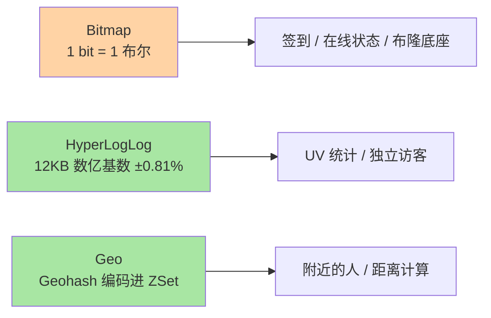
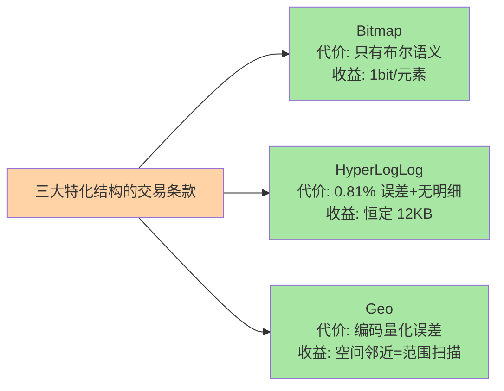

# 高级数据结构：Bitmap / HyperLogLog / Geo 的特化场景

> 一句话：三个为「极致省内存」而生的特化结构——Bitmap 用一个 bit 存一个布尔（亿级签到省千倍内存），HyperLogLog 用 12KB 数亿级基数（0.81% 误差换空间），Geo 把经纬度编码进 ZSet（附近的人一句话搞定）。

## 🎯 本文核心

**核心一句话：高级结构是「用统计与编码技巧把内存压到极限」的特化答案——各自以一个可量化的代价（位运算限制/0.81% 误差/Geohash 精度）换取常规结构百倍以上的空间收益；先确认代价可接受，再享受空间红利。**

组织主线：



## 一句话摘要

Redis 在五大基础结构外提供三个特化结构：**Bitmap**（位图）把每个元素压成一个 bit——SETBIT/GETBIT 操作第 N 位、BITCOUNT 数 1 的个数，亿级用户的「每日是否活跃」只要 12MB；**HyperLogLog**（HLL）是概率型基数统计：PFADD 添加、PFCOUNT 给出独立元素个数的近似值（标准误差 0.81%），固定约 12KB 内存可统计亿级 UV；**Geo** 把经纬度用 Geohash 编码后存进 ZSet：GEOADD 添加位置、GEOSEARCH 查附近、GEODIST 算两点距离——「附近的人」原生命中这个结构。

## 一、Bitmap：布尔状态的最小单位

```text
SETBIT sign:uid:1001:202609 9 1     # 9 月 10 日签到（第 9 位设 1）
GETBIT sign:uid:1001:202609 9       # 查某天是否签到 → 1
BITCOUNT sign:uid:1001:202609       # 本月签到天数（数 1 的个数）
BITOP OR month:all day:1 day:2 ...  # 多天位图合并（求「任一天活跃」）
```

位图的账要会算：`offset = 用户 ID × 1 bit`，一亿用户的状态 = 1 亿 bit ≈ 12MB——同样的「是否」语义用 Set 存用户 ID 要 GB 级。适用边界同样清晰：**只有「是/否」二元状态且 ID 可映射为连续偏移量时才用**；需要存数值或 ID 稀疏（ID 范围大但实际用户少）时位图反而浪费。

## 5W 速记卡

| 维度 | 一句话 |
|---|---|
| What | Bitmap 位图 / HyperLogLog 概率基数 / Geo 地理编码，三者皆为内存特化 |
| Why | 布尔、基数、地理三类场景有极致省内存的结构解 |
| When | 签到在线、UV 统计、附近的人——各自的招牌场景 |
| Where | Bitmap 本质是 String；Geo 本质是 ZSet；HLL 独立结构 |
| How | SETBIT/BITCOUNT；PFADD/PFCOUNT；GEOADD/GEOSEARCH |

## 二、HyperLogLog：用误差换空间的经典交易

UV 统计的困境：Set 精确去重要把每个访客 ID 存下来（亿级 = GB 级），而业务只问「今天多少人」不问「都是谁」。HLL 的答案：不存元素，只维护一组「哈希值前导零分布」的寄存器，从概率上推断基数——**固定 ~12KB、误差 0.81%**，一亿 UV 与一百万 UV 同样是 12KB。适用判据三问：**① 要的是个数不是名单吗？② 能容忍 <1% 误差吗？③ 元素量是否大到精确统计不划算？**三问全「是」才是 HLL 的场景；「要拉出发那 100 个人」的需求请回 Set。

## 三、Geo：附近的人的官方答案

```text
GEOADD city:locations 116.48 39.99 "user:1001"    # 添加位置
GEOSEARCH city:locations FROMLONLAT 116.48 39.99
         BYRADIUS 5 km ASC COUNT 10               # 5 公里内最近 10 人
GEODIST city:locations "user:1001" "user:2001" km # 两点距离
```

Geo 的实现是「Geohash 编码 + ZSet」：经纬度交织编码成一个 52 位整数当分数——**地理位置相近 → 编码相近 → ZSet 按分数有序 = 按空间邻近有序**，附近检索变成 ZSet 擅长的范围扫描。工程要点：Geohash 的编码粒度决定边界问题（相邻格子的元素可能物理更远），GEOSEARCH 已在实现层处理格点扩散；位置更新就是重新 GEOADD（ZSet 成员唯一，旧位置自动覆盖）。



> 💡 **实战提示**
> - Bitmap 的偏移量要「可解释」：用业务 ID 直接当 offset 前先确认 ID 上限（ID 跳到 10 亿 = 一个 125MB 的 String）——超大稀疏 ID 先做映射或分桶
> - HLL 的 PFCOUNT 是读多写少友好的：多次合并的 HLL 会缓存计算结果，PFADD 后首次 PFCOUNT 稍慢——监控大盘按「写入时算、读取缓存」的节奏用
> - 附近的人按城市分 key（`GEOADD city:beijing ...`）：全国一个 Geo key 会让范围扫描的候选集过大，城市/网格分治是标准架构
> - BITOP 合并是多 key 操作：对大位图的 OR/AND 是 O(N) 遍历，低峰执行或预聚合——与所有大 key 操作同一纪律

## 四、与「常规结构 + 应用层计算」的区别

三个结构都在回答同一个问题：**「这件事必须在 Redis 里做吗，能不能用更小的内存形态」**。用 Set 记签到、用 Set 数 UV、用应用层算距离——功能都能实现，但内存与延迟差一个量级。特化结构的价值公式：**场景命中率 × 空间收益 − 代价（误差/限制/学习成本）**。它们不是基础结构的替代，是「命中特化场景时」的升级选项——先用对基础结构，再在热点上做特化替换，是稳妥的演进路径。

## 五、典型使用场景

- **签到/在线状态**：Bitmap 按月分 key，BITCOUNT 出月度签到天数，BITOP 算连续活跃
- **布隆过滤器底座**：自实现布隆用多个 SETBIT 位数组（防穿透的布隆原理与现成方案见缓存三兄弟篇）
- **UV 大盘**：HLL 按 page/天分 key，PFCOUNT 直接进监控报表——亿级访问的统计成本恒定 12KB
- **附近的人/店**：Geo + GEOSEARCH——LBS 场景的原生实现
- **用户画像位图**：Bitmap 每位一个标签，「同时满足标签 A 和 B」变成 BITOP AND——人群圈选的位图引擎思想

## 六、误区与代价

- ❌ **「HLL 可以拉明细」**：它从设计上就丢弃了元素本体——「统计 + 明细」双需求要 HLL（大盘）+ 抽样明细（Set）双轨
- ❌ **「Bitmap 的 offset 随便编」**：把非数值 ID 哈希成 offset 会引入碰撞（两个用户共位）——位图的身份语义要求「偏移与实体一一对应」
- ❌ **「Geo 精度当 GPS」**：Geohash 编码有量化误差（米级到百米级随编码长度变化），附近检索用没问题，精确距离计费用要回专业服务
- ❌ **「特化结构到处替换」**：HLL 有误差、Bitmap 无值语义、Geo 有边界问题——替换前先核对各自的代价清单，特化是场景匹配不是普遍优化

## 七、你们可能会问

**Q1：HyperLogLog 为什么 12KB 能数亿级？**
它不存元素，只存「哈希值的概率特征」（16384 个寄存器各自记录前导零的最大值），由极大似然估计推基数——信息论上「估计个数」所需的信息量远小于「记录每个元素」。0.81% 误差对 UV 统计完全够用。

**Q2：Bitmap 和布隆过滤器什么关系？**
布隆过滤器是「多个哈希函数 × 位图」的组合应用：元素映射到 k 个位，查询时 k 位全 1 才「可能存在」。Redis 位图是实现布隆的底料，7.x 也提供了官方 BF.INSERT（RedisBloom 模块口径）——自建与模块按运维能力选。

**Q3：附近的人怎么排序「按距离从近到远」？**
GEOSEARCH 自带 ASC 按距离排序 + COUNT 限条数——因为 Geo 底层是 ZSet，距离编码进分数后天然有序。要做「附近 + 附加条件筛选」（性别、在线），Geo 出候选集后再回业务数据过滤——空间检索 + 属性筛选的两段式。

## 八、什么时候用 / 不用

- ✅ Bitmap：二元状态 + 可映射 ID + 大规模——签到、在线、位画像
- ✅ HyperLogLog：只要基数不要明细 + 误差可容忍——UV、独立设备数
- ✅ Geo：以位置为中心的范围检索——附近的人、附近门店
- ❌ 明细需求、精确需求、多维组合需求——三者分别回 Set/Set + DB/数据库与搜索引擎

## 九、自测三问

1. 三个特化结构各自的「代价换空间」交易是什么？
2. HLL 的三问适用判据是什么？不满足时用什么？
3. Geo 的底层是什么结构？Geohash 的边界问题指什么？

## 开放问题

- HLL 的精度与稀疏表示在社区有持续优化（稀疏寄存器、T-ZeroCount 缓存等实现细节的演进），「更小更准」的基数估计结构研究值得跟踪
- 向量相似度检索进入 Redis 生态（8.x 向量集等），「特化结构家族」的边界从统计与地理扩展到 AI 负载——结构家族的演化方向随负载形态持续扩容

下一篇讲「布隆过滤器」：缓存穿透的头号防线，从原理到落地。

## 🎯 核心带走

- **核心一句话**：特化结构用可量化的代价换极致内存——Bitmap 1bit 布尔、HLL 12KB 数亿基数 ±0.81%、Geo 把空间邻近编码进 ZSet；场景命中才替换
- **主线**：三结构的交易条款 → 招牌场景 → 与常规结构的替换判据
- **哪里会坏**：HLL 拉明细、offset 碰撞、Geo 当 GPS、特化结构滥用
- **边界**：本篇是特化结构选型；布隆过滤器在下一篇展开，位图引擎的深入是工程实践话题

## 📌 数据与事实声明

- 写于 2026-09-10；Bitmap/HLL/Geo 的命令语义与参数（HLL 标准误差 0.81%、12KB）以 Redis 官方文档公开口径为准
- 「城市分 key」「低峰 BITOP」为业内工程惯例，按规模实测
- 免责：命令与精度口径随版本演进可能调整，以官方文档为准

## 📚 参考资料

| 类型 | 标题 | 来源 |
|---|---|---|
| 官方文档 | Redis Data Types: Bitmaps / HyperLogLogs / Geospatial | redis.io/docs |
| 公开论文 | HyperLogLog: the analysis of a near-optimal cardinality estimation algorithm | 公开学术出版物 |
| 系列导航 | Redis 系列目录 | `docs/middleware/redis/index.md` |
