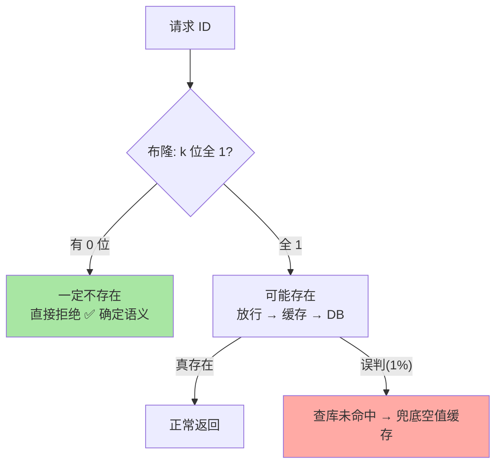

# 布隆过滤器：用微小误判换巨大内存的穿透防线

> 一句话：布隆过滤器用「多个哈希位」回答「一定不存在 / 可能存在」——「一定不存在」的确定语义恰好挡住缓存穿透，代价是 ~1% 误判与不支持删除。

## 🎯 本文核心

**核心一句话：布隆过滤器 = 位数组 + k 个哈希函数——添加时把 k 个位置设 1，查询时 k 位全 1 才「可能存在」；它的价值在单向语义：「不存在」是百分百确定的，正好用于拦截「查不存在的 key」，代价是「存在」有误判率且删除会破坏其他元素。**

组织主线：

## 一句话摘要

布隆过滤器（Bloom Filter）是一个空间效率极高的概率型数据结构：底层数组每个元素只占 1 bit，添加元素时用 k 个哈希函数算出 k 个位置并全部置 1；查询时检查这 k 位——**只要有一位是 0，元素必然不存在；全为 1 只是「可能存在」**（可能被其他元素的位重叠误判）。这个不对称语义完美匹配缓存穿透防御：把全量合法 ID 放进布隆，请求先问布隆，「一定不存在」的直接拒绝，把穿透流量挡在缓存与数据库之外。

## 一、为什么需要它：穿透流量的防线

典型场景：攻击者用随机 ID 高频请求 `/user/99999999`——这些 ID 不存在，缓存永远未命中，每次都穿透到数据库。防线思路是「提前知道哪些 ID 存在」：全量 ID 放 Set 要 GB 级内存，放数据库要一次查询——布隆过滤器用「1 亿 ID 约 120MB（1% 误判率口径）」的内存把这道防线做成了内存级操作。它在缓存体系的位置：**请求 → 布隆（不存在即拒绝）→ 缓存 → 数据库**——布隆、缓存、数据库构成三层上下游防线，穿透流量在第一道门就被拦下（穿透治理的完整体系见专题层缓存三兄弟篇）。

## 5W 速记卡

| 维度 | 一句话 |
|---|---|
| What | 位数组 + k 哈希的概率型集合成员判断结构 |
| Why | 「一定不存在」的确定语义 + 极小内存，是穿透防御的天然匹配 |
| When | 大集合的存在性预判：防穿透、爬虫去重、垃圾邮件过滤 |
| Where | 缓存链路最前端；Redis 位图自建或 BF. 模块命令 |
| How | BF.ADD 添加 / BF.EXISTS 查询；自建用多个哈希 + SETBIT |

## 二、核心机制：误判率怎么来、怎么定

误判的来源是**位重叠**：不同元素的 k 个哈希位可能落在同一批位置，查询时「借了别人的 1」。误判率由三个变量决定：**位数组大小 m、元素个数 n、哈希函数个数 k**——工程上先定「可接受的误判率 p 与预期元素量 n」，公式反推 m 与 k（BF.RESERVE 命令内置了这套计算：`BF.RESERVE filter 0.01 100000000` = 1 亿元素 1% 误判）。两条经验直觉：**误判率减半约需内存翻倍**；k 不是越大越好——k 太大位占用快、误判曲线反而回升，公式最优值附近就是答案。

> 💡 **实战提示**
> - 误判的兜底必须存在：1% 的误判放行后会查库未命中——穿透防线仍是「布隆 + 空值缓存」双层，布隆是主力不是全部
> - 什么时候重建而不是扩容：元素量超过预估后误判率上涨，布隆无法原位扩——按「新参数建新过滤器 → 双跑 → 切换」的重建成型，容量预估要留增长余量
> - 自建版哈希函数要「彼此独立」：用双重哈希模拟 k 个函数（gi = h1 + i × h2）是标准技巧，别用同一哈希取不同模
> - BF 模块与自建的选择：有 RedisBloom 模块用原生命令（支持计数版 Counting Bloom）；无模块时位图 + Lua 自建，控制好哈希质量即可

## 三、与「Set 存在性判断」的区别

同样回答「存在吗」，交易完全不同：Set 精确但存全量元素（GB 级）；布隆极省内存但有误判且**拿不到元素本身**（它根本没存元素，只有位痕迹）。适用分界：需要「拉出元素、精确判断」→ Set；只需要「存在性判断且规模巨大、可容忍误判」→ 布隆。另一个关键差异：**布隆不支持删除**（删一个元素的位会影响其他元素）——需要删除语义用 Counting Bloom（每位置改为计数器）或定期重建。

## 四、典型使用场景

- **缓存穿透防御**：全量商品/用户 ID 进布隆，非法 ID 第一道门拒绝
- **爬虫 URL 去重**：亿级 URL 判「爬过没有」——误判 1% 意味着 1% 页面少爬，业务可容忍
- **垃圾邮件/黑名单**：黑名单判断「可能在里面」再做精确规则——误判方向（多拦）可接受的场景
- **推荐去重**：已推荐内容过滤，偶发漏推无害
- **数据库预查询**：查询前先问布隆，减少无效 DB 请求（与穿透防御同构）

## 五、误区与代价

- ❌ **「布隆说存在就存在」**：语义是「可能存在」——把它当精确集合用是方向性错误，业务必须能消化 1% 误判
- ❌ **「删掉元素再 ADD 回来就行」**：不支持删除是结构级的（位共享），删除语义换 Counting Bloom 或 cuckoo filter
- ❌ **「容量预估拍脑袋」**：实际元素量超预估 2 倍，误判率可能从 1% 恶化到 15%+——预估按终局量级 + 余量定，且监控实际填充率
- ❌ **「布隆当唯一防线」**：它挡的是「不存在的 key」，穿透防御还有「空值缓存、限流、参数校验」多道防线——纵深防御，别单点依赖

## 六、你们可能会问

**Q1：误判率定多少合适？**
按「误判的业务代价」定价：防穿透场景 1% 意味着 1% 的穿透漏网（还有空值缓存兜底），完全够用；代价高的场景（安全黑名单误放）压到 0.1%——每降一个数量级，内存约增加一半到一倍。

**Q2：布隆过滤器怎么处理「新增合法 ID」？**
新 ID 注册时同步 BF.ADD——布隆只支持添加不支持撤销，这与「合法 ID 只增不减」的业务形态天然匹配；有下线语义的 ID 集合要考虑 Counting Bloom 或定时重建。

**Q3：布隆和 Set 的「双轨」怎么配合？**
典型分工：布隆挡「大概率不存在」的流量（省资源），Set/数据库负责精确判断——布隆是「快速预筛」，不是「最终事实」。两者之间的不一致（新 ID 未进布隆）靠写入时双写兜住。

## 七、什么时候用 / 不用

- ✅ 用：超大规模集合的存在性预判 + 误判可容忍 + 元素只增不减——三条件齐备即布隆主场
- ✅ 防穿透的第一道门：配合空值缓存构成双层防线
- ❌ 不用：需要精确判断、需要删除、需要拉出元素——任何一条不满足就回 Set/数据库
- ❌ 不用：小规模集合（百万以内）——Set 的内存完全可接受，别为省不存在的内存引入误判复杂度

## 八、开放问题

- 删除友好的变体（cuckoo filter、Counting Bloom）在内存与实现复杂度上的权衡持续演化，布隆家族的「选型树」随变体丰富而变长
- 分布式布隆（多分片位图的统一查询）没有原生方案，集群化部署下的布隆容量与分片策略仍是工程拼装话题

## 九、自测三问

1. 布隆的「不对称语义」是什么？为什么它天然防穿透？
2. 误判率由什么决定？容量预估不足的后果是什么？
3. 为什么不支持删除？需要删除语义的替代方案有哪些？

下一篇讲「键设计规范」：所有结构落地前的共同纪律——key 怎么命名、怎么设过期、怎么避免大 key。

## 🎯 核心带走

- **核心一句话**：布隆过滤器 = 位数组 + k 哈希，「不存在」确定、「存在」有 1% 误判——防穿透的第一道门，代价与容量预估是两个必须算的账
- **主线**：穿透痛点 → 不对称语义 → 误判机制 → 落地三式
- **哪里会坏**：当精确集合用、容量超预估恶化、当唯一防线、误当可删除
- **边界**：本篇是结构原理层；穿透治理的完整体系在专题层缓存三兄弟篇，BF 模块运维见官方文档

## 📌 数据与事实声明

- 写于 2026-09-10；布隆原理与 BF. 命令（RedisBloom 模块）以官方与模块公开文档为准
- 「1 亿 ID 约 120MB@1% 误判」为布隆公式推算口径；双层防线为业内通用实践
- 免责：模块命令与参数随版本演进可能调整，以官方文档为准

## 📚 参考资料

| 类型 | 标题 | 来源 |
|---|---|---|
| 官方文档 | RedisBloom: Bloom Filter | redis.io/docs（模块文档） |
| 公开论文 | Space/Time Trade-offs in Hash Coding with Allowable Errors（Bloom, 1970） | 公开学术出版物 |
| 系列导航 | Redis 系列目录 | `docs/middleware/redis/index.md` |
