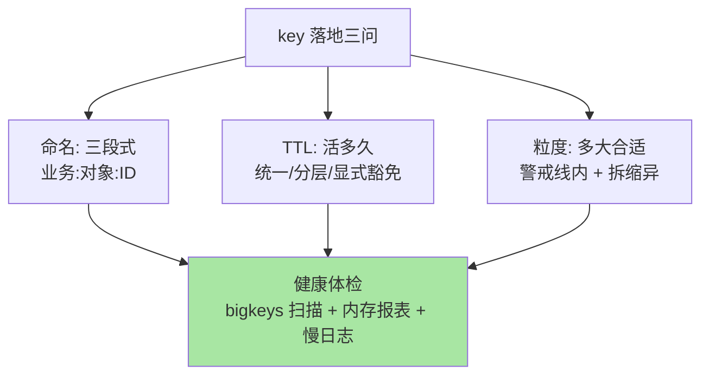

# 键设计规范：命名、过期与大 key 的共同纪律

> 一句话：key 是 Redis 唯一的「索引」，命名决定可维护性、TTL 决定内存生命周期、粒度决定单线程健康——三条纪律是所有结构落地前的共同前置。

## 🎯 本文核心

**核心一句话：Redis 的 key 设计三问——「能不能看懂（命名规范）、能活多久（TTL 策略）、会不会太大（粒度控制）」；三问答不好，结构选得再对也会败给内存暴涨、运维失控与大 key 阻塞。**

组织主线：


## 一句话摘要

Redis 按 key 精确定位一切，key 设计因此是所有使用的前置纪律：**命名**用「业务域:对象:ID」冒号分段（`order:detail:1001`），一眼看懂归属与含义、支持按前缀扫描治理；**TTL** 让每个 key 回答「活多久」——缓存类必须带过期，持久类要显式说明为什么不带；**粒度**控制单个 key 的体积（String 十 KB 级、集合万元素级为业内常用警戒线，按业务定）——大 key 是单线程模型下延迟、迁移、删除、过期四类事故的共同根源。

## 一、命名规范：key 是写给人看的索引

三段式命名 `业务:对象:ID`（如 `mall:cart:1001`、`ucenter:session:abc123`）的三重价值：**排障可读**（线上看到 key 即知归属，跨团队协作不用考古）；**前缀治理**（按业务前缀 SCAN 统计内存、批量清理有抓手）；**冲突免疫**（多业务共用实例时命名空间隔离）。反面教材是无前缀裸 ID（`1001`——谁的 1001？）与超长命名（把查询条件编进 key，`user:city:sz:age:18:...`——这是把数据库的活干到了 key 上，检索需求回数据库）。

## 5W 速记卡

| 维度 | 一句话 |
|---|---|
| What | key 的命名分段、TTL 策略、粒度控制三纪律 |
| Why | key 是唯一索引 + 内存入口 + 单线程操作对象 |
| When | 任何结构落地前；内存治理与大 key 专项时 |
| Where | 全部 Redis 数据的入口层 |
| How | 三段式命名 + 全 key 有 TTL 预算 + 体积警戒线 |

## 二、TTL 策略：每个 key 都要回答「活多久」

**「无 TTL 的 key 都应有显式理由」**是内存治理的第一原则——缓存类的 key 不设过期 = 主动制造内存危机。TTL 设计的三个层次：

```text
① 统一过期：缓存 key 按业务一致性容忍度定 TTL（如 30 分钟 + 随机抖动）
② 分层过期：同业务冷热字段不同 key、不同 TTL（热数据短、列表页长）
③ 显式豁免：配置类/字典类永不过期的 key，登记「为什么不过期」清单
```

过期加随机抖动（TTL ± 10%）是防「同一时刻批量过期 → 数据库瞬时压力」的标配细节（过期风暴的原理与治理在过期与淘汰篇展开）。TTL 刷新策略也要明确：GET 就续期（会话型）还是固定死线（缓存型）——语义不同，用 EXPIRE 还是 SET 的 KEEXPTTL 变体，写进设计文档。

## 三、粒度控制：大 key 是四类事故的共同根源

单个 key 过大（String 值超 10KB 级、集合元素超万级——业内常用警戒线，按业务压测校准）的代价贯穿单线程模型的每一处：**读**——一次 HGETALL 拉几十毫秒，阻塞所有请求；**删**——DEL 大集合同步删除卡顿（用 UNLINK 异步删）；**过期**——大 key 到期删除同样在主线程；**迁移**——集群 slots 迁移以 key 为单位，大 key 迁移即卡顿。治理组合：**拆**（按业务维度分桶：时间、哈希段）、**缩**（只存必要字段，大值外移对象存储存引用）、**异**（UNLINK + lazy-free 配置让删除走后台）。从架构上看，大 key 治理是「应用层建模与存储层健康」的上下游协同：应用侧定粒度规范，存储侧出体检报表，两侧以「体积警戒线」这个共同口径衔接。



> 💡 **实战提示**
> - 大 key 扫描进例行巡检：`redis-cli --bigkeys`（采样版）或 SCAN 全量分析（离线），内存 top 榜定期过目
> - 什么时候必须拆 key：单 key 访问延迟进入慢日志、或体积进入警戒线——两个信号任一出现就拆，等它引发事故再拆成本翻倍
> - key 数量的内存账：每个 key 自身有约 50-90 字节元数据开销（业内估算口径）——亿级小 key 的元数据就是数 GB，收进 Hash（field 便宜得多）是经典优化
> - SCAN 替代 KEYS 写进代码规范：KEYS 是 O(N) 全量阻塞，SCAN 游标分批——这一条是入职第一天的 Redis 常识红线

## 四、与「数据库表设计」的区别

key 设计与表设计都是「落地前的建模」，但约束维度不同：表设计管「关系与范式」（怎么组织事实），key 设计管「定位与生命周期」（怎么找到、活多久）——Redis 没有 WHERE，**key 的命名就是你的全部检索能力**，因此命名要自含业务语义；数据库行没有「活多久」的原生语义（靠作业清理），Redis 的 TTL 是一等公民。两套建模思维并存：事实建模在数据库，热数据定位建模在 Redis。

## 五、典型使用场景

- **缓存 key 模板**：`<业务>:<对象>:<ID>` + 统一 TTL + 空值缓存策略——团队级模板让所有缓存 key 长得一样
- **分桶治理**：大集合按 `业务:对象:ID:分桶号` 拆（时间窗或 hash 段），读写路由在应用层
- **多环境隔离**：key 前缀加环境段（`dev:mall:cart:1`）或干脆分实例——共用实例时前缀是最后的防线
- **内存巡检**：按业务前缀出内存报表，哪个业务吃内存一目了然

## 六、误区与代价

- ❌ **「key 短到看不懂」**：`u1`、`o1001` 省下的几个字节抵不上排障成本——命名优先可读，长度优化靠去掉冗余前缀而非砍语义
- ❌ **「缓存 key 不设 TTL，反正是缓存」**：不淘汰与不过期是两回事——淘汰策略兜底是保命机制，不是容量规划
- ❌ **「大 key 用 DEL 删」**：DEL 同步删除百万元素集合卡顿秒级——UNLINK 异步化是 4.0+ 的标准答案
- ❌ **「把查询条件编进 key」**：`user:city:sz:age18` 这类「检索式 key」数量爆炸且不可维护——多条件检索回数据库或倒排结构

## 七、你们可能会问

**Q1：TTL 加多少随机抖动合适？**
按「同一批 key 的数量级」定：批量写入的缓存 key 加 TTL ±10% 左右抖动，把过期时间打散——目标是把「同时过期」削成「均匀过期」，具体百分比不是重点，「有抖动」才是。

**Q2：怎么统计某个业务占了多少内存？**
按业务前缀 SCAN + MEMORY USAGE key 逐个累计（离线低峰跑），或用 `redis-cli --memkeys` 采样版——精确到业务前缀的内存报表是容量治理的基本盘。

**Q3：永不过期的 key 有哪些正当理由？**
字典/配置类（数据量小且常驻）、计数器基座、布隆过滤器底座——共同特征是「业务语义上常驻 + 量级可控」。「忘了设」不在正当理由清单里，所以要有「无 TTL key 登记清单」。

## 八、什么时候用 / 不用

- ✅ 三段式命名 + TTL 预算 + 粒度警戒线：作为团队规范三件套，任何 Redis 使用方落地前对齐
- ✅ 大 key 治理常态化：扫描进巡检、拆分有预案、删除用 UNLINK
- ❌ 不用「检索式 key」模拟数据库查询——那是把 Redis 拖进它不擅长的战场
- ❌ 不对存量 key 一次性大清洗——按业务前缀分批治理，先报表后动刀

## 九、自测三问

1. 三段式命名的三重价值是什么？反面教材有哪两类？
2. TTL 抖动防的是什么问题？无 TTL key 的正当理由清单长什么样？
3. 大 key 为什么是四类事故的共同根源？治理三招是什么？

## 开放问题

- 客户端缓存（client-side caching）与键空间通知的组合让「key 生命周期」的管理边界从服务端延伸到应用侧，键设计规范需随之纳入新维度
- serverless Redis 与超大实例的分片化管理在演进，「实例内 key 治理」与「平台级多租户隔离」的规范分层是新的治理话题


下一篇讲「持久化机制」：RDB 与 AOF 怎么让内存数据在断电后活下来。

## 🎯 核心带走

- **核心一句话**：key 三纪律——命名三段式（可读/可治理/免冲突）、TTL 全覆盖（抖动防风暴）、粒度有警戒线（大 key 拆缩异）——所有结构落地前的共同前置
- **主线**：命名 → TTL 层次 → 粒度与大 key → 巡检体检
- **哪里会坏**：检索式 key 爆炸、无 TTL 内存危机、DEL 大 key 卡顿、KEYS 阻塞
- **边界**：本篇是通用纪律；淘汰与过期的机制在过期与内存淘汰篇，bigkey 专项治理在专题层 bigkey 篇

## 📌 数据与事实声明

- 写于 2026-09-10；key 元数据开销、`--bigkeys`/`--memkeys` 工具、UNLINK 行为以 Redis 官方文档口径为准
- 「String 10KB/集合万元素警戒线」「key 元数据 50-90 字节」为业内经验估算口径，按实例规格实测
- 免责：配置与工具行为随版本演进可能调整，以官方文档为准

## 📚 参考资料

| 类型 | 标题 | 来源 |
|---|---|---|
| 官方文档 | Redis Keys / Using SCAN / Memory Optimization | redis.io/docs |
| 官方文档 | Lazy Redis: UNLINK 与 lazy-free | redis.io/docs（Topics） |
| 系列导航 | Redis 系列目录 | `docs/middleware/redis/index.md` |
