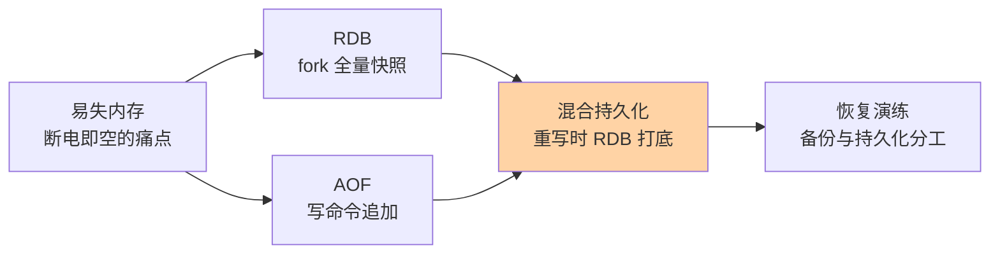
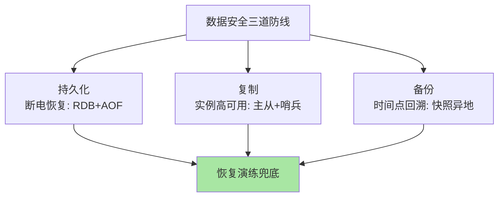

# 持久化机制：RDB 快照与 AOF 日志的可靠性账本

> 一句话：RDB 定时拍全量快照（文件小恢复快、有窗口丢数据），AOF 记每条写命令（丢得少、文件大恢复慢）——两者不是二选一，混合持久化让快照打底、增量日志补窗。

## 🎯 本文核心

**核心一句话：Redis 持久化 = RDB（某时刻的全量二进制快照）+ AOF（逐条写命令追加日志）——RDB 恢复快但窗口丢得多，AOF 丢得少但文件大恢复慢，4.0 起的混合持久化（RDB 打底 + 增量 AOF）取两者之长；「能丢多少」是业务决策，配置跟着决策走。**

组织主线：

## 一句话摘要

Redis 数据在内存，断电即空——持久化回答「怎么在磁盘上留一份」：**RDB** 按 `save` 规则（如 1 万次修改/900 秒）或 `bgsave` 手动触发，fork 子进程把整库写成紧凑二进制快照——文件小、恢复快，但两次快照之间的数据在宕机时丢失；**AOF** 把每条写命令追加进日志（`appendfsync everysec` 每秒刷盘是默认与主流选择），最多丢一秒数据，但文件是命令流水、体积与恢复时长都大于 RDB。AOF 重写压缩历史（按当前数据生成最小命令集），4.0 起重写产物以 RDB 格式打底 + 增量 AOF 追加（混合持久化），兼得两者之长。

## 一、RDB：fork 出来的全量快照

`bgsave` 的机制是「写时复制」：主进程 fork 出子进程，子进程遍历内存写快照文件——fork 瞬间内核共享父子进程内存页，主进程继续服务写入（修改时才复制页，故称写时复制）。两个工程含义：**① fork 本身有停顿**（复制页表，10GB 实例可达百毫秒级），大实例要避开高峰调度持久化；**② 快照是「发起时刻」的一致性视图**——期间的新写入不在本份快照里，这就是丢失窗口的来源。RDB 的定位：**可容忍分钟级丢失的数据的兜底 + 快速恢复的底座**。

## 5W 速记卡

| 维度 | 一句话 |
|---|---|
| What | RDB 全量二进制快照 + AOF 写命令日志 + 混合持久化 |
| Why | 内存易失，需要磁盘副本支撑宕机恢复 |
| When | RDB 兜底与快速恢复；AOF 低丢失要求；混合为 4.0+ 默认推荐 |
| Where | 磁盘文件（dump.rdb / appendonly.aof） |
| How | save/bgsave 规则；appendfsync 三档；aof 重写压缩 |

## 二、AOF：三种刷盘档位的取舍

`appendfsync` 决定「写命令进 AOF 文件的速度」：

| 档位 | 行为 | 丢失窗口 | 性能代价 |
|---|---|---|---|
| always | 每条命令 fsync | 基本不丢 | 最大（每命令一次磁盘 IO） |
| **everysec（默认）** | 后台线程每秒 fsync | 最多 1 秒 | 小 |
| no | 交给 OS 决定 | 不可控（数十秒级可能） | 最小 |

everysec 是「丢失可控 + 性能可接受」的平衡点，业内默认。**AOF 重写**解决「日志无限膨胀」：bgrewriteaof 按「当前数据集的最小命令集」生成新 AOF——一百次 INCR 重写成一次 SET。重写同样走 fork + 写时复制，与 RDB 的调度注意事项同源。

## 三、混合持久化：4.0 起的两全答案

从架构上看，持久化与复制、备份构成 Redis 数据安全的上下游三道独立防线：持久化管「本机断电恢复」，复制管「实例级高可用」，备份管「时间点回溯」——三者任缺其一，防线体系就有缺口。

`aof-use-rdb-preamble yes`（4.0+，5.0 起默认开）让 AOF 重写时：**文件头是当前数据的 RDB 格式全量，尾部追加增量 AOF 命令**——恢复时先加载 RDB 头（快），再重放少量增量（全）。这一设计终结了「选 RDB 还是 AOF」的纠结：重写频率照常配置，恢复速度与丢失窗口两头都占。仍需单独用 RDB 的场景：纯缓存（丢了无所谓，只要恢复快）、从库只做快照兜底。

> 💡 **实战提示**
> - 持久化调度避开高峰：fork 停顿与写时复制的内存放大（极端时接近翻倍）在内存充裕时段做——大实例把 save 规则与重写窗口排进变更日历
> - 持久化文件异地存放：本机磁盘坏 = 数据与备份同归于尽——快照定期上传对象存储是底线
  - **「maxmemory 撞顶导致写入失败」与持久化无关**：持久化管「断电恢复」，淘汰管「内存满了怎么办」——两套机制别混着排查
> - 恢复演练进季度例行：备份文件 + AOF 拼起来能不能恢复、要多久——没演练过的持久化方案等于没有（与 MySQL 备份演练同一纪律）

## 四、与「MySQL redo log」的区别

同为「断电恢复」，语义等级不同：MySQL 的 redo 是 WAL——**保证已提交事务不丢**（crash-safe），恢复重放到最新；Redis 的持久化是「尽力留存」——RDB 有窗口、AOF everysec 丢一秒，恢复的是「某时刻的近似状态」。差异根源在定位：数据库是事实源（零丢失是底线），Redis 多为缓存/热数据（可由事实源重建）。把 Redis 当事实源时，这个语义差距必须向业务明示——这就是篇 1「角色不清是事故第一来源」的机制注脚。

## 五、典型使用场景

- **纯缓存实例**：RDB 或关闭持久化——丢了从 MySQL 重建，省下持久化开销换性能
- **含状态实例**（计数/榜单/会话）：混合持久化 + everysec + 异地备份——丢失窗口按业务定
- **大实例调优**：save 规则放宽（降低 fork 频率）、重写排低峰、内存预留写时复制空间
- **灾备体系**：RDB 快照滚动上传远端 + 主从复制实时副本——持久化、复制、备份三道独立防线

## 六、误区与代价

- ❌ **「开了持久化就能当数据库」**：AOF everysec 也丢一秒——持久化是概率游戏，crash-safe 是协议保证，语义等级不同
- ❌ **「AOF 文件越大越安全」**：文件大只代表历史长，重写压缩才是常态——不重写的 AOF 恢复慢到不可用
- ❌ **「bgsave 期间写入无代价」**：写时复制让写入密集期内存放大，极端时 OOM——内存预留是容量规划的隐藏项
- ❌ **「从库有数据，主库不用持久化」**：主库宕机后重启为空，从库来同步一个空主 = 全集群清空——主库持久化（或至少 RDB）是从库数据安全的上游前提

## 七、你们可能会问

**Q1：为什么 fork 会卡顿？不是后台操作吗？**
卡在 fork 的瞬间动作——复制内存页表（不是内存本身），页表大小与实例内存成正比；10GB 实例的页表复制可达百毫秒，期间主线程停顿。这也是大内存实例「拆小」的理由之一。

**Q2：AOF 重写期间的新写入怎么不丢？**
重写期间的新写入同时进「旧 AOF」与「重写缓冲区」，重写完成后缓冲区内容追加进新文件——新旧无缝衔接，全程不丢命令。

**Q3：混合持久化的文件坏了怎么恢复？**
头部 RDB 段损坏则整体加载失败（与纯 RDB 同风险）——所以持久化文件本身也要有多副本（远端滚动快照），单机文件不是灾备终点。

## 八、什么时候用 / 不用

- ✅ 纯缓存：RDB（或按 SLA 关持久化）——恢复速度优先，丢失可重建
- ✅ 有状态实例：混合持久化 + everysec + 远端快照——丢失窗口按业务定价
- ❌ 不用 always 伪装数据库：每命令 fsync 的性能代价巨大，真要数据库语义请用数据库
- ❌ 不关主库持久化只靠从库——空主同步清空全集群是经典事故

## 九、自测三问

1. RDB 的丢失窗口从哪来？fork 为什么有停顿？
2. appendfsync 三档各丢什么？everysec 为什么是主流？
3. 混合持久化怎么取两者之长？主库持久化为什么不能省？

## 开放问题

- 多部分 AOF（7.x 起单文件拆 base+增量段）改善了重写时的磁盘峰值，「AOF 工程化」仍在细化和 RDB/AOF 生态整合
- 云托管 Redis 把持久化下沉到存储层（快照即服务），用户侧配置项在收窄——持久化知识从「调参」转向「验 SLA」的角色漂移值得观察

下一篇讲「过期与内存淘汰」：key 到期怎么删、内存满了谁出局。

## 🎯 核心带走

- **核心一句话**：RDB 快照（恢复快/窗口丢）+ AOF 日志（丢得少/文件大）+ 混合持久化取长——「能丢多少」定配置，fork 停顿与写时复制是隐藏代价
- **主线**：易失痛点 → RDB 机制 → AOF 三档 → 混合两全 → 恢复演练
- **哪里会坏**：大实例 fork 卡顿、写时复制 OOM、空主清空集群、持久化文件不异地
- **边界**：本篇管「断电恢复」；内存满了谁出局在过期与淘汰篇，恢复速度的工程细节在特性层持久化系列

## 📌 数据与事实声明

- 写于 2026-09-10；RDB/AOF 机制、appendfsync 档位、混合持久化（4.0+，5.0 默认开）、多部分 AOF（7.x）以 Redis 官方文档公开口径为准
- 「10GB 实例 fork 百毫秒」为业内经验量级，按硬件实测
- 免责：配置项与默认值随版本演进可能调整，以官方文档为准

## 📚 参考资料

| 类型 | 标题 | 来源 |
|---|---|---|
| 官方文档 | Redis Persistence (RDB / AOF / hybrid) | redis.io/docs |
| 官方源码 | redis/redis（rdb.c、aof.c） | github.com/redis/redis |
| 系列导航 | Redis 系列目录 | `docs/middleware/redis/index.md` |
