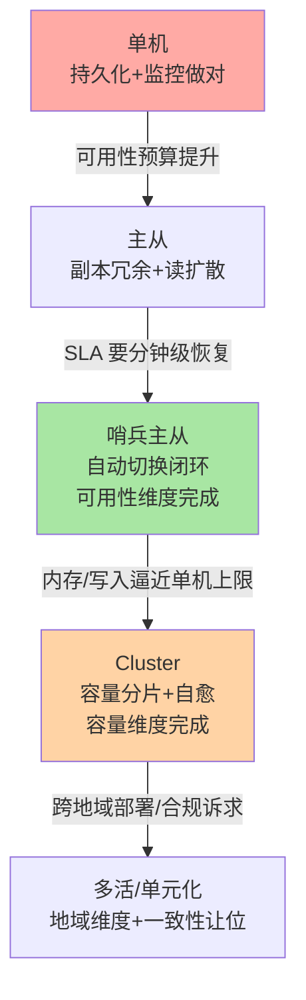

# Redis 高可用演进之路：从单机到多活的完整叙事

> 入门层讲了各形态「是什么怎么用」，特性层讲了「机制为什么这样」，专题层给了「场景怎么选怎么运维」——本篇是整合层收束：**沿业务演进的时间线，把单机 → 主从 → 哨兵 → 集群 → 多活的每一级「为什么走到这里、代价是什么、下一步的触发条件是什么」串成一条完整叙事**。

## 一句话摘要

Redis 高可用不是一次性的架构选型，而是**随业务量级逐级演进的过程**：单机（可用性为零）→ 主从（有副本，切换靠人）→ 哨兵主从（自动切换，容量仍单机）→ Cluster（容量分片 + 自愈一体）→ 多活（跨地域，一致性让位）。每一级的触发信号、代价账单、回退可能性完全不同——**演进纪律只有一条：每一级只解决上一级解决不了的瓶颈，跳级是过度设计，恋级是技术债**。

## 🎯 本文核心

**核心一句话：Redis 高可用演进 = 「可用性 → 容量 → 地域」三个维度的逐级解锁——单机的短板是单点，主从补副本、哨兵补自动切换（可用性维度闭环），Cluster 补分片（容量维度），多活补地域（最终形态）；每一级都有明确的触发信号与不可逆性评估，容量评审的趋势数据决定升级时机。**

演进链（本篇结构挂这条链上）：单机的三重风险 → 主从的副本与人工切换 → 哨兵的自动化闭环 → Cluster 的分片一体化 → 多活的最终形态与一致性让位 → 演进决策总图。

## 一、单机：一切故事的起点

单机 Redis 的三重风险：**进程挂 = 服务挂**（可用性）、**磁盘坏 = 数据丢**（持久化兜底但机器级故障无解）、**内存满 = 容量到顶**（垂直扩容有物理上限）。单机阶段的正确动作是「把持久化与监控做对」（RDB/AOF 配置、慢日志巡检）——**单机不是罪，裸奔的单机才是**。什么时候离开单机：可用性要求提升（业务不能容忍 Redis 重启期间的服务中断）→ 主从。

## 一句话（演进第一级）：主从——副本带来冗余，切换仍靠人

主从复制让数据有了实时副本：读扩散（从库分担读流量）与数据冗余（主库故障后有顶替者）双收益。但主从的两个遗留问题：**切换靠人**（主库挂了，谁提升从库、客户端改连谁，全靠人工响应——分钟级到小时级的恢复窗口）；**脑裂风险**（分区下旧主仍在收写）。主从阶段的正确动作：复制链路监控（offset 差、backlog 容量）+ 手动切换 SOP 文档化。什么时候升级：人工切换的响应速度撑不住业务的可用性预算（SLA 要求分钟级恢复）→ 哨兵。

## 5W 速记卡

| 维度 | 一句话 |
|---|---|
| What | 单机 → 主从 → 哨兵 → Cluster → 多活的五级演进叙事 |
| Why | 每一级解决上一级的特定瓶颈（单点/人工切换/容量/地域） |
| When | 升级时机由水位趋势与可用性预算驱动，不由技术潮流驱动 |
| Where | 各形态的部署拓扑与故障域分布逐级扩大 |
| How | 每级触发信号明确、代价账单清晰、回退可能性提前评估 |

## 二、哨兵：自动化的闭环与它的边界

哨兵补上「自动切换」：多数派确认故障、自动选主提升、客户端哨兵协议发现新主——故障恢复从「人工小时级」收敛到「自动秒到十秒级」。可用性维度在此闭环（单点问题、切换问题都解决），但**容量维度原封不动**：所有写仍压在一台主库，内存上限仍是单机天花板。哨兵阶段的正确动作：三节点跨故障域部署、切换演练常态化、客户端哨兵接入全覆盖。什么时候升级：**内存水位或写入量逼近单机上限**（watermark 趋势数据说话）——这是容量驱动的升级，与可用性无关，别混为一谈。

## 三、Cluster：容量分片与自愈的一体化

Cluster 把数据按 16384 槽分片到多主多从——容量线性扩展、写入分摊、故障自愈内置（不再需要哨兵进程）。代价账单：多键命令同槽限制（hash tag 改造）、客户端升级为智能客户端、运维复杂度上升（槽迁移、拓扑管理）。Cluster 阶段的正确动作：bigkey 治理前置（迁移风暴眼）、reshard 演练常态化、槽位完整性监控。什么时候升级到多活：**业务出现跨地域部署诉求**（全球化、异地容灾合规）——地域维度的诉求无法靠加节点解决。

## 四、多活：地域维度的最终形态与一致性让位

跨地域多活是演进链的最贵一级：**单元化部署**（按用户/地域切分流量与数据，各单元本地读写）是主流形态——全局强一致在跨地域光速约束下不可得，**一致性问题从「技术参数」升格为「业务设计」**：数据按单元归属划分、跨单元同步走异步复制（接受窗口）、冲突场景（同一用户跨单元迁移）按业务规则仲裁。多活阶段的正确动作：单元化路由层建设、跨单元对账体系、单元级故障演练。**多数业务的终点不是多活**——单地域内的哨兵/Cluster 已覆盖绝大多数可用性诉求，多活是为全球化与监管合规准备的形态。

## 五、演进决策总图

五形态的关键属性对照（决策评审的速查表）：

每级升级的三问（立项前自检）：**①触发信号是什么**（水位数据/SLA 变化，要有数字）；**②代价账单算了吗**（新形态的复杂度与改造量）；**③回退路径存在吗**（降级回上一级的可行性与成本）——三问答不清的升级是冲动架构。

## 六、与缓存一致性的收束联动

高可用演进与缓存一致性（特性层系列）在多活形态交汇：跨地域的缓存一致性从「秒级窗口」恶化为「跨域网络窗口」——多活架构下缓存一致性策略必须按单元重新设计（单元内 Cache-Aside、跨单元靠数据归属划分规避），这是「一致性让位」的具体含义。全系列的知识收束：**入门层给模型、特性层给机制、专题层给治理、整合层给演进——四层合起来是 Redis 高可用的完整决策地图**。

## 七、你们可能会问

**Q1：能不能直接从单机上 Cluster，跳过哨兵主从？**
技术可行但工程不建议——Cluster 的运维复杂度需要「复制、切换、槽」的完整心智，跳过哨兵主从阶段等于没有积累这些运维经验；除非新项目一开始就确定超大规模，渐进演进的风险更低。

**Q2：哨兵和 Cluster 能混用吗？**
同一数据体系不能（Cluster 内置自愈，哨兵无槽可管）；不同数据体系可以（老业务哨兵主从 + 新业务 Cluster 并存）——混合部署的管理成本要评估，统一路线是长期方向。

**Q3：怎么判断业务「到顶了不需要再演进」？**
可用性预算与容量增长双双稳定：SLA 已被当前形态满足、水位趋势平缓——演进是为了解决瓶颈，没有瓶颈就不演进。「永远用最新最重的架构」与「永远不演进」是两种对称的错误。

## 八、什么时候用 / 不用

- ✅ 按触发信号逐级演进：每级升级有数字依据（水位/SLA）、有代价账单、有回退评估
- ✅ 每一级都做「该级该做的事」：单机做持久化监控、主从做切换 SOP、哨兵做演练、Cluster 做 bigkey 前置
- ❌ 不为技术先进性跳级：多活不是勋章，是昂贵的业务形态
- ❌ 不把「高可用 = 加节点」：每一级解决的是不同维度的瓶颈，节点数不等于可用性等级

> 💡 **实战提示**
> - 什么时候评审「要不要演进一步」：季度容量评审的水位趋势 + 年度 SLA 复核——演进立项的两个数据入口，别在告警里临时决定
> - 演进升级前把「该级该做的事」清单过一遍：哨兵级补演练、Cluster 级补 bigkey 前置、多活级补单元路由——升级不是终点，是新一层纪律的起点
> - 回退评估写进立项文档：每级的降级回退路径（Cluster 降回主从、多活收回单地域）与成本——不可回退的升级要有更高的立项门槛
> - 各级形态的监控重点不同：哨兵级盯切换事件与复制差、Cluster 级盯槽位完整性与 MOVED 率、多活级盯跨域同步窗口——形态升级，监控体系同步升级

## demo 验证点

本篇的演进路径可在预发环境逐级复现验证：
1. 主从搭建与读写分离（REPLICAOF + offset 差监控）
2. 哨兵三节点故障切换演练（kill 主库 → 自动提升 → 客户端发现新主；常见报错：客户端未接哨兵协议时切换后写入报 READONLY）
3. Cluster 搭建与 reshard（redis-cli --cluster；常见报错：CROSSSLOT——多 key 未同槽；MOVED 未处理——客户端未按重定向更新槽表）
4. 演练验收点：切换时长、丢失窗口、客户端恢复速度三项对比基线

验证环境：Redis 7.x/8.0 + 3 节点起（哨兵/Cluster 均需多节点）。

## 九、开放问题

- 云托管形态正在把「演进链」压缩为「产品参数选择」（托管 Redis 的高可用/集群版一键切换），自建演进链的经验价值向架构判断与 SLA 评审迁移
- 跨地域多活的单元化框架（按业务属性自动路由与仲裁）在头部厂商内部平台成熟，开源生态的通用方案仍未收敛——多活的工程门槛是最后的护城河也是最高的墙

## 十、自测三问

1. 五级演进各自解决上一级的什么瓶颈？每级的「正确动作」是什么？
2. 演进立项的三问是什么？哪一问答不清就不该立项？
3. 为什么说「多数业务的终点不是多活」？多活的一致性让位具体指什么？

## 🎯 核心带走

- **核心一句话**：Redis 高可用 = 可用性 → 容量 → 地域三维逐级解锁——单机、主从、哨兵、Cluster、多活各解一瓶颈；触发看数字、代价要算账、回退先评估，跳级与恋级都是失衡
- **演进链**：单机三风险 → 主从副本 → 哨兵自动化 → Cluster 分片 → 多活地域与一致性让位
- **哪里会坏**：裸奔单机、主从无哨兵、容量驱动误当可用性驱动、无多活诉求硬上多活
- **边界**：本篇是全系列整合收束——机制细节回特性层、治理动作回专题层、用法模型回入门层；四层合一即完整决策地图

## 📌 数据与事实声明

- 写于 2026-09-10；各形态能力与机制描述以 Redis 官方文档与本系列特性/专题层文章为准
- 「单机舒适区 10-25GB」「哨兵三节点」等阈值为业内经验口径（本系列各篇已分别标注）
- 免责：演进决策需结合业务负载、团队现状与云产品形态综合评审

## 📚 参考资料

| 类型 | 标题 | 来源 |
|---|---|---|
| 系列内收束 | Redis 入门层 24 篇 / 特性层 11 篇 / 专题层 8 篇 | docs/middleware/redis/ |
| 官方文档 | Redis Topics: Replication / Sentinel / Cluster | redis.io/docs |
| 关联互指 | MySQL 整合层《亿级量级演进》（同构的演进叙事） | docs/data/mysql/整合层/ |
